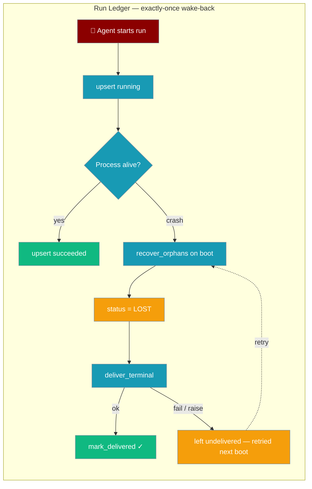
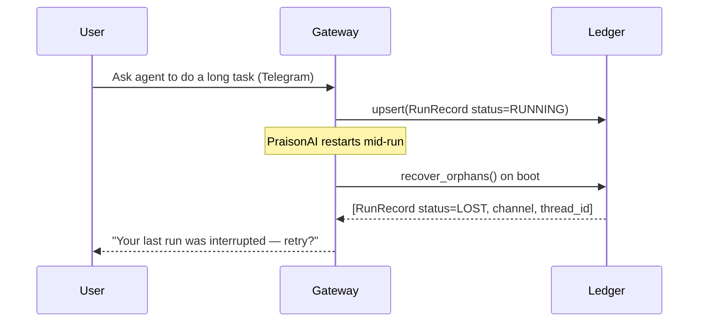
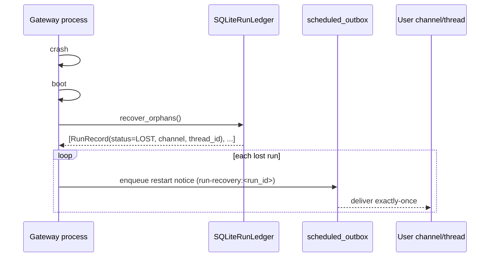
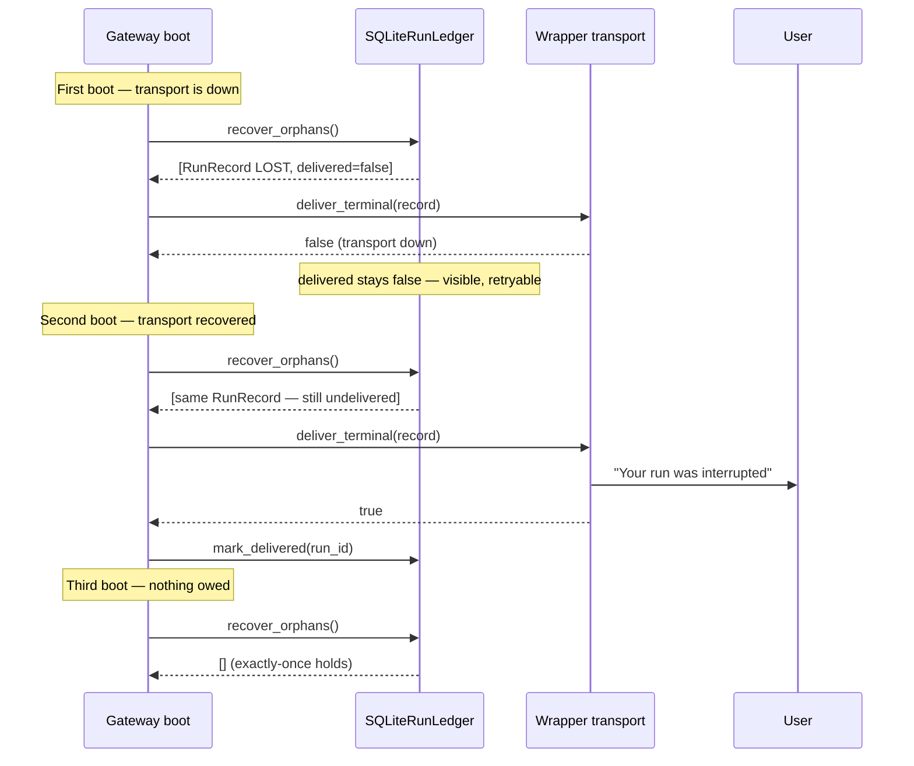

Give a background agent a stable ID that survives a restart — if PraisonAI crashes mid-run, the ledger reconciles it to `LOST` so you can wake the user and re-route.

<Note>
**Complements — does not replace — the [Run-State Journal](/features/run-state-journal).** The ledger tracks run **status** (queued/running/done/failed/lost); the journal tracks the per-event **cursor** (model decision, tool call, tool result, iteration index) so a crashed run can resume without re-executing tools or re-billing LLM calls. Use the ledger to answer *"is this run alive?"*; use the journal to answer *"where in the loop did it die?"*
</Note>

```python
from praisonaiagents.runs import SQLiteRunLedger

ledger = SQLiteRunLedger()
```

No config, no new dependencies — SQLite lives at `~/.praisonai/runs/ledger.db`.


```mermaid
graph LR
    subgraph "Run Ledger — exactly-once wake-back"
        A[🤖 Agent starts run] --> B[upsert running]
        B --> C{Process alive?}
        C -->|yes| D[upsert succeeded]
        C -->|crash| E[recover_orphans on boot]
        E --> F[status = LOST]
        F --> G[deliver_terminal]
        G -->|ok| H[mark_delivered ✓]
        G -->|fail / raise| I[left undelivered — retried next boot]
        I -.retry.-> E
    end

    classDef agent fill:#8B0000,stroke:#7C90A0,color:#fff
    classDef process fill:#189AB4,stroke:#7C90A0,color:#fff
    classDef warn fill:#F59E0B,stroke:#7C90A0,color:#fff
    classDef out fill:#10B981,stroke:#7C90A0,color:#fff
    classDef retry fill:#6366F1,stroke:#7C90A0,color:#fff

    class A agent
    class B,C,E,G process
    class F,I warn
    class D,H out
```

## Quick Start

<Steps>
<Step title="Get the default ledger">
```python
from praisonaiagents.runs import SQLiteRunLedger

ledger = SQLiteRunLedger()
```
</Step>

<Step title="Track a run">
```python
from praisonaiagents.runs import SQLiteRunLedger, RunRecord, RunStatus

ledger = SQLiteRunLedger()
ledger.upsert(RunRecord(
    run_id="run-123",
    agent_id="researcher",
    channel="telegram",
    thread_id="8765",
    status=RunStatus.RUNNING,
))
```
</Step>

<Step title="Reconcile on startup">
```python
from praisonaiagents.runs import SQLiteRunLedger

ledger = SQLiteRunLedger()
for lost in ledger.recover_orphans():
    print(f"Run {lost.run_id} was interrupted — re-routing to {lost.channel}")

for r in ledger.list_active():
    print(r.run_id, r.status)
```
</Step>

<Step title="Guarantee exactly-once wake-back">
```python
# Guarantee every recovered LOST run wakes its origin — exactly once.
import asyncio
from praisonaiagents.runs import (
    SQLiteRunLedger, TerminalOutcomeDelivererProtocol, notify_recovered,
)

class TelegramDeliverer:
    async def deliver_terminal(self, record) -> bool:
        # Wake the origin thread; return True only if the message actually landed.
        return await send_telegram(record.channel, record.thread_id,
                                   f"Run interrupted: {record.terminal_outcome}")

ledger = SQLiteRunLedger()
delivered = asyncio.run(notify_recovered(ledger, TelegramDeliverer()))
print(f"Woke {delivered} interrupted run(s)")
```
</Step>
</Steps>

<Note>
`recover_orphans()` returns every **undelivered** `LOST` run — both those reconciled in this call and any left undelivered by a prior boot. It preserves each run's `channel` and `thread_id` so the gateway can wake the same user back.
</Note>

<Note>
**Retry on next boot is automatic.** If `deliver_terminal` returns `False` (or raises), the run stays `delivered = False`. The next boot's `recover_orphans()` will surface it again so a working transport can wake the user without any manual re-arming.
</Note>

---

## How It Works

A run is recorded as it starts, updated as it progresses, and finalised with a terminal status. If a process dies while a run is still active, the next boot reconciles it to `LOST`.


```mermaid
sequenceDiagram
    participant User
    participant Gateway
    participant Ledger

    User->>Gateway: Ask agent to do a long task (Telegram)
    Gateway->>Ledger: upsert(RunRecord status=RUNNING)
    Note over Gateway: PraisonAI restarts mid-run
    Gateway->>Ledger: recover_orphans() on boot
    Ledger-->>Gateway: [RunRecord status=LOST, channel, thread_id]
    Gateway-->>User: "Your last run was interrupted — retry?"
```

### Behaviour on gateway restart

The gateway wires this recovery **automatically** — you don't call `recover_orphans()` yourself. On boot, after resuming interrupted turns, it reconciles the ledger and notifies each lost run's origin.


```mermaid
sequenceDiagram
    participant Process as Gateway process
    participant Ledger as SQLiteRunLedger
    participant Outbox as scheduled_outbox
    participant Channel as User channel/thread

    Process->>Process: crash
    Process->>Process: boot
    Process->>Ledger: recover_orphans()
    Ledger-->>Process: [RunRecord(status=LOST, channel, thread_id), ...]
    loop each lost run
        Process->>Outbox: enqueue restart notice (run-recovery:<run_id>)
        Outbox-->>Channel: deliver exactly-once
    end
```

1. `_recover_orphaned_runs()` runs on boot, right after `_resume_interrupted_turns()`.
2. `recover_orphans()` terminalises every still-active run to `LOST`, preserving its `channel` and `thread_id`.
3. Each `LOST` run's origin receives a durable restart notice. The gateway calls the transport, and **only on a successful landing** marks the run `delivered` in the ledger — so a failed/raising transport (rather than being silently dropped) is left `delivered = False` and automatically retried on the next boot. When no origin route exists (empty `channel`), the run is marked `delivered` immediately to stop the ledger re-surfacing an undeliverable run on every subsequent boot.
4. It's a **no-op** when core lacks the ledger or `ledger.db` doesn't exist yet — gateways that never used the ledger are unaffected, and no empty DB is ever created.

### Exactly-once wake-back

A `LOST` run stays owed a wake-back until its notice actually lands — surviving a transport outage across boots without ever double-notifying.


```mermaid
sequenceDiagram
    participant Boot as Gateway boot
    participant Ledger as SQLiteRunLedger
    participant Deliverer as Wrapper transport
    participant User

    Note over Boot: First boot — transport is down
    Boot->>Ledger: recover_orphans()
    Ledger-->>Boot: [RunRecord LOST, delivered=false]
    Boot->>Deliverer: deliver_terminal(record)
    Deliverer-->>Boot: false (transport down)
    Note over Ledger: delivered stays false — visible, retryable

    Note over Boot: Second boot — transport recovered
    Boot->>Ledger: recover_orphans()
    Ledger-->>Boot: [same RunRecord — still undelivered]
    Boot->>Deliverer: deliver_terminal(record)
    Deliverer->>User: "Your run was interrupted"
    Deliverer-->>Boot: true
    Boot->>Ledger: mark_delivered(run_id)

    Note over Boot: Third boot — nothing owed
    Boot->>Ledger: recover_orphans()
    Ledger-->>Boot: [] (exactly-once holds)
```

The user-facing message the origin receives:

```text
A background run was interrupted by a restart and could not be recovered
(<outcome>). Please resend your request.
```

<Note>
This is the built-in gateway behaviour. The [manual patterns below](#wake-users-after-a-crash) still work if you build your own runtime on the ledger, but a standard `praisonai gateway start` already does this for you. See also [Gateway Restart Continuation › Run ledger recovery](/features/gateway-restart-continuation#run-ledger-recovery).
</Note>

### Run statuses

`RunStatus` partitions every run into **active** (recoverable) or **terminal** (done).

| Status | Category | Meaning |
|--------|----------|---------|
| `queued` | active | Accepted, not yet started |
| `running` | active | Executing |
| `waiting` | active | Blocked on an external signal (approval, tool, human input) |
| `succeeded` | terminal | Finished cleanly |
| `failed` | terminal | Errored |
| `cancelled` | terminal | Explicitly cancelled |
| `lost` | terminal | Orphaned by a crashed process; set by `recover_orphans()` |
| `unknown` | neither | Written by a newer process; never finalised so its real state is never lost |

Check the partition with the `is_active` / `is_terminal` helpers:

```python
from praisonaiagents.runs import RunStatus

RunStatus.RUNNING.is_active      # True
RunStatus.RUNNING.is_terminal    # False
RunStatus.LOST.is_terminal       # True
RunStatus.UNKNOWN.is_active      # False — neither active nor terminal
```

`RunStatus` is a `str` enum, so `RunStatus.RUNNING == "running"`.

---

## Configuration Options

### RunRecord

A durable record of a single run. `channel` and `thread_id` capture the origin route so the gateway can wake the user back.

| Field | Type | Default | Description |
|-------|------|---------|-------------|
| `run_id` | `str` | *(required)* | Stable ID, survives restarts |
| `agent_id` | `str` | `""` | Which agent ran it |
| `channel` | `str` | `""` | Origin channel (e.g. `"telegram"`) |
| `thread_id` | `str \| None` | `None` | Origin thread, to reply back |
| `status` | `RunStatus` | `RunStatus.QUEUED` | Current lifecycle status |
| `progress` | `str \| None` | `None` | Human-readable progress summary |
| `terminal_outcome` | `str \| None` | `None` | Final result or error note |
| `created_at` | `float` | `time.time()` | Creation timestamp |
| `updated_at` | `float` | `time.time()` | Last-update timestamp |
| `metadata` | `dict` | `{}` | Free-form extra data |
| `delivered` | `bool` | `False` | Whether the terminal outcome has been delivered to the origin channel. `True` means the wake-back already landed and this run will never be re-notified. |

`to_dict()` / `from_dict()` roundtrip a record to a JSON/SQLite-friendly dict and back.

```python
from praisonaiagents.runs import RunRecord, RunStatus

rec = RunRecord(run_id="r1", channel="#ops", status=RunStatus.RUNNING)
restored = RunRecord.from_dict(rec.to_dict())
assert restored.status == RunStatus.RUNNING
```

### RunLedgerProtocol

The pluggable store contract — swap in a heavier backend by implementing these methods.

| Method | Returns | Description |
|--------|---------|-------------|
| `upsert(record)` | `None` | Insert or update, keyed by `run_id` |
| `get(run_id)` | `RunRecord \| None` | Fetch one run, or `None` if unknown |
| `list_active()` | `list[RunRecord]` | All runs still in an active status |
| `recover_orphans()` | `list[RunRecord]` | Mark active runs `LOST`, return **every undelivered** `LOST` run (retries earlier misses) |
| `mark_delivered(run_id)` | `None` | Flag a run's wake-back as delivered — exactly-once boundary |

`mark_delivered(run_id)` records that this run's terminal outcome reached its origin. Once set, `recover_orphans()` will never return this run again — the durable half of the exactly-once guarantee.

### TerminalOutcomeDelivererProtocol

The transport contract the wrapper implements. Core owns the exactly-once *guarantee*; the wrapper supplies only the concrete transport.

| Method | Returns | Description |
|--------|---------|-------------|
| `async deliver_terminal(record)` | `bool` | Deliver `record`'s terminal outcome to `record.channel` / `record.thread_id`. Return `True` when the outcome reached the origin, `False` when it could not (so the run stays undelivered and is retried next boot). |

### notify_recovered

`notify_recovered(ledger, deliverer)` is the async binder that closes the loop. For each record from `recover_orphans()` it invokes `deliverer.deliver_terminal(record)` and, **only on success**, calls `ledger.mark_delivered(record.run_id)`. A raising transport is treated as a failed (retryable) delivery, never crashing recovery for the other runs. Returns the number of runs successfully delivered this call.

```python
import asyncio
from praisonaiagents.runs import SQLiteRunLedger, notify_recovered

class MyDeliverer:
    async def deliver_terminal(self, record) -> bool:
        return await send(record.channel, record.thread_id,
                          f"Run interrupted: {record.terminal_outcome}")

ledger = SQLiteRunLedger()
count = asyncio.run(notify_recovered(ledger, MyDeliverer()))
```

### SQLiteRunLedger

The zero-dependency default, backed by stdlib `sqlite3`.

| Option | Type | Default | Description |
|--------|------|---------|-------------|
| `db_path` | `str \| None` | `~/.praisonai/runs/ledger.db` | Database file; use `":memory:"` for tests |

- **No new dependencies** — stdlib `sqlite3` only.
- **Thread-safe** — a re-entrant lock guards a shared WAL connection.
- **`recover_orphans()`** preserves the origin route and returns every undelivered `LOST` run; once `mark_delivered` flips a run, a later call filters it out.
- **`close()`** releases the connection; the file persists across restarts.

<Note>
**Automatic in-place migration.** Older `ledger.db` files from before this release lack the `delivered` column. Opening the ledger runs an additive `ALTER TABLE runs ADD COLUMN delivered INTEGER NOT NULL DEFAULT 0` — existing rows default to `delivered = False` (safe: they get retried once), and every subsequent open is a no-op. Nothing to run manually.
</Note>

---

## Common Patterns

### Mark a run terminal on success

```python
from praisonaiagents.runs import SQLiteRunLedger, RunRecord, RunStatus

ledger = SQLiteRunLedger()
ledger.upsert(RunRecord(
    run_id="run-123",
    status=RunStatus.SUCCEEDED,
    terminal_outcome="report delivered",
))
```

### Manual integration (custom hosts)

When you run `praisonai gateway start`, boot recovery is automatic (see [Automatic on gateway boot](#automatic-on-gateway-boot-new-pr-3885)) — you do **not** need this pattern. It remains the way to wire recovery into a custom, non-gateway process.

```python
from praisonaiagents.runs import SQLiteRunLedger

ledger = SQLiteRunLedger()

def on_boot(send):
    for lost in ledger.recover_orphans():
        if lost.thread_id:
            send(lost.channel, lost.thread_id,
                 "Your last run was interrupted — retry?")
```

### List recent runs regardless of status

```python
from praisonaiagents.runs import SQLiteRunLedger

ledger = SQLiteRunLedger()
for r in ledger.list_all(limit=50):
    print(r.run_id, r.status, r.updated_at)
```

---

## Best Practices

<AccordionGroup>
<Accordion title="The gateway calls recover_orphans() for you at boot">
A standard `praisonai gateway start` runs reconciliation automatically on boot, before accepting new work, and notifies each lost run's origin durably. Only call `recover_orphans()` yourself when you build a custom runtime on the ledger directly.
</Accordion>

<Accordion title="Always set channel and thread_id">
These fields are the only way the gateway can wake the right user back. Set them when the run starts so a later `LOST` reconciliation can reach the origin thread.
</Accordion>

<Accordion title="Update status at each transition">
Call `upsert()` as the run moves `queued → running → waiting → succeeded/failed`. The more current the status, the fewer false `LOST` reconciliations after a restart.
</Accordion>

<Accordion title="Swap the store for heavier backends">
`SQLiteRunLedger` is the default, but any object implementing `RunLedgerProtocol` (Postgres, Redis, a hosted queue) drops in unchanged — the gateway only depends on the protocol.
</Accordion>

<Accordion title="Return the truth from deliver_terminal">
Have `deliver_terminal` return `True` **only** when the message actually landed on the origin (or was durably enqueued to a store that will land it). Returning `True` optimistically breaks the exactly-once guarantee — a transient network blip becomes a permanently lost wake-back. When the send fails, return `False` (or let the exception propagate) so the ledger retries it next boot.
</Accordion>
</AccordionGroup>

---

## What The User Sees

<Steps>
<Step title="User asks for a long task">
A user messages a Telegram bot: "Research the top 10 databases and write a comparison." The agent starts, and the run is recorded as `RUNNING` with `channel="telegram"` and the user's `thread_id`.
</Step>

<Step title="PraisonAI restarts mid-run">
The process is killed or crashes before the run finishes. In-memory state is gone, but the ledger row on disk survives.
</Step>

<Step title="The gateway wakes the user back">
On boot, the gateway automatically calls `recover_orphans()`, marks the run `LOST`, and posts a durable notice back to the same Telegram thread. If Telegram is unreachable at that instant, the notice stays owed — and the **next** boot delivers it. Once the user has been told, they are **never** re-notified for the same run, however many times PraisonAI restarts.
</Step>
</Steps>

---

## Related

<CardGroup cols={2}>
<Card title="Background Tasks" icon="clock" href="/features/background-tasks">
  Run agent work in the background and collect results later.
</Card>
<Card title="Background Subagents" icon="rocket" href="/features/background-subagents">
  Spawn subagents that return a job ID immediately — the general-purpose ledger backs their durable state.
</Card>
<Card title="Restart Continuation" icon="arrows-rotate" href="/features/gateway-restart-continuation">
  The boot recovery that runs ledger reconciliation alongside interrupted-turn resumption.
</Card>
</CardGroup>
