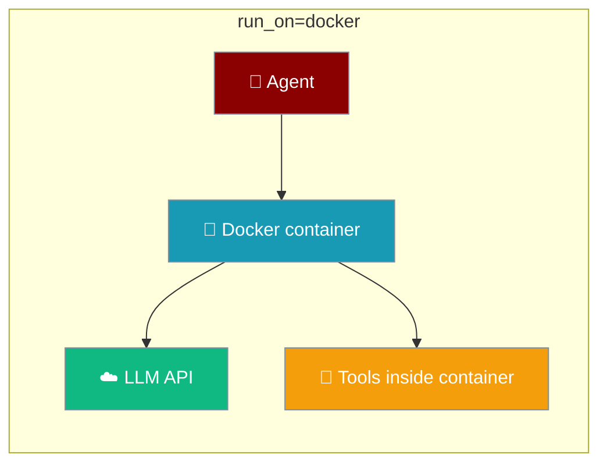
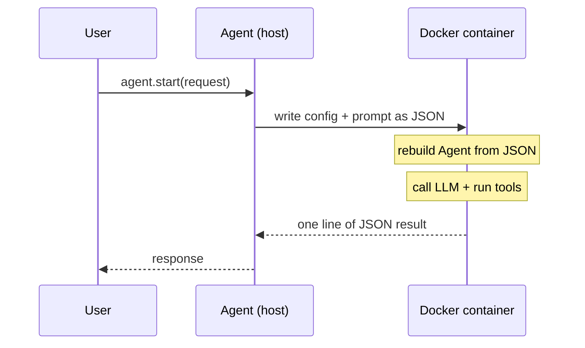
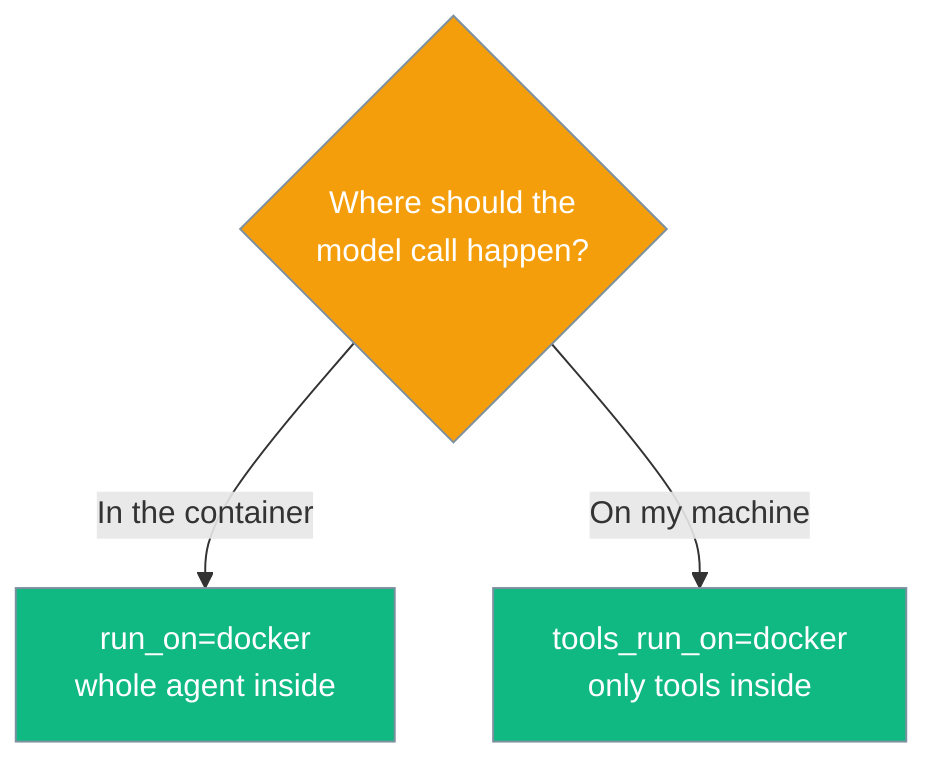

Run the whole agent — model calls, loop and tools — inside a local Docker container you own.

<Note>
`docker` is one of **eight** places `run_on=` can host the whole loop — see [Placement](/features/placement#where-run-on-and-compute-can-point) for the full list (`anthropic`, `docker`, `e2b`, `modal`, `daytona`, `flyio`, `tenki`, `novita`). `docker` keeps its own specialised backend: it talks to the daemon directly and skips a provisioning layer that the cloud places need.
</Note>



## Quick Start

<Steps>
<Step title="Minimal">
One line moves the whole agent into a container.

```python
from praisonaiagents import Agent

agent = Agent(
    name="builder",
    instructions="You build things.",
    run_on="docker",
)
agent.start("Write a Python script that prints the first 10 primes, then run it")
```
</Step>

<Step title="With a prebuilt image">
Supply your own image with `praisonaiagents` baked in to skip the ~1 min first-run install.

```python
from praisonai import HostedAgent, HostedAgentConfig
from praisonaiagents import Agent

hosted = HostedAgent(
    provider="docker",
    config=HostedAgentConfig(model="gpt-4o-mini", system="Be brief."),
    image="my-org/praisonai-agent:latest",
)
agent = Agent(name="builder", backend=hosted)
agent.start("Summarise the README in three bullets")
```
</Step>

<Step title="Extra environment and packages">
Pass extra environment variables and packages, and disable container reuse.

```python
from praisonai import HostedAgent, HostedAgentConfig
from praisonaiagents import Agent

hosted = HostedAgent(
    provider="docker",
    config=HostedAgentConfig(model="gpt-4o-mini"),
    env={"MY_FLAG": "1"},
    pip_packages=["praisonaiagents", "httpx"],
    keep_alive=False,
)
agent = Agent(name="builder", backend=hosted)
agent.start("Fetch example.com and count the words")
```
</Step>
</Steps>

---

## How It Works

The agent on your machine ships its serialisable config into the container, which rebuilds the agent, calls the LLM and runs the tools — then returns the answer.



The model API key travels *into* the container via `-e KEY` — the value is read from your host environment, never placed on the command line, so it never shows up in `docker inspect` or a process listing.

---

## `run_on="docker"` vs `tools_run_on="docker"`

Both spellings name the same place. What differs is what crosses the boundary — the parameter name carries the scope.

| | `tools_run_on="docker"` | `run_on="docker"` |
|---|---|---|
| The loop runs | your process | **in the container** |
| The model is called from | your machine | **the container** |
| Needs the API key where | your machine | **the container** |
| Your files reachable | yes | only what you mounted |

The object reports which scope you chose:

```python
>>> from praisonaiagents import Agent
>>> Agent(name="x", instructions="i", run_on="docker")
Agent(name='x', thinks_on='a Docker container', tools_run_on='a Docker container')

>>> Agent(name="x", instructions="i", tools_run_on="docker")
Agent(name='x', thinks_on='this machine', tools_run_on='a Docker container')
```

Which one do you want?



---

## Configuration Options

Pass these to `HostedAgent(provider="docker", ...)`.

| Option | Type | Default | Description |
|---|---|---|---|
| `config` | `HostedAgentConfig \| dict \| None` | `None` | Agent config (instructions, llm, name, etc.). Only JSON-safe fields cross into the container. |
| `image` | `str` | `"python:3.12-slim"` | Container image. Supply your own with `praisonaiagents` baked in to skip the first-run install. |
| `env` | `dict[str, str]` | `{}` | Extra environment variables passed into the container. |
| `keep_alive` | `bool` | `True` | Reuse one container across calls so a follow-up turn does not pay start-up again. |
| `pip_packages` | `list[str]` | `["praisonaiagents"]` | Packages installed inside the container on first run. |

### Model keys forwarded automatically

These variables are forwarded into the container when set in your host environment, passed with `-e KEY` (value read from your env), so they never appear in `docker inspect` or a process listing:

`OPENAI_API_KEY`, `ANTHROPIC_API_KEY`, `GEMINI_API_KEY`, `GOOGLE_API_KEY`, `GROQ_API_KEY`, `MISTRAL_API_KEY`, `COHERE_API_KEY`, `OPENROUTER_API_KEY`, `DEEPSEEK_API_KEY`, `XAI_API_KEY`, `OPENAI_BASE_URL`, `OPENAI_API_BASE`.

---

## Limitations

<Warning>
These are real. Hit them with eyes open.

- **Python callables in `tools=` do not cross into the container.** A function defined in your process cannot be reconstructed remotely; the container rebuilds the agent from its serialisable config only. This is the same limitation the hosted runtimes have.
- **The container needs the model API key.** Moving the loop is the point, so the key is forwarded from your host environment.
- **First run installs `praisonaiagents` (~1 min)** unless `image=` supplies one that already has it.
</Warning>

---

## Troubleshooting

When Docker is not running, `run_on="docker"` fails fast and points you at the daemon-free alternative:

```text
RuntimeError: run_on='docker' needs a running Docker daemon.
  Start Docker Desktop, or check `docker info`.
  To keep the loop on this machine and move only the tools,
  use tools_run_on='docker' instead.
```

---

## Best Practices

<AccordionGroup>
<Accordion title="Supply your own image= for production">
Bake `praisonaiagents` into a custom image and pass it as `image=`. The first-run install (~1 min) disappears and start-up becomes predictable.
</Accordion>

<Accordion title="Leave keep_alive=True for multi-turn conversations">
One container is reused across calls, so a follow-up turn does not pay start-up again. The default is already `True`.
</Accordion>

<Accordion title="Prefer tools_run_on='docker' to keep the model call local">
When you want the loop on your machine — cheaper, and no API key inside the container — move only the tools with `tools_run_on="docker"`.
</Accordion>

<Accordion title="Call .shutdown() when you disable keep_alive">
With `keep_alive=False`, tear the container down with `.shutdown()` or use the backend as a context manager (`with HostedAgent(...) as hosted:`).
</Accordion>
</AccordionGroup>

---

## Related

<CardGroup cols={2}>
<Card title="Hosted Agent" icon="cloud" href="/features/hosted-agent">
`run_on="anthropic"` — the vendor-hosted sibling.
</Card>
<Card title="Placement" icon="map-pin" href="/features/placement">
One vocabulary for where the whole agent and its tools run.
</Card>
<Card title="Where It Runs" icon="location-dot" href="/features/where-does-it-run">
Ask the object where the model thinks and the tools run.
</Card>
<Card title="Shared Sandbox" icon="box" href="/features/shared-sandbox">
For the `tools_run_on="docker"` case across a flow.
</Card>
</CardGroup>
