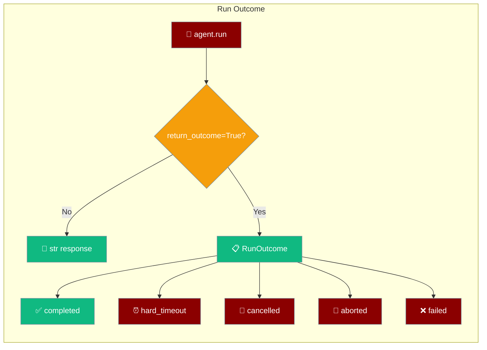
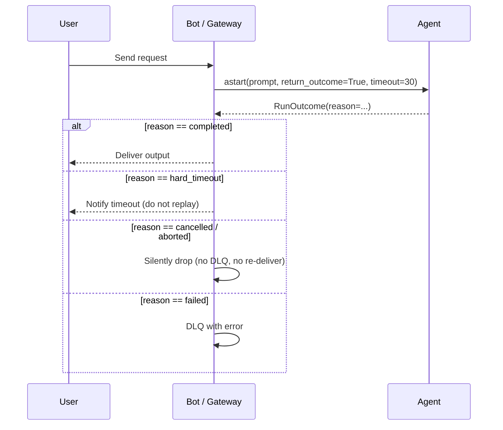
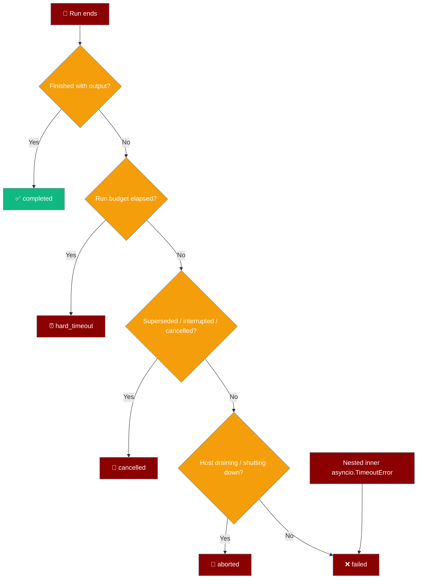

Add `return_outcome=True` to `agent.run()` or `agent.astart()` and the call returns a small frozen `RunOutcome` telling you exactly how the run ended — instead of raising and making you catch every exception type.



<Note>
`RunOutcome` (this page) and `AgentRunOutcome` (see [Agent Run Outcomes](./agent-run-outcomes)) are **two different types** with two different jobs:

| | `RunOutcome` | `AgentRunOutcome` |
|---|---|---|
| **Import** | `from praisonaiagents import RunOutcome` | `from praisonaiagents import AgentRunOutcome` |
| **Module** | `praisonaiagents.agent.run_outcome` | `praisonaiagents.run_outcome` |
| **Field** | `reason` | `status` |
| **Values** | `completed \| hard_timeout \| cancelled \| aborted \| failed` | `success \| failure \| timeout \| cancelled \| invalid_output` |
| **Where it comes from** | `agent.run(..., return_outcome=True)` / `agent.astart(..., return_outcome=True)` | Task validation, handoff results |
| **Purpose** | Host-facing terminal outcome for a whole run (bot/gateway dispatch) | Typed validation/handoff status (retry, invalid-output detection) |
</Note>

## Quick Start

<Steps>
<Step title="Simple usage (bool)">
Branch on `outcome.succeeded` — no `try/except`.

```python
from praisonaiagents import Agent, RunOutcome

agent = Agent(name="Assistant", instructions="Be helpful")

outcome = agent.run("Draft a reply", return_outcome=True)

if outcome.succeeded:
    print(outcome.output)
else:
    print(f"{outcome.reason}: {outcome.error}")
```
</Step>

<Step title="Async with a hard timeout">
`astart()` accepts a run-level `timeout` (seconds). When it elapses, `reason` is `hard_timeout`.

```python
import asyncio
from praisonaiagents import Agent, RunOutcome

agent = Agent(name="Assistant", instructions="Be helpful")

async def main():
    outcome = await agent.astart("Draft a reply", return_outcome=True, timeout=30)
    print(outcome.reason)

asyncio.run(main())
```
</Step>

<Step title="Full gateway/bot dispatch">
The headline use case — one branch per terminal reason, no exception chains.

```python
import asyncio
from praisonaiagents import Agent, RunOutcome

agent = Agent(name="Assistant", instructions="Be helpful")

async def handle(prompt, run_timeout=30):
    outcome = await agent.astart(prompt, return_outcome=True, timeout=run_timeout)

    if outcome.reason == "completed":
        await deliver(outcome.output)
    elif outcome.reason in ("cancelled", "aborted"):
        pass                              # never DLQ, never replay
    elif outcome.reason == "hard_timeout":
        await notify_timeout()
    else:                                 # "failed"
        dlq.enqueue(error=outcome.error)
```
</Step>
</Steps>

---

## How It Works

A host receives a request, dispatches it to the agent with `return_outcome=True`, and picks a channel action from the single `reason` field.



The five terminal reasons and the action each one signals:

| `reason` | Meaning | Typical host action |
|---|---|---|
| `completed` | Run ended normally with output | Deliver `outcome.output` |
| `hard_timeout` | The **run-level** budget on `astart(..., timeout=...)` elapsed | Notify user of timeout; do **not** replay |
| `cancelled` | External `asyncio.CancelledError` **or** a domain supersede/interrupt error surfaced | Silently drop; never DLQ; never re-deliver |
| `aborted` | Drain / shutdown-named error (host is shutting down) | Silently drop |
| `failed` | Anything else — including a nested inner `asyncio.TimeoutError` | DLQ with `outcome.error` |

Precedence is **sticky**: a `hard_timeout` is never silently downgraded by a later cleanup error.

---

## Which reason applies when



A nested inner `asyncio.TimeoutError` (a tool or handoff that exhausted its own budget) resolves to `failed`, **not** `hard_timeout`. Only the run-level `timeout` budget produces `hard_timeout`.

---

## Configuration Options

`RunOutcome` is a frozen dataclass. Every field:

| Attribute | Type | Default | Description |
|---|---|---|---|
| `reason` | `TerminalReason` | required | One of `"completed" \| "hard_timeout" \| "cancelled" \| "aborted" \| "failed"` |
| `output` | `Optional[str]` | `None` | Partial or final text, if any |
| `error` | `Optional[str]` | `None` | Redacted error message when `reason == "failed"` |
| `succeeded` | `bool` (property) | — | `True` only when `reason == "completed"` |

Class methods:

| Method | Signature | Purpose |
|---|---|---|
| `RunOutcome.completed` | `(output: Optional[str] = None) -> RunOutcome` | Factory for the success case |
| `RunOutcome.from_exception` | `(exc: BaseException, output: Optional[str] = None) -> RunOutcome` | Normalise a raised exception into a canonical outcome |

`from_exception` matches by type name: `hardtimeout`/`runtimeout`/`budgettimeout` → `hard_timeout`; `asyncio.CancelledError` or `supersed`/`interrupt`/`cancelled` → `cancelled`; `abort`/`drain`/`shutdown` → `aborted`; everything else → `failed` with `error=str(exc)`.

`TerminalReason` is a `Literal["completed", "hard_timeout", "cancelled", "aborted", "failed"]` (with a `str` fallback on Python `<3.8`), exported from `praisonaiagents.agent`.

New kwargs on `run()` and `astart()`:

| Kwarg | Type | Default | Applies to | Description |
|---|---|---|---|---|
| `return_outcome` | `bool` | `False` | `run()`, `astart()` | Return a `RunOutcome` instead of the raw string; the call **never raises** for known terminal states. |
| `timeout` | `float` (seconds) | `None` | `astart()` when `return_outcome=True` | Hard **run-level** budget. When it expires, the outcome is `hard_timeout`. Only this budget produces `hard_timeout`; a nested inner `asyncio.TimeoutError` maps to `failed`. |

Verified behaviour:
- `outcome.reason == "hard_timeout"` is authoritative and sticky — never downgraded.
- A nested inner `asyncio.TimeoutError` resolves to `failed`, not `hard_timeout`.
- External `asyncio.CancelledError` on the enclosing task is **re-raised** — host shutdown is honoured, not swallowed.
- `RunOutcome` is **frozen** — assigning to `.reason` raises `FrozenInstanceError`.

---

## Common Patterns

Simple success/failure branch:

```python
outcome = agent.run(prompt, return_outcome=True)
if outcome.succeeded:
    send(outcome.output)
else:
    log(outcome.reason)
```

Retry ladder — retry only on `failed`, escalate on `hard_timeout`, drop the rest:

```python
outcome = await agent.astart(prompt, return_outcome=True, timeout=30)
if outcome.reason == "failed":
    retry(prompt)
elif outcome.reason == "hard_timeout":
    escalate()
elif outcome.reason in ("cancelled", "aborted"):
    pass  # do not retry
```

Manual normalisation in a wrapper that owns its own try/except:

```python
from praisonaiagents import RunOutcome

try:
    text = my_custom_call(prompt)
    outcome = RunOutcome.completed(text)
except BaseException as exc:
    outcome = RunOutcome.from_exception(exc)
```

---

## Best Practices

<AccordionGroup>
<Accordion title="Never assume timeout means retry">
A `hard_timeout` is the run-level budget — the run didn't finish. A `failed` carrying a nested inner `asyncio.TimeoutError` is a tool/handoff timeout inside the run; only the second one is often safely retryable.
</Accordion>

<Accordion title="Don't swallow cancelled">
A `try/except` around `astart()` without `return_outcome=True` can absorb host-shutdown cancellation. Use `return_outcome=True` and check `reason` instead — external `asyncio.CancelledError` is re-raised, not hidden.
</Accordion>

<Accordion title="Route on reason, not on exception identity">
The point of `RunOutcome` is to remove `isinstance` chains from your gateway. If you're still catching exceptions, you've lost the benefit — branch on `outcome.reason`.
</Accordion>

<Accordion title="Treat RunOutcome as immutable">
It's a frozen dataclass. Build a new one with `RunOutcome.completed(...)` or `RunOutcome.from_exception(...)` instead of mutating fields.
</Accordion>
</AccordionGroup>

---

## Migration

The default behaviour of `run()` / `astart()` is unchanged — they still return a `str` and raise on error, so existing code needs no change. Opt in with one flag to collapse three catches into one branch.

```python
# Before — three catches, order matters
try:
    text = await agent.astart(prompt)
    await deliver(text)
except asyncio.TimeoutError:
    await notify_timeout()
except asyncio.CancelledError:
    raise
except Exception as exc:
    dlq.enqueue(error=str(exc))

# After — one branch
outcome = await agent.astart(prompt, return_outcome=True, timeout=run_timeout)
match outcome.reason:
    case "completed":     await deliver(outcome.output)
    case "hard_timeout":  await notify_timeout()
    case "cancelled" | "aborted": pass
    case "failed":        dlq.enqueue(error=outcome.error)
```

---

## Related

<CardGroup cols={2}>
<Card title="Agent Run Outcomes" icon="circle-check" href="/docs/features/agent-run-outcomes">
The **different** `AgentRunOutcome` type — a typed `status` for validation and handoff results, not run-level dispatch.
</Card>
<Card title="Autonomy Loop" icon="robot" href="/docs/features/autonomy-loop">
The autonomy loop's own `completion_reason` — conceptually adjacent, but a separate mechanism.
</Card>
</CardGroup>
