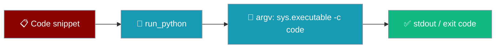
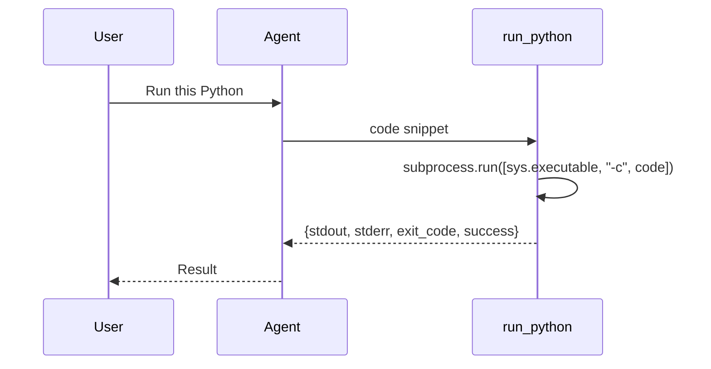

`run_python` runs a Python snippet for an agent and returns its output. Code is passed to `subprocess.run` as an argv list (`[sys.executable, "-c", code]`), so the source is preserved verbatim — no shell, no re-tokenisation — identically on POSIX and Windows.

```python
from praisonaiagents import Agent
from praisonai.code.tools import run_python

agent = Agent(
    name="Python Runner",
    instructions="Run short Python snippets and report the output.",
    tools=[run_python],
)
agent.start("Print the sum of the first 10 squares")
```

The user asks the agent to compute something; the agent runs the snippet as an argv list and returns the captured output.



<Note>
Code is executed via `subprocess.run([sys.executable, "-c", code])` — no shell, no re-tokenisation. Multi-line snippets, backslashes, and mixed quotes are preserved exactly as passed, identically on POSIX and Windows. The return shape matches `execute_command`.
</Note>

## Quick Start

<Steps>
<Step title="Give an agent the tool">
```python
from praisonaiagents import Agent
from praisonai.code.tools import run_python

agent = Agent(
    name="Python Runner",
    instructions="Run Python snippets and report the output.",
    tools=[run_python],
)
agent.start("Compute 2 ** 20 and print it")
```
</Step>

<Step title="Call it directly">
```python
from praisonai.code.tools import run_python

result = run_python("print('hello from python')")
print(result["stdout"])   # hello from python
print(result["exit_code"])  # 0
```
</Step>

<Step title="Verify verbatim source is preserved">
Snippets with newlines, backslashes, and mixed quotes that used to break under shell quoting now run intact:

```python
from praisonai.code.tools import run_python

result = run_python(r'''
import json
data = {"path": "C:\\Users\\alice", "note": "she said \"hi\""}
print(json.dumps(data))
''')
# → prints the intact JSON without shell mangling on either OS
```
</Step>
</Steps>

---

## How It Works



Passing an argv list means the operating system hands your exact `code` string to Python as a single argument. There is no intermediate shell to expand `$VAR`, collapse quotes, or re-split on whitespace — so the caller's source arrives byte-for-byte.

### Before / after

| Snippet feature | Old shell-string path | argv-list path |
|-----------------|-----------------------|----------------|
| Newlines | Re-tokenised, often mangled | Preserved verbatim |
| Backslashes (`C:\Users\...`) | Escaped/expanded by the shell | Preserved verbatim |
| Mixed single/double quotes | Broke quoting, could error | Preserved verbatim |
| POSIX vs Windows | Diverged | Identical behaviour |

---

## Return Shape

`run_python` returns the same dictionary shape as `execute_command`:

| Key | Type | Description |
|-----|------|-------------|
| `success` | `bool` | `True` when the exit code is `0` |
| `exit_code` | `int` | Process exit code |
| `stdout` | `str` | Captured standard output |
| `stderr` | `str` | Captured standard error |

```python
from praisonai.code.tools import run_python

result = run_python("import sys; sys.stderr.write('warn\\n'); print('ok')")
result["success"]    # True
result["stdout"]     # "ok\n"
result["stderr"]     # "warn\n"
```

---

## Best Practices

<AccordionGroup>
<Accordion title="Use raw strings for backslash-heavy code">
Wrap Windows paths or regex-heavy snippets in `r'''...'''` so your own Python source doesn't consume the backslashes before `run_python` ever sees them.
</Accordion>
<Accordion title="Gate it behind approval for untrusted agents">
`run_python` executes arbitrary code. Pair it with [Approval](/features/approval) so a human confirms each snippet on untrusted routes.
</Accordion>
<Accordion title="Set a timeout for long snippets">
Pass `timeout=<seconds>` to bound execution; the default is `60` seconds.
</Accordion>
<Accordion title="Prefer run_python over hand-building a shell command">
Building `python -c "..."` strings yourself re-introduces the quoting bugs this tool fixes. Pass the code to `run_python` and let the argv list carry it.
</Accordion>
</AccordionGroup>

---

## Related

<CardGroup cols={2}>
<Card title="Shell Tools" icon="terminal" href="/tools/shell_tools">
  `execute_command` and process tools for shell-level tasks.
</Card>
<Card title="Approval" icon="shield-check" href="/features/approval">
  Require human approval before an agent runs code.
</Card>
<Card title="Protected Paths" icon="lock" href="/features/protected-paths">
  Block agents from touching sensitive files.
</Card>
<Card title="Code Execution with Tools" icon="code" href="/features/code-execution-with-tools">
  Let generated code call back into your registered tools.
</Card>
</CardGroup>
