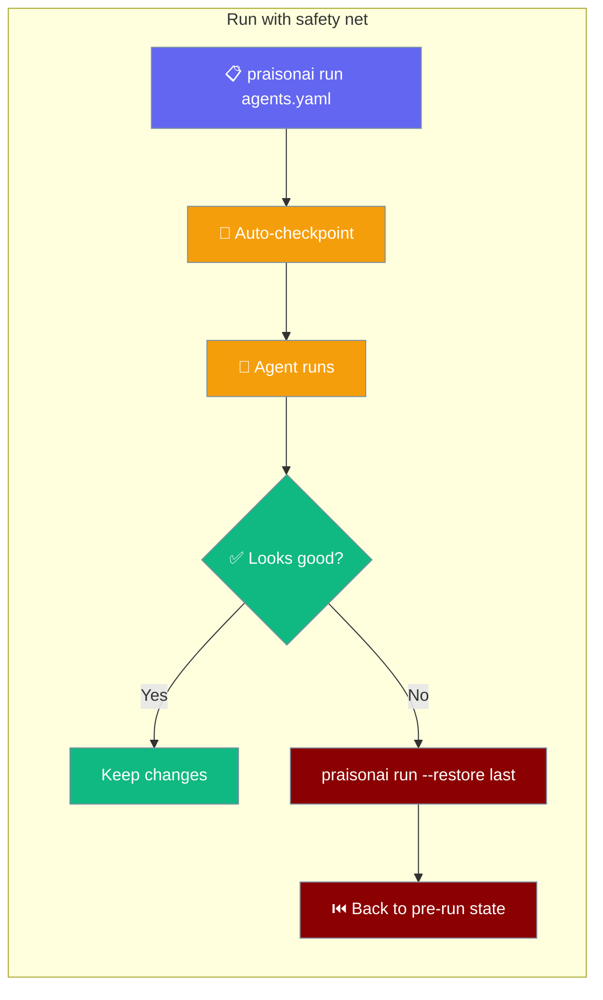

`praisonai run agents.yaml` snapshots your workspace before the agent touches anything — restoring is one command.



## Quick Start

<Steps>
<Step title="Run your agents — a snapshot is taken automatically">
```bash
praisonai run agents.yaml
```

Before the agent starts, the CLI silently checkpoints the directory containing your YAML file, tagged `run:<run_id>`. No configuration needed.
</Step>

<Step title="Something went wrong? Undo it">
```bash
praisonai run --restore last
```

Restores every file in the workspace to the state it was in before the last run. The agent does **not** run — `--restore` exits after the undo.
</Step>

<Step title="Check the checkpoint history">
```bash
praisonai checkpoint list
```

Shows all saved snapshots, newest first. Auto-checkpoints are tagged `run:<run_id>` so you can tell them apart from manual saves.
</Step>
</Steps>

---

## How It Works

Auto-checkpoint fires once per YAML-file run, **before** the first agent action.

```mermaid
sequenceDiagram
    participant User
    participant CLI
    participant Checkpoint as CheckpointService
    participant Agent

    User->>CLI: praisonai run agents.yaml
    CLI->>Checkpoint: save("run:abc123", allow_empty=false, quiet=true)
    Note over Checkpoint: Silently skips if nothing changed,<br/>no git, or protected path
    Checkpoint-->>CLI: ok (or silently swallowed error)
    CLI->>Agent: run agents.yaml
    Agent-->>User: result

    classDef user fill:#6366F1,stroke:#7C90A0,color:#fff
    classDef cli fill:#8B0000,stroke:#7C90A0,color:#fff
    classDef cp fill:#F59E0B,stroke:#7C90A0,color:#fff
    classDef ag fill:#10B981,stroke:#7C90A0,color:#fff

    class User user
    class CLI cli
    class Checkpoint cp
    class Agent ag
```

| Property | Behaviour |
|---|---|
| **When** | Before every `.yaml` / `.yml` run (YAML-file mode only) |
| **Not triggered by** | Plain-prompt runs (`praisonai run "do X"`) — they don't touch project files |
| **Scoped to** | The directory containing the YAML file, not the cwd |
| **Best-effort** | Any error (no git, protected path, no changes) is swallowed silently |
| **Verbose mode** | With `--verbose`, swallowed errors are printed as info |
| **Tagged** | `run:<run_id>` to correlate with logs |

---

## Configuration

### Disable auto-checkpoint for a single run

```bash
praisonai run agents.yaml --no-checkpoint
```

### Disable globally via project config

Add a `checkpoints:` block to `.praisonai/config.yaml`:

```yaml
checkpoints:
  auto: false   # opt out globally
```

`--no-checkpoint` does the same thing per-run and takes precedence over config.

### Restore to a specific checkpoint

```bash
# Most recent checkpoint
praisonai run --restore last

# By short ID (from checkpoint list)
praisonai run --restore abc12345

# By unique prefix
praisonai run --restore abc1
```

Ambiguous prefixes are always **rejected** — never a silent wrong restore.

---

## Best Practices

<AccordionGroup>

<Accordion title="Don't disable auto-checkpoint unless you have a reason">
The snapshot is silent and only fires when something changed. The cost is negligible; the undo value is high.
</Accordion>

<Accordion title="Manual save before risky non-agent edits">
`praisonai run agents.yaml` auto-checkpoints before agent runs, but not before you manually edit files. Use `praisonai checkpoint save "before X"` before any risky manual operation.
</Accordion>

<Accordion title="Why ambiguous prefix matches are rejected">
`--restore abc1` matching two checkpoints could silently restore the wrong one. The CLI always prints an error and exits 1 — use more characters until the prefix is unique, or use `last`.
</Accordion>

<Accordion title="Auto-checkpoint never blocks your run">
If the snapshot fails (network drive, no write permission, no git, nothing changed), the CLI swallows the error and continues to the agent run. Use `--verbose` to surface the reason.
</Accordion>

</AccordionGroup>

---

## Related

<CardGroup cols={2}>
<Card title="Checkpoint CLI" icon="terminal" href="/docs/cli/checkpoint">
Full reference: save, list, restore, diff, delete — all flags.
</Card>
<Card title="Run Command" icon="play" href="/docs/cli/run">
All `praisonai run` options, including `--restore` and `--no-checkpoint`.
</Card>
<Card title="Shadow Git Checkpointing" icon="code-branch" href="/docs/features/checkpoints">
SDK-level checkpoint internals.
</Card>
<Card title="Session Continuity" icon="history" href="/docs/features/project-sessions">
Pick up where you left off across runs.
</Card>
</CardGroup>
