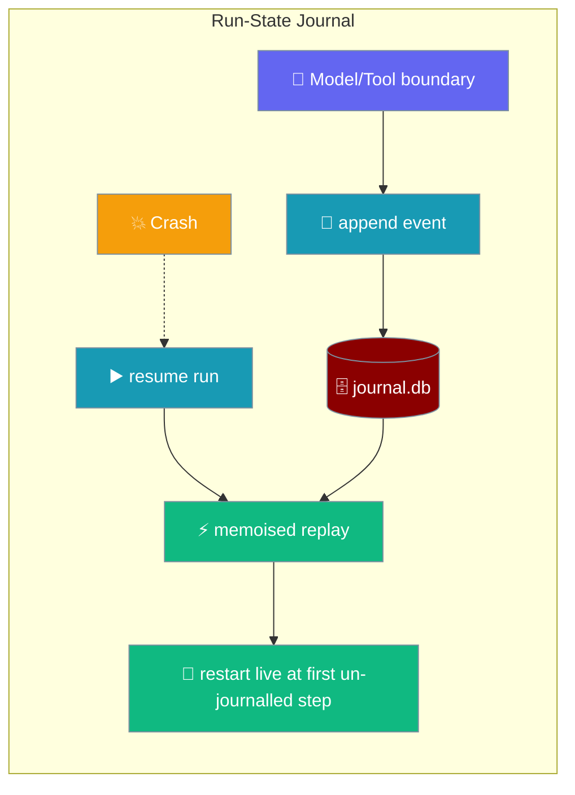
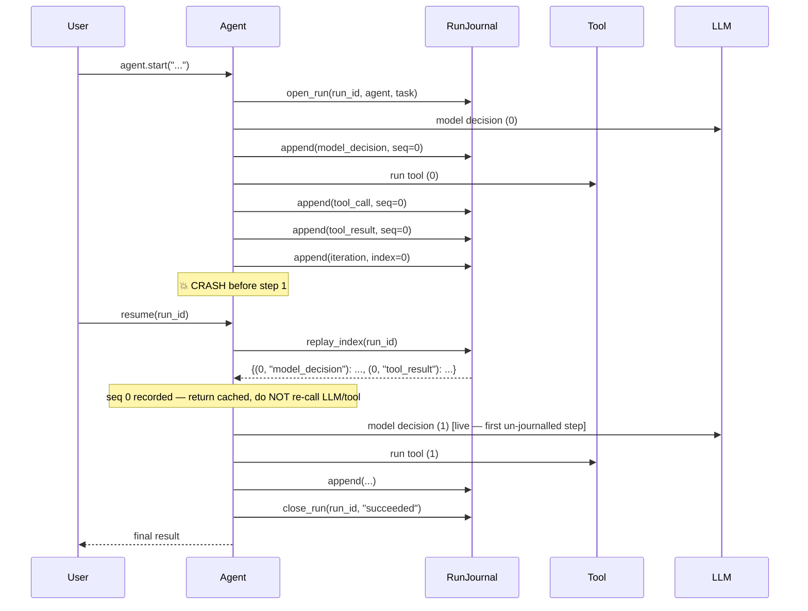
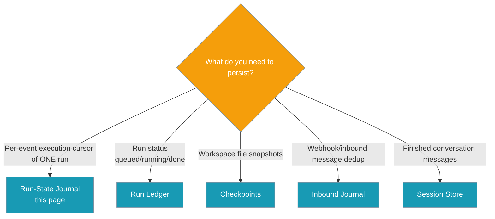

The run-state journal records the execution cursor of an agent run so a crash mid tool-loop can resume without re-executing side-effecting tools or re-billing LLM calls.

```python
from praisonaiagents.runtime import RunJournal, JournalEvent

journal = RunJournal()  # ~/.praisonai/runs/journal.db
journal.open_run("r1", agent="coder", task="migrate module")

# Record each boundary as it happens
journal.append(JournalEvent("r1", 0, "model_decision", {"text": "call tool X"}))
journal.append(JournalEvent("r1", 0, "tool_result", {"result": "done"}))

# On resume, journalled steps return recorded results — no re-billing, no re-running
replay = journal.replay_index("r1")
cached = replay.get((0, "tool_result"))  # instant recorded result

journal.close_run("r1", "succeeded")
```



## Quick Start

<Steps>
<Step title="Simple Usage">
Open a run, append a couple of events, then close it.

```python
from praisonaiagents.runtime import RunJournal, JournalEvent

journal = RunJournal(":memory:")
journal.open_run("r1", agent="coder", task="migrate module")

seq = 0
for i in range(3):
    journal.append(JournalEvent("r1", seq, "model_decision", {"text": f"call {i}"}))
    journal.append(JournalEvent("r1", seq, "tool_call", {"name": f"tool{i}", "args": {}, "idempotency_key": f"k{i}"}))
    journal.append(JournalEvent("r1", seq, "tool_result", {"result": i}))
    journal.append(JournalEvent("r1", seq, "iteration", {"index": i}))
    seq += 1

journal.close_run("r1", "succeeded")
```
</Step>

<Step title="Resume after a crash">
Compute `replay_index()` and drive the loop — journalled model calls and tools return their recorded results instantly, so the LLM is not re-billed and side-effecting tools are not re-run.

```python
replay = journal.replay_index("r1")

def call_model(seq):
    rec = replay.get((seq, "model_decision"))
    if rec is not None:
        return rec["text"]        # cached — no LLM call, no re-bill
    # …live LLM call here, then journal.append(...) the new decision

def run_tool(seq):
    rec = replay.get((seq, "tool_result"))
    if rec is not None:
        return rec["result"]      # cached — no re-execution of side effects
    # …live tool call here, then journal.append(...) the new result
```
</Step>
</Steps>

---

## How It Works

The loop is re-driven from the top on resume; recorded steps return cached results while real work restarts at the first un-journalled step.



The journal, run ledger, checkpoints, and inbound journal are four adjacent persistence primitives — pick correctly with this map.



---

## Configuration Options

The journal is a zero-dependency SQLite primitive with a single constructor argument.

**`RunJournal(db_path=None)` constructor**

| Argument | Type | Default | Description |
|----------|------|---------|-------------|
| `db_path` | `Optional[str]` | `None` → `~/.praisonai/runs/journal.db` | Path to the SQLite journal DB. Use `":memory:"` for tests. |

**Event kinds** — the five boundaries the journal records:

| Kind constant | String | Payload shape | Purpose |
|---------------|--------|---------------|---------|
| `KIND_MODEL_DECISION` | `"model_decision"` | `{"text": ...}` | Memoised on replay so the LLM is not re-called (and not re-billed). |
| `KIND_TOOL_CALL` | `"tool_call"` | `{"name", "args", "idempotency_key"}` | Records that a tool was issued. |
| `KIND_TOOL_RESULT` | `"tool_result"` | `{"result": ...}` | Memoised on replay so side-effecting tools are not re-run. |
| `KIND_APPROVAL` | `"approval"` | `{"decision": ...}` | Human/policy approval decision — enables durable pause-for-approval HITL. |
| `KIND_ITERATION` | `"iteration"` | `{"index": int}` | Loop cursor — restored on resume via `last_iteration()`. |

**`JournalEvent` dataclass**

| Field | Type | Default | Description |
|-------|------|---------|-------------|
| `run_id` | `str` | — | Owning run. |
| `seq` | `int` | — | Step number. With `kind` forms the natural key `(run_id, seq, kind)`. |
| `kind` | `str` | — | One of the 5 event kinds above. Anything else raises `ValueError`. |
| `payload` | `Dict[str, Any]` | `{}` | Any JSON-serialisable dict; non-JSON values fall back to `str(...)`. |
| `created_at` | `float` | `time.time()` | Wall-clock, set at construction. |

**`RunMeta` dataclass**

| Field | Type | Default | Description |
|-------|------|---------|-------------|
| `run_id` | `str` | — | Owning run. |
| `agent` | `str` | `""` | Agent identifier at open time. |
| `task` | `str` | `""` | Task label at open time. |
| `status` | `str` | `"running"` | One of `running`, `done`, `succeeded`, `failed`, `cancelled`. |
| `outcome` | `Optional[str]` | `None` | Terminal outcome string (as passed to `close_run`). |
| `checkpoint_id` | `Optional[str]` | `None` | Binds the files store — a resume restores this checkpoint before replaying. |
| `created_at` | `float` | `time.time()` | Wall-clock at first open. Preserved on reopen. |
| `updated_at` | `float` | `time.time()` | Wall-clock at latest write. |
| `metadata` | `Dict[str, Any]` | `{}` | Free-form JSON dict. |

**`RunJournal` public methods**

| Method | Signature | What it does |
|--------|-----------|--------------|
| `open_run` | `open_run(run_id, *, agent="", task="", checkpoint_id=None, metadata=None)` | Register `run_id` as `running` (idempotent). On reopen: preserves the journal, keeps `created_at`, COALESCEs `checkpoint_id` (a `None` reopen preserves the existing binding; a supplied one binds it). |
| `set_checkpoint` | `set_checkpoint(run_id, checkpoint_id)` | Bind the latest files checkpoint to `run_id`. |
| `close_run` | `close_run(run_id, outcome="done")` | Mark terminal so it is no longer resumed. Outcome coerced to `{done, succeeded, failed, cancelled}` (anything else → `"done"`). |
| `run_meta` | `run_meta(run_id) -> RunMeta \| None` | Read back the metadata row (or `None`). |
| `interrupted_runs` | `interrupted_runs() -> List[str]` | Ids of runs still `running` — resume candidates on restart, ordered oldest-first. |
| `append` | `append(JournalEvent)` | Append an event. Idempotent on `(run_id, seq, kind)`: re-appending updates the payload rather than raising. Unknown kinds raise `ValueError`. |
| `events` | `events(run_id) -> List[JournalEvent]` | All events ordered by `(seq, rowid)` — `tool_call` always precedes its `tool_result` within a step. |
| `replay_index` | `replay_index(run_id) -> Dict[(seq, kind), payload]` | Memoised lookup used during resume: a hit returns the recorded result instantly; a miss = real work restarts there. |
| `last_iteration` | `last_iteration(run_id) -> Optional[int]` | Highest journalled iteration index — restores the loop cursor exactly on resume. |
| `assert_replay_order` | `assert_replay_order(run_id, expected)` | Determinism guardrail. `expected` accepts either `(seq, kind)` tuples (preferred, position-aware) or bare `kind` strings (kind-only compare). Raises `RuntimeError` on mismatch. |
| `close` | `close()` | Close the underlying SQLite connection. |

Import the primitive and its event kind constants directly:

```python
from praisonaiagents.runtime import RunJournal, JournalEvent, RunMeta
from praisonaiagents.runtime.journal import (
    KIND_MODEL_DECISION,
    KIND_TOOL_CALL,
    KIND_TOOL_RESULT,
    KIND_APPROVAL,
    KIND_ITERATION,
)
```

---

## Common Patterns

Three patterns cover the full open → journal → resume lifecycle.

**Journal every boundary as it happens.** Record a `model_decision`, `tool_call`, `tool_result`, and `iteration` at each step.

```python
from praisonaiagents.runtime import RunJournal, JournalEvent

journal = RunJournal(":memory:")
journal.open_run("r1", agent="coder", task="migrate module")

seq = 0
for i in range(3):
    journal.append(JournalEvent("r1", seq, "model_decision", {"text": f"call {i}"}))
    journal.append(JournalEvent("r1", seq, "tool_call", {"name": f"tool{i}", "args": {}, "idempotency_key": f"k{i}"}))
    journal.append(JournalEvent("r1", seq, "tool_result", {"result": i}))
    journal.append(JournalEvent("r1", seq, "iteration", {"index": i}))
    seq += 1

journal.close_run("r1", "succeeded")
```

**Resume with memoised replay.** Look up each step in `replay_index()`; a hit skips re-execution.

```python
replay = journal.replay_index("r1")

def run_tool(seq):
    rec = replay.get((seq, "tool_result"))
    if rec is not None:
        return rec["result"]      # cached — no re-execution of side effects
    # …live tool call here, then journal.append(...) the new result
```

**Discover interrupted runs on gateway startup.** Any run still `running` after a crash is a resume candidate.

```python
journal = RunJournal()
for run_id in journal.interrupted_runs():
    # gateway resumes each run left `running` after the last crash
    resume_run(run_id)
```

---

## Best Practices

<AccordionGroup>
<Accordion title="Journal at every meaningful boundary">
The five event kinds cover every point where re-execution would be either wasteful (`model_decision`) or unsafe (`tool_call`/`tool_result`, `approval`). Omitting a boundary means that boundary re-runs on resume.
</Accordion>

<Accordion title="Always append the iteration event alongside model_decision/tool_result">
`last_iteration()` reads this to restore the loop cursor exactly on resume; without it the resumed loop must scan the journal to find its position.
</Accordion>

<Accordion title="Bind a checkpoint_id before appending tool events">
`open_run(..., checkpoint_id=...)` (or a later `set_checkpoint`) is what lets a resume restore the workspace to a consistent state before replaying — otherwise replay may run against a workspace that has drifted.
</Accordion>

<Accordion title="Use assert_replay_order() in tests, not in production hot loops">
The full `(seq, kind)` position-aware compare is the determinism guardrail — perfect for test coverage of your loop wiring, unnecessary on every replay step in production.
</Accordion>
</AccordionGroup>

---

## Related

<CardGroup cols={2}>
<Card title="Run Ledger" icon="database" href="/docs/features/run-ledger">
Tracks run status (queued/running/done) — the journal tracks the per-event cursor.
</Card>
<Card title="Checkpoints" icon="clock-rotate-left" href="/docs/features/checkpoints">
Workspace file snapshots bound via `checkpoint_id` for restore-before-replay.
</Card>
<Card title="Durable Approvals" icon="database" href="/docs/features/durable-approvals">
Approval decisions journalled as `KIND_APPROVAL` events for pause-for-approval HITL.
</Card>
<Card title="Inbound Journal" icon="book" href="/docs/features/inbound-journal">
Webhook dedup and in-flight recovery — a different scope from run-state replay.
</Card>
</CardGroup>
