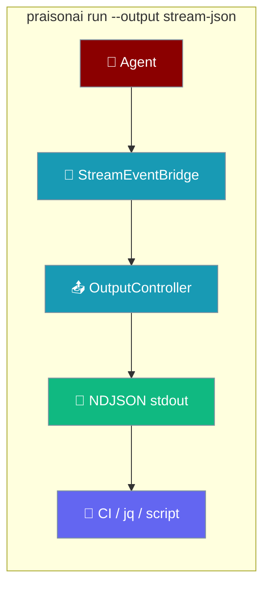
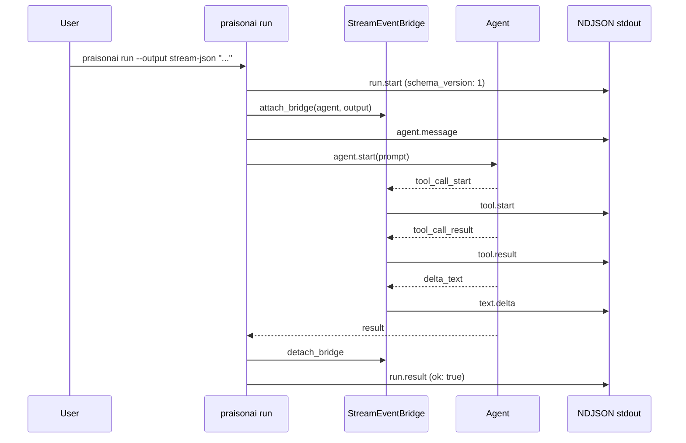
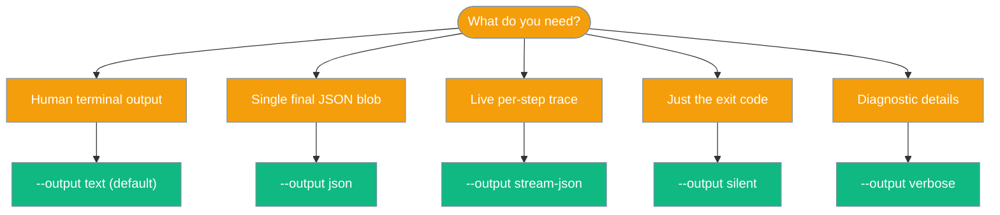

`praisonai run --output stream-json` emits a per-step NDJSON event stream for CI pipelines, scripts, and observability tools.

```bash
praisonai run --output stream-json "Find the weather in London"
```



## Quick Start

<Steps>
<Step title="Run with stream-json output">
```bash
praisonai run --output stream-json "Find the weather in London"
```

Each line of stdout is one JSON event object. The stream ends when the run completes.
</Step>

<Step title="Filter events with jq">
```bash
praisonai run --output stream-json "Find the weather in London" \
  | jq -c 'select(.event == "tool.start" or .event == "run.result")'
```

Use `jq` to watch only the events that matter to your pipeline.
</Step>

<Step title="Process events in Python">
```python
import json
import subprocess

proc = subprocess.Popen(
    ["praisonai", "run", "--output", "stream-json", "Find the weather in London"],
    stdout=subprocess.PIPE,
    text=True,
)
for line in proc.stdout:
    event = json.loads(line)
    print(event["event"], event["data"])
```
</Step>
</Steps>

---

## How It Works

Each run wires a `StreamEventBridge` between the agent's internal `StreamEventEmitter` and the `OutputController`. Every agent action — tool calls, text deltas, errors — becomes an NDJSON line on stdout.



**Run-level lifecycle events** (`run.start`, `agent.message`, `run.result`, `run.error`) are driven directly by the CLI. **Per-step events** (`tool.*`, `text.delta`, `reasoning.delta`) come through the `StreamEventBridge` callback.

---

## Event Schema (schema_version = 1)

Every NDJSON line is a JSON object with `event` and `data` keys. Every `data` object contains `schema_version: 1`.

| Event | When | Key fields in `data` |
|-------|------|----------------------|
| `run.start` | Once, at run start | `schema_version`, `target`, `model`, `framework` |
| `agent.message` | Once per agent invocation | `schema_version`, `agent` (name or null) |
| `tool.start` | Each tool call | `schema_version`, `tool`, `args` |
| `tool.result` | Each tool return | `schema_version`, `tool`, `result`, `ok` |
| `tool.error` | Tool-scoped failure | `schema_version`, `tool`, `error` |
| `text.delta` | Streaming text chunk | `schema_version`, `text` |
| `reasoning.delta` | Streaming reasoning chunk | `schema_version`, `text` |
| `run.result` | Successful run end | `schema_version`, `ok: true`, `result` |
| `run.error` | Run or transport failure | `schema_version`, `ok: false`, `error` |

### Example NDJSON output

```jsonl
{"event":"run.start","data":{"schema_version":1,"target":"Find the weather in London","model":"gpt-4o-mini","framework":"praisonai"}}
{"event":"agent.message","data":{"schema_version":1,"agent":"Researcher"}}
{"event":"tool.start","data":{"schema_version":1,"tool":"web_search","args":{"query":"weather in London"}}}
{"event":"tool.result","data":{"schema_version":1,"tool":"web_search","result":"...","ok":true}}
{"event":"text.delta","data":{"schema_version":1,"text":"The weather in London is "}}
{"event":"text.delta","data":{"schema_version":1,"text":"currently 15°C..."}}
{"event":"run.result","data":{"schema_version":1,"ok":true,"result":"The weather in London is currently 15°C..."}}
```

---

## Examples per Event Type

<AccordionGroup>

<Accordion title="run.start">
Emitted once at the start of every run. Contains the target prompt, model, and framework.

```json
{
  "event": "run.start",
  "data": {
    "schema_version": 1,
    "target": "Find the weather in London",
    "model": "gpt-4o-mini",
    "framework": "praisonai"
  }
}
```
</Accordion>

<Accordion title="agent.message">
Emitted once per agent invocation, immediately before the agent starts processing.

```json
{
  "event": "agent.message",
  "data": {
    "schema_version": 1,
    "agent": "Researcher"
  }
}
```
</Accordion>

<Accordion title="tool.start">
Emitted each time the agent calls a tool. `args` contains the tool's input arguments.

```json
{
  "event": "tool.start",
  "data": {
    "schema_version": 1,
    "tool": "web_search",
    "args": {"query": "weather in London"}
  }
}
```
</Accordion>

<Accordion title="tool.result">
Emitted when a tool returns. `ok` is `true` unless the tool reported an error.

```json
{
  "event": "tool.result",
  "data": {
    "schema_version": 1,
    "tool": "web_search",
    "result": "London: 15°C, partly cloudy",
    "ok": true
  }
}
```
</Accordion>

<Accordion title="text.delta and reasoning.delta">
Streaming text chunks from the model. `reasoning.delta` is used when `is_reasoning=True`.

```json
{"event":"text.delta","data":{"schema_version":1,"text":"The weather in London "}}
{"event":"text.delta","data":{"schema_version":1,"text":"is currently 15°C."}}
```

```json
{"event":"reasoning.delta","data":{"schema_version":1,"text":"I should search for current conditions..."}}
```
</Accordion>

<Accordion title="run.result">
Emitted once when the run completes successfully. `result` is the agent's final output.

```json
{
  "event": "run.result",
  "data": {
    "schema_version": 1,
    "ok": true,
    "result": "The weather in London is currently 15°C with partly cloudy skies."
  }
}
```
</Accordion>

<Accordion title="run.error">
Emitted when a run-level, streaming, or transport failure occurs. Also emitted for core `error` events.

```json
{
  "event": "run.error",
  "data": {
    "schema_version": 1,
    "ok": false,
    "error": "Rate limit exceeded"
  }
}
```
</Accordion>

</AccordionGroup>

---

## Stability and Versioning

Every event's `data` object includes `schema_version: 1`. This version is bumped only on backward-incompatible schema changes.

```python
import json
import subprocess

proc = subprocess.Popen(
    ["praisonai", "run", "--output", "stream-json", "task"],
    stdout=subprocess.PIPE, text=True,
)
for line in proc.stdout:
    event = json.loads(line)
    version = event["data"].get("schema_version", 0)
    if version != 1:
        raise RuntimeError(f"Unexpected schema_version: {version}")
```

<Note>
Pin your consumer against `schema_version: 1`. Future backward-incompatible changes will increment this value so you can detect and handle them gracefully.
</Note>

---

## When to Use Which Output Mode



---

## Common Patterns

### Filter for specific events with jq

Watch only tool calls and the final result:

```bash
praisonai run --output stream-json "Research quantum computing" \
  | jq -c 'select(.event | test("^tool\\.|^run\\.result$"))'
```

### Detect run.error in CI

Exit with a non-zero code if the run fails:

```bash
OUTPUT=$(praisonai run --output stream-json "Run tests")
if echo "$OUTPUT" | jq -e 'select(.event == "run.error")' > /dev/null; then
  echo "Run failed"
  exit 1
fi
```

### Build a progress UI fed by text.delta

Concatenate `text.delta` chunks to show a live streamed response:

```python
import json
import subprocess
import sys

proc = subprocess.Popen(
    ["praisonai", "run", "--output", "stream-json", "Explain quantum computing"],
    stdout=subprocess.PIPE,
    text=True,
)
for line in proc.stdout:
    event = json.loads(line)
    if event["event"] == "text.delta":
        sys.stdout.write(event["data"]["text"])
        sys.stdout.flush()
    elif event["event"] == "run.result":
        print()
        break
```

---

## Best Practices

<AccordionGroup>

<Accordion title="Always check schema_version">
Before processing events, verify `data.schema_version == 1`. This guards your consumer against future breaking changes.

```python
event = json.loads(line)
assert event["data"]["schema_version"] == 1, "Unsupported schema version"
```
</Accordion>

<Accordion title="Handle run.error explicitly">
A `run.error` event means the run failed. Check `ok == false` and surface the `error` field to your observability system.

```python
if event["event"] == "run.error":
    logger.error("Agent run failed: %s", event["data"]["error"])
    sys.exit(1)
```
</Accordion>

<Accordion title="Use stream-json only when you need per-step trace">
In `text`, `json`, `silent`, and `verbose` modes the bridge is a no-op — zero per-step callback overhead. Only enable `stream-json` when a downstream consumer actually reads the events.
</Accordion>

<Accordion title="Use run.result as the authoritative final output">
Concatenating `text.delta` chunks is useful for live display, but `run.result.data.result` is the single authoritative final output string. Prefer it when you only need the end result.
</Accordion>

</AccordionGroup>

---

## Related

<CardGroup cols={2}>
  <Card title="CLI Run" icon="play" href="/docs/cli/run">
    CLI run reference and output modes
  </Card>
  <Card title="CLI Backend Protocol" icon="plug" href="/docs/features/cli-backend-protocol">
    Backend protocol for custom CLI integrations
  </Card>
</CardGroup>
