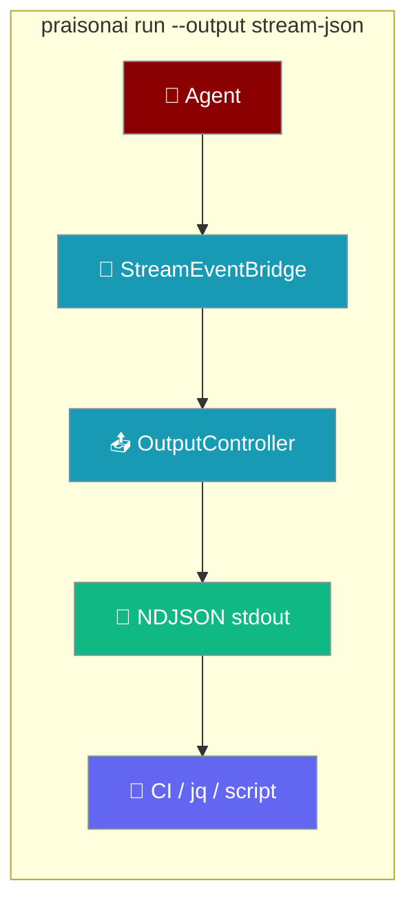
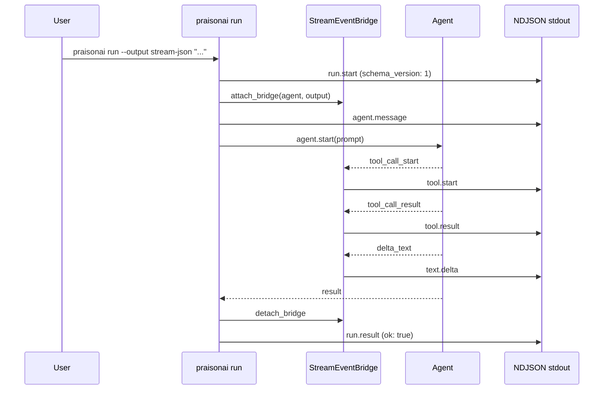
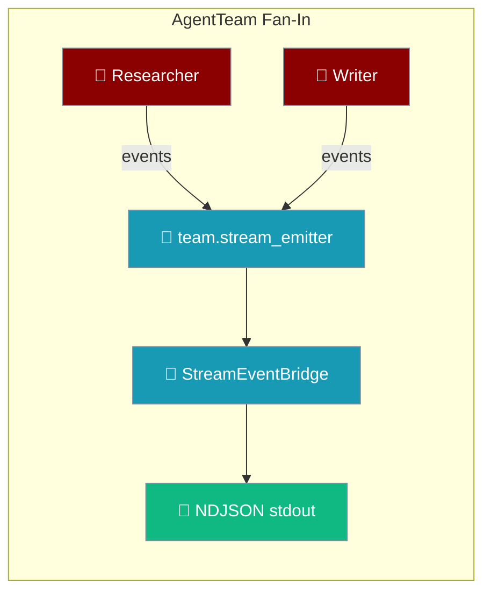
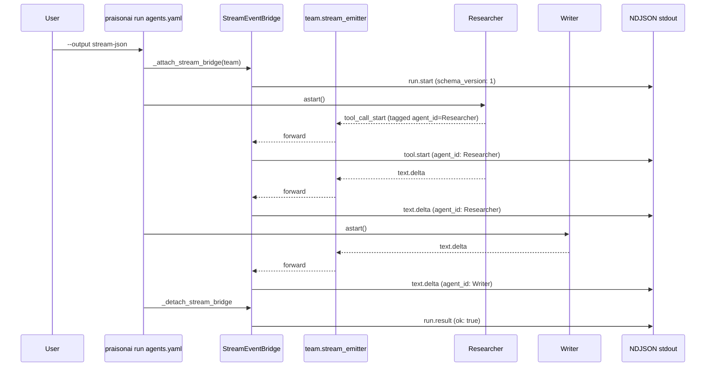
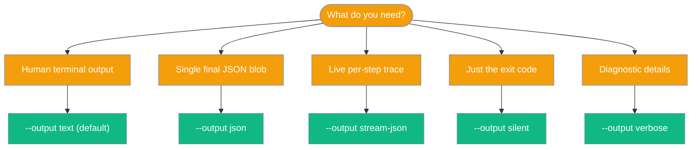

```python
from praisonaiagents import Agent

agent = Agent(name="stream-agent", instructions="Stream agent run events in real time.")
agent.start("Process this request and stream each step as it completes.")
```


`praisonai run --output stream-json` emits a per-step NDJSON event stream for CI pipelines, scripts, and observability tools. This works for single-agent runs **and** YAML / AgentTeam runs — team member events are fanned in on a single stream and tagged with the emitting agent's `agent_id`.

```bash
praisonai run --output stream-json "Find the weather in London"
```

The user runs the CLI with stream-json output; each agent step emits a versioned NDJSON line for scripts and CI.



```mermaid
graph LR
    subgraph "praisonai run --output stream-json"
        Agent[🤖 Agent] --> Bridge[🔗 StreamEventBridge]
        Bridge --> Output[📤 OutputController]
        Output --> NDJSON[📜 NDJSON stdout]
        NDJSON --> Consumer[🧰 CI / jq / script]
    end

    classDef agent fill:#8B0000,stroke:#7C90A0,color:#fff
    classDef bridge fill:#189AB4,stroke:#7C90A0,color:#fff
    classDef event fill:#10B981,stroke:#7C90A0,color:#fff
    classDef consumer fill:#6366F1,stroke:#7C90A0,color:#fff

    class Agent agent
    class Bridge,Output bridge
    class NDJSON event
    class Consumer consumer
```

## Quick Start

<Steps>
<Step title="Run with stream-json output">
```bash
praisonai run --output stream-json "Find the weather in London"
```

Each line of stdout is one JSON event object. The stream ends when the run completes.
</Step>

<Step title="Filter events with jq">
```bash
praisonai run --output stream-json "Find the weather in London" \
  | jq -c 'select(.event == "tool.start" or .event == "run.result")'
```

Use `jq` to watch only the events that matter to your pipeline.
</Step>

<Step title="Process events in Python">
```python
import json
import subprocess

proc = subprocess.Popen(
    ["praisonai", "run", "--output", "stream-json", "Find the weather in London"],
    stdout=subprocess.PIPE,
    text=True,
)
for line in proc.stdout:
    event = json.loads(line)
    print(event["event"], event["data"])
```
</Step>
</Steps>

---

## How It Works

Each run wires a `StreamEventBridge` between the agent's internal `StreamEventEmitter` and the `OutputController`. Every agent action — tool calls, text deltas, errors — becomes an NDJSON line on stdout.


```mermaid
sequenceDiagram
    participant User
    participant CLI as praisonai run
    participant Bridge as StreamEventBridge
    participant Agent
    participant Stdout as NDJSON stdout

    User->>CLI: praisonai run --output stream-json "..."
    CLI->>Stdout: run.start (schema_version: 1)
    CLI->>Bridge: attach_bridge(agent, output)
    CLI->>Stdout: agent.message
    CLI->>Agent: agent.start(prompt)
    Agent-->>Bridge: tool_call_start
    Bridge->>Stdout: tool.start
    Agent-->>Bridge: tool_call_result
    Bridge->>Stdout: tool.result
    Agent-->>Bridge: delta_text
    Bridge->>Stdout: text.delta
    Agent-->>CLI: result
    CLI->>Bridge: detach_bridge
    CLI->>Stdout: run.result (ok: true)
```

**Run-level lifecycle events** (`run.start`, `agent.message`, `run.result`, `run.error`) are driven directly by the CLI. **Per-step events** (`tool.*`, `text.delta`, `reasoning.delta`) come through the `StreamEventBridge` callback.

On YAML / AgentTeam runs, the bridge attaches to `team.stream_emitter` — a lazy aggregate `StreamEventEmitter` that fans in every member agent's events and tags each with the emitting `agent_id`.

---

## YAML / Multi-Agent Runs

YAML and AgentTeam runs emit the same NDJSON contract as single-agent runs, with an extra `agent_id` field on per-step events.

```bash
praisonai run agents.yaml --output stream-json
```

Every team member's events fan in on one stream, and each per-step event carries an `agent_id` so consumers can attribute activity to a specific member.

```python
from praisonaiagents import Agent, Task, PraisonAIAgents

researcher = Agent(name="Researcher", instructions="Research the topic.")
writer     = Agent(name="Writer",     instructions="Summarise the findings.")

team = PraisonAIAgents(
    agents=[researcher, writer],
    tasks=[
        Task(description="Find recent news on quantum computing", agent=researcher),
        Task(description="Write a 3-sentence summary",           agent=writer),
    ],
)

# The team's aggregate stream_emitter fans in per-agent events.
# The CLI `--output stream-json` attaches to this automatically.
team.start()
```


```mermaid
graph LR
    subgraph "AgentTeam Fan-In"
        A1[🤖 Researcher] -->|events| TE[📡 team.stream_emitter]
        A2[🤖 Writer]     -->|events| TE
        TE --> Bridge[🔗 StreamEventBridge]
        Bridge --> NDJSON[📜 NDJSON stdout]
    end

    classDef agent fill:#8B0000,stroke:#7C90A0,color:#fff
    classDef emit  fill:#189AB4,stroke:#7C90A0,color:#fff
    classDef out   fill:#10B981,stroke:#7C90A0,color:#fff

    class A1,A2 agent
    class TE,Bridge emit
    class NDJSON out
```

Each member agent forwards its per-step events onto `team.stream_emitter`, which the bridge turns into NDJSON on stdout.


```mermaid
sequenceDiagram
    participant User
    participant CLI as praisonai run agents.yaml
    participant Bridge as StreamEventBridge
    participant TE as team.stream_emitter
    participant A1 as Researcher
    participant A2 as Writer
    participant Stdout as NDJSON stdout

    User->>CLI: --output stream-json
    CLI->>Bridge: _attach_stream_bridge(team)
    Bridge->>Stdout: run.start (schema_version: 1)
    CLI->>A1: astart()
    A1-->>TE: tool_call_start (tagged agent_id=Researcher)
    TE-->>Bridge: forward
    Bridge->>Stdout: tool.start (agent_id: Researcher)
    A1-->>TE: text.delta
    TE-->>Bridge: forward
    Bridge->>Stdout: text.delta (agent_id: Researcher)
    CLI->>A2: astart()
    A2-->>TE: text.delta
    TE-->>Bridge: forward
    Bridge->>Stdout: text.delta (agent_id: Writer)
    CLI->>Bridge: _detach_stream_bridge
    Bridge->>Stdout: run.result (ok: true)
```

### Example NDJSON for a team run

```jsonl
{"event":"run.start","data":{"schema_version":1,"target":"agents.yaml","model":"gpt-4o-mini","framework":"praisonai"}}
{"event":"agent.message","data":{"schema_version":1,"agent":"Researcher"}}
{"event":"tool.start","data":{"schema_version":1,"agent_id":"Researcher","tool":"web_search","args":{"query":"quantum computing news"}}}
{"event":"tool.result","data":{"schema_version":1,"agent_id":"Researcher","tool":"web_search","result":"...","ok":true}}
{"event":"text.delta","data":{"schema_version":1,"agent_id":"Writer","text":"Recent breakthroughs include "}}
{"event":"text.delta","data":{"schema_version":1,"agent_id":"Writer","text":"error-corrected qubits..."}}
{"event":"run.result","data":{"schema_version":1,"ok":true,"result":"Recent breakthroughs include error-corrected qubits..."}}
```

### Group events by agent

Filter one member's events with `jq`:

```bash
praisonai run agents.yaml --output stream-json \
  | jq -c 'select(.data.agent_id == "Researcher")'
```

Route deltas to per-agent buffers in Python:

```python
import json, subprocess, collections

buffers = collections.defaultdict(list)
proc = subprocess.Popen(
    ["praisonai", "run", "agents.yaml", "--output", "stream-json"],
    stdout=subprocess.PIPE, text=True,
)
for line in proc.stdout:
    ev = json.loads(line)
    if ev["event"] == "text.delta":
        buffers[ev["data"].get("agent_id", "?")].append(ev["data"]["text"])
for agent_id, chunks in buffers.items():
    print(f"--- {agent_id} ---")
    print("".join(chunks))
```

---

## Event Schema (schema_version = 1)

Every NDJSON line is a JSON object with `event` and `data` keys. Every `data` object contains `schema_version: 1`.

| Event | When | Key fields in `data` |
|-------|------|----------------------|
| `run.start` | Once, at run start | `schema_version`, `target`, `model`, `framework` |
| `agent.message` | Once per agent invocation | `schema_version`, `agent` (name or null) |
| `tool.start` | Each tool call | `schema_version`, `tool`, `args` |
| `tool.result` | Each tool return | `schema_version`, `tool`, `result`, `ok` |
| `tool.error` | Tool-scoped failure | `schema_version`, `tool`, `error` |
| `text.delta` | Streaming text chunk | `schema_version`, `text` |
| `reasoning.delta` | Streaming reasoning chunk | `schema_version`, `text` |
| `run.retry` | Before a retry wait, on rate-limit / transient-error backoff | `schema_version`, `attempt`, `max_attempts`, `delay`, `reason` |
| `run.result` | Successful run end | `schema_version`, `ok: true`, `result` |
| `run.error` | Run or transport failure | `schema_version`, `ok: false`, `error` |

### Optional fields

| Field | Type | Present on | Description |
|-------|------|------------|-------------|
| `agent_id` | `str` \| `null` | `tool.*`, `text.delta`, `reasoning.delta`, `run.retry` | Emitting team member's `agent_id` (falls back to `display_name`). Present on YAML/team runs; absent (or `null`) on single-agent runs. |

### Example NDJSON output

```jsonl
{"event":"run.start","data":{"schema_version":1,"target":"Find the weather in London","model":"gpt-4o-mini","framework":"praisonai"}}
{"event":"agent.message","data":{"schema_version":1,"agent":"Researcher"}}
{"event":"tool.start","data":{"schema_version":1,"tool":"web_search","args":{"query":"weather in London"}}}
{"event":"tool.result","data":{"schema_version":1,"tool":"web_search","result":"...","ok":true}}
{"event":"run.retry","data":{"schema_version":1,"attempt":2,"max_attempts":5,"delay":4.0,"reason":"rate_limit"}}
{"event":"text.delta","data":{"schema_version":1,"text":"The weather in London is "}}
{"event":"text.delta","data":{"schema_version":1,"text":"currently 15°C..."}}
{"event":"run.result","data":{"schema_version":1,"ok":true,"result":"The weather in London is currently 15°C..."}}
```

---

## Examples per Event Type

<AccordionGroup>

<Accordion title="run.start">
Emitted once at the start of every run. Contains the target prompt, model, and framework.

```json
{
  "event": "run.start",
  "data": {
    "schema_version": 1,
    "target": "Find the weather in London",
    "model": "gpt-4o-mini",
    "framework": "praisonai"
  }
}
```
</Accordion>

<Accordion title="agent.message">
Emitted once per agent invocation, immediately before the agent starts processing.

```json
{
  "event": "agent.message",
  "data": {
    "schema_version": 1,
    "agent": "Researcher"
  }
}
```
</Accordion>

<Accordion title="tool.start">
Emitted each time the agent calls a tool. `args` contains the tool's input arguments.

```json
{
  "event": "tool.start",
  "data": {
    "schema_version": 1,
    "tool": "web_search",
    "args": {"query": "weather in London"}
  }
}
```
</Accordion>

<Accordion title="tool.result">
Emitted when a tool returns. `ok` is `true` unless the tool reported an error.

```json
{
  "event": "tool.result",
  "data": {
    "schema_version": 1,
    "tool": "web_search",
    "result": "London: 15°C, partly cloudy",
    "ok": true
  }
}
```
</Accordion>

<Accordion title="text.delta and reasoning.delta">
Streaming text chunks from the model. `reasoning.delta` is used when `is_reasoning=True`.

```json
{"event":"text.delta","data":{"schema_version":1,"text":"The weather in London "}}
{"event":"text.delta","data":{"schema_version":1,"text":"is currently 15°C."}}
```

```json
{"event":"reasoning.delta","data":{"schema_version":1,"text":"I should search for current conditions..."}}
```

`reasoning.delta` events now appear reliably for **async** agent invocations that hit the OpenAI Responses API. Previously they surfaced only for sync invocations, so long-running async streams looked silent during the thinking phase.
</Accordion>

<Accordion title="run.retry">
Emitted **before** the retry wait, so consumers can render a live countdown instead of a silent-looking hang. Fires on rate-limit / transient-error backoff.

```json
{
  "event": "run.retry",
  "data": {
    "schema_version": 1,
    "attempt": 2,
    "max_attempts": 5,
    "delay": 4.0,
    "reason": "rate_limit"
  }
}
```

| Field | Type | Description |
|-------|------|-------------|
| `attempt` | `int` | The retry attempt about to run |
| `max_attempts` | `int` | Total attempts allowed |
| `delay` | `float` | Seconds the run will wait before retrying |
| `reason` | `str` | Why the retry fired (e.g. `rate_limit`) |

This is the CLI-facing form of the [`RETRY` stream event](/docs/features/streaming#reacting-to-retries) — same signal, surfaced as NDJSON.
</Accordion>

<Accordion title="run.result">
Emitted once when the run completes successfully. `result` is the agent's final output.

```json
{
  "event": "run.result",
  "data": {
    "schema_version": 1,
    "ok": true,
    "result": "The weather in London is currently 15°C with partly cloudy skies."
  }
}
```
</Accordion>

<Accordion title="run.error">
Emitted when a run-level, streaming, or transport failure occurs. Also emitted for core `error` events.

```json
{
  "event": "run.error",
  "data": {
    "schema_version": 1,
    "ok": false,
    "error": "Rate limit exceeded"
  }
}
```

On YAML / AgentTeam runs, `run.error` is now emitted when `team.astart()` raises. This lets stream-json consumers distinguish a **failed** team run from an **incomplete / still-running** one. The original exception is always re-raised — the `run.error` emit is best-effort and does not mask it.
</Accordion>

</AccordionGroup>

---

## Stability and Versioning

Every event's `data` object includes `schema_version: 1`. This version is bumped only on backward-incompatible schema changes.

```python
import json
import subprocess

proc = subprocess.Popen(
    ["praisonai", "run", "--output", "stream-json", "task"],
    stdout=subprocess.PIPE, text=True,
)
for line in proc.stdout:
    event = json.loads(line)
    version = event["data"].get("schema_version", 0)
    if version != 1:
        raise RuntimeError(f"Unexpected schema_version: {version}")
```

<Note>
Pin your consumer against `schema_version: 1`. Future backward-incompatible changes will increment this value so you can detect and handle them gracefully.
</Note>

The `agent_id` field on per-step events is a **new optional field** — a forward-compatible addition that does not change `schema_version`. Consumers can ignore it and keep working on both single-agent and team runs.

---

## When to Use Which Output Mode


```mermaid
graph TB
    Start(["What do you need?"])
    Pretty["Human terminal output"] --> Text["--output text (default)"]
    Single["Single final JSON blob"] --> JSON["--output json"]
    Stream["Live per-step trace"] --> Stream2["--output stream-json"]
    Quiet["Just the exit code"] --> Silent["--output silent"]
    Debug["Diagnostic details"] --> Verbose["--output verbose"]

    Start --> Pretty
    Start --> Single
    Start --> Stream
    Start --> Quiet
    Start --> Debug

    classDef q fill:#F59E0B,stroke:#7C90A0,color:#fff
    classDef a fill:#10B981,stroke:#7C90A0,color:#fff
    class Start,Pretty,Single,Stream,Quiet,Debug q
    class Text,JSON,Stream2,Silent,Verbose a
```

---

## Common Patterns

### Filter for specific events with jq

Watch only tool calls and the final result:

```bash
praisonai run --output stream-json "Research quantum computing" \
  | jq -c 'select(.event | test("^tool\\.|^run\\.result$"))'
```

### Detect run.error in CI

Exit with a non-zero code if the run fails:

```bash
OUTPUT=$(praisonai run --output stream-json "Run tests")
if echo "$OUTPUT" | jq -e 'select(.event == "run.error")' > /dev/null; then
  echo "Run failed"
  exit 1
fi
```

### Build a progress UI fed by text.delta

Concatenate `text.delta` chunks to show a live streamed response:

```python
import json
import subprocess
import sys

proc = subprocess.Popen(
    ["praisonai", "run", "--output", "stream-json", "Explain quantum computing"],
    stdout=subprocess.PIPE,
    text=True,
)
for line in proc.stdout:
    event = json.loads(line)
    if event["event"] == "text.delta":
        sys.stdout.write(event["data"]["text"])
        sys.stdout.flush()
    elif event["event"] == "run.result":
        print()
        break
```

---

## Best Practices

<AccordionGroup>

<Accordion title="Always check schema_version">
Before processing events, verify `data.schema_version == 1`. This guards your consumer against future breaking changes.

```python
event = json.loads(line)
assert event["data"]["schema_version"] == 1, "Unsupported schema version"
```
</Accordion>

<Accordion title="Handle run.error explicitly">
A `run.error` event means the run failed. Check `ok == false` and surface the `error` field to your observability system.

```python
if event["event"] == "run.error":
    logger.error("Agent run failed: %s", event["data"]["error"])
    sys.exit(1)
```
</Accordion>

<Accordion title="Use stream-json only when you need per-step trace">
In `text`, `json`, `silent`, and `verbose` modes the bridge is a no-op — zero per-step callback overhead. Only enable `stream-json` when a downstream consumer actually reads the events.
</Accordion>

<Accordion title="Use run.result as the authoritative final output">
Concatenating `text.delta` chunks is useful for live display, but `run.result.data.result` is the single authoritative final output string. Prefer it when you only need the end result.
</Accordion>

</AccordionGroup>

---

## Related

<CardGroup cols={2}>
  <Card title="CLI Run" icon="play" href="/cli/run">
    CLI run reference and output modes
  </Card>
  <Card title="CLI Backend Protocol" icon="plug" href="/features/cli-backend-protocol">
    Backend protocol for custom CLI integrations
  </Card>
  <Card title="YAML / Team Session Continuity" icon="folder-tree" href="/features/yaml-session-continuity">
    Resume and continue YAML / AgentTeam runs across sessions
  </Card>
  <Card title="Multi-Agent Output" icon="layer-group" href="/features/multi-agent-output">
    How multi-agent runs structure and surface their output
  </Card>
</CardGroup>
