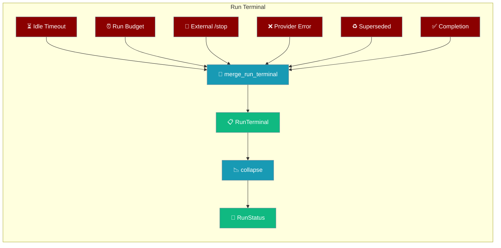
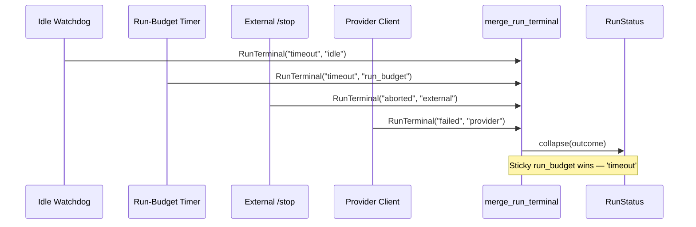
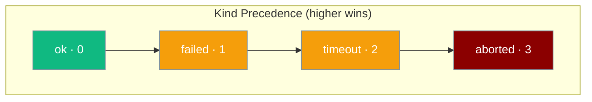
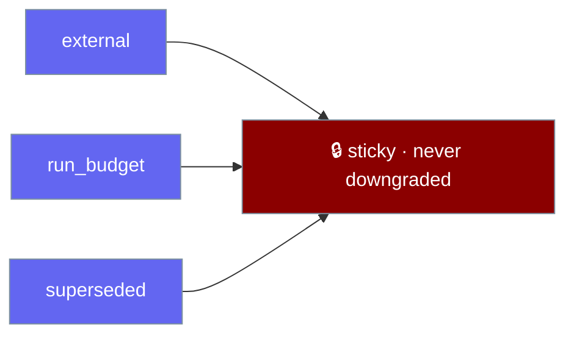
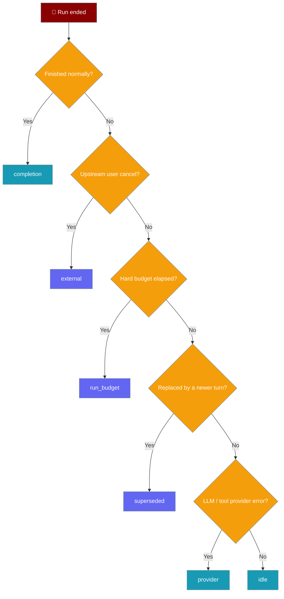

Several observers can watch the same run at once — an idle watchdog, a run-budget timer, an external `/stop`, a provider client — and `RunTerminal` folds their racing signals into one authoritative outcome that only ever refines toward stronger attribution.



<Note>
`RunTerminal` is a **third, lower-level primitive** — distinct from `RunOutcome` (host-facing terminal for a single run) and `AgentRunOutcome` (typed validation/handoff status). Reach for it in gateway/ledger scenarios where several observers watch the same run and you need one sticky, order-independent outcome.

| | `RunTerminal` | `RunOutcome` | `AgentRunOutcome` |
|---|---|---|---|
| **Import** | `from praisonaiagents import RunTerminal` | `from praisonaiagents import RunOutcome` | `from praisonaiagents import AgentRunOutcome` |
| **Vocabulary** | `kind` × `source` | `reason` | `status` |
| **Job** | Merge concurrent terminal observations into one sticky outcome | Host-facing terminal for a whole run | Typed validation/handoff status |
</Note>

## Quick Start

<Steps>
<Step title="Simplest merge (no current)">
With no recorded outcome, the observation becomes authoritative.

```python
from praisonaiagents import RunTerminal, merge_run_terminal

observed = RunTerminal("failed", "provider")
outcome = merge_run_terminal(None, observed)
print(outcome)  # RunTerminal(kind='failed', source='provider', detail=None)
```
</Step>

<Step title="Deliberate cancel is never downgraded">
A user's `/stop` wins over a late provider error, whatever the arrival order.

```python
from praisonaiagents import RunTerminal, merge_run_terminal, collapse

cancel = RunTerminal("aborted", "external", detail="user /stop")
late_error = RunTerminal("failed", "provider")

outcome = merge_run_terminal(cancel, late_error)
print(collapse(outcome))  # 'cancelled' — the user's /stop wins
```
</Step>

<Step title="Round-trip through a durable ledger">
Persist the outcome typed, not as a free string — then rehydrate it.

```python
from praisonaiagents import RunTerminal

outcome = RunTerminal("aborted", "external", detail="user /stop")

# Persist to SQLite / JSON / whatever ledger you use
data = outcome.to_dict()  # {'kind': 'aborted', 'source': 'external', 'detail': 'user /stop'}

# Restart, rehydrate
restored = RunTerminal.from_dict(data)
assert restored == outcome
```
</Step>
</Steps>

---

## How It Works

Each observer reports a `RunTerminal` to `merge_run_terminal`, which keeps refining one authoritative outcome; `collapse` projects it to a `RunStatus` for downstream consumers.



| Concept | What it does |
|---|---|
| `RunTerminal` | Frozen dataclass — one terminal observation (`kind` + `source` + `detail`) |
| `merge_run_terminal` | Refines the recorded terminal toward stronger attribution; never downgrades |
| `is_sticky` | Marks a terminal authoritative — never overwritten |
| `collapse` | Projects `RunTerminal` onto the existing `RunStatus` vocabulary |

---

## Precedence & Stickiness

`merge_run_terminal` picks a winner by two rules: a stronger `kind` always beats a weaker one, and among equal kinds a sticky source beats a non-sticky one.

**Kind precedence ladder** — a later, weaker observation never overwrites a stronger one.



**Sticky sources** — a deliberate cancel, a hard run-budget timeout, and a supersede are intentional terminals; once recorded, authoritative.



---

## Configuration Options

`RunTerminal` is a frozen dataclass. Every field:

| Field | Type | Default | Description |
|---|---|---|---|
| `kind` | `TerminalKind` | required | Collapsed terminal category — `"ok" \| "failed" \| "timeout" \| "aborted"` |
| `source` | `TerminalSource` | required | Which observer produced the terminal (decides stickiness) |
| `detail` | `Optional[str]` | `None` | Free-form detail, e.g. `"user /stop"` |

Methods:

| Method | Signature | Purpose |
|---|---|---|
| `to_dict()` | `-> Dict[str, Any]` | Serialise to a JSON/SQLite friendly dict |
| `from_dict(data)` | `classmethod -> RunTerminal` | Rehydrate from a dict produced by `to_dict` |

The `source` vocabulary and which sources are sticky:

| `source` | Sticky? | Typical observer |
|---|---|---|
| `completion` | No | Normal successful finish |
| `idle` | No | Idle-timeout watchdog |
| `run_budget` | **Yes** | Hard run-budget / total-timeout guard |
| `external` | **Yes** | User `/stop`, upstream cancel |
| `provider` | No | LLM/tool error from the provider |
| `superseded` | **Yes** | A newer turn replaced this one |

Full API surface lives in the auto-generated SDK reference for `praisonaiagents.run_outcome`.

---

## Which source to pick

Pick the `source` that names the observer that ended the run.



---

## Common Patterns

Gateway race — an idle timeout arrives, then the user cancels; the cancel wins:

```python
from praisonaiagents import RunTerminal, merge_run_terminal, collapse

terminal = None
terminal = merge_run_terminal(terminal, RunTerminal("timeout", "idle"))
terminal = merge_run_terminal(terminal, RunTerminal("aborted", "external"))
print(collapse(terminal))  # 'cancelled' — the user's cancel wins over the idle timeout
```

Order-independent merge — the same signals yield the same result regardless of arrival order:

```python
from praisonaiagents import RunTerminal, merge_run_terminal

idle       = RunTerminal("timeout", "idle")
run_budget = RunTerminal("timeout", "run_budget")

forward = merge_run_terminal(merge_run_terminal(None, idle),       run_budget)
reverse = merge_run_terminal(merge_run_terminal(None, run_budget), idle)

assert forward == reverse == run_budget  # sticky run_budget wins either way
```

Durable ledger persistence — typed, not a free string:

```python
# Before: record.terminal_outcome = str(reason)          # untyped free string
# After:
record.terminal = merge_run_terminal(record.terminal, observed)  # refine-only
record.status   = collapse(record.terminal)                       # RunStatus for downstream
```

---

## Best Practices

<AccordionGroup>
<Accordion title="Always merge, never assign">
Replacing `record.terminal` with the last observation is the exact bug this contract fixes. Always call `merge_run_terminal(record.terminal, observed)` so a late provider error can never overwrite a deliberate cancel or a hard timeout.
</Accordion>

<Accordion title="Persist typed via to_dict">
Store `outcome.to_dict()` in your durable ledger and rehydrate with `RunTerminal.from_dict(...)`. The free-string form is the ambiguity this contract removes — keep the outcome typed end to end.
</Accordion>

<Accordion title="Collapse only at the boundary">
Keep `RunTerminal` internally and call `collapse()` only when you must emit a legacy `RunStatus` — a chat reaction, an exit code, an HTTP status. Collapsing early throws away the `source` attribution.
</Accordion>

<Accordion title="Use is_sticky to stop watching">
Once a terminal is sticky, its outcome cannot change. Check `is_sticky(outcome)` and stop watching the run — further observations can only be discarded anyway.
</Accordion>
</AccordionGroup>

---

## Related

<CardGroup cols={2}>
<Card title="Run Outcome" icon="circle-check" href="/features/run-outcome">
The host-facing `RunOutcome` for a single run — related, but a different primitive with a `reason` field.
</Card>
<Card title="Agent Run Outcomes" icon="circle-check" href="/features/agent-run-outcomes">
The typed `AgentRunOutcome` `status` for validation and handoff results — related, but a different primitive.
</Card>
</CardGroup>
