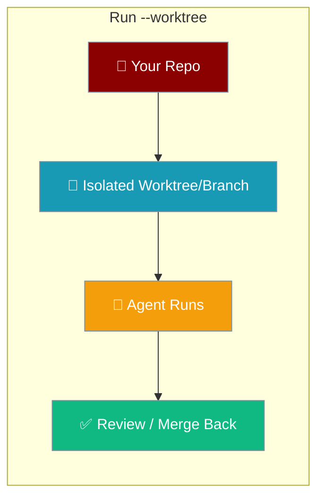
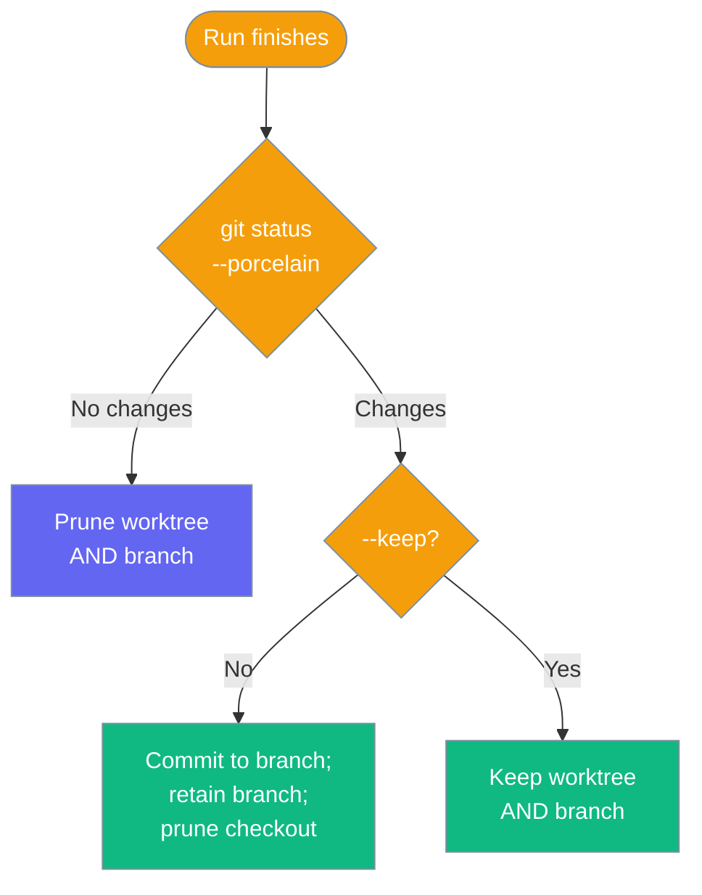

`praisonai run --worktree` runs an agent on a fresh git branch and worktree, then commits, keeps, or discards the result — your working tree is never touched.

```bash
praisonai run "Refactor the auth module and add tests" --worktree
```

That single command provisions a fresh worktree on a new branch, runs the agent there, commits every change (tracked *and* untracked) to the isolated branch, and prints how to merge it back.



## Quick Start

<Steps>
<Step title="Run a prompt in isolation">
The agent edits a fresh branch — your working tree stays clean.

```bash
praisonai run "Refactor the auth module" --worktree
```
</Step>

<Step title="Run a YAML file in isolation">
The YAML file is resolved to an absolute path before isolation, so an untracked or git-ignored `agents.yaml` still loads.

```bash
praisonai run agents.yaml --worktree
```
</Step>

<Step title="Keep the worktree for review">
Both the worktree checkout and the branch stay in place after the run so you can inspect the files directly.

```bash
praisonai run "Draft a migration plan" --worktree --keep
```
</Step>
</Steps>

---

## How It Works

`--worktree` provisions a per-run branch and directory, `chdir`s into it for the run, then decides what to keep based on whether the agent produced changes.

```mermaid
sequenceDiagram
    participant User
    participant CLI as praisonai run
    participant Adapter as GitWorktreeAdapter
    participant Worktree as Isolated Worktree

    User->>CLI: praisonai run "..." --worktree
    CLI->>Adapter: available?
    Adapter-->>CLI: yes (git repo)
    CLI->>Adapter: create("<target>-<token>")
    Adapter-->>Worktree: fresh branch + directory
    CLI->>Worktree: chdir + run agent
    Worktree-->>CLI: git status --porcelain
    CLI-->>User: commit-and-retain / prune / keep

    classDef cli fill:#8B0000,stroke:#7C90A0,color:#fff
    classDef adapter fill:#189AB4,stroke:#7C90A0,color:#fff
    classDef tree fill:#10B981,stroke:#7C90A0,color:#fff

    class User,CLI cli
    class Adapter adapter
    class Worktree tree
```

| Step | What happens |
|------|--------------|
| Probe | `GitWorktreeAdapter.available` checks the cwd is a git repo with `git` on PATH. |
| Provision | A fresh worktree is created at `.praisonai/worktrees/<slug>` on branch `praisonai/<slug>`. |
| Unique per run | A short random token is appended (`<target>-<token>`) so repeated or concurrent runs never share a worktree. |
| Run | The CLI `chdir`s into the worktree for the duration of the run. |
| Teardown | A `git status --porcelain` snapshot decides: commit-and-retain, prune, or keep. |

<Note>
The worktree is named after the run target plus a random token, then hashed into a git-ref-safe slug. Two runs of the same prompt or YAML file never clobber each other's uncommitted changes.
</Note>

---

## Teardown Matrix

What survives after the run depends on whether the agent changed anything and whether you passed `--keep`.



| Situation | What happens | User-visible message |
|-----------|--------------|----------------------|
| Not a git repo | No-op, run continues normally | `Not a git repository; running without worktree isolation.` |
| Run made no changes | Worktree **and** branch removed | `No changes on '<branch>'.` |
| Run made changes | Commit `praisonai run: <target>`, retain branch, prune worktree checkout | `Committed changes to branch '<branch>'. Review/merge with: git merge <branch>` |
| Commit fails (e.g. no git identity) | Worktree kept in place so output is never lost | `Could not commit isolated changes; worktree kept at <path> (branch '<branch>') for manual review.` |
| `--keep` | Both worktree **and** branch retained | `Worktree kept at <path> (branch '<branch>'). Review/merge then remove with: git worktree remove.` |

<Warning>
Untracked new files are committed too. Teardown uses `git status --porcelain` (not `git diff`), so brand-new files the agent creates are always captured on the branch before the checkout is pruned.
</Warning>

---

## What Gets Rejected

`--worktree` is scoped to direct prompt and YAML file runs. These combinations fail fast with exit code `1`.

| Combination | Message | Reason |
|-------------|---------|--------|
| `--worktree --attach` | `--worktree cannot be combined with --attach` | The warm runtime is a separate process whose cwd can't be redirected into the worktree. |
| `--keep` without `--worktree` | `--keep requires --worktree` | `--keep` is only meaningful with isolation. |
| `--worktree` with `--agent` / `--command` / `--profile` / `--profile-deep` | `--worktree is only supported for direct prompt and YAML file runs` | Scoped intentionally to keep the feature focused. |

---

## CI / JSON Mode

Under `--output json`, the isolation status messages are suppressed but isolation still happens.

```bash
praisonai run "Generate a changelog" --worktree --output json
```

The agent runs on the isolated branch exactly as before; only the informational prints (`Isolated run on branch ...`, `Committed changes ...`) are silenced so your JSON payload stays clean.

---

## Best Practices

<AccordionGroup>
<Accordion title="Use --worktree for risky or exploratory edits">
Isolation means a bad run never dirties your working tree. Run the agent, inspect the branch, then `git merge` only if you like the result.
</Accordion>

<Accordion title="Add --keep when you want to inspect files, not just the diff">
Without `--keep`, changed runs commit and prune the checkout — you review via `git merge <branch>`. With `--keep`, the checkout stays on disk under `.praisonai/worktrees/` so you can open the files directly.
</Accordion>

<Accordion title="Configure a git identity so commits succeed">
On teardown, changes are committed with `git commit --no-verify`. If no `user.name` / `user.email` is set, the commit fails and the worktree is kept in place for manual review instead. Set a git identity to get the clean commit-and-merge path.
</Accordion>

<Accordion title="Clean up kept worktrees when you're done">
`--keep` and commit-failure paths leave a worktree on disk. Remove it with `git worktree remove <path>` once you've reviewed or merged the branch.
</Accordion>
</AccordionGroup>

---

## Related

<CardGroup cols={2}>
<Card title="Workspace Isolation" icon="code-branch" href="/docs/features/workspace-isolation">
The SDK `GitWorktreeAdapter` this CLI flag wraps.
</Card>
<Card title="Kanban Worktree Isolation" icon="kanban" href="/docs/features/kanban#per-task-worktree-isolation">
Per-task git worktrees for kanban workers.
</Card>
<Card title="Run Command" icon="play" href="/docs/cli/run">
Full `praisonai run` CLI reference.
</Card>
</CardGroup>
