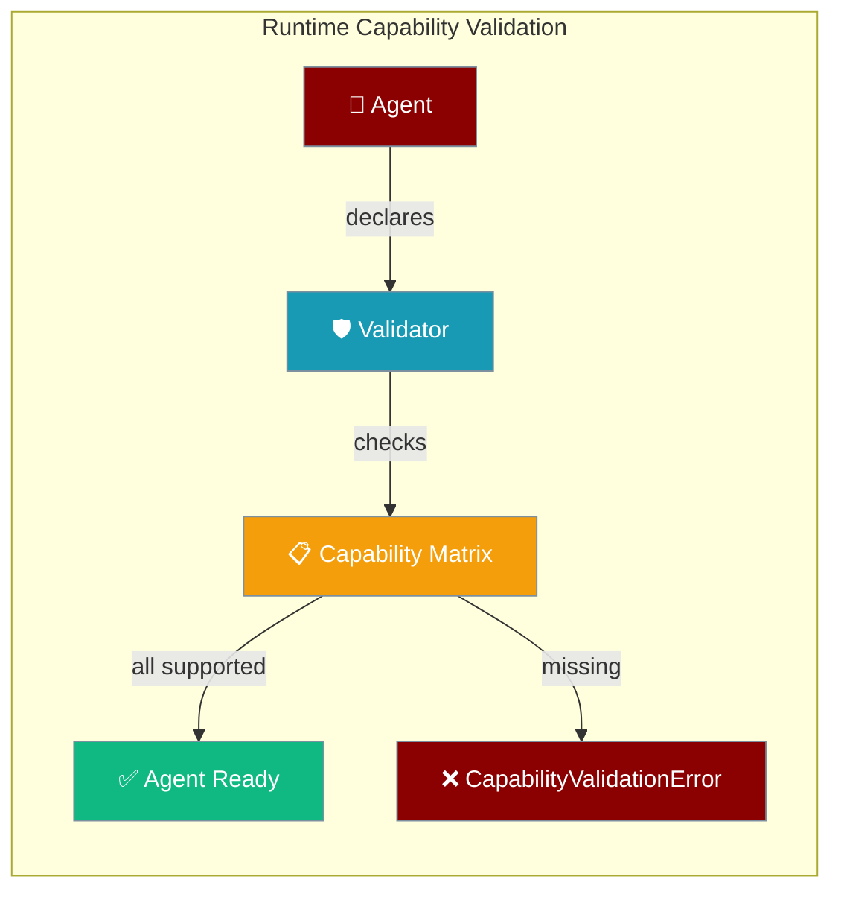
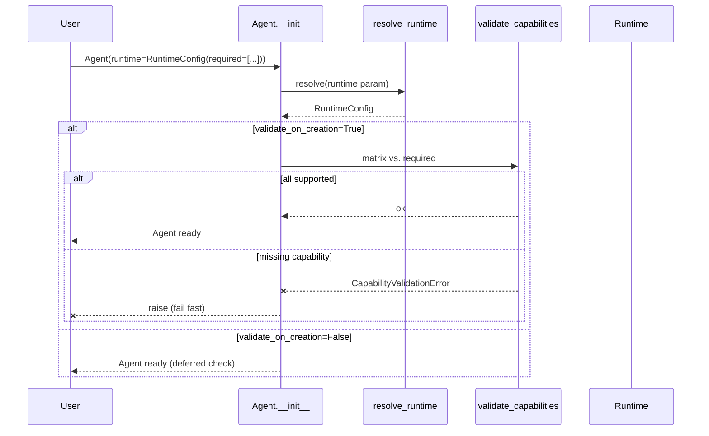

Agents declare required capabilities and the framework validates runtime support at construction — failing fast instead of mid-conversation.

```python
from praisonaiagents import Agent
from praisonaiagents.config import RuntimeConfig

agent = Agent(
    instructions="You are a research assistant",
    runtime=RuntimeConfig(
        preferred_runtime="native",
        required_capabilities=["tool_loop", "mcp_tools", "streaming_deltas"],
    ),
)
agent.start("Find the top 3 papers on RLHF this month")
```

The user declares required runtime capabilities on the agent; the framework validates support before execution starts.




## Quick Start

<Steps>
<Step title="Simple Usage">
Enable default capability validation with a single flag.

```python
from praisonaiagents import Agent

agent = Agent(
    instructions="You are a research assistant",
    runtime=True,
)

agent.start("Find the top 3 papers on RLHF this month")
```
</Step>

<Step title="With Configuration">
Declare exactly which capabilities your agent requires.

```python
from praisonaiagents import Agent
from praisonaiagents.config import RuntimeConfig

agent = Agent(
    instructions="You are a research assistant",
    runtime=RuntimeConfig(
        preferred_runtime="native",
        required_capabilities=["tool_loop", "mcp_tools", "streaming_deltas"],
        fallback_allowed=True,
    ),
)

agent.start("Find the top 3 papers on RLHF this month")
```
</Step>
</Steps>

---

## How It Works



| Step | What happens |
|------|-------------|
| 1 | User passes `runtime=` parameter (any of 6 forms) |
| 2 | `resolve_runtime` normalises the value into a `RuntimeConfig` |
| 3 | If `validate_on_creation=True`, `validate_capabilities` checks the matrix |
| 4 | All capabilities present → Agent is ready |
| 5 | Any missing → `CapabilityValidationError` raised immediately |

---

## The `runtime=` Parameter

Six forms are accepted, all normalised to `RuntimeConfig` internally.

```mermaid
graph TB
    Q{What do I need?}
    Q -->|Just turn on validation| B["runtime=True"]
    Q -->|Turn off runtime| C["runtime=False"]
    Q -->|Pick a runtime by name| D["runtime=\"native\""]
    Q -->|List required capabilities| E["runtime=[\"tool_loop\", \"mcp_tools\"]"]
    Q -->|Dict config| F["runtime={\"preferred_runtime\": \"native\", ...}"]
    Q -->|Full control| G["runtime=RuntimeConfig(...)"]

    classDef question fill:#6366F1,stroke:#7C90A0,color:#fff
    classDef option fill:#189AB4,stroke:#7C90A0,color:#fff

    class Q question
    class B,C,D,E,F,G option
```

| Form | Example | Resolves to |
|------|---------|-------------|
| `None` (default) | `Agent(...)` | No runtime override — model-based resolution |
| `bool` True | `Agent(runtime=True)` | `RuntimeConfig()` with defaults |
| `bool` False | `Agent(runtime=False)` | `None` — runtime explicitly disabled |
| `str` | `Agent(runtime="native")` | `RuntimeConfig(preferred_runtime="native")` |
| `list` / `set` / `tuple` / `frozenset` | `Agent(runtime=["tool_loop", "mcp_tools"])` | `RuntimeConfig(required_capabilities=[...])` |
| `dict` | `Agent(runtime={"preferred_runtime": "native"})` | `RuntimeConfig(**value)` |
| `RuntimeConfig` instance | `Agent(runtime=RuntimeConfig(...))` | returned as-is |

**Precedence ladder:** `Instance > Config > Dict > List > String > Bool > Default`

---

## Configuration Options

### `RuntimeConfig`

| Option | Type | Default | Description |
|--------|------|---------|-------------|
| `required_capabilities` | `list / set / tuple / frozenset` | `None` | Capability names the runtime must support. Normalised to list automatically. |
| `preferred_runtime` | `str` | `None` | Preferred runtime ID: `"native"`, `"praisonai"`, `"claude-code"`, `"plugin-harness"`. |
| `fallback_allowed` | `bool` | `True` | Allow falling back to another runtime if the preferred one is unavailable. |
| `validate_on_creation` | `bool` | `True` | Validate capabilities at `Agent(...)` construction instead of first execution. |
| `metadata` | `dict` | `{}` | Free-form metadata passed through to the runtime. |

### `RuntimeCapability` Enum

12 capabilities are available:

| Capability | Meaning |
|------------|---------|
| `NATIVE_HOOKS` | Pre-/post-/tool/error hooks fire in the runtime itself |
| `TOOL_LOOP` | Multi-turn tool-calling loop |
| `STREAMING_DELTAS` | Token-by-token streaming output |
| `CONTEXT_COMPACTION` | Automatic context window compaction |
| `MCP_TOOLS` | MCP (Model Context Protocol) tools |
| `CODE_EXECUTION` | Sandboxed code execution |
| `MULTI_MODAL` | Image / audio / file inputs |
| `ASYNC_EXECUTION` | Native `async`/`await` execution |
| `SESSION_PERSISTENCE` | Resumable sessions across restarts |
| `MEMORY_MANAGEMENT` | Native memory store integration |
| `BASIC_CHAT` | Plain prompt-and-response chat |
| `SIMPLE_TOOLS` | Single-shot tool calls (no loop) |

### Built-in Capability Matrices

| Matrix | Capabilities | Use case |
|--------|-------------|----------|
| **Native** | All 12 | Local `praisonai` / `native` runtime — full feature set |
| **Reduced** | `tool_loop`, `basic_chat`, `simple_tools` only | `claude-code`, `plugin-harness`, and unknown runtimes (safe default) |

### Runtime → Matrix Mapping

| Runtime name | Matrix |
|-------------|--------|
| `"native"`, `"praisonai"` | Native (full) |
| `"plugin"`, `"harness"`, `"reduced"`, `"plugin-harness"`, `"claude-code"` | Reduced |
| Anything else (unknown) | Reduced (safe default) |

---

## Common Patterns

### Fail-fast on missing hooks

```python
from praisonaiagents import Agent
from praisonaiagents.config import RuntimeConfig

agent = Agent(
    instructions="You are an assistant with hooks",
    runtime=RuntimeConfig(
        preferred_runtime="native",
        required_capabilities=["native_hooks", "tool_loop"],
    ),
)
```

If the runtime doesn't support `native_hooks`, the agent raises `CapabilityValidationError` immediately.

### Allow fallback when preferred runtime unavailable

```python
from praisonaiagents import Agent
from praisonaiagents.config import RuntimeConfig

agent = Agent(
    instructions="You are a research assistant",
    runtime=RuntimeConfig(
        preferred_runtime="native",
        required_capabilities=["streaming_deltas"],
        fallback_allowed=True,
    ),
)
```

### Disable creation-time validation

```python
from praisonaiagents import Agent
from praisonaiagents.config import RuntimeConfig

agent = Agent(
    instructions="You are a research assistant",
    runtime=RuntimeConfig(
        preferred_runtime="native",
        required_capabilities=["mcp_tools"],
        validate_on_creation=False,
    ),
)
```

Validation is deferred until the agent's first execution.

### Catch validation errors

```python
from praisonaiagents import (
    RuntimeCapability,
    RuntimeCapabilityMatrix,
    CapabilityValidationError,
    validate_capabilities,
)

limited_runtime = RuntimeCapabilityMatrix(basic_chat=True, simple_tools=True)
required = {RuntimeCapability.NATIVE_HOOKS, RuntimeCapability.STREAMING_DELTAS}

try:
    validate_capabilities(limited_runtime, required, "plugin-harness")
except CapabilityValidationError as e:
    print(e.runtime_name)            # "plugin-harness"
    print(e.missing_capabilities)    # {NATIVE_HOOKS, STREAMING_DELTAS}
    print(e.available_capabilities)  # {BASIC_CHAT, SIMPLE_TOOLS}
```

The error message ends with: _"Remediation: select a runtime that supports the missing capabilities or remove unsupported entries from runtime.required_capabilities."_

---

## Best Practices

<AccordionGroup>
<Accordion title="Always declare what you need">
Use `required_capabilities` to document which features your agent depends on. This prevents silent feature degradation when switching runtimes — you'll know immediately if the new runtime can't support your agent.
</Accordion>

<Accordion title="Keep validate_on_creation=True">
The default `validate_on_creation=True` catches mismatches at boot time, not mid-conversation. A fast, visible error at startup is always better than a cryptic failure during user interaction.
</Accordion>

<Accordion title="Use preferred_runtime='native' for full features">
The native runtime supports all 12 capabilities. Only use `"claude-code"` or `"plugin-harness"` when you accept the reduced capability set (`tool_loop`, `basic_chat`, `simple_tools`).
</Accordion>

<Accordion title="For custom CLI backends, implement capabilities()">
`CliBackendProtocol` now requires a `capabilities() -> RuntimeCapabilityMatrix` method. Without it, the backend reports as reduced capability only. Third-party backends must add this method to participate in capability validation.
</Accordion>
</AccordionGroup>

---

## Related

<CardGroup cols={2}>
<Card title="CLI Backend Protocol" icon="plug" href="/docs/features/cli-backend-protocol">
  CLI backend integration (now deprecated in favour of runtime=)
</Card>
<Card title="YAML Configuration Reference" icon="book" href="/docs/features/yaml-configuration-reference">
  YAML agent options including the new runtime field
</Card>
</CardGroup>
