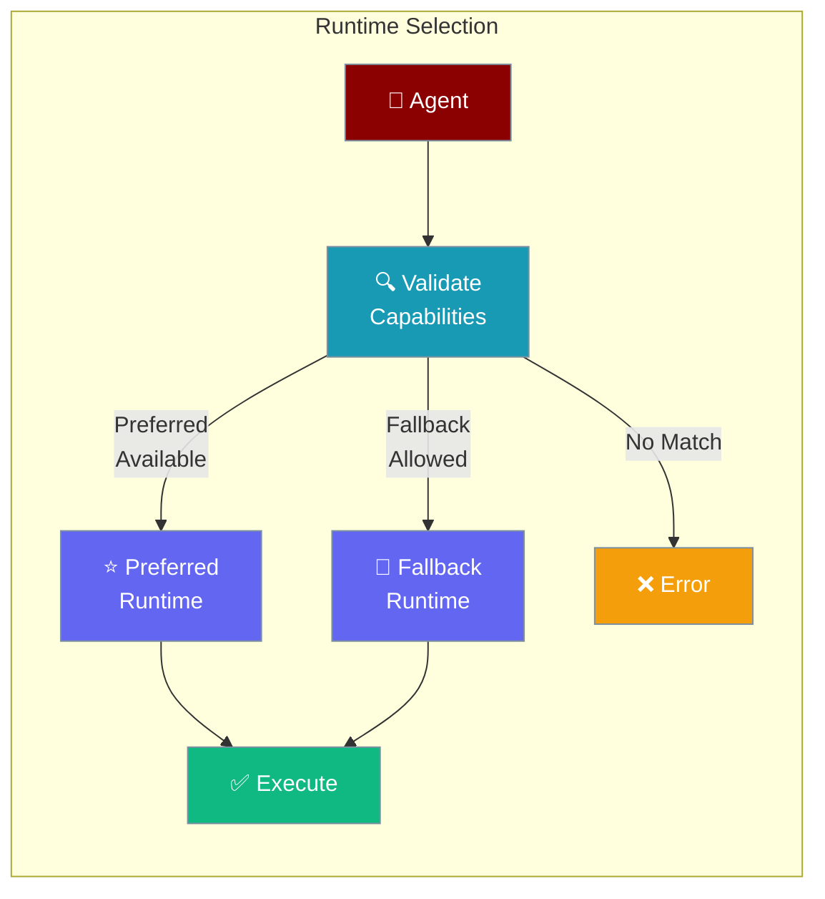
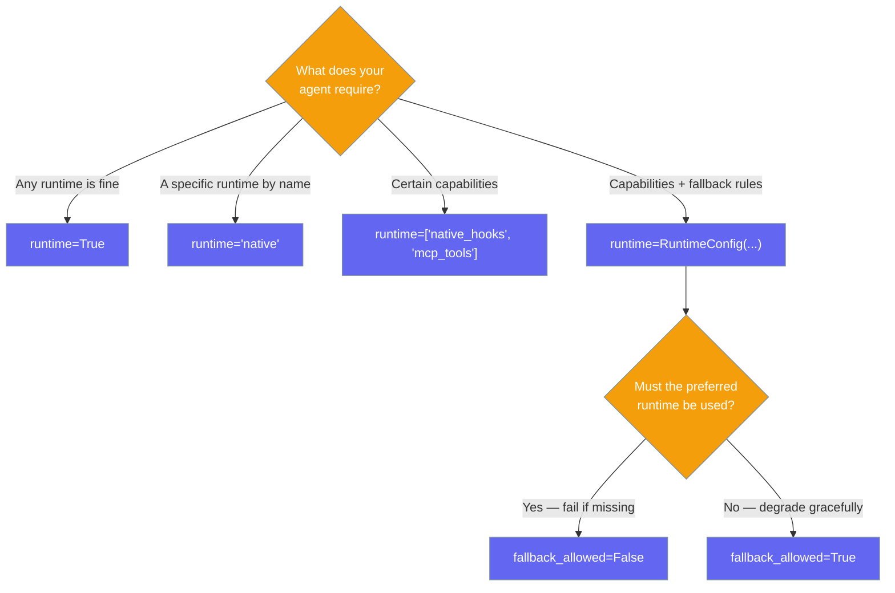
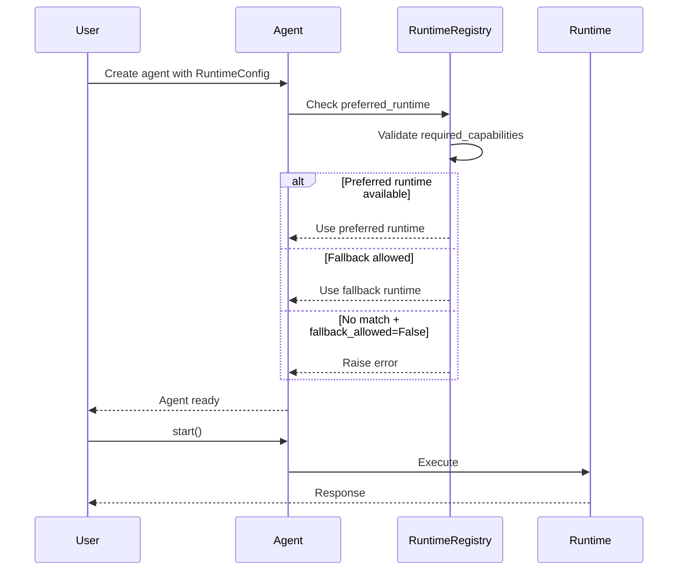

Tell the agent framework exactly which runtime features you need — it validates compatibility before your agent runs.

```python
from praisonaiagents import Agent
from praisonaiagents.config import RuntimeConfig

agent = Agent(
    name="StreamingAgent",
    instructions="You stream responses to users.",
    runtime=RuntimeConfig(
        required_capabilities={"native_hooks", "streaming_deltas"},
        preferred_runtime="native",
    )
)

agent.start("Tell me about AI")
```

The user sets runtime requirements on the agent; compatibility is checked before the first turn runs.




## Quick Start

<Steps>
<Step title="Declare Required Capabilities">
Specify what your agent needs — the framework validates this before execution:

```python
from praisonaiagents import Agent
from praisonaiagents.config import RuntimeConfig

agent = Agent(
    name="HooksAgent",
    instructions="You use native hooks for monitoring.",
    runtime=RuntimeConfig(
        required_capabilities={"native_hooks", "tool_loop"},
    )
)

agent.start("Process this request")
```
</Step>

<Step title="Prefer a Specific Runtime with Fallback">
Request a specific runtime but allow fallback if unavailable:

```python
from praisonaiagents import Agent
from praisonaiagents.config import RuntimeConfig

agent = Agent(
    name="MCPAgent",
    instructions="You use MCP tools.",
    runtime=RuntimeConfig(
        preferred_runtime="native",
        required_capabilities={"mcp_tools"},
        fallback_allowed=True,       # Try other runtimes if "native" unavailable
        validate_on_creation=True,   # Fail fast at creation, not first run
    )
)
```
</Step>
</Steps>

---

## Which Runtime Option Fits?

Pick the smallest option that expresses your requirement.



---

## How It Works



---

## Configuration Options

<Card title="RuntimeConfig SDK Reference" icon="code" href="/docs/sdk/reference/python/classes/RuntimeConfig">
  Full parameter reference for RuntimeConfig
</Card>

**Precedence ladder:**

```python
# Level 1: Bool (default runtime, no requirements)
agent = Agent(runtime=True)

# Level 2: String (preferred runtime name)
agent = Agent(runtime="native")

# Level 3: List (required capabilities)
agent = Agent(runtime=["native_hooks", "streaming_deltas"])

# Level 4: RuntimeConfig (full control)
agent = Agent(runtime=RuntimeConfig(
    required_capabilities={"native_hooks"},
    preferred_runtime="native",
    fallback_allowed=True,
))
```

| Option | Type | Default | Description |
|--------|------|---------|-------------|
| `required_capabilities` | `list \| set \| None` | `None` | Capabilities the agent must have |
| `preferred_runtime` | `str \| None` | `None` | Preferred runtime implementation name |
| `fallback_allowed` | `bool` | `True` | Allow fallback to other runtimes if preferred unavailable |
| `validate_on_creation` | `bool` | `True` | Validate at agent creation (fail fast) vs. first execution |
| `metadata` | `dict \| None` | `{}` | Additional runtime hints |

---

## Common Patterns

**Require streaming capability:**

```python
from praisonaiagents import Agent
from praisonaiagents.config import RuntimeConfig

agent = Agent(
    name="StreamBot",
    instructions="Stream responses character by character.",
    runtime=RuntimeConfig(
        required_capabilities={"streaming_deltas"},
        preferred_runtime="native",
    )
)
```

**MCP-capable agent:**

```python
from praisonaiagents import Agent
from praisonaiagents.config import RuntimeConfig

agent = Agent(
    name="MCPAgent",
    instructions="Use MCP tools to complete tasks.",
    runtime=RuntimeConfig(
        required_capabilities={"mcp_tools", "tool_loop"},
        fallback_allowed=False,  # Fail if MCP isn't available
    )
)
```

---

## Best Practices

<AccordionGroup>
<Accordion title="Use validate_on_creation=True for production">
Fail-fast validation (the default) catches capability mismatches immediately when the agent is created, not mid-execution. This prevents hard-to-debug runtime failures.
</Accordion>

<Accordion title="Set fallback_allowed=False for strict requirements">
If your agent genuinely cannot function without a specific capability (e.g., MCP tools), set `fallback_allowed=False`. This gives a clear error instead of silently falling back to a degraded runtime.
</Accordion>

<Accordion title="Use the docs for available capability names">
Check the [Runtime Capabilities](/docs/features/runtime-capabilities) page for the list of valid capability names supported by each runtime.
</Accordion>
</AccordionGroup>

---

## Related

<CardGroup cols={2}>
<Card title="Runtime Capabilities" icon="bolt" href="/docs/features/runtime-capabilities">
  List of all available runtime capabilities
</Card>
<Card title="Runtime Preflight" icon="clipboard-check" href="/docs/features/runtime-preflight">
  Pre-execution runtime validation
</Card>
<Card title="Runtime MCP" icon="plug" href="/docs/features/runtime-mcp">
  MCP tool runtime configuration
</Card>
<Card title="Agent Runtime Protocol" icon="cpu" href="/docs/features/agent-runtime-protocol">
  How agents communicate with runtimes
</Card>
</CardGroup>
