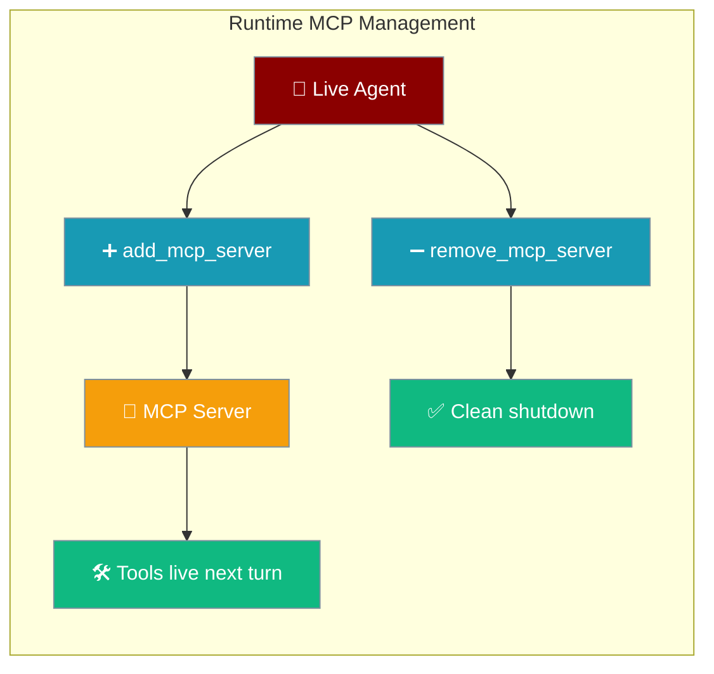
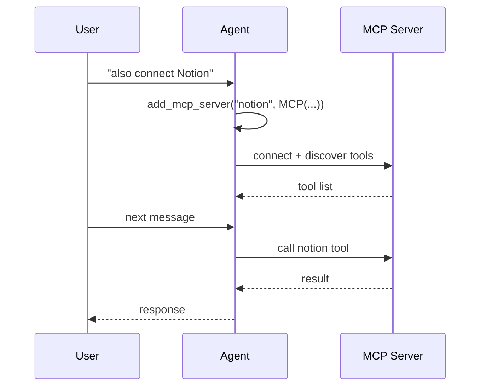

Add or remove MCP integrations on a running agent — no restart, no lost session state.



## Quick Start

<Steps>
<Step title="Attach an MCP server mid-session">

Connect a new MCP server to a running agent — tools become available on the next turn.

```python
from praisonaiagents import Agent
from praisonaiagents.mcp import MCP

agent = Agent(instructions="You are a helpful assistant")

agent.add_mcp_server("notion", MCP("npx -y @notionhq/notion-mcp-server"))

agent.start("Summarise my latest Notion page about Q3 planning")
```

</Step>

<Step title="List and remove servers">

Inspect which MCP servers are currently attached, then disconnect one.

```python
print(agent.list_mcp_servers())   # ['notion']

removed = agent.remove_mcp_server("notion")
print(removed)                     # True
print(agent.list_mcp_servers())   # []
```

</Step>
</Steps>

---

## How It Works



Runtime MCP servers are tracked in a private registry on the agent. Every time the agent processes a turn, it reads tools directly from `self.tools` — so newly attached MCP servers are picked up automatically without rebuilding the agent.

---

## API Reference

| Method | Returns | Raises |
|--------|---------|--------|
| `add_mcp_server(name, mcp)` | `MCP` instance | `ValueError` if name is empty or already attached |
| `remove_mcp_server(name)` | `bool` (`False` if name unknown) | — |
| `refresh_tools()` | `List[Any]` | — |
| `list_mcp_servers()` | `List[str]` | — |

---

## Common Patterns

### Hot-swap an MCP server

Replace a server under the same name by removing it first.

```python
agent.remove_mcp_server("notion")
agent.add_mcp_server("notion", MCP("npx -y @notionhq/notion-mcp-server"))
```

<Note>
Calling `add_mcp_server` without removing first raises `ValueError: MCP server 'notion' is already attached. Call remove_mcp_server() first to replace it.`
</Note>

### Force a tool refresh

Use `refresh_tools()` when an MCP server emits a `tools/list_changed` event.

```python
agent.refresh_tools()
```

### Gateway agent: add capabilities mid-conversation

```python
agent = Agent(instructions="You are a research assistant")

agent.start("What should I look into for Q3?")

agent.add_mcp_server("notion", MCP("npx -y @notionhq/notion-mcp-server"))

agent.start("Now pull my Notion pages tagged Q3")
```

---

## Cleanup

`agent.close()` and `await agent.aclose()` both automatically shut down all runtime-attached MCP servers — even if one fails, cleanup continues for the rest.

```python
agent = Agent(instructions="You are a helpful assistant")
agent.add_mcp_server("notion", MCP("npx -y @notionhq/notion-mcp-server"))

agent.start("Summarise my Notion workspace")

agent.close()
```

```python
import asyncio
from praisonaiagents import Agent
from praisonaiagents.mcp import MCP

async def main():
    agent = Agent(instructions="You are a helpful assistant")
    agent.add_mcp_server("notion", MCP("npx -y @notionhq/notion-mcp-server"))
    await agent.aclose()

asyncio.run(main())
```

---

## Best Practices

<AccordionGroup>
<Accordion title="Use unique, descriptive names">
Pick names that identify the service, not the tool type — `"notion"` over `"mcp1"`. The name is used to remove or re-attach the server later.
</Accordion>

<Accordion title="Always remove before re-attaching under the same name">
The registry rejects duplicates. Call `remove_mcp_server("name")` before attaching a new instance under the same name.

```python
agent.remove_mcp_server("notion")
agent.add_mcp_server("notion", MCP("npx -y @notionhq/notion-mcp-server"))
```
</Accordion>

<Accordion title="Rely on close() / aclose() for cleanup">
You do not need to manually call `remove_mcp_server` at the end of a session. `agent.close()` and `await agent.aclose()` handle all runtime-attached MCP servers automatically, continuing past any individual failure.
</Accordion>

<Accordion title="New tools appear on the next turn, not the current one">
After `add_mcp_server`, the agent must complete its current turn before the new tools are usable. Plan multi-turn conversations accordingly.
</Accordion>
</AccordionGroup>

---

## Related

<CardGroup cols={2}>
  <Card icon="plug" href="/concepts/mcp">Static MCP setup at construction time</Card>
  <Card icon="wrench" href="/concepts/tools">Function tools</Card>
</CardGroup>
