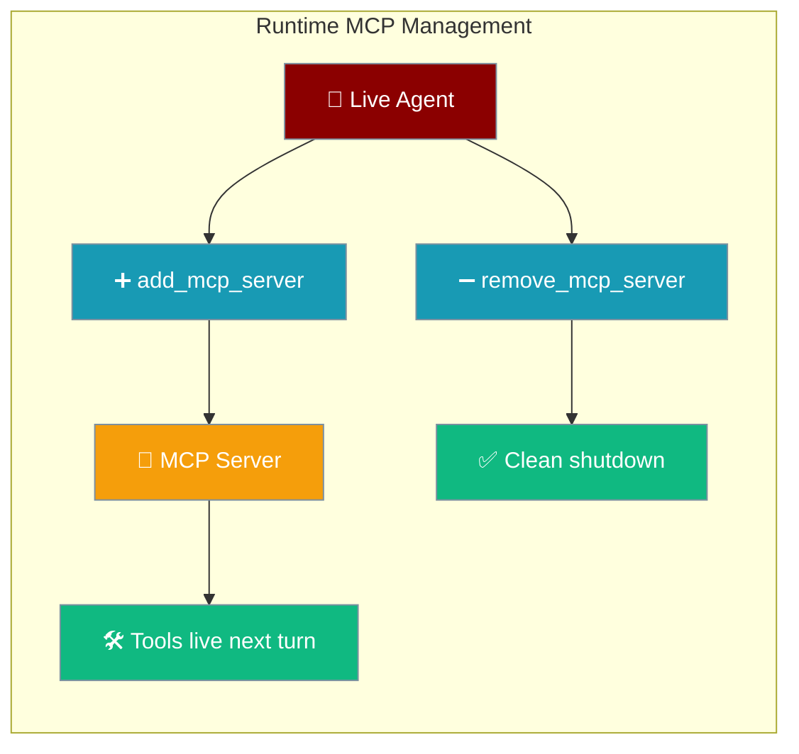
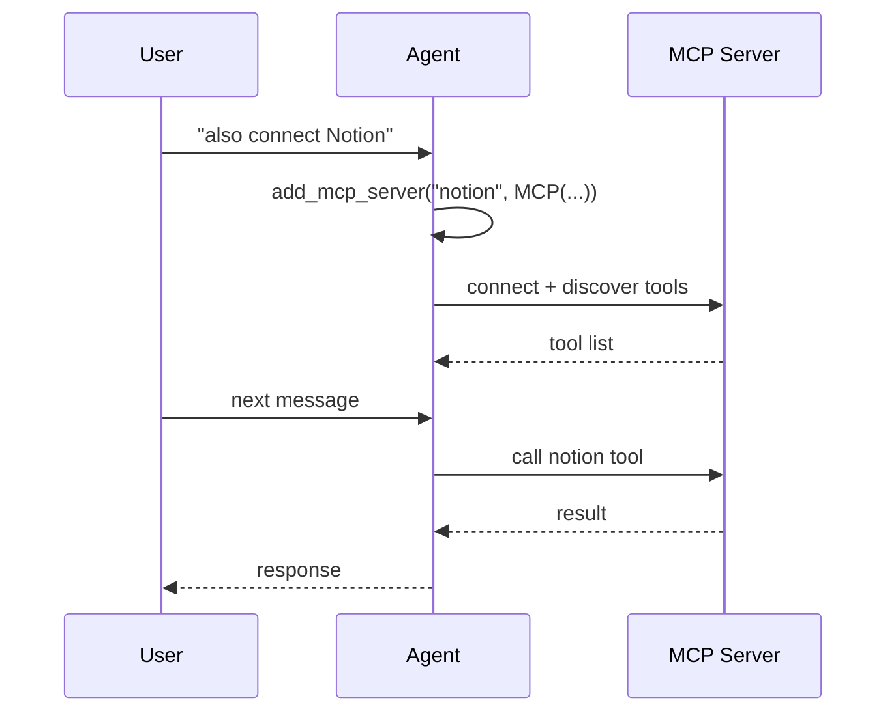

Add or remove MCP integrations on a running agent — no restart, no lost session state.

```python
from praisonaiagents import Agent, MCP

agent = Agent(instructions="You are a helpful assistant")
agent.add_mcp_server("notion", MCP("npx -y @notionhq/notion-mcp-server"))
agent.start("Summarise my latest Notion page about Q3 planning")
```



## Quick Start

<Steps>
<Step title="Attach an MCP server at runtime">
```python
from praisonaiagents import Agent, MCP

agent = Agent(instructions="You are a helpful assistant")

agent.add_mcp_server("notion", MCP("npx -y @notionhq/notion-mcp-server"))

agent.start("Summarise my latest Notion page about Q3 planning")
```
Tools from the attached server are available on the **next turn** of the same run.
</Step>

<Step title="List and remove servers">
```python
print(agent.list_mcp_servers())   # ['notion']

removed = agent.remove_mcp_server("notion")
print(removed)                     # True
print(agent.list_mcp_servers())   # []
```
</Step>
</Steps>

---

## How It Works



Runtime-attached MCPs live in a private `_mcp_servers` registry on the agent. Each `add_mcp_server` call registers the server, appends it to `self.tools`, and refreshes the toolset. Removed servers call `mcp.shutdown()` best-effort before deregistration.

---

## API Reference

| Method | Returns | Raises |
|--------|---------|--------|
| `add_mcp_server(name, mcp)` | `MCP` | `ValueError` if name is empty or already attached |
| `remove_mcp_server(name)` | `bool` (`False` if name unknown) | — |
| `refresh_tools()` | `List[Any]` | — |
| `list_mcp_servers()` | `List[str]` | — |

---

## Common Patterns

### Gateway agent adds Notion mid-session

```python
from praisonaiagents import Agent, MCP

agent = Agent(instructions="You are a helpful assistant")
agent.add_mcp_server("notion", MCP("npx -y @notionhq/notion-mcp-server"))
agent.start("What pages did I update this week?")
```

### Hot-swap under the same name

```python
agent.remove_mcp_server("notion")
agent.add_mcp_server("notion", MCP("npx -y @notionhq/notion-mcp-server"))
```

Direct re-attach without removing first raises `ValueError("MCP server 'notion' is already attached. Call remove_mcp_server() first to replace it.")`.

### React to `tools/list_changed`

```python
agent.refresh_tools()
```

Call `refresh_tools()` when an MCP server signals that its tool list changed — per-turn assembly already reads `self.tools` live, but this forces an immediate refresh.

---

## Cleanup

`agent.close()` and `await agent.aclose()` both shut down every runtime-attached MCP via `_shutdown_runtime_mcp_servers()`. Failures on individual servers are logged and skipped so one bad shutdown does not block the rest.

```python
agent.close()       # sync — shuts down all runtime-attached MCPs
await agent.aclose()  # async-safe — same guarantee
```

You do not need to call `remove_mcp_server()` manually before closing the agent.

---

## Best Practices

<AccordionGroup>
<Accordion title="Use unique, descriptive names">
Attach each MCP under a stable name (`"notion"`, `"github"`, `"postgres"`) so you can list and remove servers predictably mid-session.
</Accordion>

<Accordion title="Remove before re-attaching under the same name">
`add_mcp_server` raises on duplicate names. Call `remove_mcp_server(name)` first when hot-swapping credentials or server commands.
</Accordion>

<Accordion title="Tools surface on the next turn">
New tools are not injected into the **current** LLM turn. Send another message (or continue the run) after attaching so the agent sees the expanded toolset.
</Accordion>

<Accordion title="Rely on close()/aclose() for guaranteed cleanup">
Long-running services should still call `close()` or `aclose()` when the agent session ends — runtime MCPs are tracked and shut down automatically.
</Accordion>
</AccordionGroup>

---

## Related

<CardGroup cols={2}>
  <Card title="Load MCP Tools" icon="download" href="/docs/features/load-mcp-tools">
    Load MCP tools into an agent at build time
  </Card>
  <Card title="MCP Lifecycle" icon="arrows-rotate" href="/docs/features/mcp-lifecycle">
    Context manager and connection cleanup
  </Card>
</CardGroup>
