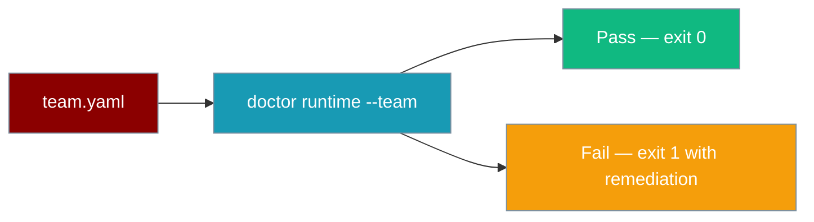
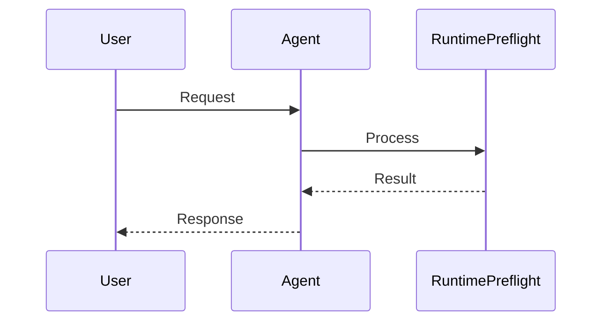
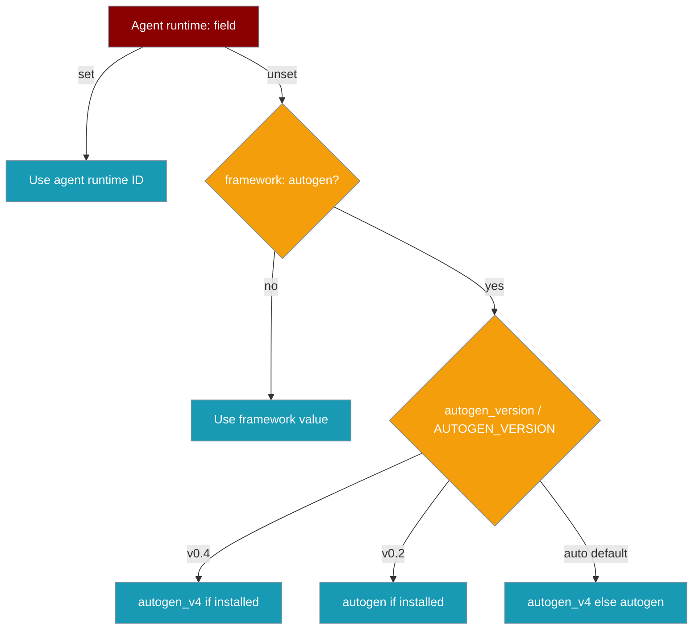

Validate team YAML for runtime compatibility, handoffs, and installed frameworks **without LLM calls or API keys**.

```python
from praisonaiagents import Agent, AgentTeam, Task

researcher = Agent(name="researcher", instructions="Research topics")
writer = Agent(name="writer", instructions="Write content")
task = Task(description="Research and write", agent=researcher)

team = AgentTeam(agents=[researcher, writer], tasks=[task])
# Run `praisonai doctor runtime --team agents.yaml` before team.start()
team.start()
```

The user validates team YAML with doctor before team.start(), catching handoff and runtime issues without LLM calls.




## How It Works




## Quick Start

<Steps>
<Step title="Simple Usage">

Define your team YAML, then run preflight before starting:

```yaml
# agents.yaml
framework: praisonai
roles:
  researcher:
    role: Researcher
    handoff:
      to: writer
  writer:
    role: Writer
```

```bash
praisonai doctor runtime --team agents.yaml
```

</Step>

<Step title="With Configuration">

Use `--json` in CI and start the team only when exit code is `0`:

```bash
praisonai doctor runtime --team agents.yaml --json
```

```python
from praisonaiagents import Agent, AgentTeam, Task

researcher = Agent(name="researcher", instructions="Research topics")
writer = Agent(name="writer", instructions="Write content")
task = Task(description="Research and write", agent=researcher)

team = AgentTeam(agents=[researcher, writer], tasks=[task])
team.start()  # safe after preflight passes
```

</Step>
</Steps>

## How It Works

`praisonai doctor runtime --team` parses your team YAML and checks:

- Known runtime IDs and installed packages
- Required capabilities (handoffs, tools, `cli_backend`, etc.)
- Handoff target existence and compatibility
- Mixed-runtime warnings across the team



**Resolution order** (mirrors the framework):

1. Agent-level `runtime:` wins.
2. Otherwise falls back to top-level `framework:` (default `praisonai`).
3. When `framework: autogen`, version comes from `autogen_version:` or `$AUTOGEN_VERSION`:
   - `v0.4` → `autogen_v4` (if available)
   - `v0.2` → `autogen`
   - `auto` (default) → prefers `autogen_v4` if installed, else `autogen`

## Runtime Capability Matrix

| Runtime ID | Display Name | Handoff support | Tool loop |
|------------|--------------|-----------------|-----------|
| `praisonai` | PraisonAI Agents | Yes | Yes |
| `crewai` | CrewAI | No | Yes |
| `autogen` | AutoGen v0.2 | No | Yes |
| `autogen_v4` | AutoGen v0.4 | Yes | Yes |
| `ag2` | AG2 (AutoGen Next) | No | Yes |

Capability names referenced by the checker: `agent_creation`, `tool_execution`, `handoff_support`, `context_sharing`, `cli_backend`, `sequential_execution`, `hierarchical_execution`, `group_chat`.

## Configuration

### CLI flags

| Flag | Type | Description |
|------|------|-------------|
| `--team` | string | Team YAML file to validate |
| `--workflow` | string | Workflow YAML file to validate (placeholder — returns SKIP) |
| `--json` | flag | Emit JSON for CI integration |
| `--deep` | flag | Enable deeper probes (accepted; runtime checks do not branch on it today) |

### Exit codes

| Code | Meaning |
|------|---------|
| `0` | No issues found |
| `1` | Issues detected (or team file missing) — non-zero blocks CI |
| `2` | Internal error |

```bash
# Basic team validation
praisonai doctor runtime --team agents.yaml

# JSON output for CI
praisonai doctor runtime --team team.yaml --json

# Workflow placeholder (returns SKIP — not yet implemented)
praisonai doctor runtime --workflow workflow.yaml
```

## What the Checker Detects

| Check ID prefix | What it catches | Severity |
|-----------------|-----------------|----------|
| `runtime.yaml_parse` | YAML file fails to parse | CRITICAL |
| `runtime.unknown_runtime.{role}` | Agent's `runtime:` value isn't a known runtime ID | HIGH |
| `runtime.unavailable.{role}` | Runtime package not installed in current env | HIGH |
| `runtime.missing_capabilities.{role}` | Agent needs a capability the runtime doesn't provide | HIGH |
| `runtime.handoff_unsupported.{role}` | Agent has `handoff:` but runtime doesn't support handoffs | HIGH |
| `runtime.handoff_target_missing.{role}` | Handoff target role name doesn't exist in the YAML | HIGH |
| `runtime.handoff_target_incompatible.{role}` | Handoff target uses a runtime that may not support tool loops | MEDIUM |
| `runtime.mixed_runtimes` | Multiple runtimes in one team — informational warning | MEDIUM |
| `runtime.mixed_handoff_incompatible` | Mixed runtime team has handoffs routed through incompatible runtimes | HIGH |

## Common Patterns

### Good team YAML (passes)

```yaml
framework: praisonai
roles:
  researcher:
    role: Researcher
    handoff:
      to: writer
  writer:
    role: Writer
```

### Bad team YAML (multiple failures)

```yaml
framework: crewai
roles:
  researcher:
    role: Researcher
    handoff:
      to: ghost   # handoff_target_missing AND handoff_unsupported (crewai)
  writer:
    runtime: autogen
    role: Writer
    # mixed_runtimes + mixed_handoff_incompatible
```

### CI integration

```yaml
- name: Runtime preflight
  run: |
    pip install praisonai
    praisonai doctor runtime --team agents.yaml --json
```

### Programmatic API

```python
from praisonai.cli.features.doctor.checks.runtime_checks import lint_runtime_team

results = lint_runtime_team("agents.yaml")
for r in results:
    print(r.id, r.status, r.message)
# Empty list means no issues
```

<Note>
The same `praisonai doctor runtime` command also handles legacy `cli_backend` migration (`--fix`, `--execute`). See [Runtime Config Migration](/docs/features/doctor-runtime-migration) for migration flags.
</Note>

## Best Practices

<AccordionGroup>
<Accordion title="Run preflight before every team deploy">
Add `praisonai doctor runtime --team agents.yaml` to CI and local scripts before `AgentTeam.start()` or `praisonai workflow run`.
</Accordion>

<Accordion title="Use --json in CI pipelines">
JSON output integrates cleanly with GitHub Actions and other CI systems — exit code `1` blocks the pipeline when compatibility issues are found.
</Accordion>

<Accordion title="Prefer a single runtime for handoff teams">
Only `praisonai` and `autogen_v4` support handoffs. Mixed-runtime teams with handoffs through `crewai`, `autogen`, or `ag2` fail preflight.
</Accordion>
</AccordionGroup>

---

## Related

<CardGroup cols={2}>
<Card title="Runtime Selection" icon="play" href="/docs/features/runtime-selection">
  Choose which runtime executes each model
</Card>
<Card title="Runtime Config Migration" icon="arrow-right-arrow-left" href="/docs/features/doctor-runtime-migration">
  Migrate legacy cli_backend fields with praisonai doctor runtime --fix
</Card>
</CardGroup>
