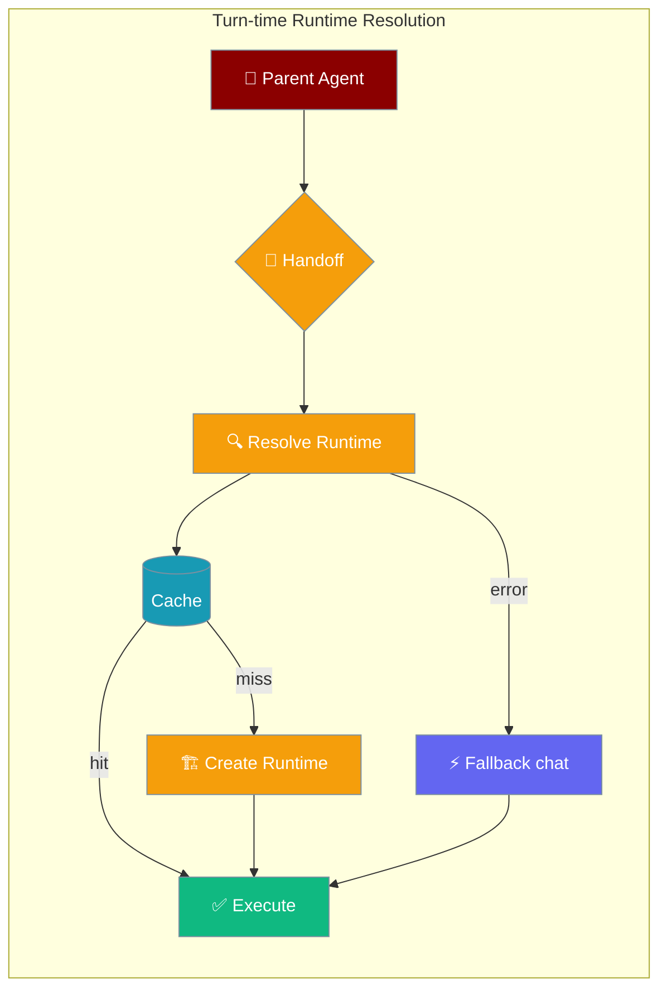
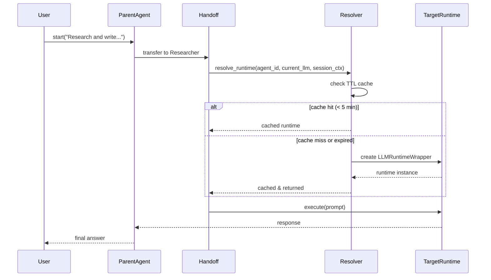

Handoffs resolve the target agent's runtime at the moment of execution — if you change a sub-agent's model between turns, the next handoff uses the new model automatically.



## Quick Start

<Steps>
<Step title="Swap a sub-agent model mid-conversation">

Create agents with handoffs and update the target model at any time — the next handoff automatically picks up the change.

```python
from praisonaiagents import Agent

researcher = Agent(
    name="Researcher",
    instructions="Research the topic and summarise it",
    llm="gpt-4o-mini",
)

writer = Agent(
    name="Writer",
    instructions="Write a polished article",
    llm="gpt-4o-mini",
    handoffs=[researcher],
)

# Swap the researcher to a different model at any point
researcher.llm = "claude-3-sonnet"

# The next handoff automatically uses claude-3-sonnet for the researcher
writer.start("Research and write about ocean currents")
```

</Step>

<Step title="Inspect the runtime cache">

Use `get_runtime_cache` and `clear_runtime_cache` to debug or force a fresh resolution.

```python
from praisonaiagents.runtime import get_runtime_cache, clear_runtime_cache

# See what runtimes are cached across sessions
cache = get_runtime_cache()
for session_id, entries in cache.items():
    for cache_key, (runtime, cached_at) in entries.items():
        print(f"{cache_key}: {runtime.provider}/{runtime.model_ref}")

# Force fresh resolution for a specific session
clear_runtime_cache(session_id="session_123")

# Clear all cached runtimes
clear_runtime_cache()
```

</Step>

<Step title="Custom resolver (advanced)">

Override the built-in resolver to control how models map to runtimes.

```python
from praisonaiagents import Agent
from praisonaiagents.runtime import (
    set_global_resolver,
    SessionContext,
)
from praisonaiagents.runtime.resolve import (
    RuntimeResolver,
    AgentRuntimeProtocol,
    LLMRuntimeWrapper,
)
from praisonaiagents.llm.llm import LLM

class MyResolver(RuntimeResolver):
    def supports_model(self, model_ref: str) -> bool:
        return model_ref.startswith(("gpt-", "claude-", "my-model-"))

    def resolve(self, agent_id, model_ref, session_ctx, **kwargs):
        # Route "my-model-*" to a custom endpoint
        if model_ref.startswith("my-model-"):
            llm = LLM(model="gpt-4o-mini", api_base="https://my.endpoint/v1")
        else:
            llm = LLM(model=model_ref)
        return LLMRuntimeWrapper(llm=llm, model_ref=model_ref, agent_id=agent_id)

set_global_resolver(MyResolver())

agent = Agent(name="MyAgent", instructions="Help users", llm="my-model-fast")
agent.start("Hello!")
```

</Step>
</Steps>

---

## How It Works

Every handoff call reads the target agent's current `llm` (or `model`) attribute **at invocation time**, not at construction time.



**Fallback on error:** If runtime resolution raises any exception, the handoff silently falls back to calling `target_agent.chat()` / `target_agent.achat()`. Handoffs never fail because of a resolver problem.

---

## Configuration Options

### `SessionContext`

Passed to `resolve_runtime` to scope caching and track handoff depth.

| Field | Type | Default | Description |
|-------|------|---------|-------------|
| `session_id` | `str` | — | Required. Used as the first segment of the cache key |
| `timestamp` | `float` | `time.time()` if `<= 0` | Session start time |
| `parent_agent_id` | `Optional[str]` | `None` | Name of the agent that triggered the handoff |
| `handoff_depth` | `int` | `0` | Current handoff nesting depth |

### Cache constants

| Constant | Value | Meaning |
|----------|-------|---------|
| `_cache_ttl_seconds` | `300` | Each cached runtime lives for 5 minutes |
| `_cleanup_interval` | `600` | Background cleanup daemon runs every 10 minutes |

Cache keys use the format `"{session_id}:{agent_id}:{model_ref}"` — caches are session-isolated so different conversations never share runtimes.

---

## Common Patterns

### Mid-conversation model swap

```python
from praisonaiagents import Agent

analyst = Agent(name="Analyst", instructions="Analyse data", llm="gpt-4o-mini")
coordinator = Agent(name="Coordinator", instructions="Coordinate", handoffs=[analyst])

# First few turns use gpt-4o-mini
coordinator.start("Quick summary of Q1 sales")

# Upgrade to a more capable model for a detailed report
analyst.llm = "gpt-4o"
coordinator.start("Full analysis of Q1 vs Q2 with trend forecasting")
```

### Force cache refresh

```python
from praisonaiagents.runtime import clear_runtime_cache

# After rotating API keys or changing model config
clear_runtime_cache()

agent.start("Continue with the updated model settings")
```

### Introspect resolved runtimes

```python
from praisonaiagents.runtime import get_runtime_cache

cache = get_runtime_cache()
total = sum(len(entries) for entries in cache.values())
print(f"Active runtimes: {total} across {len(cache)} sessions")
```

---

## Best Practices

<AccordionGroup>
<Accordion title="Change llm before starting a new turn">
Runtime re-resolution happens at the boundary of each handoff invocation. Changing `agent.llm` is effective immediately for the next handoff call — no restart needed.
</Accordion>

<Accordion title="Use clear_runtime_cache after credential rotation">
The 5-minute TTL means old runtimes may linger after you rotate API keys. Call `clear_runtime_cache()` to evict all entries and force fresh connections.
</Accordion>

<Accordion title="Implement supports_model narrowly in custom resolvers">
Return `False` from `supports_model` for models you do not handle. The built-in `DefaultRuntimeResolver` acts as the final fallback, so raising `False` simply delegates back to it.
</Accordion>

<Accordion title="Handoffs never fail due to resolver errors">
The fallback to `agent.chat()` / `agent.achat()` is unconditional. If your custom resolver is buggy or a model is unavailable, the handoff still completes using the agent's default execution path.
</Accordion>
</AccordionGroup>

---

## Public API

All names are importable from `praisonaiagents.runtime`:

```python
from praisonaiagents.runtime import (
    resolve_runtime,
    SessionContext,
    RuntimeProtocol,
    get_runtime_cache,
    clear_runtime_cache,
    set_global_resolver,
)
```

### `resolve_runtime`

```python
def resolve_runtime(
    agent_id: str,
    model_ref: str,
    session_ctx: SessionContext,
    **kwargs,
) -> AgentRuntimeProtocol:
    ...
```

The main entry point. Checks the TTL cache first; creates and caches a new runtime if none exists or the entry expired.

### `RuntimeProtocol` / `AgentRuntimeProtocol`

Protocols that custom runtimes must satisfy. Only relevant when building a custom resolver.

```python
class RuntimeProtocol(Protocol):
    def execute(self, prompt: str, **kwargs) -> Any: ...
    async def aexecute(self, prompt: str, **kwargs) -> Any: ...
    @property
    def model_ref(self) -> str: ...
    @property
    def provider(self) -> str: ...

class AgentRuntimeProtocol(RuntimeProtocol):
    @property
    def supports_streaming(self) -> bool: ...
    @property
    def supports_tools(self) -> bool: ...
```

---

## Related

<CardGroup cols={2}>
<Card icon="handshake" href="/docs/features/handoffs">
  Agent-to-agent delegation
</Card>
<Card icon="sliders" href="/docs/configuration/handoff-config">
  HandoffConfig reference
</Card>
<Card icon="shield-check" href="/docs/features/handoff-tool-policy">
  Secure tool boundaries during handoff
</Card>
<Card icon="filter" href="/docs/features/handoff-filters">
  Filter context passed during handoff
</Card>
</CardGroup>
