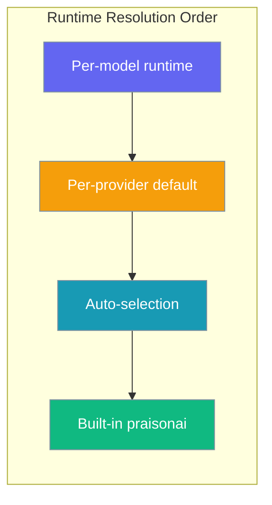
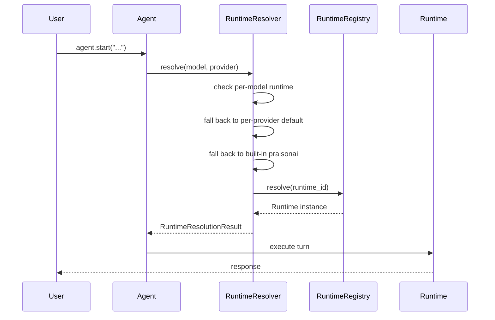
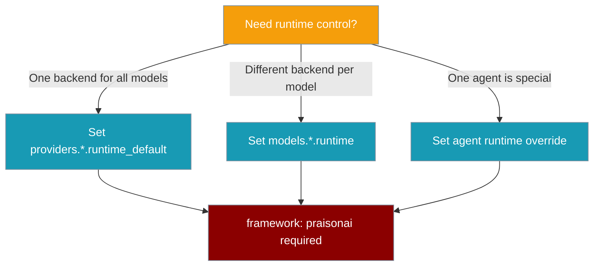

Runtime selection lets you pick which execution backend (Claude Code, Codex CLI, the built-in PraisonAI runtime) runs each model — declared on the model map, not the agent.

```python
from praisonaiagents import Agent

agent = Agent(
    name="Coder",
    instructions="Write Python code",
    runtime="claude-code",
)
agent.start("Build a CLI tool that lists open PRs")
```



## Quick Start

<Steps>
<Step title="Simple Usage">
```python
from praisonaiagents import Agent

agent = Agent(
    name="Coder",
    instructions="Write Python code",
    runtime="claude-code"
)

agent.start("Build a CLI tool that lists open PRs")
```
</Step>

<Step title="With Configuration">
```python
from praisonaiagents import Agent
from praisonaiagents.runtime.config import AgentRuntimeConfig

agent = Agent(
    name="Coder",
    instructions="Write Python code",
    runtime=AgentRuntimeConfig(
        runtime="claude-code",
        config_overrides={"timeout": 120}
    )
)
```
</Step>
</Steps>

## How It Works



**Resolution order** (from `RuntimeResolver`):

1. **Per-model runtime** — `model_runtime_configs[model_name]`
2. **Per-provider default** — `provider_runtime_configs[provider_name]`
3. **Auto-selection** — `resolve_runtime()` picks the highest-priority runtime whose `supports(model_ref)` returns true; see [Agent Runtime Protocol](/docs/features/agent-runtime-protocol)
4. **Built-in default** — `"praisonai"`
5. **Legacy `cli_backend`** — emits `DeprecationWarning`

Provider is inferred from the model name: split on `/` first, otherwise `claude*` → `anthropic`, `gpt*`/`openai*` → `openai`, `gemini*`/`google*` → `google`, `llama*` → `meta`.

## Configuration

### Agent parameter forms

| Form | Example | When to use |
|------|---------|-------------|
| `str` (runtime ID) | `runtime="claude-code"` | Most cases |
| `dict` | `runtime={"runtime": "claude-code", "config_overrides": {...}}` | Inline overrides |
| `AgentRuntimeConfig` | `runtime=AgentRuntimeConfig(runtime="claude-code", ...)` | Full programmatic control |
| `None` (default) | omit | Use model-map / provider-default / built-in |

Invalid types raise:

```
Invalid runtime type: <type>. Expected bool, str, dict, RuntimeConfig, or AgentRuntimeConfig instance.
```

### YAML — choose your level



```yaml
framework: praisonai   # required — runtime features only work here

providers:
  anthropic:
    runtime_default: claude-code
  openai:
    runtime_default: codex-cli

models:
  claude-3-sonnet:
    runtime: claude-code
  gpt-4o:
    runtime: praisonai

agents:
  coder:
    role: Developer
    llm: claude-3-sonnet
    # resolves to claude-code from models.claude-3-sonnet.runtime
  reviewer:
    role: Reviewer
    llm: gpt-4o
    runtime: claude-code   # agent-level override beats model/provider
```

### `AgentRuntimeConfig` options

| Option | Type | Default | Description |
|--------|------|---------|-------------|
| `runtime` | `Optional[str]` | `None` | Runtime ID (e.g. `"claude-code"`, `"codex-cli"`, `"praisonai"`) |
| `config_overrides` | `Dict[str, Any]` | `{}` | Runtime-specific config passed to the runtime factory |
| `provider_default` | `Optional[str]` | `None` | Provider default (YAML `providers.<name>.runtime_default`) |
| `enable_auto_selection` | `bool` | `True` | Allow auto-selection step in resolution order |
| `metadata` | `Dict[str, Any]` | `{}` | Free-form metadata |

Helper methods: `from_runtime_id(id, **kwargs)`, `from_dict(d)`, `to_dict()`, `merge_overrides(overrides)`, `with_runtime(id)`, `is_explicit()`.

### Built-in runtime IDs

Reference IDs: `"claude-code"`, `"codex-cli"`, `"praisonai"`. Built-in default is `"praisonai"`.

### Framework gate

Runtime features only work with `framework: praisonai`. Other frameworks raise:

```
Runtime features (runtime, models.*.runtime, providers.*.runtime_default) are not supported for framework='<x>'. Remove these fields from your YAML or switch to framework='praisonai'.
```

### Fail-closed behaviour

Unknown runtime IDs raise — they do **not** silently fall back:

```
Unknown runtime ID: <id>. Available runtimes: [...]. Original error: ...
```

Top-level `RuntimeError` from Agent:

```
Runtime resolution failed for agent='<name>', model='<model>': <err>. Fix the runtime ID/configuration or remove the runtime override.
```

<Warning>
If you typo a runtime ID, the agent fails at start. This is intentional — silent fallbacks should not ship to production.
</Warning>

## Common Patterns

1. **One provider, one runtime everywhere** — set `providers.anthropic.runtime_default: claude-code`.
2. **Mix runtimes per model** — `models.claude-3-sonnet.runtime: claude-code` plus `models.gpt-4o.runtime: praisonai`.
3. **Per-agent override** — agent-level `runtime` beats model/provider config when one role needs different behaviour.

## Migration from `cli_backend`

`cli_backend` still works but emits `DeprecationWarning` (slated for removal in 2.0.0).

```python
# Before (deprecated)
agent = Agent(name="X", cli_backend="claude-code")

# After
agent = Agent(name="X", runtime="claude-code")
```

```yaml
# Before
agents:
  coder:
    cli_backend: claude-code

# After (preferred — declare at the model)
models:
  claude-3-sonnet:
    runtime: claude-code
agents:
  coder:
    llm: claude-3-sonnet
```

For automatic YAML migration, run `praisonai doctor runtime --fix --execute` — see [Runtime Config Migration](/docs/features/doctor-runtime-migration).

Agent-level YAML warning:

```
Agent-level 'cli_backend' in YAML is deprecated. Use 'runtime' parameter or model-scoped runtime configuration instead.
```

## Best Practices

<AccordionGroup>
<Accordion title="Prefer model-map config over agent-level">
Keep runtime choice with the model, not the role. Use `models.<name>.runtime` unless one agent truly needs an override.
</Accordion>

<Accordion title="Always set a provider_default">
`providers.<name>.runtime_default` makes adding new models painless — new models inherit the provider backend automatically.
</Accordion>

<Accordion title="Don't catch the fail-closed error">
Typo'd runtime IDs should fail at startup, not silently fall back to the built-in runtime.
</Accordion>

<Accordion title="Migrate cli_backend to runtime">
Use the migration table above or `praisonai doctor runtime --fix` before 2.0.0 removes `cli_backend`.
</Accordion>
</AccordionGroup>

---

## Related

<CardGroup cols={2}>
<Card title="Agent Runtime Protocol" icon="plug" href="/docs/features/agent-runtime-protocol">
  Plugin harness registry, register_runtime, and praisonai.runtimes entry points
</Card>
<Card title="Runtime Preflight" icon="shield-check" href="/docs/features/runtime-preflight">
  Validate team YAML before AgentTeam.start()
</Card>
</CardGroup>
