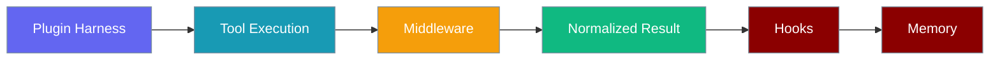
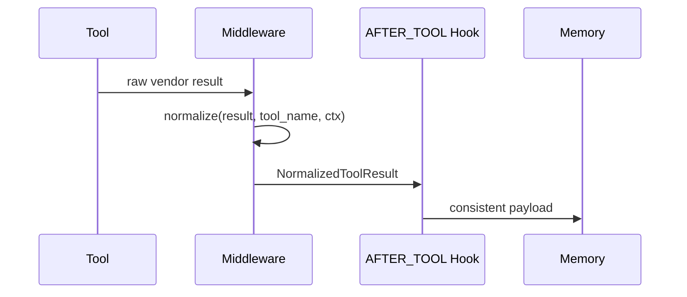
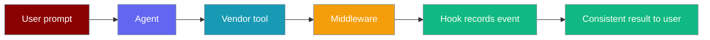

Runtime tool result middleware converts vendor-shaped tool outputs from plugin harnesses into a standard format before hooks and memory adapters run.



## Quick Start

<Steps>
<Step title="Default (zero config)">
The native `praisonai` runtime needs no middleware — results pass straight to hooks:

```python
from praisonaiagents import Agent

agent = Agent(name="assistant", instructions="Be helpful")
agent.start("What is 2 + 2?")
```
</Step>

<Step title="Register harness middleware">
Implement `normalize`, register once, then set `agent._runtime_id`:

```python
from typing import Any
from praisonaiagents import Agent, tool
from praisonaiagents.runtime import (
    MiddlewareContext,
    NormalizedToolResult,
    register_middleware,
)


class MyHarnessMiddleware:
    @property
    def runtime_id(self) -> str:
        return "my_plugin_harness"

    def normalize(self, result: Any, tool_name: str, ctx: MiddlewareContext) -> NormalizedToolResult:
        if isinstance(result, dict) and result.get("status") == "error":
            return NormalizedToolResult(
                content=None,
                success=False,
                error_message=result.get("message"),
                metadata={"vendor": "my_harness"},
                raw_result=result,
            )
        return NormalizedToolResult(content=result.get("data", result), raw_result=result)


register_middleware("my_plugin_harness", MyHarnessMiddleware())

@tool
def lookup(query: str) -> dict:
    """Look up data."""
    return {"status": "ok", "data": f"Results for {query}"}

agent = Agent(name="assistant", tools=[lookup])
agent._runtime_id = "my_plugin_harness"  # triggers middleware lookup
agent.start("Look up Python tutorials")
```
</Step>
</Steps>

## How It Works

Middleware runs in `tool_execution.py` **before** the `AFTER_TOOL` hook fires.



When `agent._runtime_id` is missing or equals `"praisonai"`, middleware is bypassed entirely (zero allocation).

## Configuration Options

### MiddlewareContext

| Field | Type | Default | Description |
|-------|------|---------|-------------|
| `tool_name` | `str` | — (required) | Name of the tool that was executed |
| `runtime_id` | `str` | — (required) | Runtime that produced the result |
| `agent_id` | `Optional[str]` | `None` | Agent name, if known |
| `session_id` | `Optional[str]` | `None` | Session id, if known |
| `execution_time_ms` | `float` | `0.0` | Tool execution time |
| `timestamp` | `float` | `time.time()` | When the result was produced |
| `metadata` | `Dict[str, Any]` | `{}` | Free-form context for middleware decisions |

### NormalizedToolResult

| Field | Type | Default | Description |
|-------|------|---------|-------------|
| `content` | `Any` | — (required) | The actual tool result |
| `success` | `bool` | `True` | Whether the tool succeeded |
| `error_message` | `Optional[str]` | `None` | Error text when `success=False` |
| `metadata` | `Dict[str, Any]` | `{}` | Vendor/exec metadata for downstream consumers |
| `execution_time_ms` | `float` | `0.0` | Execution time in ms |
| `timestamp` | `float` | `time.time()` | When normalized |
| `raw_result` | `Optional[Any]` | `None` | Original vendor object for debugging |

## Registry API

| Method | Signature | Purpose |
|--------|-----------|---------|
| `register` | `(runtime_id, middleware) -> None` | Register middleware for a runtime |
| `unregister` | `(runtime_id) -> bool` | Remove middleware |
| `get_middleware` | `(runtime_id) -> RuntimeToolResultMiddleware` | Look up; returns `PassThroughMiddleware` if not registered |
| `has_middleware` | `(runtime_id) -> bool` | Check registration |
| `list_runtimes` | `() -> list[str]` | List registered runtime ids |
| `clear` | `() -> None` | Drop all registrations (testing) |

Module helpers: `register_middleware`, `get_middleware`, `get_default_middleware_registry()`.

## Common Patterns

**Error handling** — set `success=False` and fill `error_message`; failed tools surface as `"Tool Error: <message>"` to the agent.

**Rich metadata** — attach vendor, version, cache hit, or region in `metadata` for observability hooks.

**Conditional normalization** — branch on `tool_name` prefix (e.g. `search_` vs `db_`) inside `normalize()`.

## User Interaction Flow



## Best Practices

<AccordionGroup>
<Accordion title="Keep normalize() allocation-light">
Middleware runs on the hot path after every tool call. Avoid heavy imports or deep copies inside `normalize()`.
</Accordion>

<Accordion title="Always set raw_result">
Preserve the original vendor object in `raw_result` so hooks and debugging can inspect the pre-normalised payload.
</Accordion>

<Accordion title="Do not raise from normalize()">
Middleware failures are caught and logged; tool execution continues with the raw result.
</Accordion>

<Accordion title="Skip middleware for native praisonai">
Do not register middleware for `"praisonai"` — the core runtime bypasses it for zero overhead.
</Accordion>
</AccordionGroup>

## Related

<CardGroup cols={2}>
<Card title="Hooks" icon="webhook" href="/concepts/hooks">
  Hooks receive the normalised payload via `AfterToolInput`.
</Card>
<Card title="Managed Runtime Protocol" icon="server" href="/features/managed-runtime-protocol">
  Remote agent loops on managed infrastructure — a different runtime concept.
</Card>
<Card title="Agent Runtime Protocol" icon="plug" href="/features/agent-runtime-protocol">
  Pluggable agent execution runtimes (turn/stream abstraction).
</Card>
<Card title="Memory Lifecycle Hooks" icon="brain" href="/features/memory-lifecycle-hooks">
  Memory backends that react to tool and session events.
</Card>
</CardGroup>
