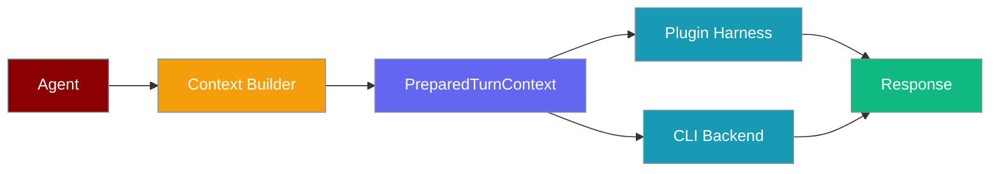
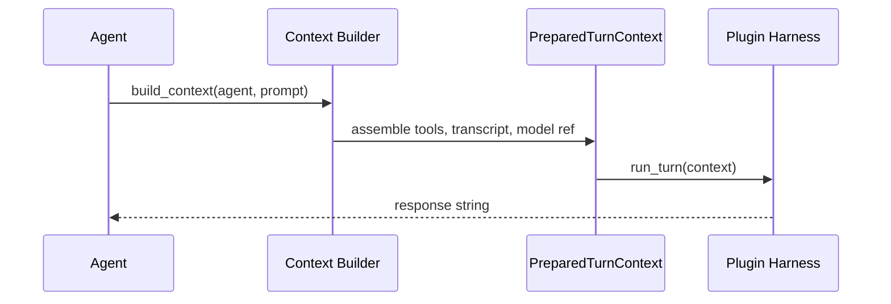
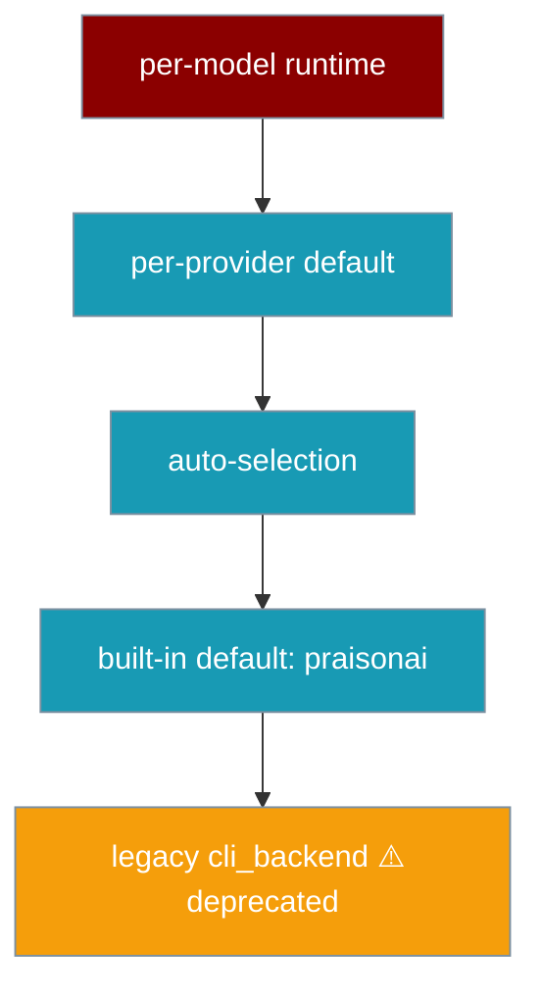

Plugin harnesses receive a single `PreparedTurnContext` object — the same plan used by the native runtime — eliminating scattered tool assembly and prompt building.



## Quick Start

<Steps>
<Step title="Native runtime (zero config)">
The built-in runtime prepares context automatically — no setup needed:

```python
from praisonaiagents import Agent

agent = Agent(name="assistant", instructions="Be helpful")
agent.start("What is 2 + 2?")
```
</Step>

<Step title="Custom plugin harness">
Implement `run_turn`, receive a `PreparedTurnContext`, return a string:

```python
import asyncio
from praisonaiagents import Agent
from praisonaiagents.runtime import (
    PreparedTurnContext,
    RuntimeMode,
)
from praisonaiagents.runtime.context_builder import default_context_builder


class MyHarness:
    async def run_turn(self, context: PreparedTurnContext) -> str:
        prompt = [m for m in context.transcript.messages if m.get("role") == "user"][-1]["content"]
        model = context.model_ref.model_id
        tools = [t.name for t in context.tools]
        return f"[{model}] Handled '{prompt}' with tools: {tools}"

    def supports_runtime_mode(self, mode: RuntimeMode) -> bool:
        return mode in {RuntimeMode.SYNC, RuntimeMode.ASYNC}


agent = Agent(name="assistant", instructions="Be helpful")
context = default_context_builder.build_context(agent=agent, prompt="Hello")
harness = MyHarness()
result = asyncio.run(harness.run_turn(context))
print(result)
```
</Step>
</Steps>

## How It Works



The context is **frozen** — harnesses read it but cannot mutate it, making multi-agent use safe.

## Configuration Options

### PreparedTurnContext fields

| Field | Type | Description |
|-------|------|-------------|
| `model_ref` | `ModelReference` | Resolved model ID, provider, temperature, capabilities |
| `tools` | `list[ToolSchema]` | Normalized tool schemas (name, description, parameters, callable) |
| `transcript` | `TranscriptWindow` | Messages history and system prompt |
| `delivery` | `DeliveryChannels` | Streaming emitter and callback configuration |
| `correlation` | `SessionCorrelation` | `session_id` and `turn_id` for metrics/tracing |
| `runtime_mode` | `RuntimeMode` | `SYNC`, `ASYNC`, `STREAM`, or `ASYNC_STREAM` |

### ModelReference fields

| Field | Type | Default | Description |
|-------|------|---------|-------------|
| `model_id` | `str` | required | Model identifier (e.g. `"gpt-4o"`) |
| `provider` | `str` | required | Provider name |
| `supports_streaming` | `bool` | `False` | Whether model supports streaming |
| `supports_tools` | `bool` | `False` | Whether model supports tool calls |
| `max_tokens` | `Optional[int]` | `None` | Token limit |
| `temperature` | `Optional[float]` | `None` | Sampling temperature |

### AgentRuntimeConfig fields

| Field | Type | Default | Description |
|-------|------|---------|-------------|
| `runtime` | `Optional[str]` | `None` | Runtime identifier (e.g. `"praisonai"`) |
| `config_overrides` | `dict` | `{}` | Runtime-specific overrides |
| `provider_default` | `Optional[str]` | `None` | Provider-level default runtime |
| `enable_auto_selection` | `bool` | `True` | Auto-select runtime when not specified |

## Runtime Resolution Order



## Common Patterns

**Read the prompt from transcript:**
```python
user_msgs = [m for m in context.transcript.messages if m.get("role") == "user"]
prompt = user_msgs[-1]["content"] if user_msgs else ""
```

**Stream using prepared delivery channels:**
```python
if context.delivery.has_streaming() and context.delivery.stream_emitter:
    from praisonaiagents.streaming.events import StreamEvent, StreamEventType
    await context.delivery.stream_emitter.emit_async(
        StreamEvent(type=StreamEventType.DELTA_TEXT, content="chunk")
    )
```

**Record metrics with correlation IDs:**
```python
metrics = {
    "session_id": context.correlation.session_id,
    "turn_id": context.correlation.turn_id,
    "model": context.model_ref.model_id,
    "tools": len(context.tools),
}
```

## Best Practices

<AccordionGroup>
<Accordion title="Never mutate PreparedTurnContext">
The context is a frozen dataclass. Create your own state objects for anything mutable during harness execution.
</Accordion>

<Accordion title="Check supports_runtime_mode before run_turn">
Declare which `RuntimeMode` values your harness supports and check before executing to avoid unexpected failures.
</Accordion>

<Accordion title="Use correlation IDs for all metrics">
Always use `context.correlation.session_id` and `context.correlation.turn_id` so traces from different harnesses align.
</Accordion>

<Accordion title="Prefer default_context_builder">
Use `default_context_builder.build_context(agent, prompt)` instead of constructing `PreparedTurnContext` manually — it handles tool normalization, system prompt assembly, and model resolution.
</Accordion>
</AccordionGroup>

## Related

<CardGroup cols={2}>
<Card title="Hooks" icon="webhook" href="/concepts/hooks">
  Hooks fire after tool execution and receive consistent payloads regardless of harness.
</Card>
<Card title="Managed Runtime Protocol" icon="server" href="/features/managed-runtime-protocol">
  Remote agent loops on managed infrastructure.
</Card>
<Card title="Agent Runtime Protocol" icon="plug" href="/features/agent-runtime-protocol">
  Pluggable agent execution runtimes (turn/stream abstraction).
</Card>
<Card title="Memory Lifecycle Hooks" icon="brain" href="/features/memory-lifecycle-hooks">
  Memory backends that react to tool and session events.
</Card>
</CardGroup>
