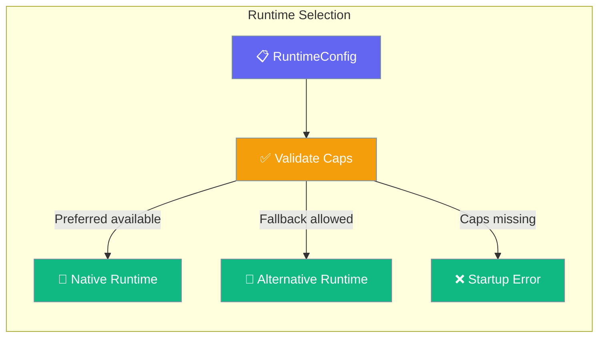
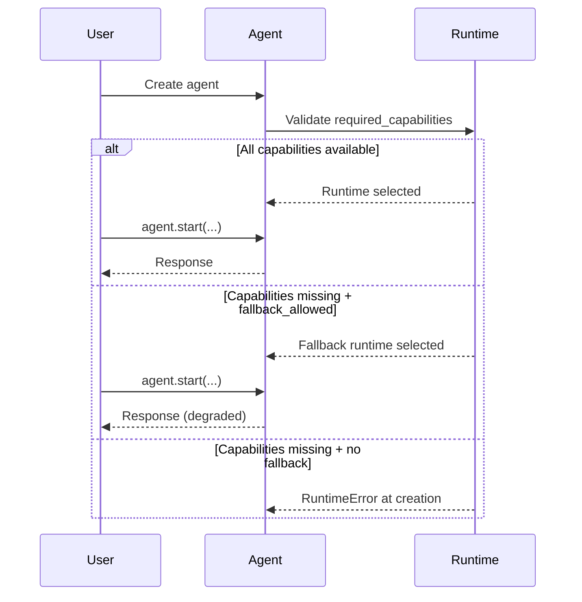

Runtime Config lets agents declare what capabilities they need — streaming, native hooks, MCP tools — and validates availability at startup.

```python
from praisonaiagents import Agent, RuntimeConfig

agent = Agent(
    name="Assistant",
    instructions="You are a real-time streaming assistant.",
    runtime=RuntimeConfig(
        required_capabilities={"streaming_deltas"},
        preferred_runtime="native",
    ),
)

agent.start("Explain the latest developments in fusion energy.")
```



## Quick Start

<Steps>
<Step title="Simple Usage">
```python
from praisonaiagents import Agent, RuntimeConfig

agent = Agent(
    instructions="You are a helpful assistant with streaming support.",
    runtime=RuntimeConfig(required_capabilities={"streaming_deltas"}),
)
agent.start("Write a short poem about autumn.")
```
</Step>

<Step title="With Preferred Runtime">
```python
from praisonaiagents import Agent, RuntimeConfig

agent = Agent(
    instructions="You are a tool-using assistant.",
    runtime=RuntimeConfig(
        preferred_runtime="native",
        required_capabilities={"tool_loop", "mcp_tools"},
        fallback_allowed=True,
    ),
)
agent.start("Search for and summarize recent Python release notes.")
```
</Step>
</Steps>

---

## How It Works



| Phase | What happens |
|---|---|
| 1. Validate | Agent checks required capabilities against available runtimes |
| 2. Select | Preferred runtime is used if available |
| 3. Fallback | Alternative runtime used if preferred is unavailable and `fallback_allowed=True` |
| 4. Execute | Agent runs on selected runtime |

---

## Configuration Options

<Card icon="code" href="/docs/sdk/reference/python/RuntimeConfig">
  Full list of options, types, and defaults — `RuntimeConfig`
</Card>

| Option | Type | Default | Description |
|---|---|---|---|
| `required_capabilities` | `list[str] \| None` | `None` | Capabilities the agent requires |
| `preferred_runtime` | `str \| None` | `None` | Preferred runtime implementation name |
| `fallback_allowed` | `bool` | `True` | Allow fallback if preferred runtime is unavailable |
| `validate_on_creation` | `bool` | `True` | Validate at agent creation (vs first execution) |
| `metadata` | `dict \| None` | `{}` | Additional runtime hints |

---

## Common Patterns

### Pattern 1 — Streaming-capable agent
```python
from praisonaiagents import Agent, RuntimeConfig

agent = Agent(
    instructions="You are a real-time assistant.",
    runtime=RuntimeConfig(
        required_capabilities={"streaming_deltas"},
        fallback_allowed=True,
    ),
)
response = agent.start("Write a detailed technical tutorial on async Python.")
print(response)
```

### Pattern 2 — MCP-tools agent with strict requirements
```python
from praisonaiagents import Agent, RuntimeConfig

agent = Agent(
    instructions="You are an agent that uses MCP tools for file system operations.",
    runtime=RuntimeConfig(
        required_capabilities={"tool_loop", "mcp_tools", "native_hooks"},
        preferred_runtime="native",
        fallback_allowed=False,
    ),
)
agent.start("List all Python files modified in the last 7 days.")
```

---

## Best Practices

<AccordionGroup>
<Accordion title="Use validate_on_creation=True">
Keeping `validate_on_creation=True` (the default) surfaces capability mismatches immediately when the agent is created, not halfway through a task. This prevents silent degradation.
</Accordion>

<Accordion title="Allow fallback for resilience">
Set `fallback_allowed=True` unless your agent strictly requires a specific runtime. Fallback lets the agent work even in environments where the preferred runtime isn't installed.
</Accordion>

<Accordion title="Check available capabilities">
Capability names include `streaming_deltas`, `tool_loop`, `mcp_tools`, `native_hooks`. Use only documented capability names to ensure forward compatibility.
</Accordion>
</AccordionGroup>

---

## Related

<CardGroup cols={2}>
<Card icon="cpu" href="/docs/features/runtime-capabilities">
  Runtime Capabilities — full capabilities reference
</Card>
<Card icon="play" href="/docs/features/execution">
  Execution — control iteration limits and budget
</Card>
</CardGroup>
