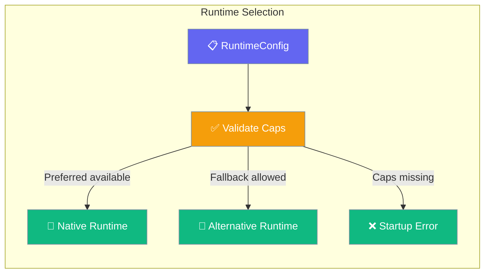
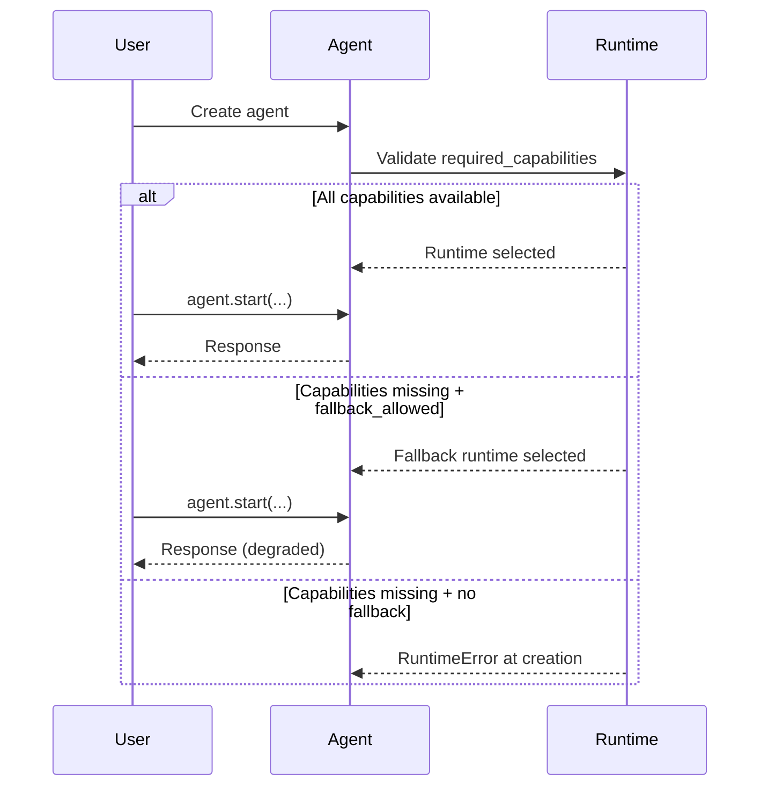
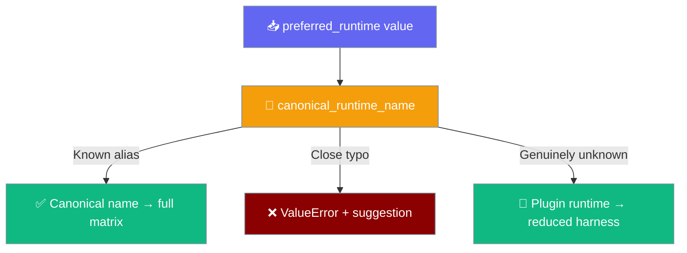

Runtime Config lets agents declare what capabilities they need — streaming, native hooks, MCP tools — and validates availability at startup.

<Note>
Replaces the deprecated `cli_backend=` kwarg — see [Legacy Agent Parameters](/features/agent-legacy-params).
</Note>

```python
from praisonaiagents import Agent
from praisonaiagents.config import RuntimeConfig

agent = Agent(
    name="Assistant",
    instructions="You are a real-time streaming assistant.",
    runtime=RuntimeConfig(
        required_capabilities={"streaming_deltas"},
        preferred_runtime="native",
    ),
)

agent.start("Explain the latest developments in fusion energy.")
```

The user enables runtime configuration on the agent; declared capabilities are validated at startup before the run proceeds.



```mermaid
graph LR
    subgraph "Runtime Selection"
        Config[📋 RuntimeConfig] --> Validate[✅ Validate Caps]
        Validate -->|Preferred available| Native[🚀 Native Runtime]
        Validate -->|Fallback allowed| Alt[🔄 Alternative Runtime]
        Validate -->|Caps missing| Error[❌ Startup Error]
    end

    classDef input fill:#6366F1,stroke:#7C90A0,color:#fff
    classDef process fill:#F59E0B,stroke:#7C90A0,color:#fff
    classDef output fill:#10B981,stroke:#7C90A0,color:#fff

    class Config input
    class Validate process
    class Native,Alt,Error output
```

## Quick Start

<Steps>
<Step title="Simple Usage">
```python
from praisonaiagents import Agent
from praisonaiagents.config import RuntimeConfig

agent = Agent(
    instructions="You are a helpful assistant with streaming support.",
    runtime=RuntimeConfig(required_capabilities={"streaming_deltas"}),
)
agent.start("Write a short poem about autumn.")
```
</Step>

<Step title="With Preferred Runtime">
```python
from praisonaiagents import Agent
from praisonaiagents.config import RuntimeConfig

agent = Agent(
    instructions="You are a tool-using assistant.",
    runtime=RuntimeConfig(
        preferred_runtime="native",
        required_capabilities={"tool_loop", "mcp_tools"},
        fallback_allowed=True,
    ),
)
agent.start("Search for and summarize recent Python release notes.")
```
</Step>
</Steps>

---

## How It Works


```mermaid
sequenceDiagram
    participant User
    participant Agent
    participant Runtime

    User->>Agent: Create agent
    Agent->>Runtime: Validate required_capabilities
    alt All capabilities available
        Runtime-->>Agent: Runtime selected
        User->>Agent: agent.start(...)
        Agent-->>User: Response
    else Capabilities missing + fallback_allowed
        Runtime-->>Agent: Fallback runtime selected
        User->>Agent: agent.start(...)
        Agent-->>User: Response (degraded)
    else Capabilities missing + no fallback
        Runtime-->>Agent: RuntimeError at creation
    end
```

| Phase | What happens |
|---|---|
| 1. Validate | Agent checks required capabilities against available runtimes |
| 2. Select | Preferred runtime is used if available |
| 3. Fallback | Alternative runtime used if preferred is unavailable and `fallback_allowed=True` |
| 4. Execute | Agent runs on selected runtime |

---

## Configuration Options

<Card icon="code" href="/sdk/reference/praisonaiagents/modules/feature_configs">
  Full list of options, types, and defaults — `RuntimeConfig`
</Card>

| Option | Type | Default | Description |
|---|---|---|---|
| `required_capabilities` | `list[str] \| None` | `None` | Capabilities the agent requires |
| `preferred_runtime` | `str \| None` | `None` | Preferred runtime implementation name |
| `fallback_allowed` | `bool` | `True` | Allow fallback if preferred runtime is unavailable |
| `validate_on_creation` | `bool` | `True` | Validate at agent creation (vs first execution) |
| `metadata` | `dict \| None` | `{}` | Additional runtime hints |

---

## Runtime Name Normalisation

`preferred_runtime` values are canonicalised before selection, so common spellings all resolve to the same capability matrix.

Normalisation is:
- **Case-insensitive** — `NATIVE`, `Native`, `nAtIvE` all resolve to `native`.
- **Whitespace-tolerant** — `" native "` is trimmed to `native`.
- **Separator-agnostic** — `-` and `_` are interchangeable (`plugin_harness` = `plugin-harness`).

### Alias Table

Source: `RUNTIME_ALIASES` in `praisonaiagents.config.feature_configs`.

| Alias (any spelling) | Canonicalises to | Notes |
|---|---|---|
| `native`, `NATIVE`, `Native`, ` native ` | `native` | Full native capability matrix |
| `plugin_harness`, `plugin-harness`, `harness`, `plugin`, `reduced` | `plugin-harness` | Reduced-harness capability matrix |
| `my-plugin-runtime` (any other unknown name) | *unchanged* | Treated as a third-party plugin runtime; falls back to the reduced harness |


```mermaid
graph TB
    In[📥 preferred_runtime value] --> Canon[🔡 canonical_runtime_name]
    Canon -->|Known alias| Known[✅ Canonical name → full matrix]
    Canon -->|Close typo| Err[❌ ValueError + suggestion]
    Canon -->|Genuinely unknown| Plugin[🔌 Plugin runtime → reduced harness]

    classDef input fill:#6366F1,stroke:#7C90A0,color:#fff
    classDef process fill:#F59E0B,stroke:#7C90A0,color:#fff
    classDef ok fill:#10B981,stroke:#7C90A0,color:#fff
    classDef bad fill:#8B0000,stroke:#7C90A0,color:#fff

    class In input
    class Canon process
    class Known,Plugin ok
    class Err bad
```

### Typo Detection

A value that is a close typo of a known runtime (e.g. `nativ`, `natve`, `reducd`, `harnes`) raises `ValueError` with a suggested spelling — instead of silently degrading to the reduced harness and dropping capabilities.

```python
from praisonaiagents import Agent
from praisonaiagents.config import RuntimeConfig

# Raises ValueError: "Unknown runtime 'nativ'. Did you mean 'native'?"
Agent(
    instructions="You are a helpful assistant.",
    runtime=RuntimeConfig(preferred_runtime="nativ"),
)
```

The typo check runs at agent construction, so a mistyped `RuntimeConfig` fails immediately rather than silently at runtime.

### Plugin Runtimes Still Accepted

An unrecognised name that is *not* a close typo is treated as an opaque plugin runtime name and passed through unchanged — a third-party runtime registered later keeps working.

```python
from praisonaiagents import Agent
from praisonaiagents.config import RuntimeConfig

# Accepted as-is; falls back to the reduced harness
Agent(
    instructions="You are a helpful assistant.",
    runtime=RuntimeConfig(preferred_runtime="my-plugin-runtime"),
)
```

### Normalised Input Surfaces

Every input form is normalised, and the caller's object is never mutated — `resolve_runtime` returns a normalised copy.

```python
from praisonaiagents import Agent

# String
Agent(instructions="…", runtime="NATIVE")

# Dict
Agent(instructions="…", runtime={"preferred_runtime": " native "})

# RuntimeConfig instance
from praisonaiagents.config import RuntimeConfig
Agent(instructions="…", runtime=RuntimeConfig(preferred_runtime="NATIVE"))
```

All three resolve `preferred_runtime` to `native`.

---

## Common Patterns

### Pattern 1 — Streaming-capable agent
```python
from praisonaiagents import Agent
from praisonaiagents.config import RuntimeConfig

agent = Agent(
    instructions="You are a real-time assistant.",
    runtime=RuntimeConfig(
        required_capabilities={"streaming_deltas"},
        fallback_allowed=True,
    ),
)
response = agent.start("Write a detailed technical tutorial on async Python.")
print(response)
```

### Pattern 2 — MCP-tools agent with strict requirements
```python
from praisonaiagents import Agent
from praisonaiagents.config import RuntimeConfig

agent = Agent(
    instructions="You are an agent that uses MCP tools for file system operations.",
    runtime=RuntimeConfig(
        required_capabilities={"tool_loop", "mcp_tools", "native_hooks"},
        preferred_runtime="native",
        fallback_allowed=False,
    ),
)
agent.start("List all Python files modified in the last 7 days.")
```

---

## Best Practices

<AccordionGroup>
<Accordion title="Use validate_on_creation=True">
Keeping `validate_on_creation=True` (the default) surfaces capability mismatches immediately when the agent is created, not halfway through a task. This prevents silent degradation.
</Accordion>

<Accordion title="Allow fallback for resilience">
Set `fallback_allowed=True` unless your agent strictly requires a specific runtime. Fallback lets the agent work even in environments where the preferred runtime isn't installed.
</Accordion>

<Accordion title="Check available capabilities">
Capability names include `streaming_deltas`, `tool_loop`, `mcp_tools`, `native_hooks`. Use only documented capability names to ensure forward compatibility.
</Accordion>
</AccordionGroup>

---

## Related

<CardGroup cols={2}>
<Card icon="cpu" href="/features/runtime-capabilities">
  Runtime Capabilities — full capabilities reference
</Card>
<Card icon="play" href="/features/execution">
  Execution — control iteration limits and budget
</Card>
</CardGroup>
