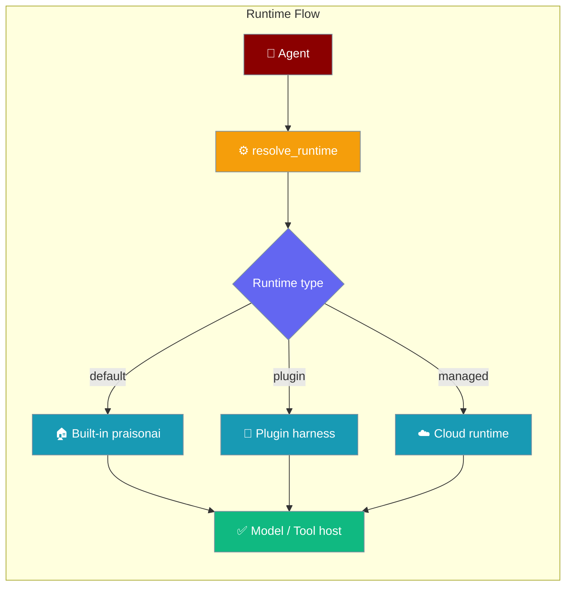
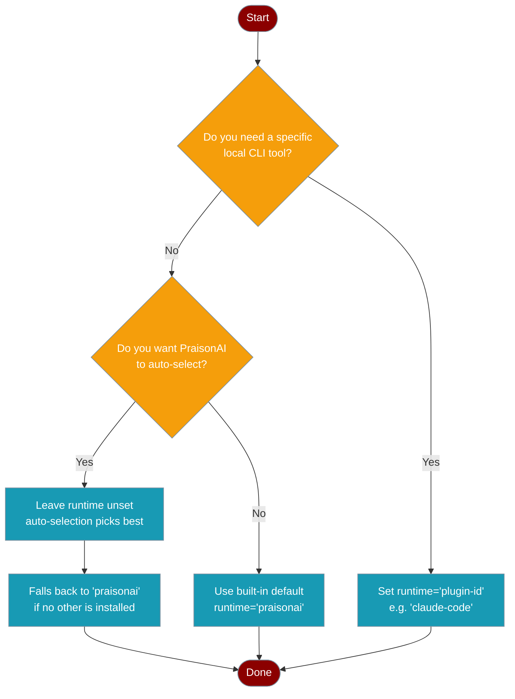
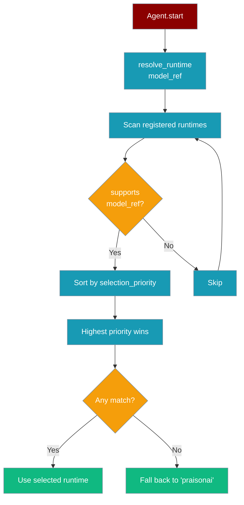
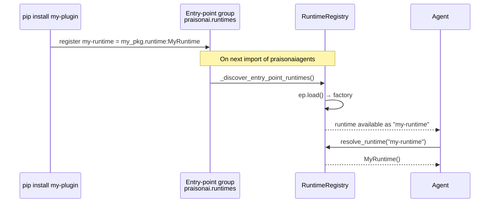
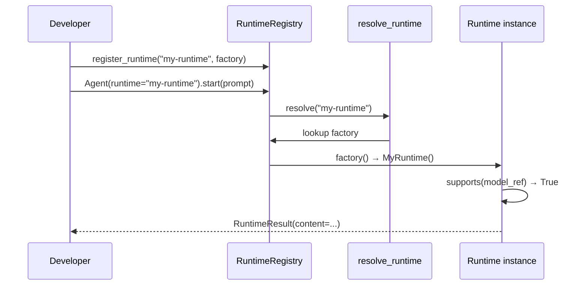

Runtimes are the execution engines between your `Agent` and the actual model or tool host. The built-in `praisonai` runtime is the default — zero config needed.



## Quick Start

<Steps>
<Step title="Default runtime — zero config">
```python
from praisonaiagents import Agent

agent = Agent(
    name="Coder",
    instructions="Write Python.",
)
agent.start("Write a hello-world script")
```

The built-in `praisonai` runtime runs automatically. Nothing to configure.
</Step>

<Step title="List installed runtimes">
```python
from praisonaiagents import list_runtimes

print(list_runtimes())
# ['praisonai']          # plus any installed plugin runtimes
```
</Step>

<Step title="Pin a specific runtime">
```python
from praisonaiagents import Agent

agent = Agent(
    name="Coder",
    instructions="Write Python.",
    runtime="praisonai",   # or "claude-code" if that plugin is installed
)
agent.start("Write a hello-world script")
```
</Step>

<Step title="Register a custom runtime">
```python
from praisonaiagents import register_runtime, AgentRuntimeProtocol

class MyRuntime:
    @property
    def runtime_name(self): return "my-runtime"
    @property
    def runtime_version(self): return "0.1"
    def supports(self, model_ref=None): return True

register_runtime("my-runtime", lambda: MyRuntime())

agent = Agent(
    name="Coder",
    instructions="Write Python.",
    runtime="my-runtime",
)
```
</Step>

<Step title="Install a plugin runtime via entry-point">
```toml
# In your plugin's pyproject.toml
[project.entry-points."praisonai.runtimes"]
my-runtime = "my_pkg.runtime:MyRuntime"
```

After `pip install my-pkg`, the runtime is auto-discovered — no code changes needed.
</Step>
</Steps>

---

## Which runtime should I use?



| Scenario | What to do |
|----------|-----------|
| Just getting started | Use default — set nothing |
| Want a specific local CLI (Claude Code, Codex) | `runtime="<plugin-id>"` |
| PraisonAI picks the best available | Leave `runtime` unset |
| Authoring a plugin runtime | Implement `AgentRuntimeProtocol` + register via entry-point |

---

## How It Works

### Auto-selection

When `runtime` is unset, `resolve_runtime()` scans all registered runtimes, calls `supports(model_ref)` on each, and picks the highest-priority match. If none match, it falls back to the built-in `praisonai` runtime.



### Plugin discovery

At import time, PraisonAI scans the `praisonai.runtimes` entry-point group and registers every installed plugin runtime automatically via `_discover_entry_point_runtimes()`.



### Register → Resolve → Run lifecycle



---

## Plugin Harness Contract

A runtime plugin must implement the `AgentRuntimeProtocol`:

```python
from praisonaiagents import AgentRuntimeProtocol

class MyRuntime:
    @property
    def runtime_name(self) -> str:
        return "my-runtime"

    @property
    def runtime_version(self) -> str:
        return "0.1.0"

    def supports(self, model_ref=None) -> bool:
        return True

    async def run_turn(self, prompt, *, system_prompt=None, model_ref=None, **kwargs):
        # Your execution logic here
        from praisonaiagents.runtime.protocols import RuntimeResult
        return RuntimeResult(content="response", metadata={})
```

<Tip>
The `AgentRuntimeProtocol` uses Python structural subtyping — your class does **not** need to explicitly inherit from it. Implement the required properties and methods and it satisfies the protocol automatically.
</Tip>

### `pyproject.toml` snippet for plugin authors

```toml
[project.entry-points."praisonai.runtimes"]
my-runtime = "my_pkg.runtime:MyRuntime"
```

After publishing and installing your package, `list_runtimes()` will include `"my-runtime"` automatically.

---

## Runtime Families

| Family | Description | Example IDs |
|--------|-------------|-------------|
| **Native** | Built-in `praisonai` runtime (default) | `"praisonai"` |
| **Plugin harness** | External CLI / container registered via `praisonai.runtimes` entry-point | `"claude-code"`, `"codex-cli"` |
| **Managed** | Cloud-hosted runtimes (E2B, Modal, etc.) | provider-specific |

<Note>
Default behaviour is unchanged. Agents that don't set `runtime` continue using the built-in PraisonAI runtime — nothing to migrate.
</Note>

---

## Configuration Options

<Card title="AgentRuntimeProtocol API Reference" icon="code" href="/docs/sdk/reference">
  Full protocol signature — runtime_name, runtime_version, supports(), run_turn(), stream_turn()
</Card>

---

## Best Practices

<AccordionGroup>
<Accordion title="Leave runtime unset for most agents">
The built-in `praisonai` runtime handles all standard LLM providers. Only set `runtime` when you specifically need a different execution harness (e.g. Claude Code for code-only tasks).
</Accordion>

<Accordion title="Use entry-points for shareable plugins">
Prefer registering runtimes via `pyproject.toml` entry-points rather than calling `register_runtime()` inline. Entry-point plugins work across projects and are discoverable without code changes.
</Accordion>

<Accordion title="Unknown runtime IDs fail loud">
If you set `runtime="typo-runtime"` and it's not registered, the agent raises a `ValueError` immediately — it does not silently fall back to the built-in runtime. This is intentional.
</Accordion>

<Accordion title="Check available runtimes before pinning">
Call `list_runtimes()` to confirm a plugin is installed before pinning it in production config. This catches missing dependencies early.
</Accordion>
</AccordionGroup>

---

## Related

<CardGroup cols={2}>
<Card title="Runtime Selection" icon="play" href="/docs/features/runtime-selection">
  Per-model and per-provider runtime config, YAML configuration, and migration from cli_backend
</Card>
<Card title="Runtime Capabilities" icon="shield-check" href="/docs/features/runtime-capabilities">
  Capability matrix — declare what features your runtime supports
</Card>
<Card title="CLI Backend Protocol" icon="terminal" href="/docs/features/cli-backend-protocol">
  Legacy cli_backend reference (deprecated — see Runtime Selection)
</Card>
<Card title="Runtime Preflight" icon="shield" href="/docs/features/runtime-preflight">
  Validate runtime configuration before AgentTeam.start()
</Card>
</CardGroup>
