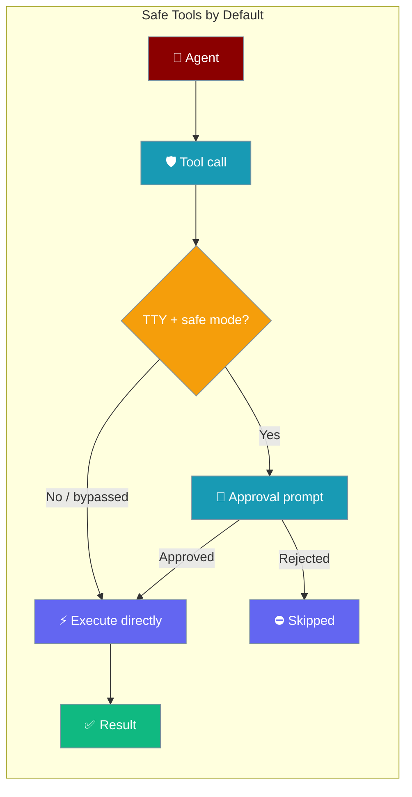
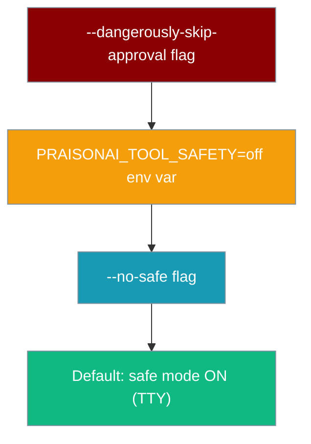
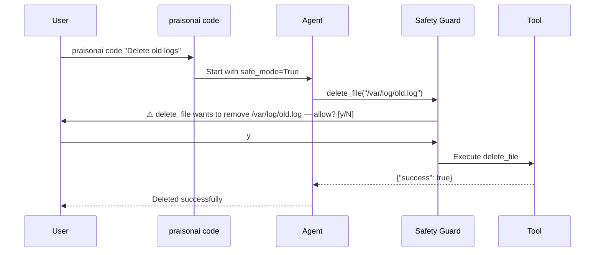

Dangerous built-in tools (shell commands, file writes, edits, deletes, and patch application) now prompt for confirmation before running. Safe mode is ON by default — no config needed.

```python
from praisonaiagents import Agent
from praisonaiagents.tools import (
    execute_command, write_file, edit_file, delete_file, apply_patch
)

agent = Agent(
    name="DevAgent",
    instructions="Help with coding tasks",
    tools=[execute_command, write_file, edit_file, delete_file, apply_patch],
)

agent.start("Refactor main.py")
```



## Quick Start

<Steps>
<Step title="Run safely out of the box">

`praisonai code` is safe by default — dangerous tools pause and ask before running:

```bash
praisonai code "Delete the tmp directory"
```

```
praisonai: delete_file wants to remove /project/tmp — allow? [y/N]
```

No flags needed. Safe mode is always on for interactive TTY sessions.
</Step>

<Step title="Disable for a single trusted task">

When you trust a specific one-off task, use `--no-safe`:

```bash
praisonai code --no-safe "Run the cleanup script"
```

Only that session bypasses approval. Subsequent sessions remain safe by default.
</Step>

<Step title="Disable for CI / non-interactive scripts">

Set the environment variable once in your CI pipeline and every praisonai command in that shell skips approval prompts automatically:

```bash
PRAISONAI_TOOL_SAFETY=off praisonai code "Run all tests and fix failures"
```

Or export it in the job environment:

```yaml
env:
  PRAISONAI_TOOL_SAFETY: "off"
```
</Step>

<Step title="Use --dangerously-skip-approval for headless agents">

For long-running headless processes that have their own external approval gate, use the explicit flag:

```bash
praisonai code --dangerously-skip-approval "Automated code review fix"
```

This also sets `PRAISONAI_TOOL_SAFETY=off` for the duration of the process.
</Step>
</Steps>

---

## Which Tools Require Approval

| Tool | What it does | Gated |
|------|-------------|-------|
| `execute_command` / `shell` | Runs arbitrary shell commands | ✅ Yes |
| `write_file` | Creates or overwrites files | ✅ Yes |
| `edit_file` | In-place file edits | ✅ Yes |
| `delete_file` | Permanently deletes files | ✅ Yes |
| `apply_patch` | Applies unified diff patches | ✅ Yes |
| Read-only tools (search, read_file, etc.) | Read but don't modify | ❌ No |

---

## Precedence Ladder



Higher entries override lower entries. The explicit `--dangerously-skip-approval` flag always wins.

---

## How It Works



On non-interactive TTYs (CI, piped stdin, `PRAISONAI_TOOL_SAFETY=off`), the guard is bypassed and tools execute immediately.

---

## Best Practices

<AccordionGroup>
<Accordion title="Always be explicit in CI">

Never rely on the default behaviour in automated pipelines. Set `PRAISONAI_TOOL_SAFETY=off` explicitly in every CI job that runs `praisonai code`:

```yaml
- name: Auto-fix code
  env:
    PRAISONAI_TOOL_SAFETY: "off"
  run: praisonai code "Fix all linting errors"
```

This makes the bypass intentional and visible in code review.
</Accordion>

<Accordion title="Prefer per-run flags over global env vars">

Use `--no-safe` for individual commands rather than exporting `PRAISONAI_TOOL_SAFETY=off` globally in your shell. A global bypass means every subsequent `praisonai code` in that shell runs without approval — easy to forget.
</Accordion>

<Accordion title="Layer approval with --dangerously-skip-approval for trusted pipelines">

If your pipeline already has an external approval gate (pull request review, policy-as-code), use `--dangerously-skip-approval` to document the intent clearly. This is better than `--no-safe` because it communicates that the operator consciously chose to skip the built-in guard.
</Accordion>

<Accordion title="Keep shared keys safe">

Never run with `PRAISONAI_TOOL_SAFETY=off` on a machine where the API key is shared across users. The approval guard is the last line of defence against a prompt injection tricking an agent into deleting or exfiltrating files.
</Accordion>
</AccordionGroup>

---

## Related

<CardGroup cols={2}>
<Card title="Approval Protocol" icon="check-circle" href="/docs/features/approval-protocol">
  Deep dive into the interactive approval flow and how to customise it
</Card>
<Card title="Core Controls" icon="sliders" href="/docs/features/core-controls">
  Other safety controls available for agents
</Card>
</CardGroup>
