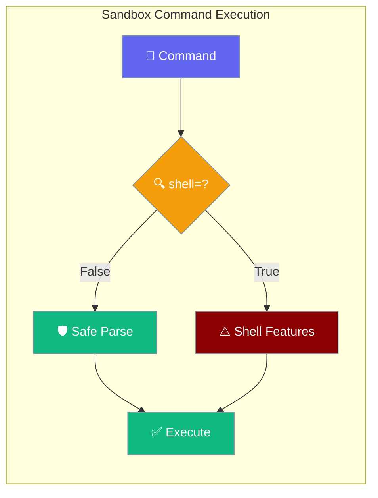
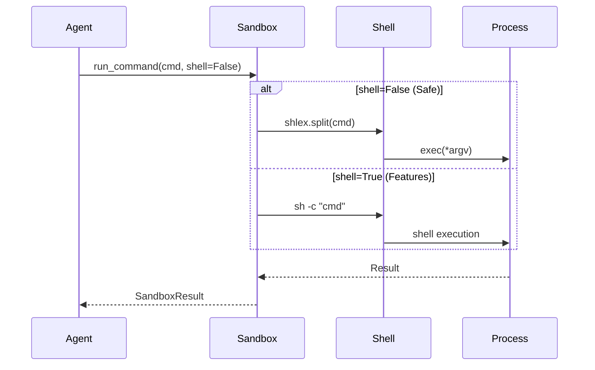
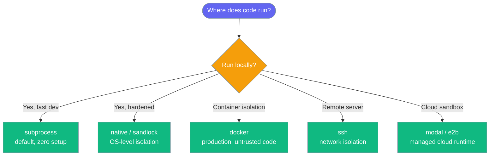
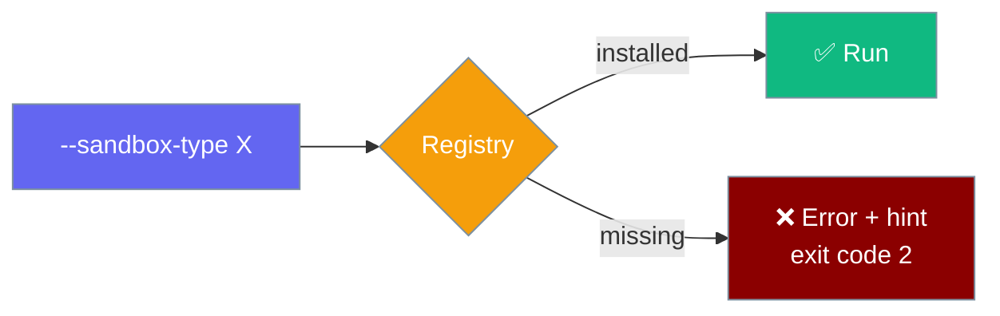
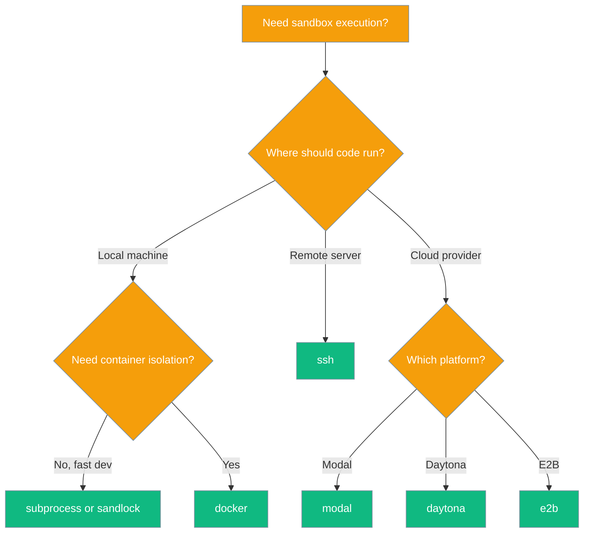
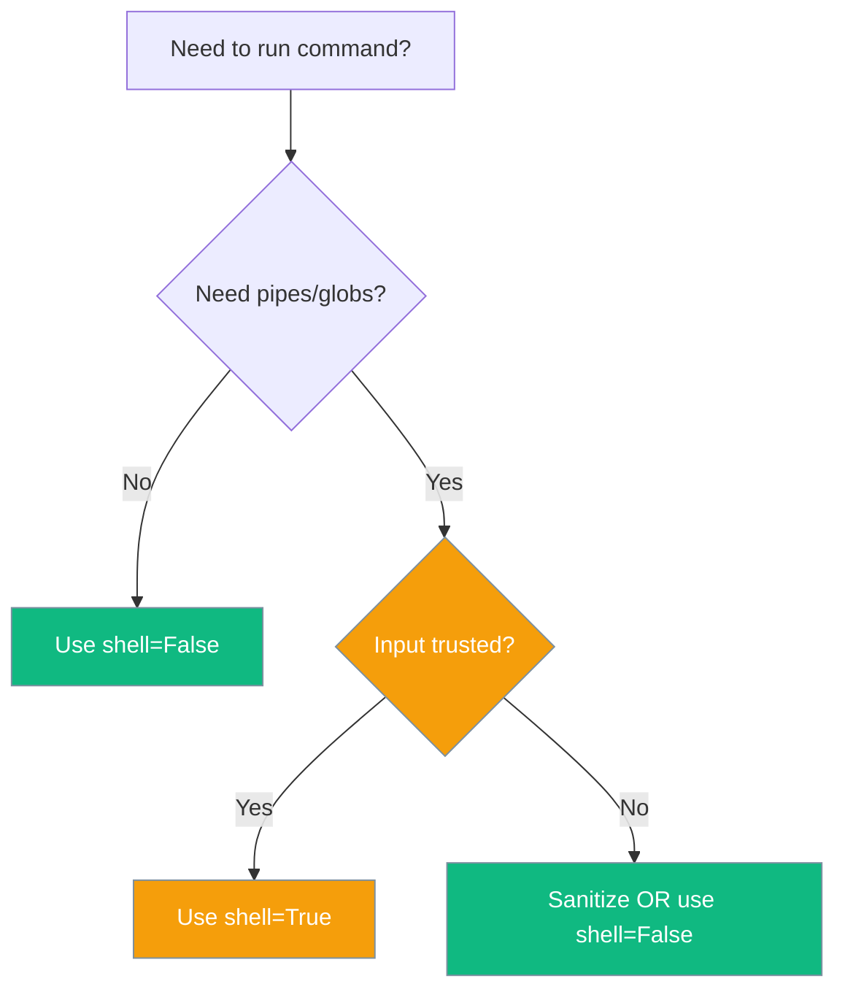

Sandbox backends provide isolated command execution environments with explicit shell control to prevent injection attacks while enabling shell features when needed.

```python
from praisonaiagents import Agent

agent = Agent(
    name="Coder",
    instructions="Run shell commands safely",
    sandbox=True,
)
agent.start("List Python files in the current directory")
```

The user runs commands through the agent; the sandbox backend isolates execution with explicit shell control.

<Note>
Sandbox backends now ship in a dedicated **`praisonai-sandbox`** package. If you use the agent-level API (`sandbox=True`, `SandboxConfig`), the existing `from praisonai.sandbox import ...` imports and `praisonai` extras continue to work — the standalone package is installed for you. Install `praisonai-sandbox` directly only when you want the sandbox stack **without** the full `praisonai` wrapper (e.g. embedding a sandbox in a small script or another project).
</Note>




## Quick Start

<Steps>
<Step title="Simple Usage">

Enable sandbox on the agent — subprocess backend is the default:

```python
from praisonaiagents import Agent

agent = Agent(
    name="System Agent",
    instructions="Execute system commands safely",
    sandbox=True,
)
agent.start("List files in the current directory")
```

</Step>

<Step title="With Configuration">

Pick a specific backend via `SandboxConfig` or the CLI `--sandbox-type` flag:

```python
from praisonaiagents import Agent, SandboxConfig

agent = Agent(
    name="Data Agent",
    instructions="Process data in an isolated container",
    sandbox=SandboxConfig.docker("python:3.11-slim"),
)
agent.start("Run pip list and summarise installed packages")
```

```bash
praisonai sandbox run --code "print('hello')" --type docker
```

</Step>
</Steps>

---

## How It Works



| Backend | Use Case | Security Level |
|---------|----------|----------------|
| `SubprocessSandbox` | Local development, scripts | Medium (OS-level isolation, POSIX only) |
| `DockerSandbox` | Production, untrusted code | High (container isolation) |
| `SSHSandbox` | Remote execution | High (network isolation) |

---

## Which Backend Should I Use?

Pick a backend based on where the code runs and how much you trust it.



---

## All Built-in Sandbox Backends

PR #2003 exposes all seven sandboxes through `SandboxRegistry` — selectable by string name from the CLI or Python.

| Name | Class | Typical use |
|------|-------|-------------|
| `docker` | `DockerSandbox` | Container isolation for production |
| `subprocess` | `SubprocessSandbox` | Fast local development (default) |
| `sandlock` | `SandlockSandbox` | Hardened local sandbox |
| `ssh` | `SSHSandbox` | Remote server execution |
| `modal` | `ModalSandbox` | Modal cloud sandboxes |
| `daytona` | `DaytonaSandbox` | **Not implemented** — use subprocess/docker/e2b |
| `e2b` | `E2BSandbox` | E2B cloud code interpreter |

**Plugin-registered backends** (installed separately, resolved via the `praisonai.sandbox` entry-point group):

| Name | Source | Typical use |
|------|--------|-------------|
| `capsule` | Plugin (via `praisonai.sandbox`) | Plugin-provided secure sandbox — install via `praisonai-plugins[capsule]` |

### Select by Name

<Tabs>
<Tab title="CLI">
```bash
# Run code in any registered backend
praisonai sandbox run --code "print('hello')" --type subprocess
praisonai sandbox run --code "print('hello')" --type e2b
praisonai sandbox run --file script.py --type modal
praisonai sandbox run --code "ls" --type docker --image python:3.11-slim
```
</Tab>

<Tab title="Python">
```python
from praisonaiagents import Agent
from praisonai.sandbox._registry import SandboxRegistry

agent = Agent(name="Coder", instructions="Run code safely")

registry = SandboxRegistry.default()
sandbox_cls = registry.resolve("daytona")  # or docker, e2b, modal, ssh, sandlock, subprocess
sandbox = sandbox_cls()
```
</Tab>
</Tabs>

### Installing Optional Backends

Only `subprocess` and `sandlock` ship in the base install — every other backend requires an optional extra. The standalone `praisonai-sandbox` package is the preferred install; the legacy `praisonai[...]` extras still work as compatibility shims.

| Backend | Preferred install | Also works (legacy shim) |
|---------|-------------------|--------------------------|
| `subprocess` | Built in — no extra required | — |
| `sandlock` | Built in — no extra required | — |
| `docker` | `pip install "praisonai-sandbox[docker]"` | `pip install "praisonai[docker]"` |
| `ssh` | `pip install "praisonai-sandbox[ssh]"` | `pip install "praisonai[ssh]"` |
| `modal` | `pip install "praisonai-sandbox[modal]"` | `pip install "praisonai[modal]"` |
| `daytona` | `pip install "praisonai-sandbox[daytona]"` | `pip install "praisonai[daytona]"` |
| `e2b` | `pip install "praisonai-sandbox[e2b]"` | `pip install "praisonai[e2b]"` |
| `capsule` | `pip install "praisonai-plugins[capsule]"` | — |

Selecting an uninstalled backend exits with code 2 and prints a fix-it hint — no silent downgrade to subprocess:

```bash
$ praisonai sandbox run --code "print('hi')" --type modal
Error: sandbox 'modal' is unavailable: <reason>
Available: ['subprocess', 'sandlock']
To install the optional backend:  pip install "praisonai-sandbox[modal]"
                                  # or (legacy):  pip install "praisonai[modal]"
Or explicitly choose another sandbox:  --sandbox-type subprocess
$ echo $?
2
```



<Note>
You'll never get an unexpected backend — if `--sandbox-type X` isn't available, the CLI tells you exactly what to install.
</Note>

For **plugin-registered** backends (like `capsule`), `SandboxManager` resolves the name through `SandboxRegistry` and raises a clearer error when the plugin is missing. When `praisonai` is installed but the plugin is not registered:

```
ValueError: Unknown sandbox type: 'capsule'. Available: ['docker', 'subprocess', 'sandlock', 'ssh', 'modal', 'daytona', 'e2b']
```

When `praisonai` itself is not installed (the registry import fails):

```
ValueError: Unknown sandbox type: 'capsule'. Supported built-ins: 'docker', 'subprocess', 'e2b', 'sandlock', 'ssh', 'modal', 'daytona'. Install a plugin package that registers 'capsule' under the 'praisonai.sandbox' entry-point group (e.g. pip install praisonai-plugins[capsule]).
```

### Third-Party Sandbox Plugins

Register custom sandboxes via the `praisonai.sandbox` entry-point group:

```toml
# pyproject.toml
[project.entry-points."praisonai.sandbox"]
my-sandbox = "my_pkg.sandbox:MySandbox"
```

After `pip install`, the new name appears alongside the built-ins when you call `registry.list_names()`.

### Example: Capsule (from praisonai-plugins)

```bash
pip install "praisonai-plugins[capsule]"
```

```python
from praisonaiagents import Agent, SandboxConfig

agent = Agent(
    name="SecureRunner",
    instructions="Execute code inside the Capsule sandbox.",
    sandbox=SandboxConfig.capsule(),   # strict security policy applied automatically
)

agent.start("Run a Python script")
```

The `capsule` backend is registered by `praisonai-plugins` under the `praisonai.sandbox` entry-point group. `SandboxManager` resolves the name via `SandboxRegistry` the first time the sandbox starts.

## Using the standalone package

The seven backends live in a dedicated package so you can use them without pulling in the full `praisonai` wrapper.

<Tabs>
<Tab title="Agent (default)">

Nothing to change — the standalone package is installed alongside `praisonai`:

```python
from praisonaiagents import Agent, SandboxConfig

agent = Agent(
    name="Coder",
    instructions="Run code inside a container",
    sandbox=SandboxConfig.docker("python:3.11-slim"),
)
agent.start("List files and print Python version")
```
</Tab>

<Tab title="Direct import">

Import a backend directly when you don't need an Agent:

```python
from praisonai_sandbox import DockerSandbox
from praisonaiagents.sandbox import SandboxConfig

config = SandboxConfig.docker("python:3.11-slim")
sandbox = DockerSandbox(image=config.image, config=config)
```
</Tab>

<Tab title="CLI">

The package installs a `praisonai-sandbox` CLI for one-off runs and scripts:

```bash
pip install praisonai-sandbox[docker]
praisonai-sandbox --help
```
</Tab>

<Tab title="Legacy shim">

Existing code keeps working — `praisonai.sandbox` transparently re-exports from `praisonai_sandbox`:

```python
from praisonai.sandbox import SubprocessSandbox   # shim → praisonai_sandbox
```
</Tab>
</Tabs>

### Which Sandbox Should I Pick?



---

## Configuration Options

### Shell Parameter Control

<Tabs>
<Tab title="shell=False (Default)">
```python
# String commands are parsed safely
result = await sandbox.run_command("python script.py --arg value")

# List commands are executed directly
result = await sandbox.run_command(["python", "script.py", "--arg", "value"])
```

**Security**: No shell injection possible. String commands are parsed with `shlex.split()`.
</Tab>

<Tab title="shell=True (Opt-in)">
```python
# Shell features available: pipes, redirects, globs
result = await sandbox.run_command(
    "find . -name '*.py' | xargs grep 'TODO' > todos.txt",
    shell=True
)

# Environment variable expansion
result = await sandbox.run_command(
    "echo $HOME && ls $PWD/*.log", 
    shell=True
)
```

**Security**: Shell evaluation enabled. Only use with trusted input.
</Tab>
</Tabs>

<Warning>
Set `shell=True` only when you need shell features (pipes, `&&`, globbing). With untrusted input always keep `shell=False`.
</Warning>

### Decision Guide



| Use Case | Recommended `shell` Value |
|----------|---------------------------|
| Running a single executable with arguments | `False` |
| Pipelines (`grep \| sort`) | `True` |
| Globs and env-var expansion | `True` |
| Untrusted / model-generated commands | `False` |

---

## Common Patterns

### Backend Selection

<Tabs>
<Tab title="Development">
```python
from praisonai.sandbox import SubprocessSandbox

# Local development with subprocess
sandbox = SubprocessSandbox()
result = await sandbox.run_command("python test.py")
```
</Tab>

<Tab title="Production">
```python  
from praisonai.sandbox import DockerSandbox

# Isolated container execution
sandbox = DockerSandbox(
    image="python:3.11-slim",
    timeout=30
)
result = await sandbox.run_command("python app.py", shell=False)
```
</Tab>

<Tab title="Remote">
```python
from praisonai.sandbox import SSHSandbox

# Remote server execution
sandbox = SSHSandbox(
    host="remote.server.com",
    username="runner"
)
result = await sandbox.run_command(["python", "remote_task.py"])
```
</Tab>
</Tabs>

### Safe Data Processing

```python
from praisonai.sandbox import DockerSandbox

sandbox = DockerSandbox()

# Process user data safely
async def process_file(filename):
    # Safe: no shell injection possible
    result = await sandbox.run_command([
        "python", "process.py", "--input", filename
    ], shell=False)
    return result.stdout

# Process with shell features when controlled
async def count_errors(log_file):
    import shlex
    # Trusted input, need shell features  
    result = await sandbox.run_command(
        f"grep 'ERROR' {shlex.quote(log_file)} | wc -l",
        shell=True
    )
    return int(result.stdout.strip())
```

### Resource Limits

```python
from praisonai.sandbox import ResourceLimits, SubprocessSandbox

limits = ResourceLimits(
    timeout_seconds=30,
    memory_mb=512
)

sandbox = SubprocessSandbox()
result = await sandbox.run_command(
    "python heavy_task.py",
    limits=limits,
    shell=False
)
```

---

## Best Practices

<AccordionGroup>
<Accordion title="Always use shell=False for untrusted input">
Model-generated commands or user input should never use `shell=True` to prevent injection attacks. The default `shell=False` provides automatic protection.

```python
# ✅ Safe with any user input
user_script = request.get("script")
result = await sandbox.run_command(f"python {user_script}", shell=False)

# ❌ Vulnerable to injection
result = await sandbox.run_command(f"python {user_script}", shell=True)
```
</Accordion>

<Accordion title="Quote arguments when building shell commands">
If you must use `shell=True`, quote all dynamic arguments with `shlex.quote()`:

```python
import shlex

filename = user_input  # Could contain special characters
command = f"process.py --file {shlex.quote(filename)}"
result = await sandbox.run_command(command, shell=True)
```
</Accordion>

<Accordion title="Prefer list form for complex commands">
Using argument lists avoids shell parsing entirely:

```python
# ✅ Clear and injection-safe
result = await sandbox.run_command([
    "python", "script.py", 
    "--input", input_file,
    "--output", output_file
], shell=False)

# ❌ Requires careful quoting
import shlex
command = f"python script.py --input {shlex.quote(input_file)} --output {shlex.quote(output_file)}"
result = await sandbox.run_command(command, shell=True)
```
</Accordion>

<Accordion title="Use appropriate backend for your security needs">
Choose the sandbox backend based on your isolation requirements:

- **Development**: `SubprocessSandbox` for speed and convenience (no longer inherits host environment)
- **Production**: `DockerSandbox` for container-level isolation  
- **Remote**: `SSHSandbox` for network-isolated execution
- **High Security**: Always use Docker or SSH backends with `shell=False`
</Accordion>

<Accordion title="Handle missing backends explicitly in scripts and CI">
Catch exit code 2 from `praisonai sandbox run --type <X>` and either install the extra or fall back to `--sandbox-type subprocess`:

```bash
praisonai sandbox run --code "print('hello')" --type docker
if [ $? -eq 2 ]; then
  echo "Docker not available, falling back to subprocess"
  praisonai sandbox run --code "print('hello')" --type subprocess
fi
```

In CI pipelines, install the required extra before running:

```bash
pip install "praisonai-sandbox[docker]"
praisonai sandbox run --code "print('hello')" --type docker
```
</Accordion>
</AccordionGroup>

---

## Related

<CardGroup cols={2}>
<Card title="Sandbox" icon="shield-halved" href="/docs/features/sandbox">
  Agent-level sandbox=True and SandboxConfig
</Card>
<Card title="Sandbox CLI" icon="terminal" href="/docs/cli/sandbox">
  CLI reference for praisonai sandbox run and praisonai sandbox shell
</Card>
</CardGroup>