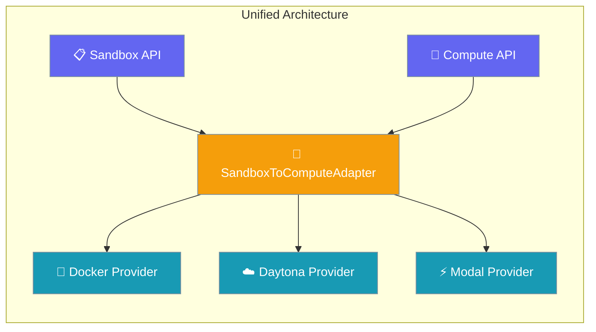
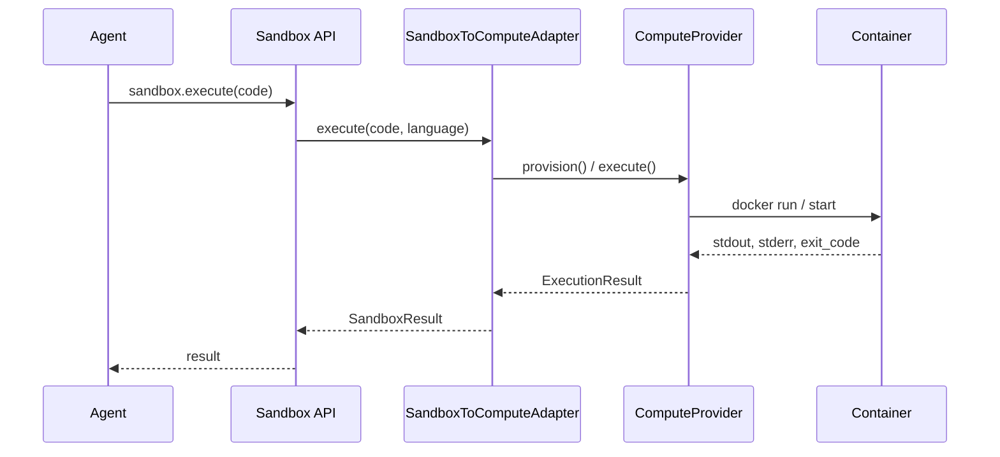
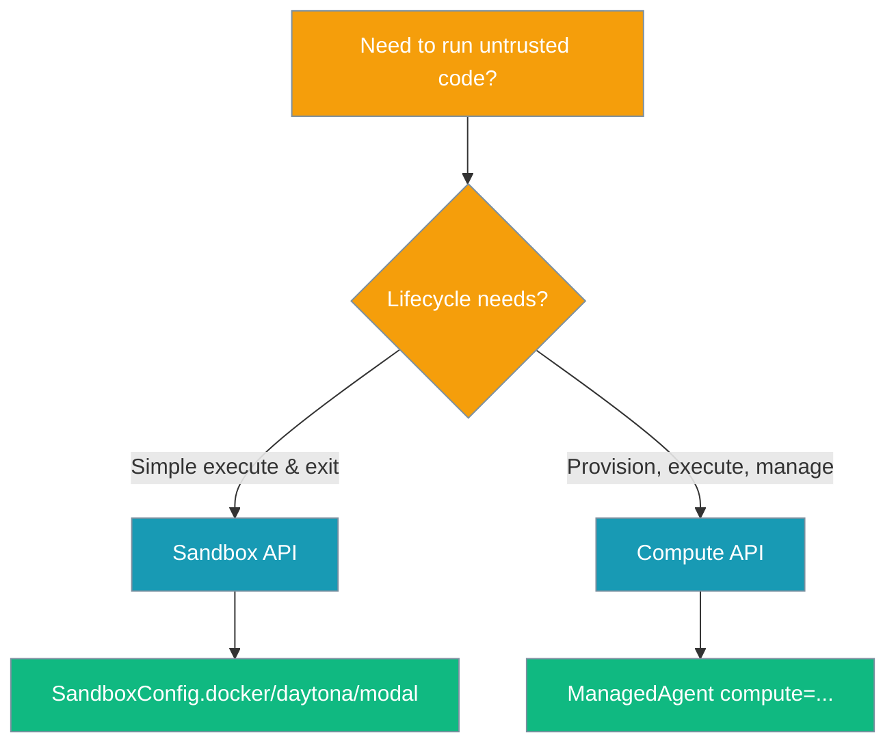

One implementation per backend; no duplicate provisioning logic. The `SandboxToComputeAdapter` provides unified access to compute providers through both legacy Sandbox and modern Compute APIs.



## Quick Start

<Steps>
<Step title="Use the Sandbox API (legacy-friendly)">

The Sandbox API maintains backward compatibility:

```python
from praisonaiagents import SandboxConfig

# Docker sandbox
sandbox = SandboxConfig.docker(image="python:3.11-slim")
await sandbox.start()

result = await sandbox.execute("print('Hello from Docker')")
print(result.stdout)  # "Hello from Docker"

await sandbox.stop()
```

</Step>

<Step title="Use the Compute API (managed agents)">

The Compute API provides modern managed agent functionality:

```python
from praisonaiagents import ManagedAgent

# Docker compute
agent = ManagedAgent(
    name="CodeAgent",
    compute="docker",
    instructions="Execute Python code safely"
)

result = agent.start("print('Hello from Compute')")
print(result)  # "Hello from Compute"
```

</Step>

<Step title="Both routes hit the same backend implementation">

Both APIs use the same underlying Docker/Daytona/Modal implementation through the adapter:

```python
# These both use the same DockerProvider internally
sandbox_result = await sandbox.execute("import sys; print(sys.version)")
compute_result = agent.start("import sys; print(sys.version)")

# Same container technology, different API surface
```

</Step>
</Steps>

---

## How It Works



The adapter layer ensures both APIs share the same backend:

| Component | Purpose | When Used |
|-----------|---------|-----------|
| `SandboxToComputeAdapter` | Protocol translation | Legacy Sandbox calls |
| `ComputeProvider` | Actual provisioning | Both Sandbox and Compute |
| `SandboxResult` | Legacy result format | Sandbox API responses |
| `ExecutionResult` | Modern result format | Compute API responses |

---

## Choosing an API



**Choose based on your lifecycle needs:**

- **Sandbox API**: "Just execute this code snippet safely"
- **Compute API**: "I need a managed environment for a long-lived agent"

Both use the same Docker/Daytona/Modal containers underneath.

---

## Configuration Options

<CardGroup cols={2}>
<Card title="Sandbox API" icon="terminal" href="/docs/features/sandbox">
  Legacy-friendly code execution API
</Card>
<Card title="Docker Compute" icon="docker" href="/docs/concepts/managed-agents-docker">
  Docker-based managed agents
</Card>
<Card title="Daytona Compute" icon="cloud" href="/docs/concepts/managed-agents-daytona">
  Cloud development environments
</Card>
<Card title="Modal Compute" icon="bolt" href="/docs/concepts/managed-agents-modal">
  Serverless compute platform
</Card>
</CardGroup>

---

## Best Practices

<AccordionGroup>

<Accordion title="Pick the API that matches your lifecycle, not the backend">

Both routes share one Docker/Daytona/Modal implementation:

```python
# ✅ Good - choose by lifecycle needs
if simple_execution:
    sandbox = SandboxConfig.docker()  # Quick execute & exit
else:
    agent = ManagedAgent(compute="docker")  # Long-lived environment

# ❌ Bad - choosing by backend preference
# There's no performance difference between APIs for the same backend
```

</Accordion>

<Accordion title="Don't import compute backends at module level">

Backends are lazy by design now:

```python
# ❌ Bad - eager import
from praisonaiagents.integrations.compute.docker import DockerProvider

# ✅ Good - lazy through adapter
sandbox = SandboxConfig.docker()  # Provider loaded on first use
```

</Accordion>

<Accordion title="Always shutdown/stop what you start">

The adapter doesn't auto-clean resources:

```python
# ✅ Good - explicit cleanup
sandbox = SandboxConfig.docker()
try:
    await sandbox.start()
    result = await sandbox.execute(code)
finally:
    await sandbox.stop()  # Always clean up

# ✅ Also good - context manager
async with SandboxConfig.docker() as sandbox:
    result = await sandbox.execute(code)  # Auto-cleanup
```

</Accordion>

</AccordionGroup>

---

## Related

<CardGroup cols={2}>
<Card title="Sandbox API" icon="terminal" href="/docs/features/sandbox">
  Sandbox API reference and examples
</Card>
<Card title="Framework Adapter Plugins" icon="plug" href="/docs/features/framework-adapter-plugins">
  Plugin authoring guide for custom frameworks
</Card>
</CardGroup>