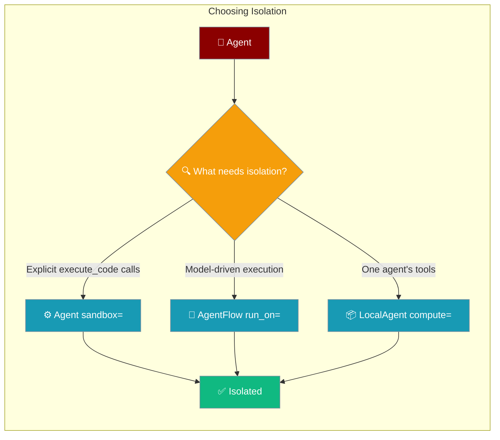

Each isolation surface in PraisonAI guarantees something different — this page states exactly what, so you never mistake a restriction flag for a real boundary.



## Quick Start

<Steps>

<Step title="Isolate an explicit execute_code() call">
`Agent(sandbox=…)` gives you the caller-invoked `execute_code()` API. It adds no tools and does not isolate `tools=` callables.

```python
from praisonaiagents import Agent

agent = Agent(name="Coder", instructions="Run Python.", sandbox=True)
result = agent.execute_code_sync("print(2 + 2)")
print(result.stdout)
```
</Step>

<Step title="Isolate everything the model runs">
`AgentFlow(run_on="docker")` puts every step's shell and file tools inside one shared container boundary, so model-driven tools route through the shared sandbox.

```python
from praisonaiagents import Agent, AgentFlow

flow = AgentFlow(
    agents=[Agent(name="Builder", instructions="Build and run code.")],
    run_on="docker",  # docker | e2b | modal | daytona | flyio | tenki | local
)
flow.start("Write a script that prints the first 10 primes, then run it")
```
</Step>

</Steps>

---

## Guarantee Matrix

Each surface below isolates a different thing — read the row before you rely on it.

| Surface | Isolates model-visible tools? | Isolates `tools=` callables? | Real container boundary? | Enforces `SecurityPolicy`? |
|---|---|---|---|---|
| `Agent(sandbox=True)` (default subprocess backend) | No — no tools auto-added | No | No (subprocess only) | Partial — `run_command()` only, not `execute()` |
| `Agent(sandbox=SandboxConfig(backend=...))` with real container backend | No — no tools auto-added | No | Yes (via configured backend) | Depends on backend |
| `Agent(sandbox=SandboxConfig.docker(...))` | No — no tools auto-added | No | Yes (container) | Command-level clauses (`blocked_commands`, `allowed_commands`, `blocked_paths`, `allowed_paths`, `max_output_size`) enforced on the host before dispatch ([PR #4303](https://github.com/MervinPraison/PraisonAI/pull/4303)). `allow_subprocess` is deliberately **not** enforced — the container is the boundary that clause approximates. |
| `Agent(sandbox=SandboxConfig.native())` (sandlock) | Isolates only explicit `execute_code()` | No | Yes — Landlock + seccomp-bpf, the only real **local** boundary | Kernel-enforced |
| `AgentFlow(run_on="docker" \| "e2b" \| ...)` | Yes — every step's shell/file tools route through the shared sandbox | No (callables stay in-process) | Yes | Depends on provider |
| `LocalAgent(compute="docker" \| "e2b" \| ...)` | Yes for that agent's shell/file tools | No | Yes | Depends on provider |
| `SandboxedAgent(compute=...)` | Yes | No | Yes | Depends on provider |
| Docker `write_file` / `read_file` | — | — | Yes — **symlink-race safe** via `open_in_sandbox()` (`O_NOFOLLOW` per component) | Mount cannot be redirected by a container-side symlink |

<Note>
With the docker backend, cross-command filesystem state **is** provided: `write_file()`, `run_command()`, and `execute()` share a `/sandbox` bind mount, so a file written by one is visible to the next. That mount does **not** expose the host filesystem (`ls /Users` fails), and code inside the container cannot swap a symlink into the mount to redirect the host's `write_file` / `read_file` — both open descriptor-relative with `O_NOFOLLOW` at every path component. `list_files()` never returns host paths — even on platforms where `TMPDIR` sits behind a symlink (macOS `/var → /private/var`).
</Note>

---

## Why `sandbox=` is not a capability grant

`Agent(sandbox=…)` is a **restriction flag**, not a way to hand the model an execution tool.

<Warning>
`Agent(sandbox=…)` does **not** add `execute_python_code` / `execute_shell_command` to `agent.tools` — that auto-injection was reverted in [PR #3976](https://github.com/MervinPraison/PraisonAI/pull/3976). Giving the model a sandboxed execution tool must be a deliberate act by the caller, the way `MCP()` is. No peer framework grants execution capability from a config flag.
</Warning>

<Warning>
The default **`subprocess`** backend enforces **none** of its own `SecurityPolicy` on its **`execute()`** path (this warning is scoped to that backend and that path):

- `allow_network=False` does not block outbound HTTPS.
- `blocked_paths=['~/.ssh', ...]` does not stop reading an SSH private key.
- `blocked_imports=['subprocess', ...]` does not stop `import subprocess`.
- A separate process is not a security boundary.

For real containment, use a real container backend (`docker` / `e2b`), `sandlock` for a kernel-enforced local boundary (Landlock + seccomp-bpf), or `AgentFlow(run_on=…)`.
</Warning>

<Note>
`DockerSandbox` is different — as of [PR #4303](https://github.com/MervinPraison/PraisonAI/pull/4303) it **does** enforce the command-level parts of `SecurityPolicy` on the host before Docker is invoked.

- **Enforced on docker:** `blocked_commands`, `allowed_commands`, `blocked_paths`, `allowed_paths` on every `run_command()`; `max_output_size` on both `run_command()` and `execute()`.
- **Not enforced on docker:** `allow_subprocess` — the container itself is the boundary that clause approximates on the host, so blocking `sh` inside the container would refuse every command rather than harden it.
- **Not a substitute for the container:** the container still bounds *where* code runs; policy enforcement is additional, not a replacement for the isolation boundary.

See [Docker SecurityPolicy enforcement](/features/sandbox-backends#docker-securitypolicy-enforcement).
</Note>

<Note>
`praisonai-sandbox` must be installed to run any sandbox backend — `pip install praisonaiagents` alone is not enough. Install a backend, e.g. `pip install "praisonai-sandbox[docker]"`.
</Note>

---

## Reliability: no leaked containers

Two guarantees close the container-leak story end to end — a timed-out execution and an exited `run_on=` script both leave **zero** running containers.

| Guarantee | How it is achieved |
|:--|:--|
| A timed-out docker execution leaves no running container | Every `docker run` is named `praisonai-<execution_id>`; on timeout the sandbox issues `docker kill <name>` before killing the client (PR [#4109](https://github.com/MervinPraison/PraisonAI/pull/4109)). |
| A `run_on=` instance is reclaimed at process exit | `ComputeManagedAgent` registers a `weakref.finalize` at provision that runs on GC **and** at interpreter exit (PR [#4109](https://github.com/MervinPraison/PraisonAI/pull/4109)); explicit `ashutdown()` detaches the finalizer to avoid double-release. |

Verified before/after:

| | Before | After |
|---|---|---|
| Containers after a timeout | 1 | **0** |
| Containers after a `run_on=` script exits | 1 | **0** |
| Ordinary run | 42 | 42 |

See [Reclaim Stray Sandboxes](/features/reclaim-stray-sandboxes) for the full mechanism and [Placement](/features/placement) for how the leaks fit the placement story.

---

## Common Patterns

<Tabs>
<Tab title="Explicit code execution">
```python
from praisonaiagents import Agent

agent = Agent(name="Analyst", instructions="Analyze data.", sandbox=True)
result = agent.execute_code_sync("import statistics; print(statistics.mean([1, 2, 3]))")
print(result.stdout)
```
</Tab>

<Tab title="Give the model a sandbox tool">
```python
from praisonaiagents import Agent

agent = Agent(name="Coder", instructions="Use run_code to answer.", sandbox=True)

def run_code(code: str) -> str:
    """Run Python in the agent's configured sandbox."""
    result = agent.execute_code_sync(code)
    return result.stdout or result.error or ""

agent.tools = [run_code]  # explicit, the way MCP() is
agent.start("Print the Python version")
```
</Tab>

<Tab title="Whole-workflow container">
```python
from praisonaiagents import Agent, AgentFlow

flow = AgentFlow(
    agents=[Agent(name="Builder", instructions="Build and run code.")],
    run_on="e2b",
)
flow.start("Create and run a script that lists installed packages")
```
</Tab>
</Tabs>

---

## Best Practices

<AccordionGroup>
  <Accordion title="Treat sandbox= as a restriction, not a grant">
    `Agent(sandbox=…)` configures the explicit `execute_code()` API. It never hands the model a tool — add one yourself only when you intend the model to run code.
  </Accordion>

  <Accordion title="Use a real container for untrusted or model-driven code">
    The default subprocess backend is for trusted development only. For untrusted or model-driven execution, use `AgentFlow(run_on="docker")`, `LocalAgent(compute="docker")`, or `sandlock` for a kernel-enforced local boundary.
  </Accordion>

  <Accordion title="Remember autonomy= injects a host tool">
    With `autonomy=True`, the agent still carries the host `execute_command` tool. `sandbox=` does not protect that path — isolate the whole workflow with `AgentFlow(run_on=…)` instead.
  </Accordion>

  <Accordion title="Install a sandbox backend first">
    `pip install praisonaiagents` cannot execute any sandbox. Install `praisonai-sandbox` with the backend you need before relying on isolation.
  </Accordion>
</AccordionGroup>

---

## Related

<CardGroup cols={2}>
  <Card title="Sandbox" icon="shield-halved" href="/features/sandbox">
    Configure the explicit `execute_code()` API and choose a backend
  </Card>
  <Card title="Shared Sandbox" icon="server" href="/features/shared-sandbox">
    Share one container across every agent with `run_on=`
  </Card>
</CardGroup>
