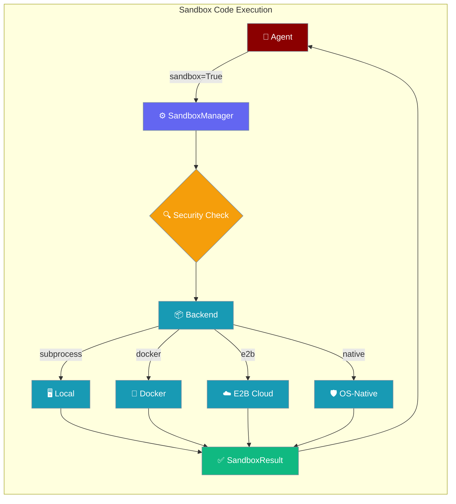
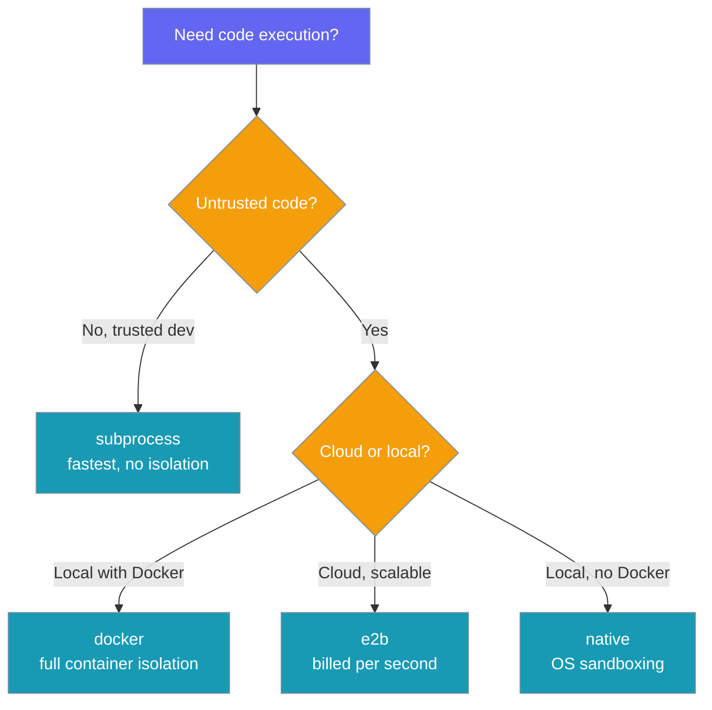
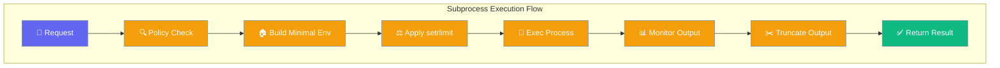
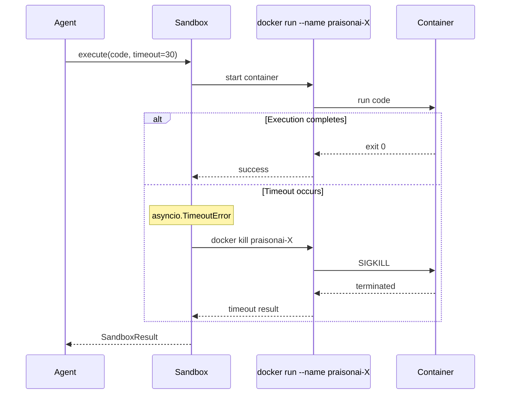

Sandbox provides secure, isolated environments for executing code generated by AI agents, protecting your system from potentially harmful operations.

```python
from praisonaiagents import Agent

agent = Agent(
    name="Coder",
    instructions="Write and execute Python code safely.",
    sandbox=True,
)
agent.start("Calculate fibonacci(10) and print the result")
```

<Note>
Need model-generated code to call your registered tools? See [Code Execution with Tools](./code-execution-with-tools). The subprocess sandbox backend cannot see the agent's tool registry, so the tool bridge runs in-process rather than in a subprocess sandbox.
</Note>

The user asks the agent to execute generated code; work stays inside an isolated sandbox instead of the host shell.



```mermaid
graph LR
    subgraph "Sandbox Code Execution"
        A[🤖 Agent] -->|sandbox=True| M[⚙️ SandboxManager]
        M --> S{🔍 Security Check}
        S --> B[📦 Backend]
        B -->|subprocess| L[🖥️ Local]
        B -->|docker| D[🐳 Docker]
        B -->|e2b| E[☁️ E2B Cloud]
        B -->|native| N[🛡️ OS-Native]
        L & D & E & N --> R[✅ SandboxResult]
        R --> A
    end

    classDef agent fill:#8B0000,stroke:#7C90A0,color:#fff
    classDef manager fill:#6366F1,stroke:#7C90A0,color:#fff
    classDef check fill:#F59E0B,stroke:#7C90A0,color:#fff
    classDef backend fill:#189AB4,stroke:#7C90A0,color:#fff
    classDef result fill:#10B981,stroke:#7C90A0,color:#fff

    class A agent
    class M manager
    class S check
    class B,L,D,E,N backend
    class R result
```

## Quick Start

<Steps>

<Step title="Simple Usage">
Enable sandbox with a single line - the easiest way to get started.

```python
from praisonaiagents import Agent

agent = Agent(
    name="Coder",
    instructions="Write and execute Python code safely.",
    sandbox=True  # one-line enable
)

agent.start("Calculate fibonacci(10) and print the result")
```
</Step>

<Step title="With Configuration">
Use factory methods for specific sandbox types.

```python
from praisonaiagents import Agent, SandboxConfig

agent = Agent(
    name="DataAnalyst",
    instructions="Analyze data with Python.",
    sandbox=SandboxConfig.docker("python:3.11-slim")
)

agent.start("Read CSV data and create a summary")
```
</Step>

<Step title="Full Configuration">
Complete control over sandbox settings.

```python
from praisonaiagents import Agent, SandboxConfig, ResourceLimits, SecurityPolicy

agent = Agent(
    name="SecureAgent",
    instructions="Execute code with strict security.",
    sandbox=SandboxConfig(
        sandbox_type="e2b",
        resource_limits=ResourceLimits(memory_mb=512, timeout_seconds=60),
        security_policy=SecurityPolicy.standard(),
    )
)

agent.start("Process sensitive data securely")
```
</Step>

</Steps>

---

## Agent Sandbox API

When `sandbox` is configured, agents gain powerful execution capabilities:

```python
import asyncio
from praisonaiagents import Agent

agent = Agent(
    name="DataAnalyst",
    instructions="Analyze data with Python.",
    sandbox=True,
)

# Async pattern
async def main():
    result = await agent.execute_code("""
import statistics
data = [1, 2, 3, 4, 5, 100]
print(f"Mean: {statistics.mean(data)}")
print(f"Median: {statistics.median(data)}")
""")
    print(result.stdout)
    print(f"Status: {result.status}, Exit: {result.exit_code}")

asyncio.run(main())

# Sync pattern (for non-async code)
result = agent.execute_code_sync("print(2 + 2)")
print(result.stdout)
```

### SandboxMixin API

| Method | Signature | Description |
|--------|-----------|-------------|
| `has_sandbox` | `property -> bool` | Whether sandbox is configured |
| `execute_code` | `async (code, language="python", check_security=True, **kwargs) -> SandboxResult` | Async code execution with optional security pre-check |
| `execute_code_sync` | `(code, language="python", check_security=True, **kwargs) -> SandboxResult` | Sync wrapper around `execute_code` |
| `run_shell_command` | `async (command: str \| list, check_security=True, **kwargs) -> SandboxResult` | Run shell command in sandbox |
| `get_sandbox_status` | `() -> Dict[str, Any]` | Returns `{"configured", "config", "available_types", "current_type"}` |
| `sandbox_cleanup` | `async () -> None` | Force cleanup of sandbox resources |
| `get_sandbox_manager` | `() -> SandboxManager \| None` | Get or lazily create the manager |

---

## Auto-Generated Agent Tools

When `sandbox` is set on an Agent, two tools are automatically available:

```python
from praisonaiagents import Agent

agent = Agent(
    name="ShellAgent",
    instructions="Use execute_python_code or execute_shell_command to answer questions.",
    sandbox=True,
)

agent.start("What's the current working directory and the first 5 files in it?")
# The agent will autonomously call execute_shell_command("pwd && ls | head -n 5")
```

**Available auto-generated tools:**
- `execute_python_code(code: str) -> str` — runs Python in the sandbox, returns stdout or error
- `execute_shell_command(command: str) -> str` — runs shell command in the sandbox, returns output or error

---

## Sandbox Backends

Choose the right backend for your security and performance needs:


```mermaid
graph TB
    Start[Need code execution?] --> Q1{Untrusted code?}
    Q1 -->|No, trusted dev| Sub[subprocess<br/>fastest, no isolation]
    Q1 -->|Yes| Q2{Cloud or local?}
    Q2 -->|Local with Docker| Doc[docker<br/>full container isolation]
    Q2 -->|Cloud, scalable| E2B[e2b<br/>billed per second]
    Q2 -->|Local, no Docker| Nat[native<br/>OS sandboxing]

    classDef question fill:#F59E0B,stroke:#7C90A0,color:#fff
    classDef choice fill:#189AB4,stroke:#7C90A0,color:#fff
    classDef start fill:#6366F1,stroke:#7C90A0,color:#fff

    class Start start
    class Q1,Q2 question
    class Sub,Doc,E2B,Nat choice
```

<Tabs>
<Tab title="Subprocess (Local)">
**Fastest, minimal isolation - development only**

```python
from praisonaiagents import SandboxConfig

config = SandboxConfig.subprocess()
agent = Agent(sandbox=config)
```

| Requirements | None (built-in) |
|--------------|------------------|
| **Use case** | Development, trusted code only |
| **Isolation** | ⚠️ Limited - NOT for untrusted code |
| **Performance** | ✅ Fastest |

<Warning>
- **POSIX (Linux/macOS)**: Subprocess now blocks host env leakage, enforces `memory_mb`/`max_processes`/`max_open_files` via `setrlimit`, truncates output at `max_output_size`, and terminates the whole process group on timeout.
- **Windows**: Still weaker — `setrlimit` and process-group kill are unavailable; the sandbox warns at runtime.
- **Untrusted code**: Remains a Docker/E2B job, but the gap is now smaller.
</Warning>
</Tab>

<Tab title="Docker">
**Full container isolation - recommended for production**

```python
from praisonaiagents import SandboxConfig

config = SandboxConfig.docker("python:3.11-slim")
agent = Agent(sandbox=config)
```

| Requirements | Docker daemon + `pip install praisonaiagents[sandbox-docker]` |
|--------------|----------------------------------------------------------------|
| **Use case** | Production, untrusted code, full isolation |
| **Isolation** | ✅ Complete container isolation |
| **Performance** | Good |
</Tab>

<Tab title="E2B Cloud">
**Scalable cloud VMs with full filesystem access**

```python
import os
from praisonaiagents import SandboxConfig

os.environ.setdefault("E2B_API_KEY", os.getenv("E2B_API_KEY", ""))
config = SandboxConfig.e2b()
agent = Agent(sandbox=config)
```

| Requirements | `E2B_API_KEY` + `pip install praisonaiagents[sandbox] e2b-code-interpreter` |
|--------------|---------------------------------------------------------------------------|
| **Use case** | Cloud, scalable, full filesystem + shell |
| **Isolation** | ✅ Cloud VM isolation |
| **Performance** | Good (network dependent) |
</Tab>

<Tab title="Native OS">
**OS-level sandboxing without Docker**

```python
from praisonaiagents import SandboxConfig

config = SandboxConfig.native(
    writable_paths=["./src", "./tests"],
    network=False,
)
agent = Agent(sandbox=config)
```

| Requirements | macOS (Seatbelt) or Linux (Landlock + bubblewrap) |
|--------------|----------------------------------------------------|
| **Use case** | OS-native isolation without Docker |
| **Isolation** | ✅ OS-level sandboxing |
| **Performance** | Good |

**Native sandbox parameters:**

| Param | Type | Default | Description |
|-------|------|---------|-------------|
| `writable_paths` | `List[str]` | `[os.getcwd()]` | Directories the agent may write to |
| `network` | `bool` | `False` | Whether to allow network access |
</Tab>

<Tab title="Sandlock">
**Kernel-level Landlock + seccomp isolation — strongest local sandbox**

```python
from praisonai.sandbox import SandlockSandbox
from praisonaiagents import SandboxConfig

config = SandboxConfig(sandbox_type="sandlock")
```

| Requirements | `pip install 'praisonai[sandbox]'` or `pip install sandlock` + **Linux ≥ 6.12**, `CONFIG_SECURITY_LANDLOCK=y`, seccomp not stripped |
|--------------|--------------------------------------------------------------------------------------------------------------------------------------|
| **Use case** | OS-native high-security isolation without Docker |
| **Isolation** | ✅ Kernel-enforced Landlock + seccomp-bpf |
| **Performance** | ~5ms overhead, no root required |

<Warning>
**Breaking change (PR #1367):** `SandlockSandbox.__init__` now raises `RuntimeError` when the system's Landlock ABI is below the minimum required (currently ABI v6, Linux ≥ 6.12 with `CONFIG_SECURITY_LANDLOCK=y`). Previously it silently fell back to `SubprocessSandbox`. Containers that strip seccomp or run on older kernels will now fail loudly at startup.

Use the graceful-degradation pattern if you need to support older kernels:

```python
from praisonai.sandbox import SandlockSandbox, SubprocessSandbox

try:
    sb = SandlockSandbox(cfg)
except (ImportError, RuntimeError):
    sb = SubprocessSandbox(cfg)
```
</Warning>

**Other behaviour changes in PR #1367:**

| Change | Detail |
|--------|--------|
| `clean_env=True` default | Host environment variables are isolated from the child process |
| `stdout`/`stderr` type | Decoded to `str` (previously returned raw `bytes`) |
| `max_cpu` from `limits.cpu_percent` | Now applied via `RLIMIT_CPU` (was accepted but ignored) |
| Timeout detection | `exit_code == -1` is sandlock's structural timeout sentinel |
| Network policy (enabled) | `net_connect=["0-65535"]` — all ports allowed when network is on |
| Network policy (disabled) | `net_allow_hosts=[]` — no hosts allowed when network is off |
| `execute_file()` | Invokes script by path, not `-c <slurped source>` |
</Tab>

<Tab title="SSH Remote">
**Execute on remote servers via SSH**

```python
# Requires: pip install paramiko
config = SandboxConfig(sandbox_type="ssh")
```

| Requirements | `pip install paramiko` + SSH access |
|--------------|-------------------------------------|
| **Use case** | Remote SSH execution |
| **Isolation** | Depends on remote system |
</Tab>

<Tab title="Modal Cloud">
**Modal cloud compute platform**

```python
# Requires: pip install modal
config = SandboxConfig(sandbox_type="modal")
```

| Requirements | `pip install modal` + Modal account |
|--------------|-------------------------------------|
| **Use case** | Modal cloud compute |
| **Isolation** | ✅ Cloud isolation |
</Tab>

<Tab title="Daytona">
**Daytona development workspaces**

<Warning>
**Not yet implemented (PR #2122):** `DaytonaSandbox.is_available` returns `False` and `DaytonaSandbox.start()` raises `NotImplementedError`: *"Daytona backend not yet implemented. Use 'subprocess', 'docker', or 'e2b' sandbox instead."*
</Warning>

Use `subprocess`, `docker`, or `e2b` instead.
</Tab>

<Tab title="Capsule (Plugin)">
**Plugin-provided secure sandbox — installed via praisonai-plugins**

```python
from praisonaiagents import SandboxConfig

config = SandboxConfig.capsule()   # security_policy=strict() applied automatically
agent = Agent(sandbox=config)
```

| Requirements | `pip install "praisonai-plugins[capsule]"` |
|--------------|---------------------------------------------|
| **Use case** | Plugin-registered secure sandbox backend |
| **Isolation** | ✅ Provided by plugin backend |
| **Security policy** | `SecurityPolicy.strict()` is applied automatically |

<Note>
`capsule` is registered by an external plugin under the `praisonai.sandbox` entry-point group. If the plugin is not installed, `SandboxManager` raises:
`ValueError: Unknown sandbox type: 'capsule'. Available: [...]`
</Note>
</Tab>
</Tabs>

<Note>
**Zero import cost when unused.** The sandbox subsystem — including `SandboxConfig`, `SandboxManager`, security checks, and all backends — is lazy-loaded. `from praisonaiagents import Agent` does not load any sandbox module. Sandbox modules are only imported the first time you set `sandbox=True` (or pass a `SandboxConfig`) on an `Agent`, or call a sandbox method. This keeps the default `import Agent` path light for agents that never execute code.
</Note>

---

## What SecurityPolicy actually controls in subprocess

| Setting | Effect on subprocess child |
|---------|----------------------------|
| `allow_network=False` | Strips `HTTP_PROXY` / `HTTPS_PROXY` / `NO_PROXY` from child env |
| `allow_network=True` | Passes proxy vars through from host |
| `max_output_size` | Truncates stdout/stderr; appends `[OUTPUT TRUNCATED]` |
| `allow_file_write` | Controls file write permissions (implementation varies by backend) |
| `allow_subprocess` | Controls subprocess creation (implementation varies by backend) |
| `blocked_paths` | Prevents access to specified paths |
| `blocked_commands` | Blocks execution of specified shell commands |
| `blocked_imports` | Prevents importing specified Python modules |

---

## Resource limits in practice

<Tabs>
<Tab title="Linux / macOS">
POSIX `setrlimit` mapping enforces hard limits:

```python
from praisonaiagents import ResourceLimits

limits = ResourceLimits(
    memory_mb=512,        # → RLIMIT_AS 
    max_processes=10,     # → RLIMIT_NPROC
    max_open_files=50,    # → RLIMIT_NOFILE
    timeout_seconds=30    # Wall clock timeout (separate)
)
```

When limits are exceeded:
- Memory: Process is killed by the kernel 
- Processes: `fork()` fails with EAGAIN
- Files: `open()` fails with EMFILE
- Timeout: Whole process group killed with SIGKILL

</Tab>
<Tab title="Windows">
Resource limits are not available on Windows. The subprocess warns at runtime:

```
WARNING: Resource limits not supported on Windows - sandbox isolation is weaker
```

Only timeout handling works:
- Timeout: Process leader is killed (not process group)
- Memory/processes/files: No enforcement

For Windows users requiring resource limits, use Docker backend instead.
</Tab>
</Tabs>

---

## Timeout handling

```mermaid
graph TB
    subgraph "Timeout Response"
        A[⏰ Timeout Triggered] --> B{🖥️ OS?}
        B -->|POSIX| C[💀 killpg(SIGKILL)]
        B -->|Windows| D[💀 proc.kill()]
        C --> E[🧹 Process Group Dead]
        D --> F[⚠️ Leader Only Dead]
    end
    
    classDef timeout fill:#F59E0B,stroke:#7C90A0,color:#fff
    classDef decision fill:#6366F1,stroke:#7C90A0,color:#fff
    classDef result fill:#8B0000,stroke:#7C90A0,color:#fff
    
    class A timeout
    class B decision
    class C,D,E,F result
```

On POSIX the whole process group is killed (`killpg(SIGKILL)`); on Windows only the leader is killed.

---

## Subprocess execution flow


```mermaid
graph TB
    subgraph "Subprocess Execution Flow"
        A[📨 Request] --> B[🔍 Policy Check]
        B --> C[🏠 Build Minimal Env]
        C --> D[⚖️ Apply setrlimit]
        D --> E[🚀 Exec Process]
        E --> F[📊 Monitor Output]
        F --> G[✂️ Truncate Output]
        G --> H[✅ Return Result]
    end
    
    classDef request fill:#6366F1,stroke:#7C90A0,color:#fff
    classDef process fill:#F59E0B,stroke:#7C90A0,color:#fff
    classDef result fill:#10B981,stroke:#7C90A0,color:#fff
    
    class A request
    class B,C,D,E,F,G process
    class H result
```

---

## Security Pre-checks

Static code analysis warns about potentially dangerous patterns before execution:

```python
from praisonaiagents.sandbox import check_code_safety, format_warnings

code = """
import os
os.system("rm -rf /tmp/test")
"""

warnings = check_code_safety(code, language="python")
print(format_warnings(warnings))
# Security analysis found 1 potential issue(s):
# HIGH RISK:
#   - Direct system command execution (line 3)
#     Context: os.system("rm -rf /tmp/test")
# Note: These are warnings only. The sandbox provides real isolation.
```

### Security API

```python
from praisonaiagents.sandbox import (
    check_code_safety,
    format_warnings,
    get_security_summary,
    SecurityWarning,
)
```

| Function | Signature | Description |
|----------|-----------|-------------|
| `check_code_safety` | `(code: str, language: str = "python") -> List[SecurityWarning]` | Runs regex + AST analysis. Supports `python`, `bash`, generic fallback |
| `format_warnings` | `(warnings: List[SecurityWarning]) -> str` | Pretty-print warnings grouped by severity |
| `get_security_summary` | `(warnings) -> Dict` | Returns `{"total_warnings", "by_severity", "max_severity", "is_safe", "has_critical"}` |

**SecurityWarning fields:**

| Field | Type | Description |
|-------|------|-------------|
| `pattern` | `str` | Regex pattern or AST node that triggered |
| `message` | `str` | Human-readable warning |
| `severity` | `str` | `"low"`, `"medium"`, `"high"`, `"critical"` |
| `line_number` | `Optional[int]` | Line number in code |
| `context` | `Optional[str]` | Source line text |

<Warning>
Security pre-checks do not block execution - they provide warnings only. The sandbox provides the real isolation.
</Warning>

### Agent Integration

Agents automatically run security checks unless disabled:

```python
result = await agent.execute_code(
    code="import os; os.system('ls')",
    check_security=True,  # default
)
# Warnings are stored in result.metadata["security_warnings"]
```

### Path Traversal Protection

`DockerSandbox` and `SubprocessSandbox` validate every path passed to
`write_file`, `read_file`, and `list_files`. Paths that resolve outside
the sandbox root — via `../`, absolute paths, or symlink escapes — are
rejected:

```python
# Inside an agent's sandbox
sandbox.write_file("../../../etc/passwd", "x")   # returns False, logs warning
sandbox.read_file("/etc/shadow")                  # returns None
sandbox.list_files("../..")                       # returns []
```

Blocked attempts are logged as
`Path traversal attempt blocked: <path>`. This is in addition to the
container/OS isolation the sandbox already provides — defense in depth.

---

## SandboxManager

Factory and async context manager for sandbox backends:

```python
from praisonaiagents.sandbox import SandboxManager, SandboxConfig

# Convenience: one-shot run
config = SandboxConfig.docker("python:3.11-slim")
manager = SandboxManager(config)
result = await manager.run_code("print('Hello, World!')")

# Context manager: reuse one sandbox for multiple executions
async with SandboxManager(config) as sandbox:
    r1 = await sandbox.execute("x = 5")
    r2 = await sandbox.execute("print(x * 2)")  # persistence depends on backend
```

### SandboxManager API

| Method | Description |
|--------|-------------|
| `__init__(config: SandboxConfig \| None)` | Defaults to `SandboxConfig.subprocess()` |
| `run_code(code, language="python", **kwargs) -> SandboxResult` | One-shot: open, run, cleanup |
| `__aenter__ / __aexit__` | Async context manager yielding `SandboxProtocol` |
| `get_available_types() -> Dict[str, Dict]` | Returns availability info per backend |

---

## Configuration Options

Progressive disclosure from simple to advanced:

```python
from praisonaiagents import Agent, SandboxConfig, ResourceLimits, SecurityPolicy

# Level 1: Bool (simplest)
agent = Agent(sandbox=True)

# Level 2: Factory shortcut
agent = Agent(sandbox=SandboxConfig.docker("python:3.11-slim"))

# Level 3: Full config
agent = Agent(
    sandbox=SandboxConfig(
        sandbox_type="e2b",
        resource_limits=ResourceLimits(memory_mb=512, timeout_seconds=60),
        security_policy=SecurityPolicy.standard(),
    )
)
```

### Factory Shortcuts

| Factory | What it does |
|---------|--------------|
| `SandboxConfig.subprocess()` | Local subprocess backend (default) |
| `SandboxConfig.docker(image="python:3.11-slim")` | Docker container backend |
| `SandboxConfig.e2b()` | E2B cloud sandbox |
| `SandboxConfig.native(writable_paths=None, network=False)` | OS-native sandbox (Seatbelt / Landlock+bwrap) |
| `SandboxConfig.capsule()` | Plugin-provided Capsule sandbox — applies `SecurityPolicy.strict()` automatically |

### SandboxConfig Options

| Option | Type | Default | Description |
|--------|------|---------|-------------|
| `sandbox_type` | `str` | `"subprocess"` | Backend: subprocess, docker, e2b, native, sandlock, ssh, modal (`daytona` not yet implemented). Additional names (e.g. `capsule`) can be provided by plugins registered under the `praisonai.sandbox` entry-point group. |
| `image` | `str` | `"python:3.11-slim"` | Docker image (docker backend only) |
| `working_dir` | `str` | `"/workspace"` | Working directory within sandbox |
| `env` | `Dict[str, str]` | `{}` | Environment variables |
| `resource_limits` | `ResourceLimits` | `ResourceLimits()` | CPU, memory, timeout limits |
| `security_policy` | `SecurityPolicy` | `SecurityPolicy()` | File and network access rules |
| `auto_cleanup` | `bool` | `True` | Auto-cleanup after execution |
| `persist_files` | `bool` | `False` | Keep files between runs |
| `mount_paths` | `List[str]` | `[]` | Paths to mount (host:container format) |
| `metadata` | `Dict[str, Any]` | `{}` | Additional configuration |

### ResourceLimits Presets

```python
from praisonaiagents import ResourceLimits

# Minimal limits for untrusted code
limits = ResourceLimits.minimal()  # 128MB, 30s, no network

# Standard limits  
limits = ResourceLimits.standard()  # 512MB, 60s

# Generous limits for trusted code
limits = ResourceLimits.generous()  # 2GB, 300s, network allowed
```

| Limit | Minimal | Standard | Generous |
|-------|---------|----------|----------|
| `memory_mb` | 128 | 512 | 2048 |
| `timeout_seconds` | 30 | 60 | 300 |
| `cpu_percent` | 50 | 100 | 100 |
| `network_enabled` | ❌ | ❌ | ✅ |

### SecurityPolicy Presets

```python
from praisonaiagents import SecurityPolicy

# Strict policy for untrusted code
policy = SecurityPolicy.strict()

# Standard policy
policy = SecurityPolicy.standard()

# Permissive policy (trusted code only)
policy = SecurityPolicy.permissive()

# Custom policy
policy = SecurityPolicy(
    allow_network=False,
    allow_file_write=True,
    allow_subprocess=False,
    blocked_paths=["/etc", "~/.ssh"],
    blocked_imports=["subprocess", "os.system"]
)
```

---

## Common Patterns

<Tabs>
<Tab title="Data Science Agent">
```python
from praisonaiagents import Agent, SandboxConfig, ResourceLimits

agent = Agent(
    name="DataScientist",
    instructions="Analyze data and create visualizations.",
    sandbox=SandboxConfig(
        sandbox_type="docker",
        image="python:3.11-slim",
        resource_limits=ResourceLimits.generous(),  # Need memory for data
        mount_paths=["./data:/workspace/data:ro"],   # Mount data read-only
    )
)

agent.start("Load the CSV file and show descriptive statistics")
```
</Tab>

<Tab title="Secure Code Review">
```python
from praisonaiagents import Agent, SandboxConfig, SecurityPolicy

agent = Agent(
    name="SecurityReviewer", 
    instructions="Review code for security issues.",
    sandbox=SandboxConfig(
        sandbox_type="e2b",
        security_policy=SecurityPolicy.strict(),  # Maximum security
    )
)

agent.start("Analyze this code for potential vulnerabilities")
```
</Tab>

<Tab title="Batch Processing">
```python
from praisonaiagents.sandbox import SandboxManager, SandboxConfig

config = SandboxConfig(
    sandbox_type="docker",
    persist_files=True,    # Keep files between runs
    auto_cleanup=False     # Manual cleanup
)

# Process multiple files using same sandbox
async with SandboxManager(config) as sandbox:
    for file in files:
        result = await sandbox.execute(f"process_file('{file}')")
        print(result.stdout)
```
</Tab>
</Tabs>

---

## Timeout Behavior & Resource Cleanup

Understanding how different backends handle timeouts and resource cleanup ensures your resource limits are properly enforced.

| Backend | Local cleanup on timeout | Remote cleanup on timeout |
|---|---|---|
| `subprocess` | Process killed | N/A |
| `docker` | Client process killed **and** `docker kill <container>` issued on the named container (`praisonai-<execution_id>`) | Container stopped — resource limits enforced |
| `ssh` | Local SSH client killed | Remote process terminated via `timeout N sh -c ...` wrapper; remote temp file cleaned up via `finally` (even on error) |
| `e2b`, `modal`, `native`, `sandlock`, `daytona` | Backend-managed | Backend-managed |

### Docker Timeout Handling

Docker containers get deterministic names and are properly killed on timeout:


```mermaid
sequenceDiagram
    participant Agent
    participant Sandbox
    participant Docker as docker run --name praisonai-X
    participant Container
    
    Agent->>Sandbox: execute(code, timeout=30)
    Sandbox->>Docker: start container
    Docker->>Container: run code
    
    alt Execution completes
        Container-->>Docker: exit 0
        Docker-->>Sandbox: success
    else Timeout occurs
        Note over Sandbox: asyncio.TimeoutError
        Sandbox->>Docker: docker kill praisonai-X
        Docker->>Container: SIGKILL
        Container-->>Docker: terminated
        Docker-->>Sandbox: timeout result
    end
    
    Sandbox-->>Agent: SandboxResult
```

**Why containers are no longer orphaned:** Every `docker run` is launched with `--name praisonai-<execution_id>`. On timeout, the sandbox issues `docker kill <name>` to stop the actual container — not just detach the client. Your `memory_mb` and `cpu_percent` limits are now enforced through the entire execution lifecycle.

### SSH Timeout Handling

SSH backend prevents both remote process leaks and temp file accumulation:

**Remote process cleanup:** Commands are wrapped with `timeout N sh -c ...` to ensure remote processes terminate even if the SSH connection drops.

**Temp file cleanup:** File cleanup (`rm -f`) is now in a `finally` block. Even if execution raises (timeout, network blip), the remote temp file is removed. Cleanup errors are swallowed so they never mask the real execution result.

---

## Best Practices

<AccordionGroup>
  <Accordion title="Use Docker for untrusted code">
    Always use Docker sandbox when executing code from untrusted sources. Subprocess isolation is not sufficient for security-critical applications.
  </Accordion>
  
  <Accordion title="Enable security pre-checks">
    Keep `check_security=True` (default) when calling `execute_code()`. Review warnings in `result.metadata["security_warnings"]` for insights.
  </Accordion>
  
  <Accordion title="Set appropriate resource limits">
    Configure memory and timeout limits based on expected workload. Start with minimal limits and increase as needed.
  </Accordion>
  
  <Accordion title="Disable network by default">
    Keep `allow_network=False` unless code specifically needs network access. This prevents data exfiltration.
  </Accordion>

  <Accordion title="Use context managers for persistence">
    For multiple operations on the same sandbox, use `async with SandboxManager(config) as sandbox:` to reuse the environment efficiently.
  </Accordion>

  <Accordion title="File system boundaries are enforced">
    Filesystem boundaries are enforced — write_file/read_file/list_files reject paths that escape the sandbox root, even before the backend's isolation kicks in.
  </Accordion>
</AccordionGroup>

---

## Related

<CardGroup cols={2}>
  <Card title="Sandboxed Agent" icon="shield-check" href="/docs/features/sandboxed-agent">
    Complete agent with built-in sandbox
  </Card>
  <Card title="Sandbox Backends" icon="server" href="/docs/features/sandbox-backends">
    Shell control and backend selection
  </Card>
</CardGroup>