Sandbox provides secure, isolated environments for executing code generated by AI agents, protecting your system from potentially harmful operations.

```mermaid
graph LR
    subgraph "Sandbox Execution"
        A[🤖 Agent] --> S[🔒 Sandbox]
        S --> C[📦 Container]
        C --> R[✅ Result]
    end
    
    classDef agent fill:#8B0000,stroke:#7C90A0,color:#fff
    classDef sandbox fill:#F59E0B,stroke:#7C90A0,color:#fff
    classDef container fill:#189AB4,stroke:#7C90A0,color:#fff
    classDef result fill:#10B981,stroke:#7C90A0,color:#fff
    
    class A agent
    class S sandbox
    class C container
    class R result
```



## Quick Start

<Steps>

<Step title="Configure Sandbox">
```python
from praisonaiagents import SandboxConfig, ResourceLimits

config = SandboxConfig(
    sandbox_type="subprocess",
    resource_limits=ResourceLimits(
        memory_mb=256,
        timeout_seconds=30
    )
)
```
</Step>

<Step title="Execute Code via CLI">
```bash
# Run Python code
praisonai sandbox run "print('Hello, World!')"

# Run with timeout
praisonai sandbox run --timeout 10 "import time; time.sleep(5)"
```
</Step>

<Step title="Check Result">
```python
from praisonaiagents import SandboxResult, SandboxStatus

# Result contains status, output, and errors
if result.status == SandboxStatus.COMPLETED:
    print(result.stdout)
else:
    print(f"Error: {result.error}")
```
</Step>

</Steps>

---

## How It Works


| Component | Role |
|-----------|------|
| **Sandbox** | Manages isolation and resource limits |
| **Container** | Isolated execution environment |
| **ResourceLimits** | CPU, memory, and time constraints |
| **SecurityPolicy** | File and network access rules |

---

## Sandbox Types

<Tabs>
<Tab title="Subprocess">
Lightweight isolation using OS-level restrictions.

```python
from praisonaiagents import SandboxConfig

config = SandboxConfig.subprocess()
```

**Best for:** Quick execution, development, trusted code
</Tab>

<Tab title="Docker">
Full container isolation with Docker.

```python
from praisonaiagents import SandboxConfig

config = SandboxConfig.docker(image="python:3.11-slim")
```

**Best for:** Production, untrusted code, full isolation
</Tab>

<Tab title="E2B">
Cloud-based sandbox using E2B service.

```python
from praisonaiagents import SandboxConfig

config = SandboxConfig.e2b()
```

**Best for:** Serverless, scalable execution
</Tab>
</Tabs>

---

## Configuration Options

```python
from praisonaiagents import SandboxConfig, ResourceLimits, SecurityPolicy

config = SandboxConfig(
    sandbox_type="docker",
    image="python:3.11-slim",
    working_dir="/workspace",
    resource_limits=ResourceLimits(
        memory_mb=512,
        cpu_percent=50,
        timeout_seconds=60,
        network_enabled=False
    ),
    security_policy=SecurityPolicy(
        allow_network=False,
        allow_file_write=True,
        allow_subprocess=False
    ),
    auto_cleanup=True
)
```

| Option | Type | Default | Description |
|--------|------|---------|-------------|
| `sandbox_type` | `str` | `"subprocess"` | Type: subprocess, docker, e2b |
| `image` | `str` | `"python:3.11-slim"` | Docker image |
| `working_dir` | `str` | `"/workspace"` | Working directory |
| `auto_cleanup` | `bool` | `True` | Auto-cleanup after execution |
| `persist_files` | `bool` | `False` | Keep files between runs |

---

## Resource Limits

Control resource usage to prevent abuse:

```python
from praisonaiagents import ResourceLimits

# Minimal limits for untrusted code
limits = ResourceLimits.minimal()  # 128MB, 30s, no network

# Standard limits
limits = ResourceLimits.standard()  # 512MB, 60s

# Generous limits for trusted code
limits = ResourceLimits.generous()  # 2GB, 300s, network allowed
```

| Limit | Minimal | Standard | Generous |
|-------|---------|----------|----------|
| `memory_mb` | 128 | 512 | 2048 |
| `timeout_seconds` | 30 | 60 | 300 |
| `cpu_percent` | 50 | 100 | 100 |
| `network_enabled` | ❌ | ❌ | ✅ |

---

## Security Policy

Fine-grained security controls:

```python
from praisonaiagents import SecurityPolicy

# Strict policy
policy = SecurityPolicy.strict()

# Standard policy
policy = SecurityPolicy.standard()

# Permissive policy (trusted code only)
policy = SecurityPolicy.permissive()

# Custom policy
policy = SecurityPolicy(
    allow_network=False,
    allow_file_write=True,
    allow_subprocess=False,
    blocked_paths=["/etc", "~/.ssh"],
    blocked_imports=["subprocess", "os.system"]
)
```

---

## Result Handling

```python
from praisonaiagents import SandboxResult, SandboxStatus

result = await sandbox.execute("print('Hello')")

# Check status
if result.status == SandboxStatus.COMPLETED:
    print(f"Output: {result.stdout}")
elif result.status == SandboxStatus.TIMEOUT:
    print("Execution timed out")
elif result.status == SandboxStatus.FAILED:
    print(f"Error: {result.stderr}")
elif result.status == SandboxStatus.KILLED:
    print("Process was killed (resource limit)")

# Access details
print(f"Exit code: {result.exit_code}")
print(f"Duration: {result.duration_seconds}s")
```

---

## CLI Commands

```bash
# Run code
praisonai sandbox run "print('Hello')"

# Run with file
praisonai sandbox run --file script.py

# Interactive shell
praisonai sandbox shell

# With resource limits
praisonai sandbox run --memory 256 --timeout 30 "code"

# Using Docker
praisonai sandbox run --type docker --image python:3.11 "code"

# Check status
praisonai sandbox status
```

---

## Common Patterns

<Tabs>
<Tab title="Code Agent">
```python
from praisonaiagents import Agent, SandboxConfig

agent = Agent(
    name="coder",
    instructions="Write and execute Python code",
    sandbox=SandboxConfig(
        sandbox_type="docker",
        resource_limits=ResourceLimits.standard()
    )
)
```
</Tab>

<Tab title="Data Analysis">
```python
from praisonaiagents import SandboxConfig

config = SandboxConfig.docker(
    image="python:3.11-slim"
)
config.env = {"PYTHONPATH": "/workspace"}
config.mount_paths = ["./data:/workspace/data:ro"]
```
</Tab>

<Tab title="Batch Execution">
```python
from praisonaiagents import SandboxConfig

config = SandboxConfig(
    sandbox_type="subprocess",
    persist_files=True,  # Keep files between runs
    auto_cleanup=False   # Manual cleanup
)
```
</Tab>
</Tabs>

---

## Best Practices

<AccordionGroup>
  <Accordion title="Use Docker for untrusted code">
    Always use Docker sandbox when executing code from untrusted sources. Subprocess isolation is not sufficient for security-critical applications.
  </Accordion>
  
  <Accordion title="Set appropriate resource limits">
    Configure memory and timeout limits based on expected workload. Start with minimal limits and increase as needed.
  </Accordion>
  
  <Accordion title="Disable network by default">
    Keep `network_enabled=False` unless the code specifically needs network access. This prevents data exfiltration.
  </Accordion>
  
  <Accordion title="Review blocked paths and imports">
    Customize `blocked_paths` and `blocked_imports` in SecurityPolicy to prevent access to sensitive system resources.
  </Accordion>
</AccordionGroup>

---

## Related

<CardGroup cols={2}>
  <Card title="Code Agent" icon="code" href="/features/codeagent">
    AI-powered code generation
  </Card>
  <Card title="Tools" icon="wrench" href="/concepts/tools">
    Extend agent capabilities
  </Card>
</CardGroup>
