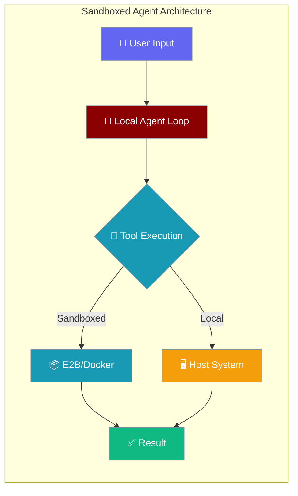
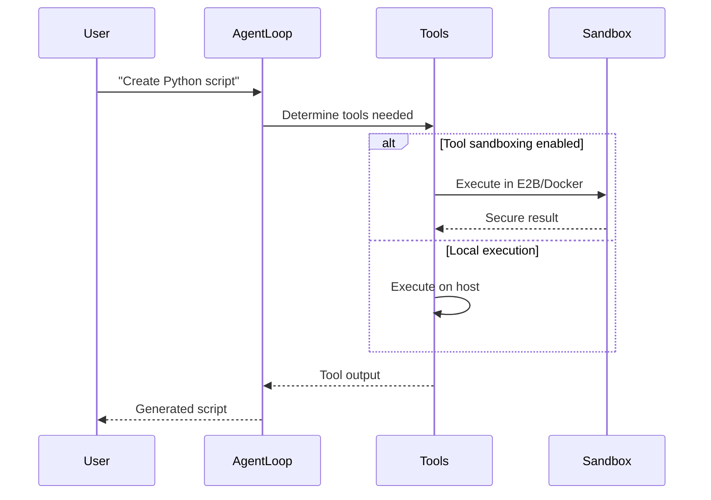

Sandboxed agents keep the agent loop local while optionally running tools in secure sandboxes.



## Quick Start

<Steps>
<Step title="Basic Usage">
Local loop, local tools - simplest configuration.

```python
from praisonai import SandboxedAgent, SandboxedAgentConfig
from praisonaiagents import Agent

sandboxed = SandboxedAgent(
    config=SandboxedAgentConfig(
        model="gpt-4o",
        system="You are a coding assistant.",
    )
)

agent = Agent(name="coder", backend=sandboxed)
result = agent.start("Create a Python script that prints hello")
```
</Step>

<Step title="With Tool Sandboxing">
Local loop, tools run in E2B sandbox for security.

```python
from praisonai import SandboxedAgent, SandboxedAgentConfig

sandboxed = SandboxedAgent(
    compute="e2b",  # Tools run in E2B, loop stays local
    config=SandboxedAgentConfig(
        model="gpt-4o",
        system="You are a coding assistant.",
        tools=["execute_command", "read_file", "write_file"],
        packages={"pip": ["pandas", "numpy"]},
    )
)

agent = Agent(name="secure_coder", backend=sandboxed)
result = agent.start("Analyze CSV data with pandas")
```
</Step>
</Steps>

---

## How It Works



| Component | Location | Purpose |
|-----------|----------|---------|
| **Agent Loop** | Local | LLM calls, decision making, memory |
| **Tool Execution** | Local or Sandbox | Code execution, file operations |
| **Memory & State** | Local | Session persistence, context |

---

## Configuration Options

<Card title="SandboxedAgentConfig Reference" icon="code" href="/docs/sdk/reference/typescript/classes/SandboxedAgentConfig">
  Full configuration options for sandboxed agents
</Card>

### Essential Configuration

| Option | Type | Default | Description |
|--------|------|---------|-------------|
| `model` | `str` | `"gpt-4o"` | LLM model to use |
| `system` | `str` | `"You are a helpful coding assistant."` | System prompt |
| `tools` | `List[str]` | `["execute_command", "read_file", "write_file", "list_files", "search_web"]` | Available tools |
| `packages` | `Dict[str, List[str]]` | `None` | Package dependencies |
| `networking` | `Dict[str, Any]` | `{"type": "unrestricted"}` | Network access rules |
| `host_packages_ok` | `bool` | `False` | Allow host package installation |

---

## Common Patterns

### Secure Development Environment

```python
# Development with package isolation
sandboxed = SandboxedAgent(
    compute="docker",
    config=SandboxedAgentConfig(
        model="claude-sonnet-4-6",
        tools=["execute_command", "read_file", "write_file"],
        packages={
            "pip": ["requests", "beautifulsoup4"],
            "npm": ["express", "lodash"]
        },
        networking={"type": "limited", "allowed_hosts": ["api.github.com"]}
    )
)
```

### Local Development (No Sandbox)

```python
# Fast iteration, local execution
sandboxed = SandboxedAgent(
    config=SandboxedAgentConfig(
        model="gpt-4o-mini",
        host_packages_ok=True,  # Allow host package installs
        tools=["execute_command", "search_web"]
    )
)
```

### Multi-Provider Flexibility

```python
# Use with any LLM provider
sandboxed = SandboxedAgent(
    config=SandboxedAgentConfig(
        model="ollama/llama3.3",  # Local model
        system="You are a Python expert.",
        tools=["execute_command"]
    )
)
```

---

## Best Practices

<AccordionGroup>
<Accordion title="Security Considerations">
Always use sandboxing when running untrusted code or installing packages:

```python
# Secure: Tools run in sandbox
SandboxedAgent(compute="e2b", config=config)

# Insecure: Tools run on host
SandboxedAgent(config=config)  # Only if you trust the code
```
</Accordion>

<Accordion title="Performance Optimization">
- Use local execution for trusted environments and faster iteration
- Use sandbox for production or when handling user-generated code
- Consider model choice: `gpt-4o-mini` for speed, `claude-sonnet-4-6` for complex tasks
</Accordion>

<Accordion title="Backward Compatibility">
`LocalManagedAgent` and `SandboxedAgent` are the same class:

```python
# Both imports work identically
from praisonai import LocalManagedAgent, LocalManagedConfig
from praisonai import SandboxedAgent, SandboxedAgentConfig

# Same functionality
old_agent = LocalManagedAgent(config=LocalManagedConfig())
new_agent = SandboxedAgent(config=SandboxedAgentConfig())
```
</Accordion>

<Accordion title="Tool Sandboxing vs Managed Runtime">
- **SandboxedAgent**: Agent loop stays local, only tools may be sandboxed
- **Managed Runtime**: Entire agent loop runs remotely (see [Managed Runtime Protocol](/docs/features/managed-runtime-protocol))
</Accordion>
</AccordionGroup>

---

## Related

<CardGroup cols={2}>
<Card title="Managed Runtime Protocol" icon="cloud" href="/docs/features/managed-runtime-protocol">
  Remote agent runtime for full managed execution
</Card>
<Card title="Managed Agents" icon="robot" href="/docs/concepts/managed-agents">
  Core concepts for managed agent backends
</Card>
</CardGroup>