```mermaid
flowchart LR
    subgraph Agent["🤖 Agent"]
        A[Process]
    end
    
    subgraph Output["📄 Output"]
        F[File]
        C[Console]
    end
    
    In[Input] --> A
    A --> F
    A --> C
    
    style In fill:#8B0000,color:#fff
    style A fill:#189AB4,color:#fff
    style F fill:#8B0000,color:#fff
    style C fill:#8B0000,color:#fff
```

Save agent responses to files using multiple methods. Choose the approach that fits your use case.

---

## Quick Start

<Tabs>
  <Tab title="write_file Tool">
    Agent decides when and what to save:
    ```python
    from praisonaiagents import Agent
    from praisonaiagents.tools import write_file

    agent = Agent(
        name="Writer",
        instructions="Write content and save it to the specified file",
        tools=[write_file]
    )
    agent.start("Write a poem and save it to poem.txt")
    ```
  </Tab>
  <Tab title="Task output_file">
    Auto-save task result to file:
    ```python
    from praisonaiagents import Agent, Task, Agents

    agent = Agent(name="Writer")
    task = Task(
        description="Write a poem about nature",
        agent=agent,
        output_file="poem.txt",
        create_directory=True
    )
    agents = Agents(agents=[agent], tasks=[task])
    agents.start()
    ```
  </Tab>
  <Tab title="Workflow YAML">
    Save step output in workflows:
    ```yaml
    steps:
      - agent: writer
        action: "Write a poem about nature"
        output_file: "output/poem.txt"
    ```
  </Tab>
  <Tab title="Manual">
    Capture and save manually:
    ```python
    from praisonaiagents import Agent

    agent = Agent(name="Writer")
    response = agent.start("Write a poem")
    
    with open("poem.txt", "w") as f:
        f.write(response)
    ```
  </Tab>
</Tabs>

---

## Methods Comparison

| Method | Best For | Auto-Save | Agent Control |
|--------|----------|-----------|---------------|
| **write_file Tool** | Dynamic file operations | No | Agent decides |
| **Task.output_file** | Task-based workflows | Yes | Framework |
| **Workflow output_file** | YAML workflows | Yes | Framework |
| **Manual** | Full control | No | Developer |

---

## Method 1: write_file Tool

<Info>
**Recommended** when the agent needs to decide what to save and where.
</Info>


### Basic Usage

```python
from praisonaiagents import Agent
from praisonaiagents.tools import write_file

agent = Agent(
    name="ReportWriter",
    role="Technical Writer",
    goal="Create and save technical documentation",
    tools=[write_file]
)

# Agent will use write_file tool to save the report
agent.start("Write a technical report about Python and save it to report.md")
```

### With Multiple File Tools

```python
from praisonaiagents import Agent
from praisonaiagents.tools import read_file, write_file, list_files

agent = Agent(
    name="FileManager",
    instructions="Manage files: read, write, and organize",
    tools=[read_file, write_file, list_files]
)

agent.start("Read config.json, update the version to 2.0, and save as config_new.json")
```

<Tip>
The agent autonomously decides when to call `write_file` based on the task.
</Tip>

---

## Method 2: Task output_file

<Info>
**Recommended** for task-based workflows where you want automatic file saving.
</Info>


### Basic Usage

```python
from praisonaiagents import Agent, Task, Agents

# Create agent
writer = Agent(
    name="ContentWriter",
    role="Writer",
    goal="Create engaging content"
)

# Task with output_file
task = Task(
    description="Write a blog post about machine learning",
    expected_output="A well-structured blog post in markdown",
    agent=writer,
    output_file="blog_post.md",
    create_directory=True  # Creates parent directories if needed
)

# Run
agents = Agents(agents=[writer], tasks=[task])
result = agents.start()
# File automatically saved to blog_post.md
```

### Multiple Tasks with Different Outputs

```python
from praisonaiagents import Agent, Task, Agents

researcher = Agent(name="Researcher", role="Research Analyst")
writer = Agent(name="Writer", role="Content Writer")

research_task = Task(
    description="Research AI trends for 2024",
    agent=researcher,
    output_file="research/ai_trends.txt"
)

writing_task = Task(
    description="Write a summary based on the research",
    agent=writer,
    output_file="output/summary.md",
    create_directory=True
)

agents = Agents(
    agents=[researcher, writer],
    tasks=[research_task, writing_task],
    process="sequential"
)
agents.start()
# Creates: research/ai_trends.txt and output/summary.md
```

---

## Method 3: Workflow output_file

<Info>
**Recommended** for YAML-based workflows with variable substitution.
</Info>


### agents.yaml Example

```yaml
metadata:
  name: content-generator
  version: "1.0"

variables:
  output_dir: "generated"
  topic: "artificial intelligence"

agents:
  writer:
    role: Content Writer
    goal: Create engaging content about {{topic}}
    llm: gpt-4o-mini

steps:
  - agent: writer
    action: "Write a comprehensive article about {{topic}}"
    expected_output: "A well-structured article in markdown format"
    output_file: "{{output_dir}}/article.md"
```

### Run the Workflow

<CodeGroup>
```bash CLI
praisonai agents.yaml
```

```python Python
from praisonaiagents import Workflow

workflow = Workflow.from_yaml("agents.yaml")
workflow.run()
# Output saved to: generated/article.md
```
</CodeGroup>

---

## Method 4: Manual Capture

<Info>
Use when you need full control over the saving process.
</Info>

### Basic Manual Save

```python
from praisonaiagents import Agent
import json

agent = Agent(name="DataProcessor")
response = agent.start("Generate a list of 5 programming languages with descriptions")

# Save as text
with open("languages.txt", "w") as f:
    f.write(response)

# Or save as JSON (if response is structured)
with open("languages.json", "w") as f:
    json.dump({"content": response}, f, indent=2)
```

### With Error Handling

```python
from praisonaiagents import Agent
from pathlib import Path

agent = Agent(name="Writer")
response = agent.start("Write a short story")

output_path = Path("stories/short_story.txt")
output_path.parent.mkdir(parents=True, exist_ok=True)

try:
    output_path.write_text(response)
    print(f"✅ Saved to {output_path}")
except IOError as e:
    print(f"❌ Failed to save: {e}")
```

---

## Best Practices

<AccordionGroup>
  <Accordion title="Choose the Right Method" icon="lightbulb">
    | Scenario | Recommended Method |
    |----------|-------------------|
    | Agent decides what to save | `write_file` tool |
    | Auto-save task results | `Task.output_file` |
    | YAML workflows | Workflow `output_file` |
    | Custom save logic | Manual capture |
  </Accordion>
  
  <Accordion title="Use create_directory" icon="folder-plus">
    Always set `create_directory=True` when using `Task.output_file` to avoid errors:
    ```python
    Task(
        output_file="deep/nested/path/file.txt",
        create_directory=True  # Creates all parent directories
    )
    ```
  </Accordion>
  
  <Accordion title="Use Variables in Workflows" icon="code">
    Use variables for flexible output paths:
    ```yaml
    variables:
      output_dir: "reports"
      date: "2024-01"
    
    steps:
      - output_file: "{{output_dir}}/{{date}}/report.md"
    ```
  </Accordion>
  
  <Accordion title="Handle Large Outputs" icon="file-lines">
    For large outputs, consider streaming to file:
    ```python
    agent = Agent(name="Writer")
    
    with open("large_output.txt", "w") as f:
        for chunk in agent.stream("Generate a long document"):
            f.write(chunk)
            f.flush()
    ```
  </Accordion>
</AccordionGroup>

---

## Complete Example

<Steps>
  <Step title="Install">
    ```bash
    pip install praisonaiagents
    export OPENAI_API_KEY="your-key"
    ```
  </Step>
  
  <Step title="Create Agent with File Tools">
    ```python
    from praisonaiagents import Agent
    from praisonaiagents.tools import write_file, read_file

    agent = Agent(
        name="DocumentProcessor",
        role="Document Specialist",
        goal="Process and save documents efficiently",
        tools=[write_file, read_file]
    )
    ```
  </Step>
  
  <Step title="Run and Save">
    ```python
    # Agent will automatically save to the specified file
    result = agent.start("""
        Write a project README with:
        - Project title: My AI Project
        - Description
        - Installation steps
        - Usage examples
        
        Save it to README.md
    """)
    
    print("✅ Document saved!")
    ```
  </Step>
</Steps>

---

## Related

<CardGroup cols={2}>
  <Card title="File Tools" icon="folder" href="/tools/file_tools">
    Complete file operations reference
  </Card>
  <Card title="Task Configuration" icon="list-check" href="/concepts/tasks">
    Task parameters and options
  </Card>
  <Card title="Workflows" icon="diagram-project" href="/concepts/workflows">
    YAML workflow configuration
  </Card>
  <Card title="Agent Tools" icon="wrench" href="/tools/overview">
    All available agent tools
  </Card>
</CardGroup>
