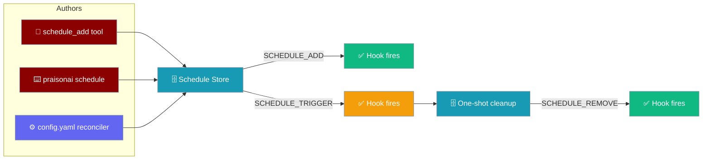
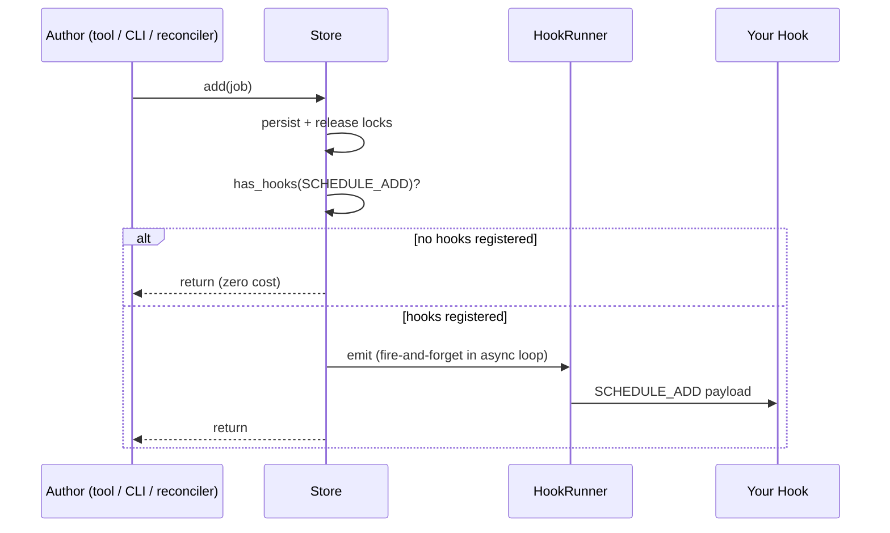

Schedule lifecycle hooks fire when a scheduled job is persisted, deleted, or triggered — so your audit log or metrics endpoint sees the whole life of every job, no matter who created it.



## Quick Start

<Steps>
<Step title="Register a hook">
Register one hook on the default registry for `SCHEDULE_ADD`.

```python
from praisonaiagents.hooks import HookEvent, HookResult, get_default_registry

registry = get_default_registry()

@registry.on(HookEvent.SCHEDULE_ADD)
def on_add(event_data):
    print(f"Added: {event_data.job_name} → {event_data.schedule}")
    print(f"Job ID: {event_data.job_id}, enabled: {event_data.enabled}")
    return HookResult.allow()
```
</Step>

<Step title="Give an Agent the tool">
Hand the agent the `schedule_add` tool — the store fires your hook when the agent persists a job.

```python
from praisonaiagents import Agent
from praisonaiagents.tools import schedule_add, schedule_list, schedule_remove

agent = Agent(
    name="Scheduler",
    instructions="Schedule reminders the user asks for.",
    tools=[schedule_add, schedule_list, schedule_remove],
)

agent.start("Remind me to stretch every 5 minutes")
```
</Step>
</Steps>

---

## How It Works

`SCHEDULE_ADD` and `SCHEDULE_REMOVE` are emitted by the schedule store — the one chokepoint every add/remove path funnels through — after its locks release.



---

## What Fires (and What Doesn't)

Events fire only on a real change.

| Situation | Emits `SCHEDULE_ADD` | Emits `SCHEDULE_REMOVE` |
|---|---|---|
| `store.add(job)` succeeds | ✅ | — |
| `store.add(job)` raises (duplicate id/name) | ❌ | — |
| `store.remove(job_id)` finds the job | — | ✅ |
| `store.remove(job_id)` finds nothing | — | ❌ |
| `store.remove_by_name(name)` cross-tenant mismatch | — | ❌ |
| `claim_due()` auto-deletes a `delete_after_run` one-shot | — | ✅ (once) |
| `claim_due()` runs a recurring job | — | ❌ |
| `_save()` fails and rolls back the delete | — | ❌ |

---

## Payload Reference

**`ScheduleAddInput`** (fires on `SCHEDULE_ADD`):

| Field | Type | Default | Description |
|---|---|---|---|
| `job_name` | `str` | `""` | Human-friendly job name. |
| `job_id` | `str` | `""` | Stable id assigned by the store. |
| `schedule` | `str` | `""` | Rendered as `"every 3600s"`, `"cron:0 8 * * 1-5"`, or `"at:2026-09-08T10:00:00"`. |
| `message` | `str` | `""` | The scheduled prompt. Truncated to 500 chars in `to_dict()`. |
| `agent_id` | `str` | `""` | The job's `agent_id` (or `""`). |
| `principal` | `str` | `""` | Tenant / principal string for multi-tenant scoping. |
| `enabled` | `bool` | `True` | Whether the job is enabled at add time. |

**`ScheduleRemoveInput`** (fires on `SCHEDULE_REMOVE`):

| Field | Type | Default | Description |
|---|---|---|---|
| `job_name` | `str` | `""` | Name of the deleted job. |
| `job_id` | `str` | `""` | Id of the deleted job. |
| `schedule` | `str` | `""` | Rendered same as above. |
| `principal` | `str` | `""` | Tenant / principal of the deleted job. |

Both inherit `session_id`, `cwd`, `event_name`, `timestamp`, and `agent_name` from `HookInput` (`agent_name` is the job's `agent_id` if set, else `"scheduler"`).

<Note>
Both types are importable from `praisonaiagents.hooks`:
`from praisonaiagents.hooks import ScheduleAddInput, ScheduleRemoveInput`.
</Note>

---

## Common Patterns

### Audit log

Append every add and remove to a JSONL file.

```python
import json
from praisonaiagents.hooks import HookEvent, HookResult, get_default_registry

registry = get_default_registry()

def audit(event_data):
    with open("schedule_audit.jsonl", "a") as f:
        f.write(json.dumps({
            "event": event_data.event_name,
            "session_id": event_data.session_id,
            "principal": event_data.principal,
            "job_id": event_data.job_id,
            "schedule": event_data.schedule,
        }) + "\n")
    return HookResult.allow()

registry.on(HookEvent.SCHEDULE_ADD)(audit)
registry.on(HookEvent.SCHEDULE_REMOVE)(audit)
```

### Per-tenant quota

Count active schedules per `principal`.

```python
from collections import Counter
from praisonaiagents.hooks import HookEvent, HookResult, get_default_registry

registry = get_default_registry()
active = Counter()

@registry.on(HookEvent.SCHEDULE_ADD)
def inc(event_data):
    active[event_data.principal] += 1
    return HookResult.allow()

@registry.on(HookEvent.SCHEDULE_REMOVE)
def dec(event_data):
    active[event_data.principal] -= 1
    return HookResult.allow()
```

### One-shot metric

Push a metric when a spent one-shot is auto-removed.

```python
from praisonaiagents.hooks import HookEvent, HookResult, get_default_registry

registry = get_default_registry()

@registry.on(HookEvent.SCHEDULE_REMOVE)
def one_shot_metric(event_data):
    if event_data.schedule.startswith("at:"):
        print(f"scheduler.one_shot_completed job_id={event_data.job_id}")
    return HookResult.allow()
```

---

## Emission Discipline

<Warning>
- Hooks fire **after** the store releases its locks — safe to call back into the store.
- **Zero cost** when nothing is registered: a single `has_hooks` lookup and the emitter returns.
- A raising hook cannot roll back the mutation and is logged at `debug`.
- Do not rely on ordering across processes; a `SCHEDULE_ADD` from one gateway process and a `SCHEDULE_REMOVE` from another may arrive in any order.
</Warning>

Inside a running asyncio loop, emission is fire-and-forget; `asyncio.run(...)` around your code works because the emitter handles both loop states.

---

## Best Practices

<AccordionGroup>
<Accordion title="Keep hooks lightweight">
Hooks may run inside an async event loop. Avoid blocking I/O; offload heavy work to a queue.
</Accordion>

<Accordion title="Filter early on principal">
For multi-tenant setups, check `event_data.principal` at the top of the hook and return `HookResult.allow()` immediately when it doesn't match.
</Accordion>

<Accordion title="Don't gate the mutation from a hook">
These events are observability-only — the store proceeds regardless of `HookResult.deny(...)`. To control **who** can create schedules, gate the callers: guardrails on the tool, auth on the CLI.
</Accordion>

<Accordion title="Use job_id as the durable key">
Use `event_data.job_id`, not `event_data.job_name`, as the stable key — names can be reused.
</Accordion>
</AccordionGroup>

---

## Related

<CardGroup cols={2}>
<Card title="Hook Events" icon="webhook" href="/features/hook-events">
Full event reference for every lifecycle hook.
</Card>
<Card title="Schedule Tools" icon="wrench" href="/tools/schedule-tools">
The agent-callable tools that trigger these hooks.
</Card>
<Card title="Schedule CLI" icon="terminal" href="/cli/schedule">
The CLI that triggers these hooks.
</Card>
<Card title="Bot Lifecycle Hooks" icon="robot" href="/features/bot-lifecycle-hooks">
Sibling gateway lifecycle events.
</Card>
</CardGroup>
