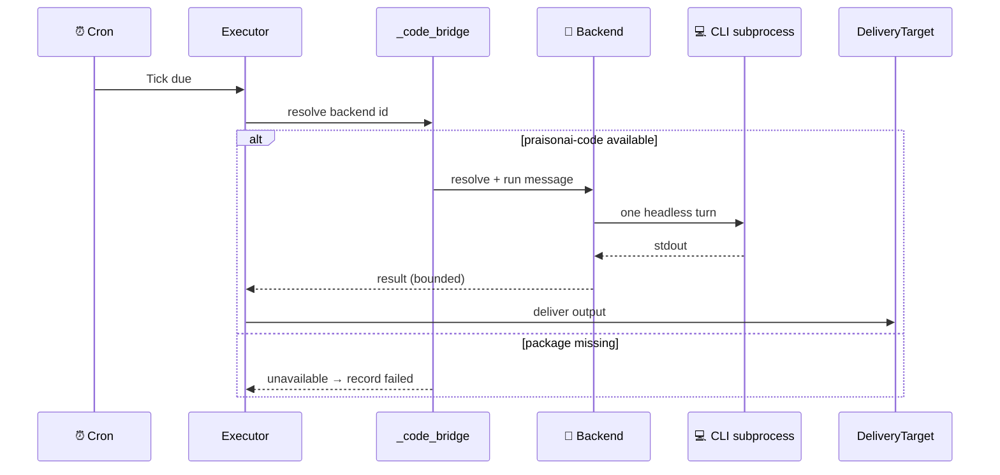
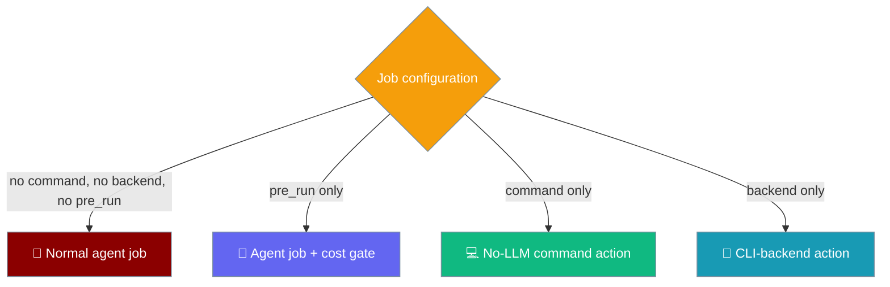

Attach a `backend` to a scheduled job to run its `message` as one headless turn through a registered CLI backend — no native agent is resolved, and no in-process model turn is taken.


A backend job is a model-free *action*: it delegates the whole turn to a coding-CLI (`claude-code`, `codex-cli`, `gemini`, `grok`) that owns its own subscription — ideal for a nightly refactor or a scheduled review in a pinned repo.

## Quick Start

<Steps>
<Step title="CLI">
Add a job with `--backend`. Its `message` runs as one headless CLI turn — no agent, no in-process model turn.

```bash
praisonai schedule add "nightly-refactor" \
  -s "cron:0 2 * * *" \
  -m "tidy utils.py, run tests" \
  --backend claude-code \
  --backend-cwd ~/proj \
  --deliver telegram
```
</Step>

<Step title="Python">
Set `backend` on a `ScheduleJob`. `backend_options` carries overrides like `cwd` and `timeout_ms`.

```python
from praisonaiagents.scheduler import ScheduleJob, Schedule, DeliveryTarget

job = ScheduleJob(
    name="nightly-refactor",
    schedule=Schedule(kind="cron", cron_expr="0 2 * * *"),
    message="tidy utils.py, run tests",
    backend="claude-code",
    backend_options={"cwd": "/path", "timeout_ms": 300000},
    delivery=DeliveryTarget.parse("telegram"),
)
```
</Step>
</Steps>

<Note>
`--backend` is a trusted, human-only surface. Like `--command` and `--pre-run` it spawns a host CLI subprocess and is **not** exposed on the LLM-callable `schedule_add` tool, so a prompt-injected agent cannot persist arbitrary backend jobs.
</Note>

---

## How It Works

The executor resolves the backend through the `_code_bridge` seam before any agent — a backend job never resolves a native agent and never takes an in-process model turn.



| Detail | Behaviour |
|--------|-----------|
| **No model turn** | No native agent is resolved; the job's pinned `model` is an *input* to the CLI, not a drift guard. |
| **`_code_bridge` seam** | Resolution goes through the sanctioned bridge so the bot package never hard-depends on `praisonai-code`. |
| **Belt-and-braces bound** | The backend's own `timeout_ms` bounds the turn; the executor adds a **30s** `asyncio.wait_for` on top. |
| **Output cap** | stdout is bounded to the same **8,000-character** cap as `--command` (marker: `\n…[output truncated]`). |
| **Gates apply** | `--pre-run` / `--condition` gate backend jobs; go-path watermark persistence is deferred until the backend turn succeeds. |
| **Run-scoped policy** | Policy scans the `message` (the untrusted input) for backend jobs. |
| **Intentional silence** | A backend response equal to the silence sentinel is not delivered. |
| **Failure plumbing** | Failures flow through `mark_run`, `_audit_output`, and `_maybe_deliver_failure` — same as agent turns. |
| **Session/resume** | Subsequent turns on the same session set `is_resume=True` (codex resume shape: `codex exec resume <id> ...`). |

<Note>
Run the job's `message` as one headless turn through a CLI backend. Resolution goes through the sanctioned `_code_bridge` seam so the bot package never hard-depends on `praisonai-code`; when the optional code package is unavailable the tick is recorded as `failed` with a clear remediation instead of crashing the ticker. The job's pinned `model` is passed straight to the backend (the pin is an input here, not a drift guard — there is no in-process agent to compare against), output is bounded like command output, and failures flow through the same run-record, audit, and failure-delivery plumbing as agent turns.
</Note>

---

## Choosing the Right Mode

A scheduled job runs in one of four modes depending on which fields are set.



| Configuration | Mode | Model turn? |
|---------------|------|-------------|
| No `command`, no `backend`, no `pre_run` | Normal agent job (default) | Yes |
| `pre_run` only | Agent job with a [cost gate](/features/scheduler-pre-run-gate) | Yes, when the gate says go |
| `command` only | [No-LLM command action](/features/scheduler-command-action) | No |
| `backend` only | **CLI-backend action** | No (headless CLI turn) |

`command` and `backend` are **mutually exclusive** — a job runs exactly one model-free action:

```text
--command and --backend are mutually exclusive: a job runs exactly one model-free action. Configure one or the other.
```

---

## Configuration Options

### `ScheduleJob` fields

| Option | Type | Default | Description |
|--------|------|---------|-------------|
| `backend` | `Optional[str]` | `None` | Registered backend id — `claude-code`, `codex-cli`, `gemini`, `grok` (list with `praisonai backends`). When set, this job runs as a headless CLI turn; no in-process agent, no model turn. |
| `backend_options` | `Dict[str, Any]` | `{}` | Overrides passed at resolution: `cwd` (working directory), `timeout_ms` (subprocess bound), plus other backend-recognised keys. Unknown keys are rejected at resolution time. |

**`backend` docstring:**

> Optional external coding-CLI backend id (e.g. `"claude-code"`, `"codex-cli"`). When set, the job's `message` is executed as one headless turn through the named backend from the backend registry — no native agent is resolved and no in-process model turn is taken. Like `command`, this is a trusted operator-configured action: it spawns a host CLI subprocess and is deliberately not exposed on the LLM-callable scheduling tools. Additive and backward-compatible: jobs without a `backend` are unchanged.

**`backend_options` docstring:**

> Optional mapping of overrides for the backend run. Recognised keys are validated by the executor/backend (e.g. `cwd` for the working directory, `timeout_ms` for the subprocess bound); unknown config overrides are rejected at resolution time rather than silently ignored.

### Behavior notes

- **Prereq:** requires `pip install praisonai-code`. If missing, the tick is recorded as `failed` with the remediation: `CLI backend '<id>' unavailable: <e>. Backend jobs require the praisonai-code package (pip install praisonai-code).`
- **Default timeouts:** the backend's own `timeout_ms` (backends default to **300s**); the executor adds a **30s** belt-and-braces `asyncio.wait_for` on top.
- **Output cap:** stdout is bounded to the same **8,000-char** cap as `--command`.
- **`--model`** on a backend job is passed as an *input* to the CLI (e.g. `codex -m gpt-5-codex`, `grok --model ...`) — not a drift guard. Pinning is otherwise skipped for backend jobs.
- **Delivery:** identical routing to `--command` / agent jobs (Telegram, Discord, Slack, WhatsApp, `all`, `origin`, `platform:chat_id[:thread]`).

---

## Common Patterns

### Nightly refactor (Claude Code)

Run a nightly clean-up turn through `claude-code` in a pinned repo.

```bash
praisonai schedule add "nightly-refactor" \
  -s "cron:0 2 * * *" \
  -m "tidy utils.py, run tests" \
  --backend claude-code \
  --backend-cwd ~/proj \
  --deliver telegram
```

### Codex daily fix

Run a daily fix turn through `codex-cli`, pinning the model.

```bash
praisonai schedule add "codex-daily-fix" \
  -s daily \
  -m "fix the failing tests in src/" \
  --backend codex-cli \
  --model gpt-5-codex \
  --deliver slack:C012345
```

### Gemini review in a pinned repo

Run a scheduled review through `gemini` in a fixed working directory.

```bash
praisonai schedule add "gemini-review" \
  -s "cron:0 18 * * 1-5" \
  -m "review today's diff and summarise risks" \
  --backend gemini \
  --backend-cwd /srv/repo \
  --deliver telegram
```

### Grok subscription-backed turn

Run a scheduled turn through `grok`, bounded with `--backend-timeout`.

```bash
praisonai schedule add "grok-brief" \
  -s daily \
  -m "summarise open issues" \
  --backend grok \
  --backend-timeout 600 \
  --deliver telegram
```

---

## Best Practices

<AccordionGroup>
<Accordion title="Backend jobs are a trusted, human-only surface">
`--backend` spawns a host CLI subprocess. Like `--command` and `--pre-run`, it is **not** exposed on the LLM-callable `schedule_add` tool — only a human author via CLI, YAML, or Python can persist one. This prevents a prompt-injected agent from persisting arbitrary backend jobs.
</Accordion>

<Accordion title="Install praisonai-code first">
Backend jobs require the CLI backend registry. Install it before adding a backend job:

```bash
pip install praisonai-code
```

If it is missing, the tick is recorded as `failed` with a clear remediation instead of crashing the ticker.
</Accordion>

<Accordion title="Prefer --backend-timeout for long tasks">
A refactor or test run can exceed the backend's default `300s`. Raise the bound with `--backend-timeout` so a legitimate long turn is not killed early.

```bash
praisonai schedule add "big-refactor" -s daily \
  -m "refactor the payment module" \
  --backend claude-code --backend-timeout 1200 \
  --deliver telegram
```
</Accordion>

<Accordion title="Use --no-continuable for pure notifications">
When a backend turn is a report, not a conversation, add `--no-continuable` so a reply starts a fresh session instead of resuming.
</Accordion>
</AccordionGroup>

---

## Related

<CardGroup cols={2}>
<Card title="Scheduler Command Action" icon="terminal" href="/features/scheduler-command-action">
  The parallel model-free action — a shell command instead of a CLI backend
</Card>
<Card title="Schedule CLI" icon="clock" href="/cli/schedule">
  Where `--backend`, `--backend-cwd`, and `--backend-timeout` are configured
</Card>
<Card title="Backends" icon="plug" href="/cli/backends">
  List registered CLI backend ids with `praisonai backends`
</Card>
<Card title="Runtime Selection" icon="play" href="/features/runtime-selection">
  Model-scoped runtime configuration for agent runs
</Card>
<Card title="CLI Backend Protocol" icon="plug" href="/features/cli-backend-protocol">
  How CLI backends plug into the Agent API
</Card>
<Card title="Claude Code" icon="message-bot" href="/code/claude-code">
  The flagship CLI backend — Claude Pro / Max subscriptions
</Card>
</CardGroup>
