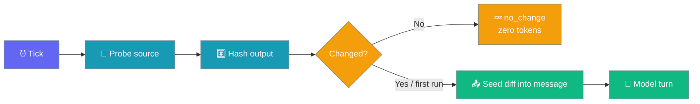
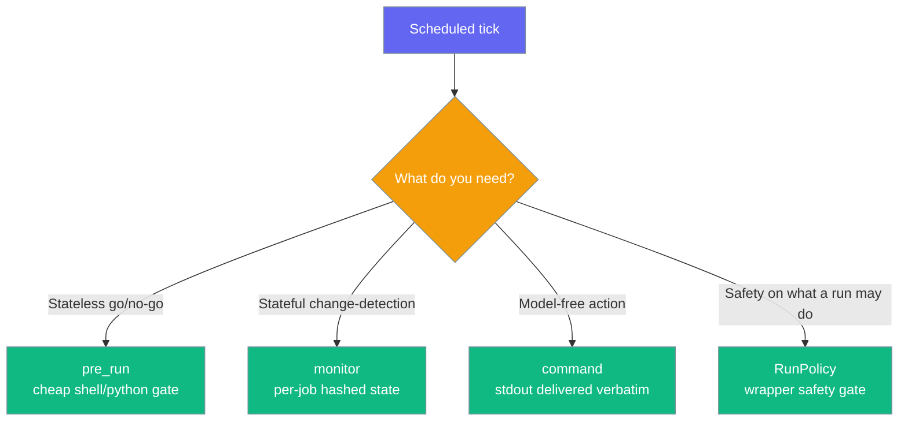

A monitor job hashes a watched source each tick and only runs the model when that source has changed — quiet ticks record `no_change` and spend zero tokens.

```python
from praisonaiagents.scheduler import Schedule, ScheduleJob

job = ScheduleJob(
    name="status-watch",
    schedule=Schedule(kind="every", every_seconds=300),
    monitor={"command": "curl -s https://api.example.com/status"},
    message="Summarise any changes to the status endpoint.",
)
```

The first tick runs and seeds a baseline; later ticks compare the fresh hash to the last one and stay silent until something actually changes.



## Quick Start

<Steps>
<Step title="Watch a source">

Point `monitor` at a cheap source. Each tick probes it, hashes the output, and only runs the model on a change:

```python
from praisonaiagents.scheduler import Schedule, ScheduleJob

job = ScheduleJob(
    name="status-watch",
    schedule=Schedule(kind="every", every_seconds=300),
    monitor={"command": "curl -s https://api.example.com/status"},
    message="Summarise any changes to the status endpoint.",
)
```

</Step>

<Step title="Pin the model for unattended runs">

An unattended job created against a cheap default should not silently follow a later, pricier one — snapshot the model and pin it:

```python
from praisonaiagents.scheduler import Schedule, ScheduleJob

job = ScheduleJob(
    name="status-watch",
    schedule=Schedule(kind="every", every_seconds=300),
    monitor={"url": "https://api.example.com/status"},
    message="Summarise any changes.",
    provider="openai",
    model="gpt-4o-mini",
    pin_model=True,  # default — the run fails closed if the model drifts
)
```

</Step>
</Steps>

---

## Which Gate Should I Use?

Four distinct controls decide whether — and how — a scheduled tick runs.



| Control | Stateful? | Runs the model? | Purpose |
|---------|-----------|-----------------|---------|
| `pre_run` | No | Yes, when the gate says "go" | Cheap stateless go/no-go before an expensive turn |
| `monitor` | Yes (per-job state) | Only on change / first run | Change-detection — suppress unchanged sources |
| `command` | No | No | Run a shell command and deliver stdout verbatim |
| `RunPolicy` | — | — | Wrapper safety gate on *what* a run may do |

---

## Run Statuses

A monitor tick records exactly one status so operators can tell "unchanged" apart from "gate said skip".

| Status | Meaning |
|--------|---------|
| `succeeded` | The model turn ran and completed |
| `failed` | The run (or a `command`) errored or timed out |
| `skipped` | A generic gate (`pre_run`) said "nothing to do" |
| `no_change` | A watched `monitor` source was unchanged — model suppressed, zero tokens, no delivery |

`no_change` is distinct from `skipped` on purpose: it means "the watched source did not change", not "the gate said don't run".

---

## Model-Free Delivery Action

Set `command` to run a shell command on schedule and deliver its stdout verbatim — no agent, no LLM call.

```python
from praisonaiagents.scheduler import Schedule, ScheduleJob

job = ScheduleJob(
    name="disk-watchdog",
    schedule=Schedule(kind="every", every_seconds=3600),
    command="df -h",
    command_timeout=60.0,  # kill the command after this many seconds
)
```

The command's process group is killed if it exceeds `command_timeout`, and that tick is recorded as `failed` — a hung command can never stall the ticker.

---

## Custom Stateful Gates

Implement `JobConditionProtocol.should_run` to build your own change-detection gate. A stateful gate accepts the job's prior `state` and returns a `GateResult` that both suppresses an unchanged source and carries the next-tick hash.

```python
import hashlib
from praisonaiagents.scheduler import GateResult

class UrlHashGate:
    def should_run(self, job, *, state=None):
        state = state or {}
        fresh = fetch(job.monitor["url"])  # your bounded fetch
        digest = hashlib.sha256(fresh.encode()).hexdigest()
        if state.get("hash") == digest:
            return GateResult(no_change=True, state_updates={"hash": digest})
        return GateResult(run=True, context=fresh, state_updates={"hash": digest})
```

When `no_change=True`, `GateResult` forces `run=False` in `__post_init__`, so a gate can never fire a tick the contract defines as suppressed. Leaving `state_updates=None` writes nothing — an error probe leaves prior state untouched so a later recovery still suppresses.

---

## Out of the Box

The default wrapper store `ConfigYamlScheduleStore` **already** implements `JobStateStoreProtocol` — a job picks up state persistence automatically, with no custom store needed. The executor loads prior state into a "Notepad" prompt block and persists updates back under a 16 KiB per-job cap. See [Cross-Run Memory](/features/scheduler-job-state) for the full notepad walkthrough.

---

## Custom State Stores

Roll your own store (for tests or a custom backend) by implementing `JobStateStoreProtocol` to persist a job's per-tick scratchpad — a last-seen hash, a cursor, or a watermark.

```python
class InMemoryStateStore:
    def __init__(self):
        self._state = {}

    def get_state(self, job_id):
        return self._state.get(job_id, {})

    def set_state(self, job_id, state):
        self._state[job_id] = state

    def clear_state(self, job_id):
        self._state.pop(job_id, None)
```

All three methods are optional for a store to provide — callers detect support with `hasattr()` and treat absence as today's stateless behaviour.

---

## Configuration Options

Fields on `ScheduleJob` that drive monitor mode and model pinning.

| Field | Type | Default | Purpose |
|-------|------|---------|---------|
| `monitor` | `Optional[Dict[str, Any]]` | `None` | Change-detection source spec: `{"command": "…"}` or `{"url": "…"}` |
| `command` | `Optional[str]` | `None` | Model-free execution action; stdout delivered verbatim |
| `command_timeout` | `float` | `60.0` | Kill the command after this many seconds |
| `provider` | `Optional[str]` | `None` | Snapshotted provider name at creation |
| `model` | `Optional[str]` | `None` | Snapshotted model identifier at creation |
| `pin_model` | `bool` | `True` | When `True` and `model` set, the run fails closed on drift |
| `pre_run` | `Optional[str]` | `None` | Cheap stateless shell/python gate (distinct from `monitor`) |

`GateResult` fields for stateful gates:

| Field | Type | Default | Purpose |
|-------|------|---------|---------|
| `run` | `bool` | `True` | Proceed with the model turn |
| `context` | `Optional[str]` | `None` | Text appended to `message` when `run=True` |
| `reason` | `Optional[str]` | `None` | Human-readable note recorded with the run |
| `no_change` | `bool` | `False` | Watched source unchanged — implies `run=False`, records `no_change` |
| `state_updates` | `Optional[Dict[str, Any]]` | `None` | Bounded key/value to persist for the next tick — persisted on **both** go and `no_change` ticks, so a watermark advances even on a suppressed tick |

---

## Best Practices

<AccordionGroup>
<Accordion title="Use monitor for change-detection, pre_run for go/no-go">
`monitor` carries per-job state and records `no_change`; `pre_run` is a stateless gate that records `skipped`. Reach for `monitor` when you need to compare against the last tick, and `pre_run` when a cheap check answers "is there anything to do right now?".
</Accordion>

<Accordion title="Pin the model on unattended jobs">
Unattended runs fire with no human present. Snapshot `provider` and `model` and keep `pin_model=True` so a job created against `gpt-4o-mini` never silently inherits a later, pricier default.
</Accordion>

<Accordion title="Bound every command with command_timeout">
A model-free `command` job runs a real shell command. Keep `command_timeout` tight so a hung command is killed (with its process group on POSIX) and recorded as `failed` instead of stalling the ticker.
</Accordion>

<Accordion title="Leave state untouched on probe errors">
When a probe fails, return a `GateResult` with `state_updates=None` so prior state is preserved. A later recovery to the same output still hashes equal and suppresses, avoiding a spurious change alert.
</Accordion>
</AccordionGroup>

---

## Related

<CardGroup cols={2}>
<Card title="Cross-Run Memory" icon="database" href="/features/scheduler-job-state">
  The default notepad — state persistence with no custom store
</Card>
<Card title="Async Scheduler" icon="clock" href="/features/async-scheduler">
  Multi-tenant, at-most-once scheduling primitives
</Card>
<Card title="Pre-Run Gate" icon="filter" href="/features/scheduler-pre-run-gate">
  Stateless go/no-go gate that skips quiet ticks
</Card>
</CardGroup>
