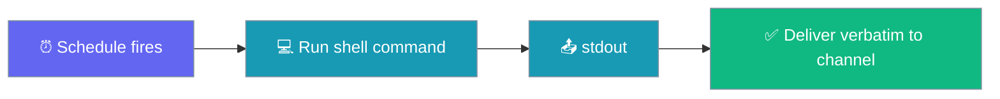
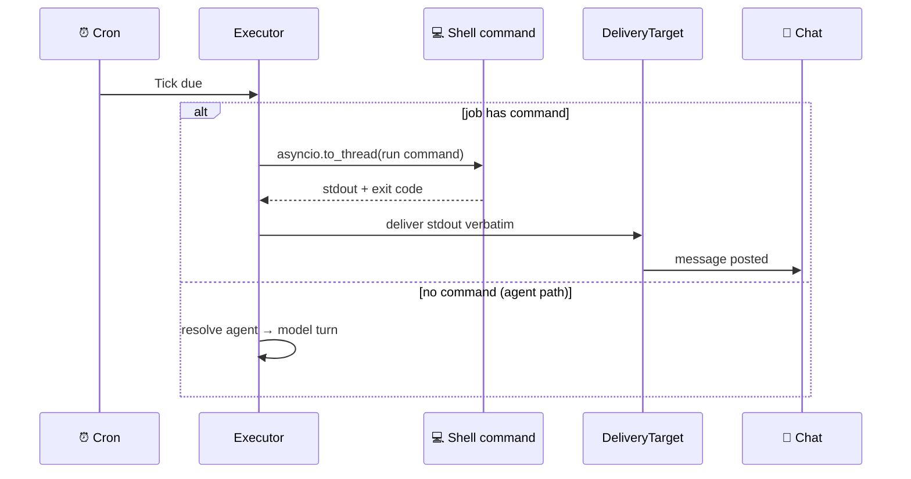
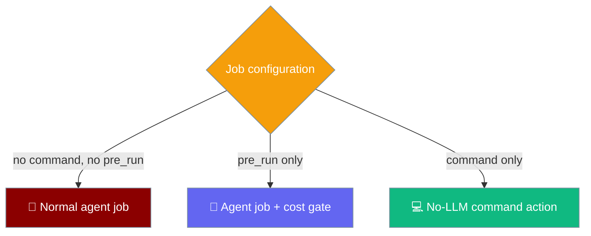

Attach a `command` to a scheduled job to run a shell command on its schedule and deliver the raw stdout to your channel — no agent is resolved and no model turn is taken.



A command job is a model-free *action*: cheap, deterministic, and token-free — ideal for watchdogs like `df -h`, `uptime`, or a health-check `curl`.

## Quick Start

<Steps>
<Step title="CLI">
Add a job with `--command`. Its stdout is delivered as-is — no `--message`, no agent, no tokens.

```bash
praisonai schedule add "disk-watch" -s hourly \
  --command "df -h /" \
  --deliver telegram:-100123
```
</Step>

<Step title="Python">
Set `command` on a `ScheduleJob`. When `command` is present, the job takes the model-free path.

```python
from praisonaiagents.scheduler import ScheduleJob, Schedule, DeliveryTarget

job = ScheduleJob(
    name="disk-watch",
    schedule=Schedule(kind="every", every_seconds=3600),
    command="df -h /",
    command_timeout=30,
    delivery=DeliveryTarget.parse("telegram:-100123"),
)
```
</Step>
</Steps>

---

## How It Works

The executor checks for a `command` **before** resolving any agent — a command job never touches the model.



| Detail | Behaviour |
|--------|-----------|
| **No model turn** | No agent is resolved; zero tokens are spent. |
| **Off the event loop** | The command runs via `asyncio.to_thread`, so a slow command never blocks other ticks. |
| **Bounded runtime** | The command is killed after `command_timeout` seconds; a timeout returns the conventional `124` code and records the tick as `failed`. |
| **Process-group kill** | On POSIX the command runs in its own session, so a timeout kills the whole process group (shell + children) rather than orphaning them. |
| **Exit codes surface** | A non-zero exit is **not** silently dropped — the delivered text is prefixed `[exit N] <output>`. |
| **Output cap** | stdout is bounded to **8,000 characters** before verbatim delivery through the existing `DeliveryTarget` path. |

---

## Choosing the Right Mode

A scheduled job runs in one of three modes depending on which fields are set.



| Configuration | Mode | Model turn? |
|---------------|------|-------------|
| No `command`, no `pre_run` | Normal agent job (default) | Yes |
| `pre_run` only | Agent job with a [cost gate](/features/scheduler-pre-run-gate) | Yes, when the gate says go |
| `command` only | **No-LLM command action** | No |

`pre_run` is a *gate* (a cheap check that still runs the model); `command` is an *action* (a shell command that runs **instead of** the model).

---

## Configuration Options

### `ScheduleJob` fields

| Option | Type | Default | Description |
|--------|------|---------|-------------|
| `command` | `Optional[str]` | `None` | Shell command whose stdout is delivered verbatim. When set, the job runs this command on its schedule and delivers the output as-is to `delivery` — with no agent resolved and no model turn taken. Additive and backward-compatible: jobs without a `command` keep the existing agent path. |
| `command_timeout` | `float` | `60.0` | Max seconds the `command` may run before it is killed (with its process group on POSIX) and the tick is recorded as `failed`. Bounds the action so a hung command cannot stall the ticker. |

`command` is persisted only when set; `command_timeout` is persisted only when a `command` is configured **and** the timeout differs from the default `60.0`. Agent-only jobs are unchanged on disk.

---

## Common Patterns

### Disk watch

Report free space on the root filesystem every hour.

```bash
praisonai schedule add "disk-watch" -s hourly \
  --command "df -h /" \
  --deliver telegram:-100123
```

### Health-check curl

Poll a health endpoint and post the raw response. Use `--no-continuable` so a reply starts a fresh session instead of resuming.

```bash
praisonai schedule add "api-health" -s "*/5m" \
  --command "curl -s https://api.example.com/health" \
  --deliver slack:C012345 \
  --no-continuable
```

### Uptime heartbeat

Post a lightweight heartbeat so you know the host is alive.

```python
from praisonaiagents.scheduler import ScheduleJob, Schedule, DeliveryTarget

job = ScheduleJob(
    name="uptime",
    schedule=Schedule(kind="every", every_seconds=300),
    command="uptime",
    delivery=DeliveryTarget.parse("slack:C012345"),
)
```

---

## Best Practices

<AccordionGroup>
<Accordion title="Bound every command with command_timeout">
The default `command_timeout=60.0` kills a hung command with its process group on POSIX. Lower it to match a fast watchdog so a stuck command cannot stall the ticker.

```python
job = ScheduleJob(
    name="disk-watch",
    schedule=Schedule(kind="every", every_seconds=3600),
    command="df -h /",
    command_timeout=10,
)
```
</Accordion>

<Accordion title="Keep output under 8,000 characters">
stdout is capped at 8,000 characters before delivery. Trim chatty commands with `head`, `tail`, or a filter so the channel gets a clean, complete message.

```bash
praisonai schedule add "top-procs" -s hourly \
  --command "ps aux --sort=-%mem | head -10" \
  --deliver telegram:-100123
```
</Accordion>

<Accordion title="Use --no-continuable for pure alerts">
A command action is a notification, not a conversation. Add `--no-continuable` so a reply in the channel starts a fresh session instead of trying to resume a job that has no agent context.
</Accordion>

<Accordion title="Command jobs are a trusted, human-only surface">
`command` runs an arbitrary host shell command. It is **not** accepted by the agent-callable `schedule_add` tool — only a human author via CLI, YAML, or Python can persist one. This prevents a prompt-injected agent from persisting arbitrary shell commands on the host.
</Accordion>
</AccordionGroup>

---

## Related

<CardGroup cols={2}>
<Card title="Pre-Run Gate" icon="filter" href="/features/scheduler-pre-run-gate">
  The go/no-go gate — cheap check that still runs the model turn
</Card>
<Card title="Scheduler Delivery" icon="paper-plane" href="/features/scheduler-delivery">
  Push scheduled results to Telegram/Discord/Slack/WhatsApp
</Card>
<Card title="Schedule CLI" icon="terminal" href="/cli/schedule">
  CLI surface — where `--command` and `--command-timeout` are configured
</Card>
</CardGroup>
