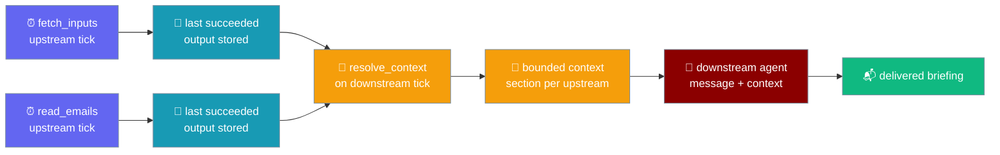
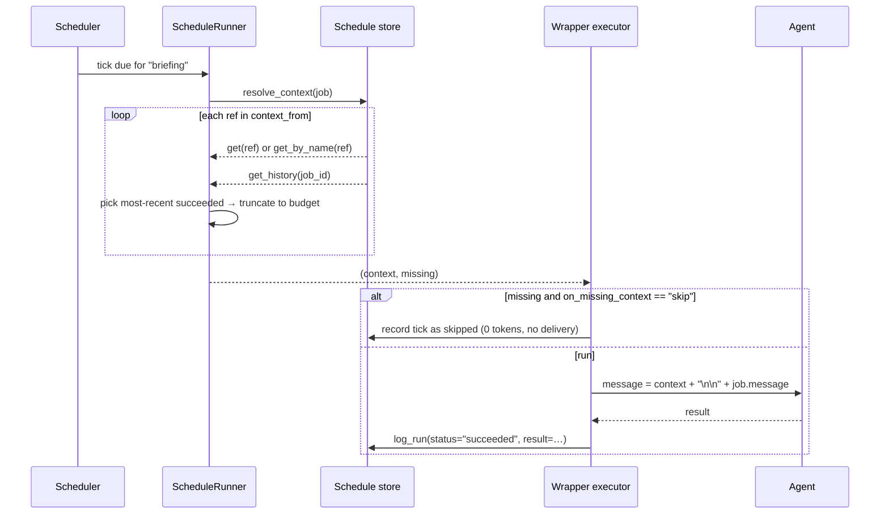

Turn isolated scheduled jobs into a composable pipeline — a downstream job names its upstreams, and the runner prepends each upstream's most-recent successful output to the downstream `message` as bounded, clearly-delimited context.



<Note>
`resolve_context` is **pure and side-effect-free** — it *returns* the resolved text; a wrapper executor is what prepends it to `message`. The core owns only the shape (three `ScheduleJob` fields) and the resolution contract.
</Note>

## Quick Start

<Steps>
<Step title="One upstream feeds one downstream">
Point a downstream job at an upstream by name. At fire time the runner resolves the upstream's last successful output and prepends it as context.

```python
from praisonaiagents import Agent
from praisonaiagents.scheduler import ScheduleJob, Schedule

agent = Agent(name="Briefer", instructions="Write a short morning briefing")

fetch = ScheduleJob(
    name="fetch_inputs",
    schedule=Schedule(kind="cron", cron_expr="0 6 * * *"),
    message="Fetch today's calendar and unread email summary.",
)

brief = ScheduleJob(
    name="briefing",
    schedule=Schedule(kind="cron", cron_expr="5 6 * * *"),
    message="Draft a briefing from the fetched inputs.",
    agent_id=agent.id,
    context_from=["fetch_inputs"],
)
```
</Step>

<Step title="Bare-string upstream in YAML">
For a single upstream, write `context_from` as a plain string — `from_dict` coerces it to a one-element list.

```yaml
jobs:
  - name: briefing
    message: "Draft a briefing from the fetched inputs."
    schedule:
      kind: cron
      cron_expr: "5 6 * * *"
    context_from: fetch_inputs
```
</Step>

<Step title="Multiple upstreams + skip on empty">
Name several upstreams, tighten the per-stage budget, and refuse to run when an input is missing.

```python
from praisonaiagents.scheduler import ScheduleJob, Schedule

brief = ScheduleJob(
    name="briefing",
    schedule=Schedule(kind="cron", cron_expr="5 6 * * *"),
    message="Merge calendar and email into one briefing.",
    context_from=["calendar", "email"],
    context_max_chars=1500,
    on_missing_context="skip",
)
```
</Step>
</Steps>

---

## How It Works

Each downstream tick resolves its upstreams from execution history, bounds each output, and formats one section per upstream.



Each resolved upstream becomes a section formatted exactly as `### Context from '{ref}'` followed by its output, and sections join with a blank line:

```text
### Context from 'fetch_inputs'
calendar + unread email summary
```

Two upstreams preserve declared order:

```text
### Context from 'a'
AAA

### Context from 'b'
BBB
```

| Step | What the runner does |
|------|----------------------|
| Resolve ref | Try `store.get(ref)` (id); fall back to `store.get_by_name(ref)` (name) |
| Pick record | First `get_history` record with `status == "succeeded"` **and** a truthy `result` |
| Bound output | Truncate to `max(context_max_chars, 0)` characters |
| Format | `### Context from '{ref}'\n{output}`, sections joined with `"\n\n"` |
| Report gaps | Refs with no resolvable output are collected in `missing` |

<Note>
"Most-recent successful" is strict: a **failed** record does not satisfy a ref, and a **succeeded** record with an empty `result` does not either — the ref is reported as missing.
</Note>

---

## Configuration Options

Three declarable fields on `ScheduleJob` control chaining.

| Field | Type | Default | Description |
|-------|------|---------|-------------|
| `context_from` | `Optional[List[str]]` | `None` | Upstream job ids/names whose most-recent successful output is injected as bounded context. `None` keeps the existing stateless behaviour. A bare string is coerced to a one-element list |
| `context_max_chars` | `int` | `4000` | Per-upstream truncation budget so a large upstream output can't blow up the downstream prompt |
| `on_missing_context` | `Literal["run", "skip"]` | `"run"` | Policy when a declared upstream has no resolvable output — `"run"` fires with whatever resolved; `"skip"` records the tick as `skipped` (no tokens, no delivery) |

`ScheduleRunner.resolve_context(job)` returns a `(context, missing)` tuple.

| Return value | Type | Description |
|--------------|------|-------------|
| `context` | `str` | Joined, delimited upstream text — `""` when nothing resolved |
| `missing` | `List[str]` | Refs with no resolvable successful output, so the caller can apply `on_missing_context` |

```python
from praisonaiagents.scheduler import ScheduleJob, Schedule, ScheduleRunner, FileScheduleStore

store = FileScheduleStore(store_dir="/tmp/schedules")
runner = ScheduleRunner(store)

brief = ScheduleJob(name="briefing", context_from=["fetch_inputs"])
context, missing = runner.resolve_context(brief)
```

<Warning>
A zero or negative `context_max_chars` clamps to `0` — an **empty** body, not the full upstream output. This preserves the bounded contract even when the budget is misconfigured.
</Warning>

<Note>
`ScheduleJob.to_dict()` only emits `context_from` when it's truthy, and emits `context_max_chars` / `on_missing_context` only when they differ from their defaults. A job that never sets `context_from` serialises **byte-for-byte** the same as before.
</Note>

---

## Common Patterns

### Morning briefing pipeline

Three chained jobs — fetch, summarise, deliver — each small and independently observable in run history.

```python
from praisonaiagents import Agent
from praisonaiagents.scheduler import ScheduleJob, Schedule, DeliveryTarget

writer = Agent(name="Briefer", instructions="Write a concise morning briefing")

fetch = ScheduleJob(
    name="fetch_inputs",
    schedule=Schedule(kind="cron", cron_expr="0 6 * * *"),
    message="Fetch today's calendar and unread email summary.",
)

merge = ScheduleJob(
    name="briefing",
    schedule=Schedule(kind="cron", cron_expr="5 6 * * *"),
    message="Merge the fetched inputs into one briefing.",
    agent_id=writer.id,
    context_from=["fetch_inputs"],
)

deliver = ScheduleJob(
    name="deliver_briefing",
    schedule=Schedule(kind="cron", cron_expr="10 6 * * *"),
    message="Send the briefing to the team.",
    agent_id=writer.id,
    context_from=["briefing"],
    delivery=DeliveryTarget(channel="telegram", channel_id="123456"),
)
```

The final stage typically delivers — see [Scheduler Delivery](/features/scheduler-delivery).

### Fail-closed downstream

Refuse to draft a briefing when the inbox fetch produced nothing.

```python
from praisonaiagents.scheduler import ScheduleJob, Schedule

brief = ScheduleJob(
    name="briefing",
    schedule=Schedule(kind="cron", cron_expr="5 6 * * *"),
    message="Draft a briefing.",
    context_from=["fetch_inputs"],
    on_missing_context="skip",
)
```

`on_missing_context="skip"` records the tick as the existing `skipped` outcome — no tokens, no delivery — so the downstream never runs on empty inputs.

### Fan-in from two watchers

One downstream consumes two independent [`monitor`](/features/scheduler-monitor) jobs' outputs.

```python
from praisonaiagents.scheduler import ScheduleJob, Schedule

releases = ScheduleJob(
    name="release-watch",
    schedule=Schedule(kind="every", every_seconds=3600),
    message="Summarise what changed.",
    monitor={"url": "https://example.com/releases"},
)

status = ScheduleJob(
    name="status-watch",
    schedule=Schedule(kind="every", every_seconds=3600),
    message="Summarise service status.",
    monitor={"command": "curl -sf --max-time 5 https://status.example.com/health"},
)

digest = ScheduleJob(
    name="ops-digest",
    schedule=Schedule(kind="cron", cron_expr="0 * * * *"),
    message="Combine release and status notes into one digest.",
    context_from=["release-watch", "status-watch"],
)
```

---

## Best Practices

<AccordionGroup>
<Accordion title="Bound context_max_chars per stage">
Each upstream is truncated independently, so set a budget that fits the downstream prompt. A tight budget on a chatty upstream keeps the assembled prompt small and cheap.

```python
ScheduleJob(name="brief", context_from=["fetch"], context_max_chars=1500)
```
</Accordion>

<Accordion title="Refs by name read well; ids are stable">
A name is readable in YAML and history, but it changes if you rename the job. An id never changes. Use names for hand-authored pipelines and ids when the reference must survive a rename.
</Accordion>

<Accordion title="Use on_missing_context='skip' when empty inputs are meaningless">
If a downstream has nothing useful to say without its upstream, `skip` records the tick as `skipped` (no tokens, no delivery) — consistent with the [pre-run gate](/features/scheduler-pre-run-gate). Leave the default `"run"` when partial context is still useful.
</Accordion>

<Accordion title="Declared order is preserved verbatim">
Sections appear in the exact order you list `context_from`. Put the most important upstream first so it leads the assembled prompt.
</Accordion>

<Accordion title="resolve_context is pure — call it in a dry run">
Because it has no side effects, a wrapper can call `resolve_context` to preview exactly what a downstream tick would see — and which upstreams are missing — before spending any tokens.
</Accordion>
</AccordionGroup>

---

## Related

<CardGroup cols={2}>
<Card title="Async Scheduler" icon="clock" href="/features/async-scheduler">
  Schedule agents on intervals, cron, or one-shot timestamps
</Card>
<Card title="Scheduler Delivery" icon="paper-plane" href="/features/scheduler-delivery">
  Push a pipeline's final stage to Telegram/Discord/Slack/WhatsApp
</Card>
<Card title="Scheduler Monitor" icon="eye" href="/features/scheduler-monitor">
  Wake a job only when a watched source changed — fan its output in
</Card>
<Card title="Pre-Run Gate" icon="filter" href="/features/scheduler-pre-run-gate">
  Stateless go/no-go gate — skip when there's nothing to do
</Card>
</CardGroup>
