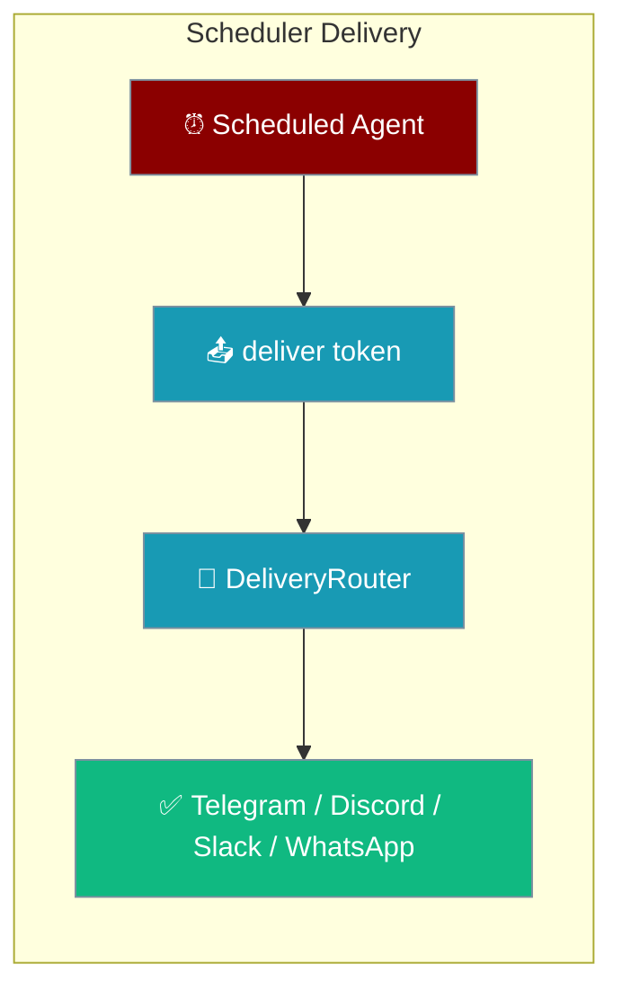
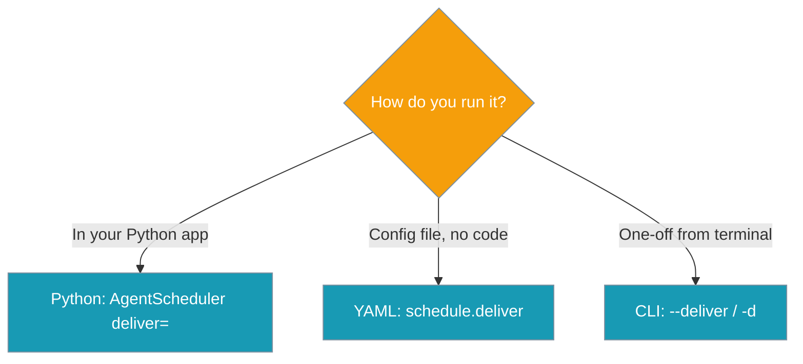
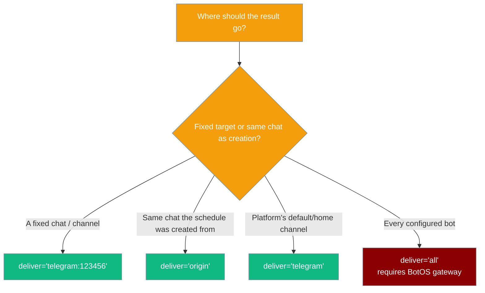
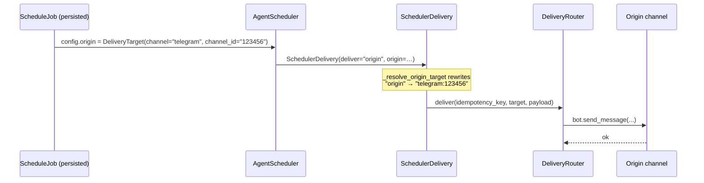
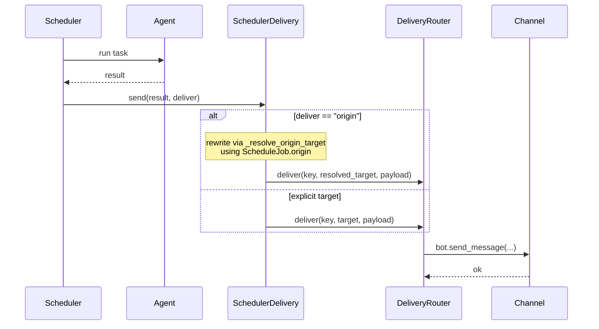
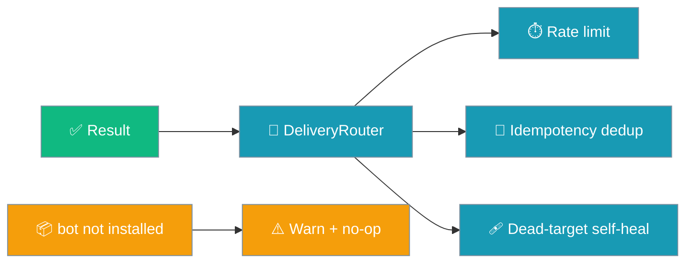

Set `deliver=` on a scheduled agent and each result is pushed to a chat target — no gateway required.

```python
from praisonaiagents import Agent
from praisonai.scheduler import AgentScheduler

agent = Agent(name="Brief", instructions="Summarise the morning news")
AgentScheduler(agent, task="Morning brief", deliver="telegram:123456").start("hourly")
```



"Run this agent every hour and text me the result on Telegram." That used to mean wiring up the scheduler **and** the full BotOS gateway. Now it's one parameter — the scheduler talks to the shared `DeliveryRouter` directly.

<Note>
If `praisonai-bot` isn't installed, delivery logs a single warning and no-ops. The scheduled run itself never fails because delivery failed.
</Note>

## Quick Start

<Steps>
<Step title="Deliver to a specific chat">
```python
from praisonaiagents import Agent
from praisonai.scheduler import AgentScheduler

agent = Agent(name="Brief", instructions="Summarise the morning news")

scheduler = AgentScheduler(agent, task="Morning brief", deliver="telegram:123456")
scheduler.start("hourly")
```
</Step>

<Step title="Deliver to the platform home channel">
```python
from praisonaiagents import Agent
from praisonai.scheduler import AgentScheduler

agent = Agent(name="Brief", instructions="Summarise the morning news")

# Bare platform token → router resolves the platform's home channel
scheduler = AgentScheduler(agent, task="Morning brief", deliver="telegram")
scheduler.start("daily")
```
</Step>

<Step title="Async scheduler">
```python
import asyncio
from praisonaiagents import Agent
from praisonai.scheduler import AsyncAgentScheduler

async def main():
    agent = Agent(name="Brief", instructions="Summarise the morning news")
    scheduler = AsyncAgentScheduler(agent, task="Morning brief", deliver="telegram:123456")
    await scheduler.start("hourly")

asyncio.run(main())
```
</Step>
</Steps>

---

## Three Ways to Set the Target

The same delivery token works from Python, YAML, and the CLI.

<Tabs>
<Tab title="Python">
```python
from praisonaiagents import Agent
from praisonai.scheduler import AgentScheduler

agent = Agent(name="Brief", instructions="Summarise the morning news")
AgentScheduler(agent, task="Morning brief", deliver="telegram:123456").start("hourly")
```
</Tab>

<Tab title="YAML">
```yaml
# agents.yaml
framework: praisonai

agents:
  - name: "Brief"
    instructions: "Summarise the morning news"

task: "Morning brief"

schedule:
  every: "hourly"          # alias for `interval` — new in PR #2934
  deliver: "telegram:123456"
```
</Tab>

<Tab title="CLI">
```bash
praisonai schedule add "morning-brief" \
  -s hourly \
  -m "Morning brief" \
  --deliver telegram:123456
```
</Tab>
</Tabs>

<Note>
`every:` is a new alias for `interval:` in the YAML `schedule:` block — both accept `hourly`, `daily`, `weekly`, `*/30m`, or raw seconds.
</Note>

### Which surface fits which scenario?



---

## Delivery Target Tokens

The `deliver` value is parsed by `DeliveryTarget.parse()` — the same serialisable model reused from the existing delivery machinery.

| Token | Meaning |
|-------|---------|
| `"telegram"` | Default (home) channel of that platform |
| `"telegram:123456"` | Specific channel / chat ID |
| `"telegram:123456:789"` | Channel `123456` with thread `789` |
| `"origin"` | Reply to the same channel the schedule was created from (uses `ScheduleJob.origin`) |
| `"all"` | Every configured bot — **requires the full BotOS gateway** |

<Note>
`deliver="origin"` **does** work on the lightweight scheduler path — it delivers back to the same channel the schedule was created from, using the origin persisted on `ScheduleJob.origin` at creation. No live gateway session is required. The warning is only logged if the job was created **without** an origin channel.
</Note>

<Warning>
`deliver="all"` still needs the full BotOS gateway (it must enumerate every configured bot). On the lightweight path it logs a warning and no-ops — use an explicit `platform` or `platform:channel_id` token instead, or run under the gateway.
</Warning>

Swap `telegram` for `discord`, `slack`, or `whatsapp` — the grammar is identical.



---

## Deliver back to the origin channel

Use `deliver="origin"` when the schedule was created from a chat and you want the recurring result to land back in that same chat — without wiring up a specific `platform:channel_id` token.

```python
from praisonaiagents import Agent
from praisonai.scheduler import AgentScheduler

agent = Agent(name="Brief", instructions="Summarise the morning news")

# Job was created from a Telegram chat — its origin is persisted on
# ScheduleJob.origin at creation. deliver="origin" delivers back to it.
scheduler = AgentScheduler(agent, task="Morning brief", deliver="origin")
scheduler.start("hourly")
```

**How origin resolution works:**



`SchedulerDelivery.origin_from_config()` normalises the origin whether it is a live `DeliveryTarget` **or** its persisted `dict` form (from `to_dict()`), so scheduled jobs restored from disk resolve correctly too.

<Tip>
`deliver="origin"` still logs a warning and no-ops if the job was created without an origin channel — for example, a job created purely from Python code with no chat context. In that case, use an explicit `platform:channel_id` token.
</Tip>

---

## How It Works

The scheduler runs the agent, then hands the result to `SchedulerDelivery`, which resolves the token and sends through the shared `DeliveryRouter`.



`SchedulerDelivery` is built once per scheduler and reused across runs, so the router's idempotency cache and rate limiters persist between ticks.

---

## Reliability Guarantees

Delivery reuses the existing `DeliveryRouter`, so scheduled sends inherit the gateway's guarantees.

| Guarantee | What it means |
|-----------|---------------|
| **Rate limiting** | Inherits the router's per-platform token-bucket limits |
| **Idempotency dedup** | Each success carries a stable idempotency key; a re-fired job delivering the same result to the same target is deduplicated in-process |
| **Dead-target self-heal** | The router retries and skips/marks dead targets |
| **Graceful degradation** | When `praisonai-bot` is not installed, a single warning is logged and delivery no-ops — the scheduled run itself never fails |



---

## Common Patterns

### Deliver from a blueprint

```python
from praisonai.scheduler import AgentScheduler

scheduler = AgentScheduler.from_blueprint(
    "morning-brief",
    slots={"hour": 8, "weekdays": "mon-fri"},
    deliver="telegram",
)
scheduler.start(scheduler._yaml_schedule_config["interval"])
```

`deliver=` on `from_blueprint` overrides the blueprint's default delivery target.

### Deliver to a thread

```python
from praisonaiagents import Agent
from praisonai.scheduler import AgentScheduler

agent = Agent(name="Standup", instructions="Post the daily standup summary")
AgentScheduler(agent, task="Standup", deliver="discord:555:thread-42").start("daily")
```

Attachments produced by the job (media returned by the agent) now travel into the same thread — parity with text delivery is preserved on Slack, Telegram, and Discord. See [Outbound Media Delivery](/docs/features/outbound-media-delivery) for the thread grammar.

---

## Best Practices

<AccordionGroup>
<Accordion title="Pick between an explicit target and origin">
Use `telegram:123456` when the job should always land in one fixed chat, regardless of where it was created. Use `deliver="origin"` when the schedule was created from a chat and should reply back into that same chat — this works on the lightweight path as long as the job was created with an origin channel. Reserve `deliver="all"` for flows running under the full BotOS gateway.
</Accordion>

<Accordion title="Install the bot extra to enable delivery">
Delivery needs the `praisonai-bot` package. Without it, the scheduled run still executes — only the push is skipped, with one warning. Install the bot extra to turn delivery on.
</Accordion>

<Accordion title="Reuse one scheduler instance per job">
The router's idempotency cache and rate limiters live on the scheduler's delivery helper. Keep a single scheduler running so repeated identical results to the same target are deduplicated instead of re-sent.
</Accordion>

<Accordion title="Pick the surface that matches how you deploy">
Use Python inside an app, YAML for a config-file deploy, and the CLI for one-off terminal jobs — all three accept the same `deliver` token grammar.
</Accordion>
</AccordionGroup>

---

## Related

<CardGroup cols={2}>
<Card title="Async Agent Scheduler" icon="clock" href="/docs/features/async-agent-scheduler">
  Run agents on a recurring schedule with async execution
</Card>
<Card title="Pre-Run Gate" icon="filter" href="/docs/features/scheduler-pre-run-gate">
  Skip ticks when a cheap check says nothing to do
</Card>
<Card title="Schedule CLI" icon="terminal" href="/docs/cli/schedule">
  The `--deliver` / `-d` flag and other schedule commands
</Card>
<Card title="Gateway Inbound Hooks" icon="webhook" href="/docs/features/gateway-inbound-hooks">
  Shares the same delivery target format
</Card>
</CardGroup>
