Set `deliver=` on a scheduled agent and each result is pushed to a chat target — no gateway required.

<Note>
**New:** every delivered brief is now a *continuable* conversation by default — a user's reply in the same chat resumes the job's turn with the brief in context. Opt out per-job with `--no-continuable` for pure notifications. See [Continuable Delivery](#continuable-delivery).
</Note>

```python
from praisonaiagents import Agent
from praisonai.scheduler import AgentScheduler

agent = Agent(name="Brief", instructions="Summarise the morning news")
AgentScheduler(agent, task="Morning brief", deliver="telegram:123456").start("hourly")
```

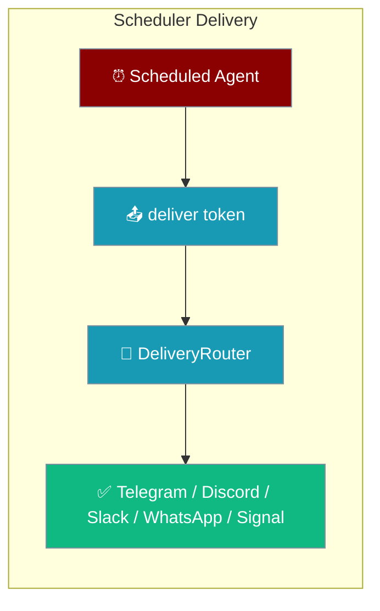
```mermaid
graph LR
    subgraph "Scheduler Delivery"
        A[⏰ Scheduled Agent] --> B[📤 deliver token]
        B --> C[🔀 DeliveryRouter]
        C --> D[✅ Telegram / Discord / Slack / WhatsApp / Signal]
    end

    classDef agent fill:#8B0000,stroke:#7C90A0,color:#fff
    classDef process fill:#189AB4,stroke:#7C90A0,color:#fff
    classDef output fill:#10B981,stroke:#7C90A0,color:#fff

    class A agent
    class B,C process
    class D output
```

"Run this agent every hour and text me the result on Telegram." That used to mean wiring up the scheduler **and** the full BotOS gateway. Now it's one parameter — the scheduler talks to the shared `DeliveryRouter` directly.

<Note>
If `praisonai-bot` isn't installed, delivery logs a single warning and no-ops. The scheduled run itself never fails because delivery failed. **When it *is* installed but no live gateway is running** (a plain `praisonai schedule tick` from OS cron / CI / serverless), delivery falls back to a stateless, token-authenticated standalone sender per platform — see [Out-of-process delivery](#out-of-process-delivery).
</Note>

<Note>
Running from **cron**, **CI**, or a **serverless** invocation with no gateway? Delivery still lands using only `{PLATFORM}_BOT_TOKEN` — see [Out-of-process delivery](#out-of-process-delivery).
</Note>

## Quick Start

<Steps>
<Step title="Deliver to a specific chat">
```python
from praisonaiagents import Agent
from praisonai.scheduler import AgentScheduler

agent = Agent(name="Brief", instructions="Summarise the morning news")

scheduler = AgentScheduler(agent, task="Morning brief", deliver="telegram:123456")
scheduler.start("hourly")
```
</Step>

<Step title="Deliver to the platform home channel">
```python
from praisonaiagents import Agent
from praisonai.scheduler import AgentScheduler

agent = Agent(name="Brief", instructions="Summarise the morning news")

# Bare platform token → router resolves the platform's home channel
scheduler = AgentScheduler(agent, task="Morning brief", deliver="telegram")
scheduler.start("daily")
```
</Step>

<Step title="Reply back to the origin chat">
```python
from praisonaiagents import Agent
from praisonai.scheduler import AgentScheduler

agent = Agent(name="Brief", instructions="Summarise the morning news")

# Inside a bot handler: the incoming request's origin is persisted on the job
# config, so deliver="origin" resolves it on the lightweight path.
scheduler = AgentScheduler(
    agent,
    task="Daily brief",
    deliver="origin",
    config={"origin": incoming_origin},  # persisted ScheduleJob.origin (DeliveryTarget or dict)
)
scheduler.start("daily")
# Fires every day and delivers back to the same channel/thread the user
# scheduled it from — no gateway required.
```
</Step>

<Step title="Async scheduler">
```python
import asyncio
from praisonaiagents import Agent
from praisonai.scheduler import AsyncAgentScheduler

async def main():
    agent = Agent(name="Brief", instructions="Summarise the morning news")
    scheduler = AsyncAgentScheduler(agent, task="Morning brief", deliver="telegram:123456")
    await scheduler.start("hourly")

asyncio.run(main())
```
</Step>
</Steps>

---

## Three Ways to Set the Target

The same delivery token works from Python, YAML, and the CLI.

<Tabs>
<Tab title="Python">
```python
from praisonaiagents import Agent
from praisonai.scheduler import AgentScheduler

agent = Agent(name="Brief", instructions="Summarise the morning news")
AgentScheduler(agent, task="Morning brief", deliver="telegram:123456").start("hourly")
```
</Tab>

<Tab title="YAML">
```yaml
# agents.yaml
framework: praisonai

agents:
  - name: "Brief"
    instructions: "Summarise the morning news"

task: "Morning brief"

schedule:
  every: "hourly"          # alias for `interval` — new in PR #2934
  deliver: "telegram:123456"
```
</Tab>

<Tab title="CLI">
```bash
praisonai schedule add "morning-brief" \
  -s hourly \
  -m "Morning brief" \
  --deliver telegram:123456
```
</Tab>
</Tabs>

<Note>
`every:` is a new alias for `interval:` in the YAML `schedule:` block — both accept `hourly`, `daily`, `weekly`, `*/30m`, or raw seconds.
</Note>

### Tools in scheduled YAML

The `tools:` list inside `agents.yaml` resolves through the same `ToolResolver` that `praisonai run agents.yaml` uses — so any tool name the CLI accepts also works when the file is scheduled via `AgentScheduler.from_yaml()` or `AsyncAgentScheduler.from_yaml()`. See [Tool Resolver](/features/tool-resolver).

```yaml
# agents.yaml
framework: praisonai

agents:
  - name: "News Monitor"
    role: "News Analyst"
    goal: "Track AI news"
    instructions: "Search and summarise the last 24h."
    tools:
      - duckduckgo          # any tool praisonai run accepts, not just search_tool
      - internet_search

task: "Search for latest AI news"

schedule:
  every: "hourly"
  deliver: "telegram:12345"
```

<Note>
Before [PraisonAI #3420](https://github.com/MervinPraison/PraisonAI/issues/3420), the scheduled YAML loader only recognised the hardcoded names `search_tool` / `InternetSearchTool` — every other tool was silently dropped and the agent ran with `tools=[]`. The scheduler now uses the canonical `ToolResolver`, keeping CLI, Python, and scheduled surfaces identical.
</Note>

### Which surface fits which scenario?

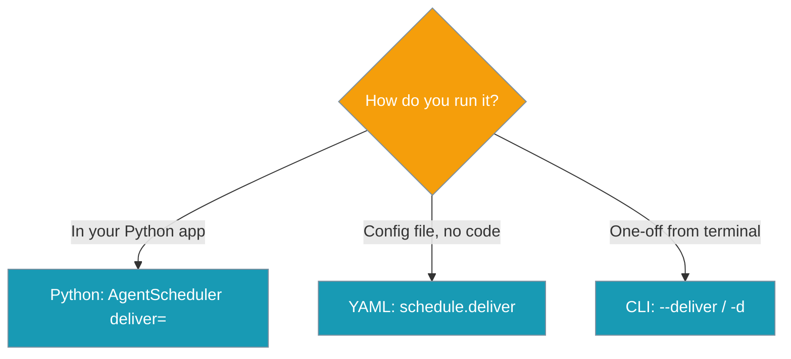
```mermaid
graph TB
    Start{How do you run it?} -->|In your Python app| Py[Python: AgentScheduler deliver=]
    Start -->|Config file, no code| Yaml[YAML: schedule.deliver]
    Start -->|One-off from terminal| Cli[CLI: --deliver / -d]

    classDef q fill:#F59E0B,stroke:#7C90A0,color:#fff
    classDef opt fill:#189AB4,stroke:#7C90A0,color:#fff

    class Start q
    class Py,Yaml,Cli opt
```

---

## Delivery Target Tokens

The `deliver` value is parsed by `DeliveryTarget.parse()` — the same serialisable model reused from the existing delivery machinery.

```
platform                          # bare platform, uses configured default channel
platform:channel_id               # concrete channel
platform:channel_id:thread_id     # threaded delivery (Slack thread ts,
                                  #   Telegram forum topic id, Discord thread id)
origin                            # persisted job origin (resolves on the lightweight path)
all                               # fan out to every bot (gateway only)
```

| Token | Meaning |
|-------|---------|
| `"telegram"` | Default (home) channel of that platform |
| `"telegram:123456"` | Specific channel / chat ID |
| `"telegram:123456:789"` | Channel `123456`, delivered into thread `789` |
| `"origin"` | Reply to the same channel/thread the schedule was created from |
| `"all"` | Fan out to every configured bot (**gateway only**) |

<Note>
`origin` now works on the lightweight scheduler path when the job has a persisted origin (`ScheduleJob.origin` — set automatically when a job is created from a bot/webhook request). It resolves to the same channel/thread the request came in on, no gateway required. If the job has **no** persisted origin, the lightweight path logs a warning and skips delivery. Only `all` still needs the full gateway — it enumerates every registered bot.
</Note>

### Thread semantics per platform

The third `:thread_id` segment threads the outbound message. `DeliveryRouter.resolve()` returns `(platform, channel_id, thread_id)` and `deliver()` passes `thread_id` into `bot.send_message(...)`. Adapters without a `thread_id` kwarg are unaffected — a guard introspects the adapter first.

| Platform | `thread_id` semantics |
|----------|-----------------------|
| Slack | Parent message `ts` (thread timestamp) |
| Telegram | Forum topic `message_thread_id` |
| Discord | Thread channel ID |
| WhatsApp | Ignored (no thread concept) |
| Others | Silently ignored — adapters without a `thread_id` kwarg are unaffected |

```python
from praisonaiagents import Agent
from praisonai.scheduler import AgentScheduler

agent = Agent(name="Notify", instructions="Post the hourly status")
AgentScheduler(agent, task="Notify", deliver="slack:C0123456:1728987654.001234").start("hourly")
# Delivers into the Slack thread rooted at message ts 1728987654.001234.
```

Swap `telegram` for `discord`, `slack`, `whatsapp`, or `signal` — the grammar is identical.

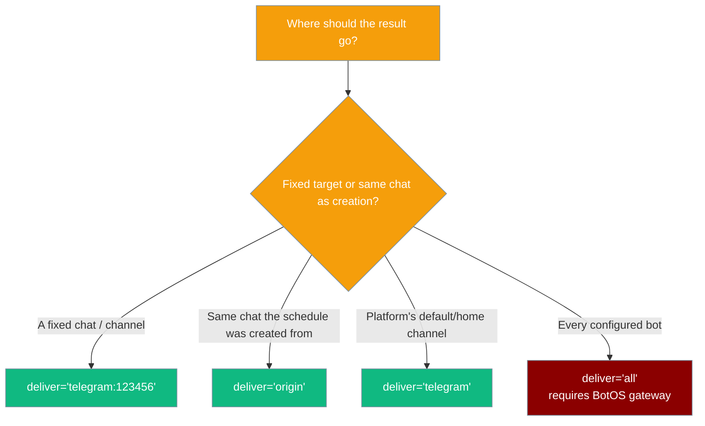
```mermaid
graph TB
    A[Where should the result go?] --> B{Fixed target or same chat as creation?}
    B -->|A fixed chat / channel| C[deliver='telegram:123456']
    B -->|Same chat the schedule was created from| D[deliver='origin']
    B -->|Platform's default/home channel| E[deliver='telegram']
    B -->|Every configured bot| F[deliver='all'<br/>requires BotOS gateway]

    classDef question fill:#F59E0B,stroke:#7C90A0,color:#fff
    classDef choice fill:#10B981,stroke:#7C90A0,color:#fff
    classDef gated fill:#8B0000,stroke:#7C90A0,color:#fff

    class A,B question
    class C,D,E choice
    class F gated
```

---

## Deliver back to the origin channel

Use `deliver="origin"` when the schedule was created from a chat and you want the recurring result to land back in that same chat — without wiring up a specific `platform:channel_id` token.

```python
from praisonaiagents import Agent
from praisonai.scheduler import AgentScheduler

agent = Agent(name="Brief", instructions="Summarise the morning news")

# Job was created from a Telegram chat — its origin is persisted on
# ScheduleJob.origin at creation. deliver="origin" delivers back to it.
scheduler = AgentScheduler(agent, task="Morning brief", deliver="origin")
scheduler.start("hourly")
```

**How origin resolution works:**

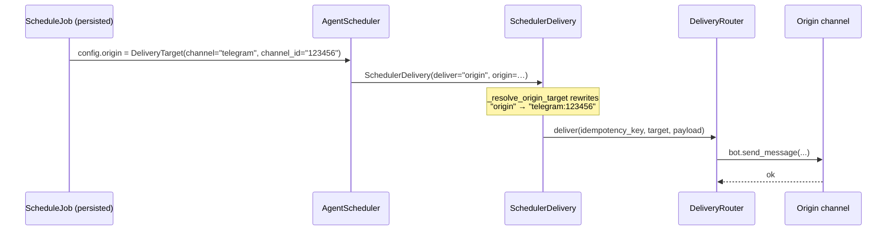
```mermaid
sequenceDiagram
    participant Job as ScheduleJob (persisted)
    participant Sched as AgentScheduler
    participant Delivery as SchedulerDelivery
    participant Router as DeliveryRouter
    participant Chat as Origin channel

    Job->>Sched: config.origin = DeliveryTarget(channel="telegram", channel_id="123456")
    Sched->>Delivery: SchedulerDelivery(deliver="origin", origin=…)
    Note over Delivery: _resolve_origin_target rewrites<br/>"origin" → "telegram:123456"
    Delivery->>Router: deliver(idempotency_key, target, payload)
    Router->>Chat: bot.send_message(...)
    Chat-->>Router: ok
```

`SchedulerDelivery.origin_from_config()` normalises the origin whether it is a live `DeliveryTarget` **or** its persisted `dict` form (from `to_dict()`), so scheduled jobs restored from disk resolve correctly too.

<Tip>
`deliver="origin"` still logs a warning and no-ops if the job was created without an origin channel — for example, a job created purely from Python code with no chat context. In that case, use an explicit `platform:channel_id` token.
</Tip>

---

## Out-of-process delivery

Scheduled delivery works out of process — a plain OS cron entry, a CI runner, or a scale-to-zero deployment — using **only** `{PLATFORM}_BOT_TOKEN`. No persistent gateway, no adapter, no live process.

```python
from praisonaiagents import Agent
from praisonai.scheduler import AgentScheduler

agent = Agent(name="Brief", instructions="Summarise the morning news")

# No gateway running. TELEGRAM_BOT_TOKEN set in env. Called from OS cron:
#   0 * * * *  TELEGRAM_BOT_TOKEN=... praisonai schedule tick
AgentScheduler(agent, task="Morning brief", deliver="telegram:123456").start("hourly")
```

The line a user puts in `crontab -e`:

```bash
# Every hour, out of process, no gateway
0 * * * *  TELEGRAM_BOT_TOKEN=xxxx praisonai schedule tick
```

Before this, running `praisonai schedule tick` out of process silently dropped delivery — the executor computed the result but its `delivery_handler` was `None`, so nothing was pushed. Now the executor falls back to a stateless, token-authenticated standalone sender when no live handler is wired. The send is no longer fire-and-forget: each HTTPS call is retried in-process on transient failures — see [Bounded in-process retry](#bounded-in-process-retry).

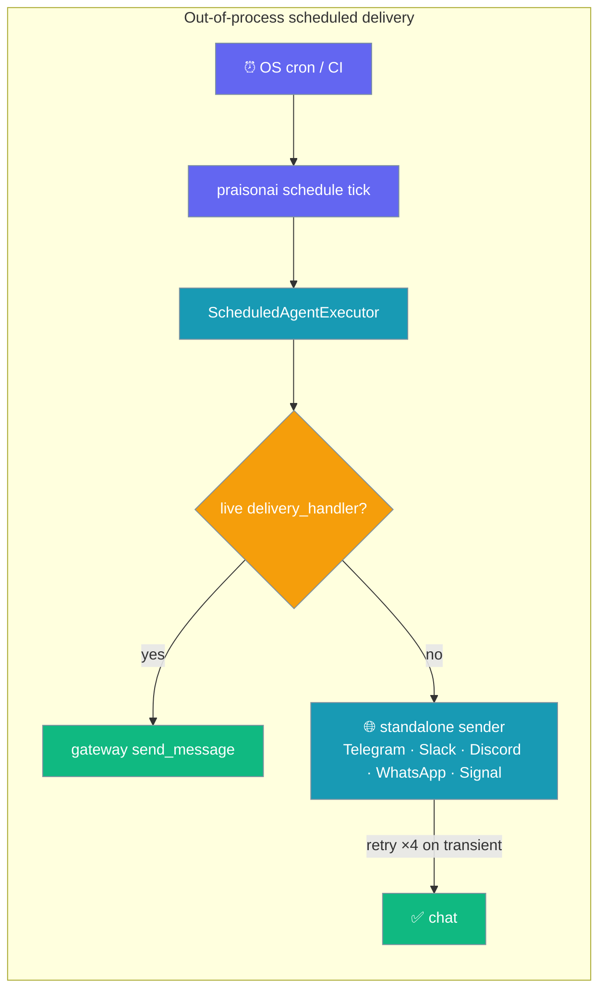
```mermaid
graph LR
    subgraph "Out-of-process scheduled delivery"
        Cron[⏰ OS cron / CI] --> Tick[praisonai schedule tick]
        Tick --> Exec[ScheduledAgentExecutor]
        Exec --> Live{live delivery_handler?}
        Live -- yes --> LiveOK[gateway send_message]
        Live -- no --> Standalone[🌐 standalone sender<br/>Telegram · Slack · Discord · WhatsApp · Signal]
        Standalone -- retry ×4 on transient --> Chat[✅ chat]
    end

    classDef trigger fill:#6366F1,stroke:#7C90A0,color:#fff
    classDef process fill:#189AB4,stroke:#7C90A0,color:#fff
    classDef branch  fill:#F59E0B,stroke:#7C90A0,color:#fff
    classDef out     fill:#10B981,stroke:#7C90A0,color:#fff

    class Cron,Tick trigger
    class Exec,Standalone process
    class Live branch
    class LiveOK,Chat out
```

<Steps>
<Step title="Set the platform token">
```bash
# Same env the live gateway uses — read at send time, not import.
export TELEGRAM_BOT_TOKEN=123456:AAE...
```
</Step>

<Step title="Run one tick from cron / CI / serverless">
```bash
# One-shot from a plain OS-cron entry — no gateway, no bots running.
praisonai schedule tick
# → each due job runs, and any deliver: telegram target is POSTed to
#   sendMessage using the token above.
```
</Step>
</Steps>

The HTTP call uses the standard-library `urllib.request`, so there is nothing to install beyond `praisonai-bot`. Each send has a 30-second timeout, and a long result is auto-chunked into multiple messages so it is never rejected by the platform's size limit.

### Environment variables

Each platform is gated by its bot token. A bare `deliver: telegram` target (no explicit chat id) resolves its channel from a home-channel env var or the gateway's persisted state file.

| Platform | Token env | Home-channel env | Platform API endpoint | Size limit | Thread field |
|---|---|---|---|---|---|
| `telegram` | `TELEGRAM_BOT_TOKEN` | `TELEGRAM_HOME_CHANNEL` | `POST https://api.telegram.org/bot{token}/sendMessage` | 4096 chars | `message_thread_id` |
| `slack` | `SLACK_BOT_TOKEN` | `SLACK_HOME_CHANNEL` | `POST https://slack.com/api/chat.postMessage` (Bearer auth) | 39000 chars | `thread_ts` |
| `discord` | `DISCORD_BOT_TOKEN` | `DISCORD_HOME_CHANNEL` | `POST https://discord.com/api/v10/channels/{id}/messages` (Bot auth) | 2000 chars | `message_reference` (`fail_if_not_exists=false`) |
| `whatsapp` | `WHATSAPP_ACCESS_TOKEN` + `WHATSAPP_PHONE_NUMBER_ID` | `WHATSAPP_HOME_CHANNEL` | `POST https://graph.facebook.com/v20.0/{phone_number_id}/messages` (Bearer auth) | 4096 chars | *(ignored — see per-platform note)* |
| `signal` | `SIGNAL_ACCOUNT`, `SIGNAL_BRIDGE_URL` *(default `http://localhost:8080`)* | `SIGNAL_HOME_CHANNEL` | `POST {SIGNAL_BRIDGE_URL}/v2/send` | 2000 chars | *(n/a)* |

Long results are split with the same markdown-aware `chunk_message` helper the live adapters use, so a result over the size limit is delivered as multiple messages instead of being rejected. On Discord, a target that carries a `thread_id` is preserved via `message_reference` (with `fail_if_not_exists=false`) so the message stays in the same conversation.

### Chat-id resolution order

`_resolve_chat_id` walks three sources in order — the first non-empty value wins.

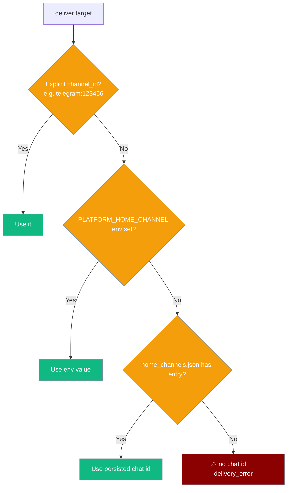
```mermaid
graph TB
    Start[deliver target] --> Explicit{Explicit channel_id?<br/>e.g. telegram:123456}
    Explicit -->|Yes| Use1[Use it]
    Explicit -->|No| Env{PLATFORM_HOME_CHANNEL env set?}
    Env -->|Yes| Use2[Use env value]
    Env -->|No| File{home_channels.json has entry?}
    File -->|Yes| Use3[Use persisted chat id]
    File -->|No| Fail[⚠️ no chat id → delivery_error]

    classDef q fill:#F59E0B,stroke:#7C90A0,color:#fff
    classDef ok fill:#10B981,stroke:#7C90A0,color:#fff
    classDef err fill:#8B0000,stroke:#7C90A0,color:#fff

    class Explicit,Env,File q
    class Use1,Use2,Use3 ok
    class Fail err
```

| Order | Source | Why |
|---|---|---|
| 1 | Explicit `channel_id` on the `deliver:` target (`telegram:123456`) | Most specific — always wins. |
| 2 | `{PLATFORM}_HOME_CHANNEL` env var | Env-first, so a deployment can override without touching gateway state. |
| 3 | `~/.praisonai/state/home_channels.json` | The gateway's persisted `HomeChannelRegistry`. A user who ran `/sethome` inside a bot chat is resolved from cron with no reconfiguration. |

### Failure modes

Nothing is hidden — a target that cannot be delivered is recorded as `delivery_error` on the run instead of being silently dropped.

| Scenario | Result |
|---|---|
| **Unroutable token at schedule creation** (missing/malformed `channel_id`, unknown platform, empty target) | `SchedulerDelivery` logs an actionable warning with `reason` + `hint`; construction still returns so callers that only want a preview aren't blocked. A caller that wants hard-fail behaviour can raise `ScheduleTargetError` explicitly. See [Creation-time validation and preview](#creation-time-validation-and-preview). |
| Token env unset | Run succeeds; `delivery_error` recorded (`"{TOKEN} not set for standalone delivery"`). |
| Bare-platform target and no `{PLATFORM}_HOME_CHANNEL` + no registry entry | Run succeeds; `delivery_error` recorded. |
| Unsupported platform (custom / entry-point / etc.) | Run succeeds; `delivery_error` recorded. |
| Slack `{"ok": false}` body | Run succeeds; `delivery_error` records the Slack error name |
| Payload > platform limit | Auto-chunked into multiple messages (see per-platform table below) |
| Live `delivery_handler` present | Live path wins; standalone sender is never invoked |

### Per-platform detail

| Platform | Token env | Home-channel env | Chunk limit | Thread mapping |
|---|---|---|---:|---|
| Telegram | `TELEGRAM_BOT_TOKEN` | `TELEGRAM_HOME_CHANNEL` | 4096 chars | `thread_id` → `message_thread_id` (forum topic) |
| Slack | `SLACK_BOT_TOKEN` | `SLACK_HOME_CHANNEL` | 39000 chars | `thread_id` → `thread_ts` (parent message ts) |
| Discord | `DISCORD_BOT_TOKEN` | `DISCORD_HOME_CHANNEL` | 2000 chars | `thread_id` → `message_reference` reply |
| WhatsApp | `WHATSAPP_ACCESS_TOKEN` + `WHATSAPP_PHONE_NUMBER_ID` | `WHATSAPP_HOME_CHANNEL` | 4096 chars | **Ignored** — WhatsApp has no thread concept; a scheduler `thread_id` is **not** a WhatsApp `context.message_id` and is deliberately dropped (see the WhatsApp note below) |
| Signal | `SIGNAL_ACCOUNT` (sender number) | `SIGNAL_HOME_CHANNEL` (recipient) | 2000 chars | Not applicable (Signal has no threads) |
| Custom / entry-point platforms | — | — | — | **Not supported** — no standalone sender, delivery raises → `delivery_error` |

Signal also reads `SIGNAL_BRIDGE_URL` (defaults to `http://localhost:8080`, matching the live [Signal Bot](/features/signal-bot) adapter) for the `signal-cli-rest-api` bridge endpoint.

#### Telegram
Set `TELEGRAM_BOT_TOKEN` and either use an explicit `deliver: telegram:<chat_id>` target or set `TELEGRAM_HOME_CHANNEL`. `thread_id` on the target maps to `message_thread_id` (forum topic).

#### Slack
Set `SLACK_BOT_TOKEN` and either use `deliver: slack:<channel_id>` or set `SLACK_HOME_CHANNEL`. `thread_id` maps to `thread_ts`. Slack returns HTTP 200 even for logical failures like a bad channel — those surface as `delivery_error` in the run record.

#### Discord
Set `DISCORD_BOT_TOKEN` and either use `deliver: discord:<channel_id>` or set `DISCORD_HOME_CHANNEL`. `thread_id` becomes a `message_reference` reply to preserve conversation context; if the referenced message is gone, delivery degrades gracefully to a normal message instead of dropping.

#### WhatsApp
Set `WHATSAPP_ACCESS_TOKEN` and `WHATSAPP_PHONE_NUMBER_ID` (the same env the live adapter reads). Target with `deliver: whatsapp:<recipient_number>` or set `WHATSAPP_HOME_CHANNEL`. The payload is a plain-text WhatsApp Cloud API message POSTed to `https://graph.facebook.com/v20.0/{phone_number_id}/messages`.

<Note>
**No reply-context from `thread_id`.** A scheduler `thread_id` is a *generic conversation identifier*, not a WhatsApp `context.message_id`. Feeding it into `context.message_id` would yield an invalid id the Cloud API rejects as a **permanent 4xx**, so the standalone sender **omits** `context` entirely — matching the live adapter (`bots/whatsapp.py`), which sets `context` only from an explicit `reply_to` inbound message id, never from `thread_id`. This is a deliberate divergence from Slack/Telegram/Discord thread mapping.
</Note>

#### Signal
End-to-end encrypted via a `signal-cli-rest-api` bridge (the same one the live [Signal Bot](/features/signal-bot) uses). Set `SIGNAL_ACCOUNT` (your linked sender number, e.g. `+15550000`) and optionally `SIGNAL_BRIDGE_URL` (defaults to `http://localhost:8080`). Target with `deliver: signal:<recipient_number_or_group>` or set `SIGNAL_HOME_CHANNEL`. The bridge must be running and reachable from wherever `praisonai schedule tick` fires — see the [Signal Bot](/features/signal-bot) page for the Docker one-liner.

### Bounded in-process retry

An ephemeral tick (cron / CI / serverless) has no persistent process to drain a durable outbox, so *durability* here is a **bounded in-process retry**. Each HTTPS send is attempted up to **4 times** with exponential backoff (1 s → 2 s → 4 s → 8 s, capped at 20 s, ±20 % jitter). A server-mandated `Retry-After` — integer-seconds *or* HTTP-date — is honoured over the computed backoff. Only transient failures (5xx, 429, network) are retried; a permanent failure (bad token, 4xx) raises on the first attempt so the executor records `delivery_error` immediately rather than burning the tick on a doomed send.

| Field | Value | Source |
|---|---|---|
| Max attempts (`_MAX_ATTEMPTS`) | `4` | `_standalone_sender.py` |
| Initial backoff | `1000 ms` | `BackoffPolicy(initial_ms=1000, ...)` |
| Max backoff | `20000 ms` | `BackoffPolicy(max_ms=20000, ...)` |
| Backoff factor | `2.0` | `BackoffPolicy(factor=2.0, ...)` |
| Jitter | `0.2` (±20 %) | `BackoffPolicy(jitter=0.2)` |
| Retry-After | Server value wins when present | `server_retry_after(exc)` |
| Classifier | Shared with interactive replies | `is_recoverable_error(exc)` |

The raw `Retry-After` header is preserved verbatim so `bots._resilience.server_retry_after` can parse **both** integer-seconds and HTTP-date forms — a plain `float(header)` would silently drop an HTTP-date delay under 429 throttling.

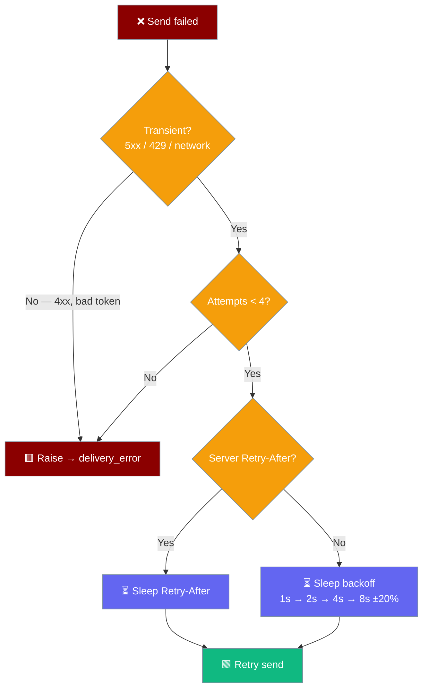
```mermaid
graph TB
    Fail[❌ Send failed] --> Recoverable{Transient?<br/>5xx / 429 / network}
    Recoverable -->|No — 4xx, bad token| FailFast[🟥 Raise → delivery_error]
    Recoverable -->|Yes| Attempts{Attempts < 4?}
    Attempts -->|No| FailFast
    Attempts -->|Yes| RetryAfter{Server Retry-After?}
    RetryAfter -->|Yes| SleepServer[⏳ Sleep Retry-After]
    RetryAfter -->|No| SleepBackoff[⏳ Sleep backoff<br/>1s → 2s → 4s → 8s ±20%]
    SleepServer --> Retry[🟩 Retry send]
    SleepBackoff --> Retry

    classDef fail fill:#8B0000,stroke:#7C90A0,color:#fff
    classDef question fill:#F59E0B,stroke:#7C90A0,color:#fff
    classDef wait fill:#6366F1,stroke:#7C90A0,color:#fff
    classDef ok fill:#10B981,stroke:#7C90A0,color:#fff

    class Fail,FailFast fail
    class Recoverable,Attempts,RetryAfter question
    class SleepServer,SleepBackoff wait
    class Retry ok
```

### End-to-end: cron deployment walkthrough

<Steps>
<Step title="Register your home channel once">
Run `/sethome` inside your Telegram bot chat. This records your chat id to `~/.praisonai/state/home_channels.json`.
</Step>

<Step title="Create a job with a bare platform target">
```bash
praisonai schedule add "morning-brief" -s hourly -m "Morning brief" --deliver telegram
```
No explicit chat id — it resolves from the persisted registry.
</Step>

<Step title="Schedule the tick in OS cron">
```bash
# crontab -e
0 * * * *  TELEGRAM_BOT_TOKEN=xxxx praisonai schedule tick
```
</Step>

<Step title="Gateway off — cron fires — message lands">
The gateway is asleep. Cron fires, the job runs, and the standalone sender resolves the chat id from the persisted registry file. The brief arrives in your chat.
</Step>
</Steps>
---

## Continuable Delivery

A delivered brief is a **conversation opener**, not a dead-end. Reply in the same chat and the agent picks up where the brief left off — with the delivered text already in context. Zero configuration, on by default.

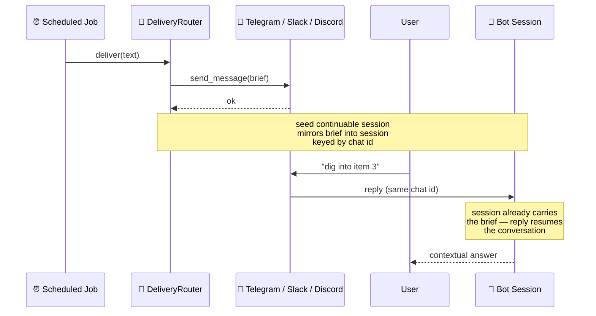
```mermaid
sequenceDiagram
    participant Cron as ⏰ Scheduled Job
    participant Router as 🔀 DeliveryRouter
    participant Chat as 💬 Telegram / Slack / Discord
    participant User
    participant Session as 🧵 Bot Session

    Cron->>Router: deliver(text)
    Router->>Chat: send_message(brief)
    Chat-->>Router: ok
    Note over Router,Session: seed continuable session<br/>mirrors brief into session<br/>keyed by chat id
    User->>Chat: "dig into item 3"
    Chat->>Session: reply (same chat id)
    Note over Session: session already carries<br/>the brief — reply resumes<br/>the conversation
    Session-->>User: contextual answer
```

**Before / after #3449:**

| Scenario | Before #3449 | After #3449 (default) |
|---|---|---|
| User replies to a delivered daily-brief with "why did revenue dip on Tuesday?" | Reply lands as a new turn — agent has no idea which report this refers to. | Reply resumes the job's session — agent sees the brief it just delivered and answers in context. |
| Config required | Manually pre-wire `session_id` on `DeliveryTarget`. | None — `continuable=True` is the default. |
| Fire-and-forget notice (e.g. "backup finished") | Same as above. | Set `continuable=False` (or `--no-continuable`) to opt out. |

### Quick start — nothing to do

Continuable delivery is default-on. Every scheduled job with a delivery target already resumes its conversation on reply:

```python
from praisonaiagents import Agent
from praisonai.scheduler import AgentScheduler

agent = Agent(name="Brief", instructions="Summarise the morning news")
AgentScheduler(agent, task="Morning brief", deliver="telegram:123456").start("hourly")

# User replies "expand on item 2" in chat 123456 → resumes the job's conversation
# with the brief already in context. No wiring, no session id, no re-briefing.
```

### Opt out for fire-and-forget alerts

Some deliveries are pure notifications ("build finished", "backup ok") — a reply should stay a fresh turn, not resume a maintenance job. Turn seeding off with a single flag:

<Note>
`cron:` schedules (like `cron:0 3 * * *` below) honour wall-clock time-of-day and survive restarts (introduced in [PR #3527](https://github.com/MervinPraison/PraisonAI/pull/3527)). Install `croniter` (`pip install croniter`) to enable this — without it the wrapper falls back to a coarse interval and warns once. See [Wall-clock cron](/docs/features/async-agent-scheduler#wall-clock-cron).
</Note>

<Tabs>
<Tab title="CLI">
```bash
praisonai schedule add "backup-alert" \
  -s "cron:0 3 * * *" \
  -m "Backup ok" \
  --deliver "slack:C012345" \
  --no-continuable
```
</Tab>
<Tab title="Tool">
```python
from praisonaiagents.tools import schedule_add

schedule_add(
    name="backup-alert",
    schedule="cron:0 3 * * *",
    message="Backup ok",
    deliver="slack:C012345",
    continuable=False,      # fire-and-forget notification
)
```
</Tab>
<Tab title="Python">
```python
from praisonaiagents.scheduler.models import DeliveryTarget, ScheduleJob, Schedule

job = ScheduleJob(
    name="backup-alert",
    schedule=Schedule(kind="cron", cron_expr="0 3 * * *"),
    message="Backup ok",
    delivery=DeliveryTarget(
        channel="slack",
        channel_id="C012345",
        continuable=False,   # opt out — reply lands as a fresh turn
    ),
)
```
</Tab>
</Tabs>

### The seed contract

Given a successful delivery of `text` to `channel:channel_id`, the gateway seeds a resumable session:

| Precondition | What the gateway does |
|---|---|
| `continuable is True` (default) | Mirrors `text` into the destination bot's session under the delivery chat id. The user's next message in this chat resumes the conversation. |
| `continuable is False` | Skips seeding entirely. Reply lands as a brand-new, contextless turn. |
| Delivery **failed** (any path) | Does **not** seed. Nothing was delivered, so nothing is claimed to have been. |
| Seeding raises (session missing, adapter oddity) | Logs a single `debug` line and returns. The delivery has already succeeded and remains committed — a seeding failure never breaks it. |
| Intentional-silence run (`NO_REPLY` / `[SILENT]` / `SILENT`) | Delivery is skipped — no delivery, no seed. See [Intentional Silence](#intentional-silence). |

<Note>
The `continuable` field is a **declarable contract**. Core (`praisonaiagents/scheduler/models.py`) owns the field and its round-trip; the actual seeding runs in the `praisonai-bot` gateway. Deployments running the scheduler without the bot wrapper (direct scheduler → agent, no gateway) still round-trip the field and honour the opt-out, but there is no session to seed.
</Note>

### Configuration options

| Option | Where | Type | Default | Description |
|---|---|---|---|---|
| `continuable` | `DeliveryTarget(continuable=…)` | `bool` | `True` | When `True`, seed the destination bot's session with the delivered brief so a reply resumes the job's conversation. Set `False` for pure fire-and-forget notifications. |
| `continuable` | `schedule_add(…, continuable=…)` | `bool` | `True` | Threaded through to the constructed `DeliveryTarget`. |
| `--continuable / --no-continuable` | `praisonai schedule add` | flag | `--continuable` | Applied only when a delivery target is configured; a no-op on jobs with no delivery. |

**Serialisation.** `DeliveryTarget.to_dict()` persists `continuable` **only when it is `False`** — the default is implied by absence, so existing on-disk schedule stores are byte-for-byte unchanged. `from_dict()` treats a missing field as `True`, so restored legacy jobs immediately gain the new behaviour on next fire.

### When to opt out

<AccordionGroup>
  <Accordion title="Pure status alerts">
    Backup finished, deploy succeeded, monitoring "ok" heartbeat. There is no conversation to have — the reply, if any, is an unrelated command. Use `--no-continuable` so the chat context stays fresh.
  </Accordion>
  <Accordion title="Fan-out to shared channels (deliver=&quot;all&quot;)">
    A broadcast to every home channel implies the recipients aren't a single continuing conversation. Seeding runs once per destination `channel:channel_id`, so a shared/group chat resumes the *last* fire's context, not per-participant. If replies in the shared chat are noise, prefer `--no-continuable`.
  </Accordion>
  <Accordion title="Sub-minute ticks">
    A tight loop that seeds on every fire would overwrite the session before the user can read it. Prefer `--no-continuable` (or a coarser schedule) for high-frequency jobs.
  </Accordion>
  <Accordion title="Recurring briefs and digests (leave it on)">
    Recurring briefs, digests, standing reports, sensor summaries — the reader almost always wants to reply to the *thing they just read*. Leave continuable on.
  </Accordion>
</AccordionGroup>

---

## How It Works

The scheduler runs the agent, then hands the result to `SchedulerDelivery`, which resolves the token and sends through the shared `DeliveryRouter`.

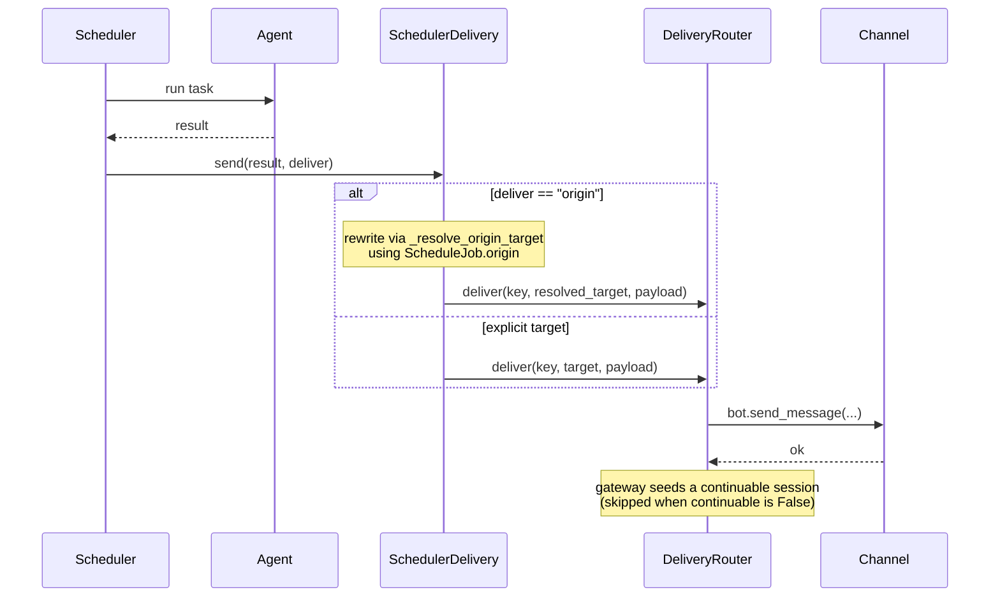
```mermaid
sequenceDiagram
    participant Scheduler
    participant Agent
    participant SchedulerDelivery
    participant DeliveryRouter
    participant Channel

    Scheduler->>Agent: run task
    Agent-->>Scheduler: result
    Scheduler->>SchedulerDelivery: send(result, deliver)
    alt deliver == "origin"
        Note over SchedulerDelivery: rewrite via _resolve_origin_target<br/>using ScheduleJob.origin
        SchedulerDelivery->>DeliveryRouter: deliver(key, resolved_target, payload)
    else explicit target
        SchedulerDelivery->>DeliveryRouter: deliver(key, target, payload)
    end
    DeliveryRouter->>Channel: bot.send_message(...)
    Channel-->>DeliveryRouter: ok
    Note over DeliveryRouter: gateway seeds a continuable session<br/>(skipped when continuable is False)
```

Under the full gateway a live `delivery_handler` is wired. Run `praisonai schedule tick` out of process (cron / CI / serverless) and there is no live handler — the executor falls back to a per-platform standalone sender instead. See [Out-of-process delivery](#out-of-process-delivery).

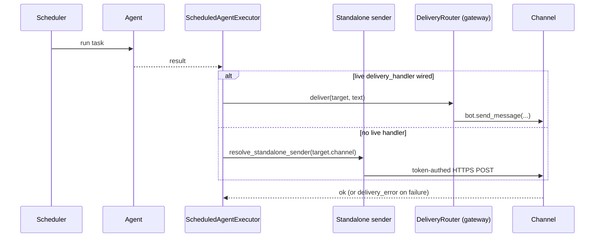
```mermaid
sequenceDiagram
    participant Scheduler
    participant Agent
    participant Exec as ScheduledAgentExecutor
    participant Standalone as Standalone sender
    participant Router as DeliveryRouter (gateway)
    participant Channel

    Scheduler->>Agent: run task
    Agent-->>Exec: result
    alt live delivery_handler wired
        Exec->>Router: deliver(target, text)
        Router->>Channel: bot.send_message(...)
    else no live handler
        Exec->>Standalone: resolve_standalone_sender(target.channel)
        Standalone->>Channel: token-authed HTTPS POST
    end
    Channel-->>Exec: ok (or delivery_error on failure)
```

`SchedulerDelivery` is built once per scheduler and reused across runs, so the router's idempotency cache and rate limiters persist between ticks. After a successful delivery, a gateway-hosted job also seeds a resumable session so a reply resumes the conversation — see [Continuable Delivery](#continuable-delivery).

---

## Intentional Silence

A scheduled run whose entire output is exactly `NO_REPLY`, `[SILENT]`, or `SILENT` skips delivery — nothing is pushed to the chat target. The run is still recorded as `succeeded` in scheduler history and metrics.

```python
from praisonaiagents import Agent
from praisonai.scheduler import AgentScheduler

agent = Agent(
    name="Watchdog",
    instructions=(
        "Every hour, check the log file for new ERROR lines. "
        "If there are none, reply with exactly: NO_REPLY. "
        "Otherwise summarise the errors."
    ),
)
AgentScheduler(agent, task="Hourly check", deliver="telegram:123456").start("hourly")
```

The noisy `NO_REPLY` control token is never posted to the channel — the tick just doesn't produce any message.

<Note>
`no_change` is a distinct silent-suppress outcome from a generic `run=False` skip. A [change-detection monitor](/features/scheduler-monitor) records `no_change` when a watched source is unchanged — the model turn never runs, so there's nothing to deliver. Intentional silence, by contrast, runs the model and suppresses only the delivery.
</Note>

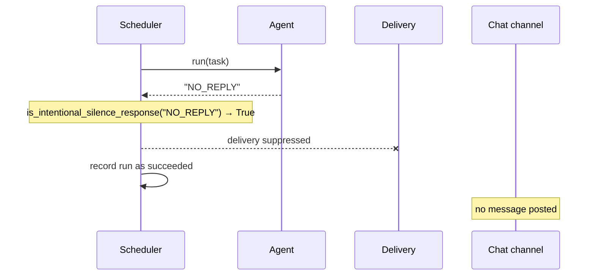
```mermaid
sequenceDiagram
    participant Sched as Scheduler
    participant Agent
    participant Delivery
    participant Chat as Chat channel

    Sched->>Agent: run(task)
    Agent-->>Sched: "NO_REPLY"
    Note over Sched: is_intentional_silence_response("NO_REPLY") → True
    Sched--xDelivery: delivery suppressed
    Sched->>Sched: record run as succeeded
    Note over Chat: no message posted
```

| Agent output | Delivery |
|---|---|
| `NO_REPLY` (exact, case-insensitive, whitespace-trimmed) | Suppressed |
| `[SILENT]` / `SILENT` | Suppressed |
| `I think NO_REPLY is a good idea` (prose) | Delivered normally |
| Any other text | Delivered normally |

The marker check calls `is_intentional_silence_response` from `praisonaiagents.bots.silence` — the same primitive the chat-bot path uses. **All three unattended paths honour it via the shared `_BaseAgentScheduler._should_suppress_delivery` helper:** `AgentScheduler._deliver_result` (sync lightweight), `AsyncAgentScheduler._deliver_result` (async lightweight, wired in [PraisonAI #3420](https://github.com/MervinPraison/PraisonAI/issues/3420)), and the full-gateway `ScheduledAgentExecutor`.

| Path | Silence marker suppressed |
|------|---------------------------|
| `AgentScheduler` (sync lightweight) | ✅ Yes |
| `AsyncAgentScheduler` (async lightweight) | ✅ Yes (fixed in #3420) |
| `ScheduledAgentExecutor` (full gateway) | ✅ Yes |

<Note>
Unlike the [chat-bot path](/features/bot-intentional-silence) — where silence is opt-in via `allow_silence: true` — the scheduled delivery path honours silence markers **unconditionally**. An unattended monitor should never post the raw control token to a channel, so there is no `allow_silence` toggle for the scheduler.
</Note>

<Note>
A [Scheduler Monitor](/features/scheduler-monitor) job that finds its watched source unchanged records a `no_change` status — the delivery is suppressed silently (no ping, no tokens), distinct from a `skipped` gate outcome.
</Note>

---

## Creation-time validation and preview

A scheduled job now pre-flights its delivery target at creation, so "where will this go?" is answered before it ever fires — an unroutable token surfaces an actionable warning the moment you create the schedule, instead of being silently dropped at fire time.

```python
from praisonaiagents import Agent
from praisonai.scheduler import AgentScheduler

agent = Agent(name="Brief", instructions="Summarise the morning news")
AgentScheduler(agent, task="Morning brief", deliver="telegram:123456").start("hourly")
# → logs: Scheduled -> telegram:123456
```

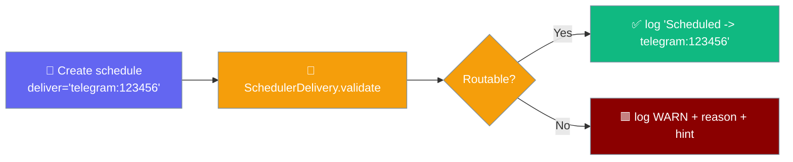
```mermaid
graph LR
    Create[📝 Create schedule<br/>deliver='telegram:123456'] --> Validate[🔀 SchedulerDelivery.validate]
    Validate --> Routable{Routable?}
    Routable -->|Yes| Log[✅ log 'Scheduled -> telegram:123456']
    Routable -->|No| Warn[🟥 log WARN + reason + hint]

    classDef input fill:#6366F1,stroke:#7C90A0,color:#fff
    classDef process fill:#F59E0B,stroke:#7C90A0,color:#fff
    classDef success fill:#10B981,stroke:#7C90A0,color:#fff
    classDef failure fill:#8B0000,stroke:#7C90A0,color:#fff

    class Create input
    class Validate,Routable process
    class Log success
    class Warn failure
```

The pre-flight runs the moment `AgentScheduler` (or the `SchedulerDelivery` wrapper) is constructed — before the first tick.

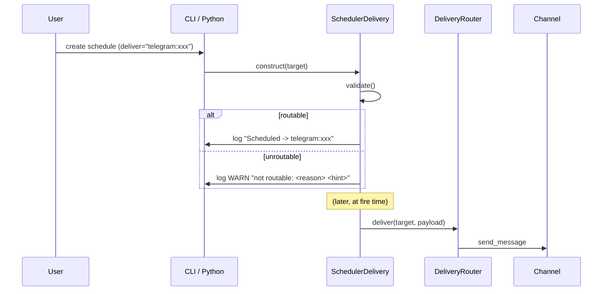
```mermaid
sequenceDiagram
    participant User
    participant Sched as CLI / Python
    participant Delivery as SchedulerDelivery
    participant Router as DeliveryRouter
    participant Channel

    User->>Sched: create schedule (deliver="telegram:xxx")
    Sched->>Delivery: construct(target)
    Delivery->>Delivery: validate()
    alt routable
        Delivery->>Sched: log "Scheduled -> telegram:xxx"
    else unroutable
        Delivery->>Sched: log WARN "not routable: <reason> <hint>"
    end
    Note over Delivery: (later, at fire time)
    Delivery->>Router: deliver(target, payload)
    Router->>Channel: send_message
```

### Which primitive do I reach for?

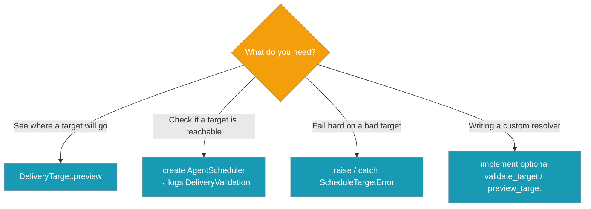
```mermaid
graph TB
    Q{What do you need?} -->|See where a target will go| Preview[DeliveryTarget.preview]
    Q -->|Check if a target is reachable| Validate[create AgentScheduler<br/>→ logs DeliveryValidation]
    Q -->|Fail hard on a bad target| Error[raise / catch ScheduleTargetError]
    Q -->|Writing a custom resolver| Resolver[implement optional<br/>validate_target / preview_target]

    classDef q fill:#F59E0B,stroke:#7C90A0,color:#fff
    classDef opt fill:#189AB4,stroke:#7C90A0,color:#fff

    class Q q
    class Preview,Validate,Error,Resolver opt
```

### Preview grammar

`DeliveryTarget.preview()` is pure and dependency-free — nothing is fetched, so it is safe to call before the gateway is up. It renders the resolved destination as one of:

| Rendering | When |
|---|---|
| `platform:channel_id` | Explicit channel (e.g. `telegram:@alice`) |
| `platform:channel_id:thread_id` | Explicit channel + thread (e.g. `telegram:123:789`) |
| `origin` / `all` | Symbolic routing tokens, preserved verbatim |
| `<unrouted>` | An empty/no-op target with no resolvable destination |

Pass `session_target="main"` (or `"isolated"`) to append a ` (session <id>)` suffix when the caller knows the session hint.

```python
from praisonaiagents.scheduler import DeliveryTarget

target = DeliveryTarget.parse("telegram:@alice")
print(target.preview())                       # → telegram:@alice
print(target.preview(session_target="main"))  # → telegram:@alice (session main)
```

### The validation result

Creating an `AgentScheduler` with a `deliver=` token pre-flights it and logs the outcome. That outcome is a frozen `DeliveryValidation` — the structured answer to "will this route?" — with four fields:

| Field | Type | Meaning |
|---|---|---|
| `ok` | `bool` | `True` when the target resolves to a reachable route |
| `reason` | `str` | On failure, why it is unroutable (empty when `ok`) |
| `hint` | `str` | On failure, the actionable next step (empty when `ok`) |
| `preview` | `str` | Dry-run preview of the destination |

A routable target logs `Scheduled -> <preview>` at info level; an unroutable one logs a warning carrying `reason` and `hint`.

```python
from praisonaiagents import Agent
from praisonai.scheduler import AgentScheduler

agent = Agent(name="Brief", instructions="Summarise the morning news")

# Routable → logs: Scheduled -> telegram:123456
AgentScheduler(agent, task="Morning brief", deliver="telegram:123456").start("hourly")

# Unroutable → logs a warning with the reason and an actionable hint
AgentScheduler(agent, task="Morning brief", deliver="all").start("hourly")
```

### Fail-fast with `ScheduleTargetError`

Creating a scheduler with an unroutable token **logs an actionable warning but does not raise** — so a caller that only wants a preview isn't blocked. When you want hard-fail behaviour, raise `ScheduleTargetError` yourself with the structured `reason` / `hint`:

```python
from praisonaiagents.gateway import ScheduleTargetError

def require_routable(preview: str, reason: str = "", hint: str = "") -> None:
    if reason:
        raise ScheduleTargetError(reason, hint)

try:
    require_routable(
        preview="all",
        reason="symbolic target 'all' cannot be resolved by the lightweight path",
        hint="Use a 'platform' or 'platform:channel_id' token.",
    )
except ScheduleTargetError as e:
    # e.reason and e.hint are structured, actionable strings
    print(f"cannot schedule: {e.reason} — {e.hint}")
```

<Note>
`ScheduleTargetError` **subclasses `ValueError`**, so any existing `except ValueError` handler keeps catching it — you can adopt the structured `reason` / `hint` fields incrementally.
</Note>

### Custom resolvers

A custom delivery resolver can opt into creation-time pre-flight by implementing the optional `validate_target()` and `preview_target()` methods from `DeliveryPreflightProtocol`. Both are backward-compatible — a resolver that implements only `resolve()` still satisfies `DeliveryResolverProtocol` and keeps working exactly as before; callers duck-type on the pre-flight methods and fall back to the structural `DeliveryTarget.preview()` check when they are absent. See the [scheduler SDK reference](/sdk/praisonai/scheduler) for the exact signatures.

---

## Reliability Guarantees

Delivery reuses the existing `DeliveryRouter`, so scheduled sends inherit the gateway's guarantees.

| Guarantee | What it means |
|-----------|---------------|
| **Creation-time pre-flight** | Unroutable delivery tokens surface a warning the moment the schedule is created — no more silent drops on the first fire. Fire-time dead-target self-heal remains the second line of defence. See [Creation-time validation and preview](#creation-time-validation-and-preview). |
| **Rate limiting** | Inherits the router's per-platform token-bucket limits |
| **Idempotency dedup — lightweight `AgentScheduler`** | Router LRU (in-process). A re-fired job delivering the same result to the same target is deduplicated within one process. |
| **Idempotency dedup — gateway-hosted scheduled/proactive delivery** | Durable — enqueued via SQLite `OutboundQueue` at `~/.praisonai/state/gateway_outbox.sqlite`. Survives a crash-and-restart: a re-fired job is a no-op INSERT that resolves to the already-`sent` row. Falls back to the router LRU only if the durable store cannot be built. |
| **Dead-target self-heal** | The router retries and skips/marks dead targets |
| **Graceful degradation** | When `praisonai-bot` is not installed, a single warning is logged and delivery no-ops — the scheduled run itself never fails |
| **Out-of-process delivery** | When no live `delivery_handler` is wired (cron / CI / serverless), delivery falls back to a per-platform standalone HTTPS sender (Telegram / Slack / Discord / **WhatsApp** / **Signal**). Uses only the platform's own env (`{PLATFORM}_BOT_TOKEN`, or the WhatsApp / Signal env vars) — no adapter, no persistent process. Each send is retried in-process up to 4 times with exponential backoff on transient failures (5xx / 429 / network), honouring a server-mandated `Retry-After`; a permanent failure (bad token, 4xx) records `delivery_error` on the first attempt. See [Out-of-process delivery](#out-of-process-delivery) and [Bounded in-process retry](#bounded-in-process-retry). |
| **Intentional silence** | An exact `NO_REPLY` / `[SILENT]` / `SILENT` output suppresses delivery; the run is still recorded as `succeeded` |
| **Continuable delivery** | On successful delivery of a `continuable` target, the gateway seeds a resumable session keyed to the reply address. A seed failure logs and never breaks the delivery — the brief still lands. |
| **No silent drops** | A configured delivery target that cannot be delivered (missing token, unsupported platform, Slack logical error, etc.) is recorded as `delivery_error` on the run — never silently dropped. |

On the gateway-hosted scheduled path, delivery is enqueued into a durable SQLite outbox at `~/.praisonai/state/gateway_outbox.sqlite` before it reaches the router. Its `UNIQUE` idempotency key survives a process restart, so the exact crash window a scheduler must survive (fire → deliver → crash → restart → re-fire) is deduplicated without a double-post. A pre-crash send that never landed stays retryable and is delivered at-least-once on the next tick. If the outbox cannot be built (missing dependency or permission error) the path falls back to the router's in-process LRU exactly as before.

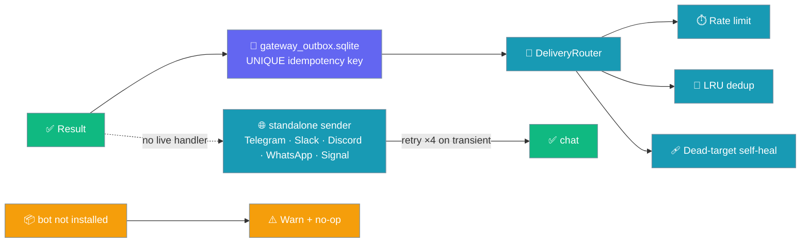
```mermaid
graph LR
    Result[✅ Result] --> Outbox[💾 gateway_outbox.sqlite\nUNIQUE idempotency key]
    Outbox --> Router[🔀 DeliveryRouter]
    Router --> Rate[⏱️ Rate limit]
    Router --> Dedup[🔁 LRU dedup]
    Router --> Heal[🩹 Dead-target self-heal]
    Result -. no live handler .-> Standalone[🌐 standalone sender<br/>Telegram · Slack · Discord · WhatsApp · Signal]
    Standalone -- retry ×4 on transient --> Chat[✅ chat]
    Missing[📦 bot not installed] --> NoOp[⚠️ Warn + no-op]

    classDef ok fill:#10B981,stroke:#7C90A0,color:#fff
    classDef proc fill:#189AB4,stroke:#7C90A0,color:#fff
    classDef store fill:#6366F1,stroke:#7C90A0,color:#fff
    classDef warn fill:#F59E0B,stroke:#7C90A0,color:#fff

    class Result,Chat ok
    class Router,Rate,Dedup,Heal,Standalone proc
    class Outbox store
    class Missing,NoOp warn
```

---

## Common Patterns

### Deliver from a blueprint

```python
from praisonai.scheduler import AgentScheduler

scheduler = AgentScheduler.from_blueprint(
    "morning-brief",
    slots={"hour": 8, "weekdays": "mon-fri"},
    deliver="telegram",
)
scheduler.start(scheduler._yaml_schedule_config["interval"])
```

`deliver=` on `from_blueprint` overrides the blueprint's default delivery target.

### Deliver to a thread

```python
from praisonaiagents import Agent
from praisonai.scheduler import AgentScheduler

agent = Agent(name="Standup", instructions="Post the daily standup summary")
AgentScheduler(agent, task="Standup", deliver="discord:555:thread-42").start("daily")
```

Attachments produced by the job (media returned by the agent) now travel into the same thread — parity with text delivery is preserved on Slack, Telegram, and Discord. See [Outbound Media Delivery](/features/outbound-media-delivery) for the thread grammar.

### Fire-and-forget notice

```bash
praisonai schedule add "backup-notice" -s daily \
  -m "post the backup-complete notice" \
  --deliver slack:C0123456 \
  --no-continuable
```

Use `--no-continuable` when a reply should not resume the job — the reply starts a fresh session, matching pre-#3449 behaviour.

### Out-of-process cron entry

Deliver a morning brief without keeping a gateway process alive — set the token env vars in the crontab and call `praisonai schedule tick`.

```bash
# crontab -e
# Deliver a morning brief without keeping a gateway process alive.
TELEGRAM_BOT_TOKEN=123456:AAE...
TELEGRAM_HOME_CHANNEL=-100555
0 8 * * * cd /srv/praisonai && praisonai schedule tick
```

```yaml
# .praisonai/schedules/morning-brief.yaml (or the same YAML you'd use elsewhere)
name: morning-brief
schedule:
  cron: "0 8 * * *"
message: "Summarise overnight alerts"
deliver: "telegram"          # → resolved to TELEGRAM_HOME_CHANNEL out-of-process
```

See [Out-of-process delivery](#out-of-process-delivery) for the full contract.

---

## Best Practices

<AccordionGroup>
<Accordion title="Use an explicit channel ID for scheduled jobs">
`telegram:123456` targets a fixed chat and works without any request context.

`origin` now works on the lightweight scheduler path **when the job has a persisted origin** (`ScheduleJob.origin`, set automatically when the job is created from a bot/webhook request) — it resolves to the same channel/thread the request came in on, no gateway required. `all` still needs the full gateway. For jobs created outside a bot request (no persisted origin), prefer an explicit `platform:channel_id` token.
</Accordion>

<Accordion title="Install the bot extra to enable delivery">
Delivery needs the `praisonai-bot` package. Without it, the scheduled run still executes — only the push is skipped, with one warning. With the package installed you get two delivery paths automatically: the **live gateway path** when a `delivery_handler` is wired, and the **standalone sender** for Telegram / Slack / Discord / WhatsApp / Signal when running unattended (cron / CI / serverless). Each path honours the platform's own env (`{PLATFORM}_BOT_TOKEN`, or the WhatsApp / Signal env vars). See [Out-of-process delivery](#out-of-process-delivery).
</Accordion>

<Accordion title="Reuse one scheduler instance per job">
The router's idempotency cache and rate limiters live on the scheduler's delivery helper. Keep a single scheduler running so repeated identical results to the same target are deduplicated instead of re-sent.
</Accordion>

<Accordion title="Pick the surface that matches how you deploy">
Use Python inside an app, YAML for a config-file deploy, and the CLI for one-off terminal jobs — all three accept the same `deliver` token grammar.
</Accordion>
</AccordionGroup>

---

## Related

<CardGroup cols={2}>
<Card title="Async Agent Scheduler" icon="clock" href="/features/async-agent-scheduler">
  Run agents on a recurring schedule with async execution
</Card>
<Card title="Pre-Run Gate" icon="filter" href="/features/scheduler-pre-run-gate">
  Skip ticks when a cheap check says nothing to do
</Card>
<Card title="Scheduler Monitor" icon="eye" href="/features/scheduler-monitor">
  Deliver only when a watched source changed — silence on `no_change`
</Card>
<Card title="Context Chaining" icon="link" href="/features/scheduler-context-chaining">
  Feed one job's output into the next — the final stage delivers
</Card>
<Card title="Schedule CLI" icon="terminal" href="/cli/schedule">
  The `--deliver` / `-d` flag and other schedule commands
</Card>
<Card title="Gateway Inbound Hooks" icon="webhook" href="/features/gateway-inbound-hooks">
  Shares the same delivery target format
</Card>
<Card title="DeliveryTarget SDK reference" icon="code" href="/sdk/praisonai/scheduler">
  Field-level detail for `DeliveryTarget`, `preview()`, and `DeliveryValidation`
</Card>
</CardGroup>
