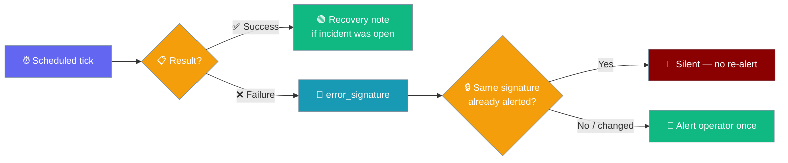
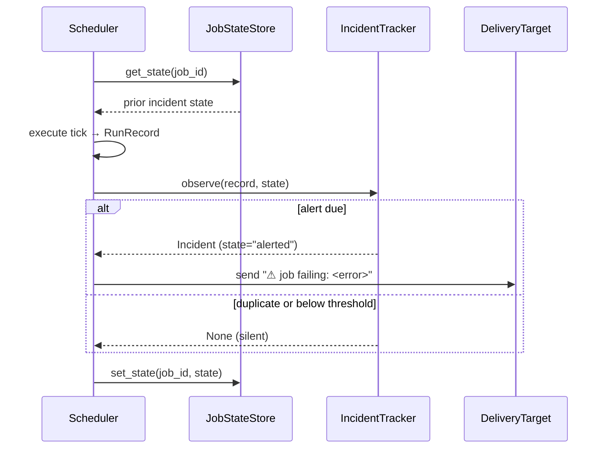
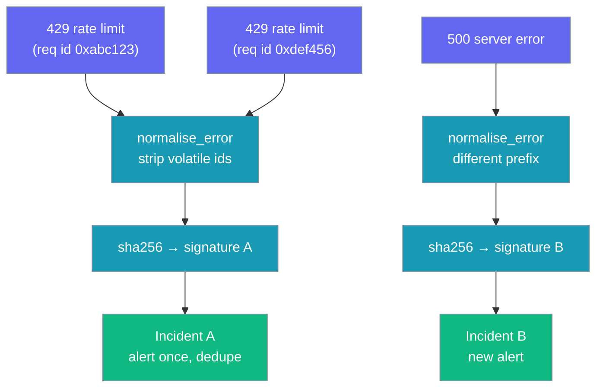
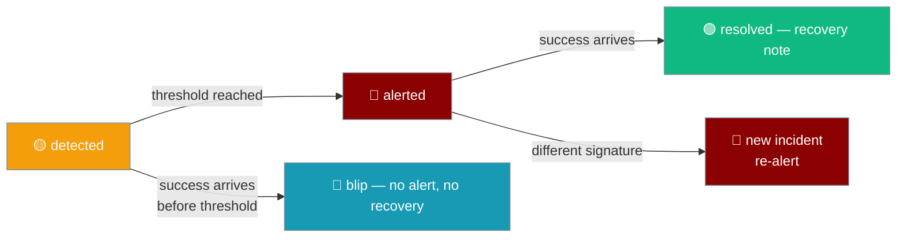
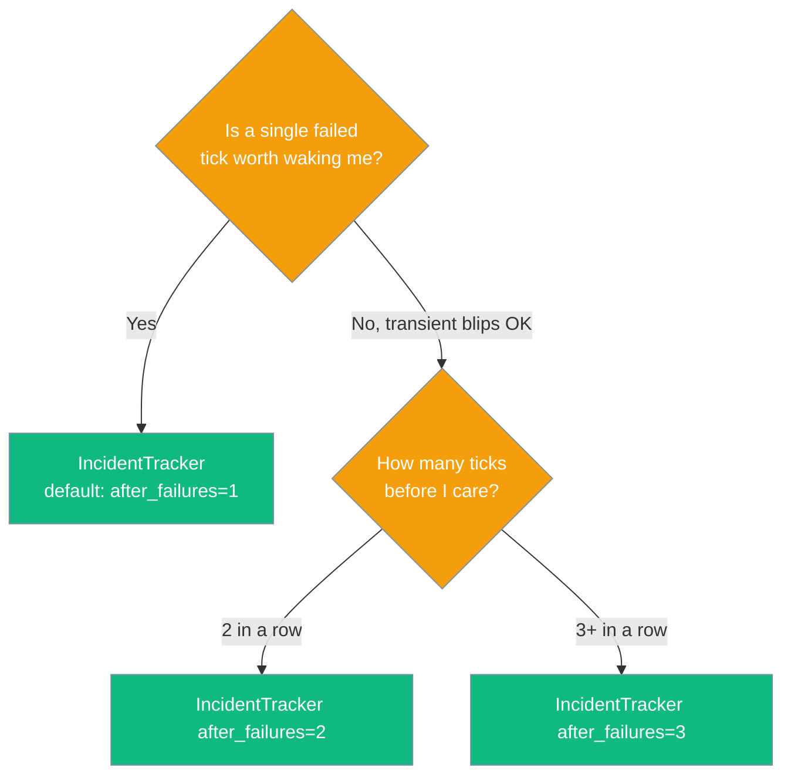

Turn a stream of scheduled-run failures into a single de-duped operator alert — one ping when a nightly job breaks, one when it recovers, nothing in between.



## Quick Start

<Steps>
<Step title="Just enable it">

Incidents ride on top of the scheduler notepad, so the wrapper attaches the tracker automatically when you run from the scheduler.

```python
from praisonaiagents import Agent

agent = Agent(
    name="nightly-brief",
    instructions="Summarise overnight repo activity.",
)

# Deliver runs to Slack; the wrapper attaches incident tracking automatically,
# so a broken nightly job pings the channel once — not every night at 2 a.m.
agent.start("Every day at 02:00, brief last-night activity to slack:#eng.")
```

</Step>

<Step title="Drive ticks yourself">

Use the pure tracker when you drive ticks (custom runner, tests, out-of-process cron).

```python
from praisonaiagents.scheduler import IncidentTracker
from praisonaiagents.scheduler.models import RunRecord

tracker = IncidentTracker()          # default: alert on the first failure
state = {}                            # small dict — persist through JobStateStoreProtocol

# Nightly job fails with the same 429 for three ticks in a row.
alert = tracker.observe(RunRecord(job_id="nightly", status="failed", error="429 rate limit (req id 0xabc123)"), state)
if alert:
    deliver_to_operator(f"⚠ Nightly job failing: {alert.error}")

# Next two ticks: identical failure → no re-alert.
tracker.observe(RunRecord(job_id="nightly", status="failed", error="429 rate limit (req id 0xdef456)"), state)  # None
tracker.observe(RunRecord(job_id="nightly", status="failed", error="429 rate limit (req id 0x999abc)"), state)  # None

# Next success closes the incident → single recovery note.
resolved = tracker.observe(RunRecord(job_id="nightly", status="succeeded"), state)
if resolved:
    deliver_to_operator("✅ Nightly job recovered")
```

</Step>

<Step title="Tolerate transient blips">

```python
from praisonaiagents.scheduler import IncidentTracker

# Alert only after the same failure repeats 3 ticks in a row.
tracker = IncidentTracker(after_failures=3)
```

</Step>
</Steps>

---

## How It Works

The scheduler loads per-job state, runs the tick, folds the resulting `RunRecord` through the tracker, and delivers only when an alert is due.



| Run status | Tracker action |
|------------|----------------|
| `failed` (new signature) | Mints an incident; alerts once when threshold is met |
| `failed` (same signature) | Advances counters; stays silent |
| `succeeded` (incident open) | Resolves it; sends one recovery note |
| `succeeded` (nothing open) | No-op |
| `skipped` / `no_change` | Ignored — neither failure nor recovery |

---

## What Counts As "The Same" Failure

Failures collapse to one incident when their `error_signature` matches, and `normalise_error` strips only the volatile parts of a message before hashing.



| Input token type | Stripped? | Why |
| --- | --- | --- |
| Hex blobs (`0xDEADBEEF`) / long hex ids (>=8 chars) | Yes | Request ids, hashes — volatile per retry |
| Long digit runs (>=4 digits) | Yes | Timestamps, epochs, pids, ports — volatile |
| Numbers fused into words (`worker3`, `id42`) | Yes | Identifier-like fragments — volatile |
| Short standalone codes (1–3 digits, e.g. `404`, `500`, exit `12`) | **No** | Meaningful category — different codes must re-alert |
| Whitespace | Collapsed | Cosmetic |

The normaliser then keeps a prefix of the first 200 chars and `sha256`s it.

```python
from praisonaiagents.scheduler import error_signature

# Same signature — only the request id changed.
assert error_signature("429 rate limit (req id 0xabc123def456)") == \
       error_signature("429 rate limit (req id 0x99900012345a)")

# Different signature — a status-code change must re-alert.
assert error_signature("HTTP 404 not found") != \
       error_signature("HTTP 500 server error")
```

---

## Tolerating Transient Blips

Set `after_failures=N` to alert only when the same failure repeats N ticks in a row — a single flaky tick that recovers never pages you.



```python
from praisonaiagents.scheduler import IncidentTracker
from praisonaiagents.scheduler.models import RunRecord

tracker = IncidentTracker(after_failures=3)
state = {}

tracker.observe(RunRecord(job_id="poll", status="failed", error="boom"), state)  # None
tracker.observe(RunRecord(job_id="poll", status="failed", error="boom"), state)  # None
alert = tracker.observe(RunRecord(job_id="poll", status="failed", error="boom"), state)  # alerts now
assert alert.count == 3
```

<Note>A blip that recovers before the threshold never alerted, so it sends **no** recovery note either.</Note>

Pick a threshold with this decision tree:



---

## Wiring the Alert

The returned `Incident` carries the raw `error` for the alert body; hand it to the job's existing [delivery target](/features/scheduler-delivery) — there is no new delivery API.

```python
from praisonaiagents.scheduler import IncidentTracker
from praisonaiagents.scheduler.models import RunRecord

tracker = IncidentTracker()
state = {}

def deliver_to_operator(text):
    ...  # reuse the job's DeliveryTarget (e.g. slack:#eng)

record = RunRecord(job_id="nightly", job_name="Nightly", status="failed", error="429 rate limit")
incident = tracker.observe(record, state)
if incident:
    deliver_to_operator(f"⚠ {incident.job_name} failing: {incident.error}")
```

---

## Configuration Options

`IncidentTracker` takes one option.

| Option | Type | Default | Description |
| --- | --- | --- | --- |
| `after_failures` | `int` | `1` | Alert only after this many *consecutive* failures of the same signature. Values below 1 are treated as 1. |

Each incident is a small dataclass persisted per job.

| Field | Type | Default | Description |
| --- | --- | --- | --- |
| `job_id` | `str` | — | ID of the failing job. |
| `signature` | `str` | — | Stable `error_signature` grouping the failures. |
| `state` | `Literal["detected","alerted","resolved"]` | `"detected"` | Lifecycle state. |
| `error` | `Optional[str]` | `None` | Most recent raw error message (for the alert body). |
| `first_seen` | `float` | `time.time()` | Epoch seconds of the first failure. |
| `last_seen` | `float` | `time.time()` | Epoch seconds of the most recent failure. |
| `count` | `int` | `0` | Number of failing ticks grouped into this incident. |
| `job_name` | `str` | `""` | Human-readable job name for display. |

<CardGroup cols={2}>
  <Card icon="code" href="/docs/sdk/reference/praisonaiagents/classes/IncidentTracker">
    Full SDK reference
  </Card>
  <Card icon="code" href="/docs/sdk/reference/praisonaiagents/classes/Incident">
    Fields, serialization
  </Card>
</CardGroup>

---

## Common Patterns

Persist tracker state through the store you already use for the notepad — the incident dict round-trips as-is.

```python
from praisonaiagents.scheduler import IncidentTracker
from praisonaiagents.scheduler.models import RunRecord

tracker = IncidentTracker()

def tick(store, record):
    state = store.get_state(record.job_id)   # JobStateStoreProtocol
    incident = tracker.observe(record, state)
    store.set_state(record.job_id, state)    # incident lives inside per-job state
    return incident
```

Reuse the job's delivery target for the alert — no second channel.

```python
incident = tracker.observe(record, state)
if incident:
    job.delivery.send(f"⚠ {incident.job_name} failing: {incident.error}")
```

Raise the threshold for a chatty external API so occasional 429s do not page you.

```python
tracker = IncidentTracker(after_failures=3)
```

---

## Best Practices

<AccordionGroup>
<Accordion title="Reuse the job's delivery target">
Send incident alerts through the same `DeliveryTarget` the job already uses — don't set up a second channel.
</Accordion>

<Accordion title="Keep after_failures low for daily jobs">
Use `1` or `2` for hourly/daily jobs. A high threshold delays detection because it needs that many consecutive ticks first.
</Accordion>

<Accordion title="Keep the tracker at the runner level">
Don't call `IncidentTracker` from inside an agent tool — it's a runner-level concern. The scheduler wraps it for you.
</Accordion>

<Accordion title="Round-trip state through the existing store">
Persist incident state through the same store you use for the [job-state notepad](/features/scheduler-job-state), not a new one.
</Accordion>
</AccordionGroup>

---

## Related

<CardGroup cols={2}>
  <Card icon="paper-plane" href="/features/scheduler-delivery">
    Where the alert is delivered
  </Card>
  <Card icon="database" href="/features/scheduler-job-state">
    The state store incident data rides on
  </Card>
</CardGroup>
