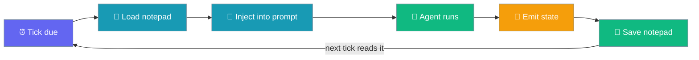
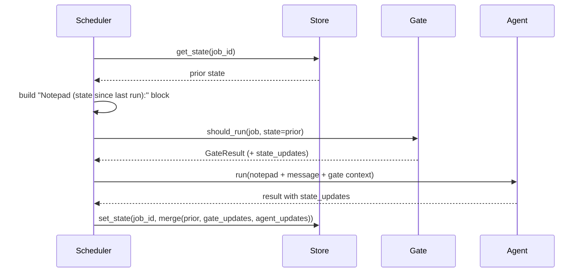

Scheduled agents now remember a small notepad across runs — a cursor, a watermark, a last-seen id — so a recurring job can do incremental work instead of repeating itself.



## Quick Start

<Steps>
<Step title="Agent-centric — just enable it, no ceremony">
Once the wrapper's `ConfigYamlScheduleStore` is in use, a scheduled agent gets the notepad automatically. The agent reads its notepad from the prompt and writes back by returning a dict with `state_updates` (or `state`).

```python
from praisonaiagents import Agent
from praisonaiagents.tools import schedule_add

agent = Agent(
    name="pr-digest",
    instructions=(
        "Read the notepad at the top of the message. If `last_seen_pr` is present, "
        "only list PRs above that number. Then emit `state_updates={'last_seen_pr': <max id>}`."
    ),
    tools=[schedule_add],
)

agent.start("Every weekday at 9am, list open PRs needing review and deliver to Slack.")
```
</Step>

<Step title="Direct Python — build the ScheduleJob yourself">
No new arguments — the notepad is picked up automatically from the store.

```python
from praisonaiagents.scheduler import ScheduleJob, Schedule

job = ScheduleJob(
    name="pr-digest",
    schedule=Schedule(kind="cron", cron_expr="0 9 * * 1-5"),
    message="List open PRs needing review. Only report PRs newer than last_seen_pr.",
)
```
</Step>

<Step title="YAML parity">
```yaml
schedule:
  cron: "0 9 * * 1-5"
  message: "List open PRs needing review. Only report PRs newer than last_seen_pr."
  deliver: "slack:#eng"
```
</Step>
</Steps>

---

## How It Works

Each tick loads prior state, prepends a notepad block, runs the agent, then merges and persists whatever the gate and agent emit.



The gate is only handed `state=` when it opts in (signature-detected), so legacy stateless gates never see a `TypeError`.

| Where state comes in / out | What lands in the notepad |
|----------------------------|---------------------------|
| Prior state loaded before the run | `Notepad (state since last run):` block prepended to the message |
| Monitor gate's `GateResult.state_updates` | Folded into the notepad AND persisted (even on `no_change` / skip ticks) |
| Agent result's `state_updates` or `state` (dict) | Merged onto prior state and persisted |
| Plain-string agent result | No writes — today's stateless behaviour |
| Empty / unchanged updates | No write; `config.yaml` untouched |

---

## The Notepad Format

The block prepended to the prompt is deterministic — sorted `key=value` lines under a fixed header, separated from the message by a blank line.

With prior state `{"last_seen_pr": 4821, "cursor": "abc"}`:

```
Notepad (state since last run):
cursor=abc
last_seen_pr=4821

<the job's original message here>
```

- Sorted alphabetically by key so ordering is stable across runs.
- Empty state → **no notepad block** (byte-for-byte the prior behaviour).
- The block is separated from the message by a blank line.

---

## How the Agent Writes Back

Two ways an agent can persist an update:

1. **Return an object with `state_updates` or `state`** — a rich chat result exposing a `dict`. Only dicts are honoured; a plain string result writes nothing.
2. **A monitor gate's `GateResult.state_updates`** — persists on both the go-path and the `no_change` / skip path.

A stateful gate carries a watermark forward even on a suppressed tick:

```python
from praisonaiagents.scheduler import GateResult

class UnreadWatermarkGate:
    def should_run(self, job, *, state=None):
        state = state or {}
        latest = fetch_latest_id()  # your cheap probe
        if latest == state.get("last_id"):
            return GateResult(no_change=True, state_updates={"last_id": latest})
        return GateResult(run=True, context=f"new since {state.get('last_id')}",
                          state_updates={"last_id": latest})
```

---

## Configuration Options

Behaviour is enabled automatically when the runner uses `ConfigYamlScheduleStore` (the wrapper default) — no new `ScheduleJob` fields, no new imports, no new module exports.

| Setting | Value | Description |
|---------|-------|-------------|
| Per-job cap | `16 KiB` (hard-coded `_MAX_STATE_BYTES`) | An oversized write is rejected and the prior state is kept — a runaway `set_state` cannot grow `config.yaml` unbounded |
| Storage key | `job_state` in `config.yaml` | Omitted entirely when empty — stateless jobs leave `config.yaml` byte-for-byte unchanged |
| Removal | Automatic | State is dropped on `remove(job_id)`, `remove_by_name(name)`, and one-shot `delete_after_run` claims |
| Empty write | `set_state(job_id, {})` | Clears the entry (equivalent to `clear_state(job_id)`) |
| One-shot jobs | `delete_after_run=True` | Cross-run memory is skipped for these — they have no "next run" and would otherwise leave an orphan entry |

<Note>
A job with `delete_after_run=True` is removed from the store (and its state popped) before the run reaches the executor. The executor therefore does not persist state for one-shot jobs — persisting now would recreate an orphan `job_state` entry nothing ever cleans up, and would be injected if the same explicit id were reused. Use cross-run memory only for recurring jobs.
</Note>

---

## Custom Stores

Advanced backends implement `JobStateStoreProtocol` — the same three methods, the same `hasattr()` capability detection. All three methods are **optional**; absence means today's stateless behaviour.

```python
from praisonaiagents.scheduler import JobStateStoreProtocol  # type: ignore

class InMemoryStateStore:
    def __init__(self):
        self._state = {}

    def get_state(self, job_id):
        return self._state.get(job_id, {})

    def set_state(self, job_id, state):
        self._state[job_id] = state

    def clear_state(self, job_id):
        self._state.pop(job_id, None)
```

This page is for the built-in default — the deeper contract lives in [Scheduler Monitor](/features/scheduler-monitor) and [Scheduler Change Detection](/features/scheduler-change-detection).

---

## Best Practices

<AccordionGroup>
<Accordion title="Keep the notepad tiny">
Store cursors, ids, and hashes — not full payloads. The 16 KiB cap rejects oversized writes and keeps the prior state, so a runaway `set_state` can never bloat `config.yaml`.
</Accordion>

<Accordion title="Reference notepad keys explicitly in the agent's instructions">
The agent sees the sorted `key=value` lines verbatim. Write instructions like *"if `last_seen_pr` is present, only list PRs above it."* so the agent knows exactly which keys to read and write.
</Accordion>

<Accordion title="Let the gate carry the watermark on quiet ticks">
A `GateResult.state_updates` persists even when the tick is `no_change` / `skipped`, so the *next* tick sees the advance. Use this to move a monitor watermark forward on a silent tick.
</Accordion>

<Accordion title="Don't rely on cross-run memory for one-shot jobs">
`delete_after_run=True` skips persistence by design — a one-shot job has no "next run" to read the notepad. Use cross-run memory only for recurring jobs.
</Accordion>
</AccordionGroup>

---

## Related

<CardGroup cols={2}>
<Card title="Scheduler Monitor" icon="eye" href="/features/scheduler-monitor">
  The change-detection sibling that carries a hashed watermark
</Card>
<Card title="Scheduler Change Detection" icon="radar" href="/features/scheduler-change-detection">
  Deeper `GateResult` / `JobStateStoreProtocol` reference
</Card>
<Card title="Scheduler Pre-Run Gate" icon="filter" href="/features/scheduler-pre-run-gate">
  The stateless sibling — a cheap go/no-go gate
</Card>
<Card title="Scheduler Monitor Mode" icon="eye" href="/features/scheduler-monitor-mode">
  Declarable `monitor` spec that drives change detection
</Card>
</CardGroup>
