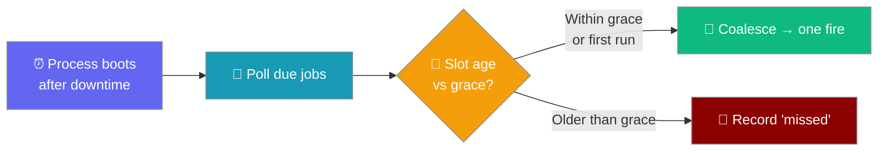
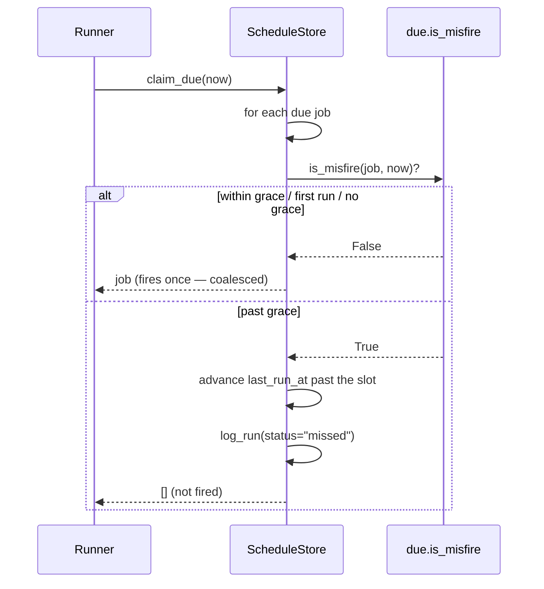

A missed occurrence is never silently dropped: set `misfire_grace_seconds` and a stale slot is recorded as `missed` in history instead of firing a no-longer-useful run.



## Quick Start

<Steps>
<Step title="Set a grace window">
Set `misfire_grace_seconds` so a stale slot after downtime is recorded rather than fired.

```python
from praisonaiagents import Agent
from praisonaiagents.scheduler import ScheduleJob, Schedule

agent = Agent(name="daily-brief", instructions="Summarise overnight activity.")

job = ScheduleJob(
    name="daily-brief",
    schedule=Schedule(kind="cron", cron_expr="0 7 * * *", tz="UTC"),
    message="Brief last night's activity.",
    agent_id=agent.id,
    # If the process was down more than 10 minutes past 07:00, don't fire a
    # stale brief — record the miss instead.
    misfire_grace_seconds=600,
)
```
</Step>

<Step title="Same job in YAML">
```yaml
jobs:
  - name: daily-brief
    schedule:
      kind: cron
      cron_expr: "0 7 * * *"
      tz: UTC
    message: "Brief last night's activity."
    misfire_grace_seconds: 600
```
</Step>

<Step title="Leave it unset for the old behaviour">
Leaving `misfire_grace_seconds` unset (or `None`) preserves the pre-existing behaviour — a missed occurrence still coalesces into one fire on recovery.

```python
from praisonaiagents.scheduler import ScheduleJob, Schedule

job = ScheduleJob(
    name="hourly-poll",
    schedule=Schedule(kind="every", every_seconds=3600),
    message="Poll upstream.",
    # misfire_grace_seconds=None  ← default; existing jobs unchanged
)
```
</Step>
</Steps>

---

## How It Works

On recovery the store looks at each due job, computes the epoch of the occurrence it is firing *for*, and either fires (within grace / first run) or records `missed` (past grace).



| Job state | `misfire_grace_seconds` | Slot age at recovery | Outcome |
|-----------|-------------------------|----------------------|---------|
| Recurring, previously ran | `None` (default) | any | Coalesces into one normal fire (unchanged from before) |
| Recurring, previously ran | `90` | ≤ 90 s | One normal fire (within grace) |
| Recurring, previously ran | `90` | > 90 s | Recorded as `missed`; not fired |
| First run (`last_run_at is None`) | any grace | any | Always fires — a first fire is never a recovered recurrence |
| Any | any grace | slot in future / not-yet-elapsed | Not due; nothing to record |
| Any | non-numeric junk (hand-edited YAML) | any | Falls back to "not a misfire" (no `TypeError`, other due jobs still fire) |

---

## What The User Sees

Silence, not a stale ping — a broken window shows up as a `missed` row in run history so an operator can spot the gap on the same page they read successes and failures.

```python
history = store.get_history(job_id=job.id)
missed = [r for r in history if r.status == "missed"]
```

---

## Kinds — how the "occurrence" is derived

`scheduled_instant()` derives the recovered slot per `Schedule.kind`, so you can reason about which fire is being suppressed.

| Kind | The slot being recovered for | Age formula |
|------|------------------------------|-------------|
| `every` | `last_run_at + every_seconds` (the *first* slot that came due after the last run) | `now - (last_run_at + every_seconds)` |
| `cron` | The last cron fire at or before `now` | `now - croniter.get_prev(now)` |
| `at` | The target instant itself | `now - at` |

---

## Configuration Options

<CardGroup cols={2}>
  <Card icon="code" href="/docs/sdk/reference/praisonaiagents/classes/ScheduleJob">
    Full field reference for the job dataclass
  </Card>
  <Card icon="code" href="/docs/sdk/reference/praisonaiagents/classes/RunRecord">
    All run status values and history fields
  </Card>
</CardGroup>

The one knob this feature introduces.

| Option | Type | Default | Description |
|--------|------|---------|-------------|
| `misfire_grace_seconds` | `Optional[float]` | `None` | Max age (seconds) of the occurrence being recovered for it to still fire. Older than this on recovery, the occurrence is recorded as `missed` instead of fired. Within the window (or a first run) coalesces into a single normal fire. `None` disables the check — existing jobs are byte-for-byte unchanged. |

The new `RunRecord.status` value.

| Value | Meaning |
|-------|---------|
| `missed` | A recurring occurrence landed while the process was down and fell outside the job's `misfire_grace_seconds` — the run was suppressed but recorded (not silently dropped) so an operator can see the gap. |

---

## Common Patterns

A daily brief tolerates a short delay but not a multi-hour one.

```python
from praisonaiagents import Agent
from praisonaiagents.scheduler import ScheduleJob, Schedule

agent = Agent(name="daily-brief", instructions="Summarise overnight activity.")

job = ScheduleJob(
    name="daily-brief",
    schedule=Schedule(kind="cron", cron_expr="0 7 * * *", tz="UTC"),
    message="Brief last night's activity.",
    agent_id=agent.id,
    misfire_grace_seconds=600,
)
```

An interval poll with a wide grace fires after a brief restart but skips a slot after a multi-hour outage.

```python
from praisonaiagents.scheduler import ScheduleJob, Schedule

job = ScheduleJob(
    name="hourly-poll",
    schedule=Schedule(kind="every", every_seconds=3600),
    message="Poll upstream.",
    misfire_grace_seconds=1800,
)
```

A first run always fires — the policy only applies to recovered recurrences.

```python
from praisonaiagents.scheduler import ScheduleJob, Schedule

# Created after 07:00 with a tight grace — the first slot still runs once.
job = ScheduleJob(
    name="new-cron",
    schedule=Schedule(kind="cron", cron_expr="0 7 * * *", tz="UTC"),
    message="Initial fire.",
    misfire_grace_seconds=60,
)
```

---

## Best Practices

<AccordionGroup>
<Accordion title="Set the grace to the usefulness window">
The grace is "how late can this slot still be useful?" — a daily 07:00 brief probably tolerates 10 minutes but not 6 hours; an hourly poll of live data might tolerate 30 seconds.
</Accordion>

<Accordion title="Leave it None when 'late is better than never'">
`None` (the default) is the right choice when a coalesced late fire is still valuable — the previous behaviour is preserved byte-for-byte.
</Accordion>

<Accordion title="Read a cluster of missed rows as a downtime marker">
A cluster of `missed` rows across jobs is a downtime marker — combine it with [Scheduler Incidents](/features/scheduler-incidents) so a broken schedule and a broken job are both surfaced.
</Accordion>

<Accordion title="Write a number, not a string">
`_coerce_optional_float` will accept `"3600"` in a hand-edited config, but the intended form is unquoted (`misfire_grace_seconds: 3600`). Non-numeric junk fails safe to "no misfire policy".
</Accordion>
</AccordionGroup>

---

## Related

<CardGroup cols={2}>
  <Card icon="database" href="/features/scheduler-job-state">
    Cross-run notepad the scheduler already persists
  </Card>
  <Card icon="bell" href="/features/scheduler-incidents">
    Alert once when a scheduled job breaks
  </Card>
  <Card icon="eye" href="/features/scheduler-monitor">
    Silence-when-unchanged sibling — declarable monitor spec
  </Card>
  <Card icon="clock" href="/features/async-scheduler">
    The async runner that observes the policy
  </Card>
</CardGroup>
