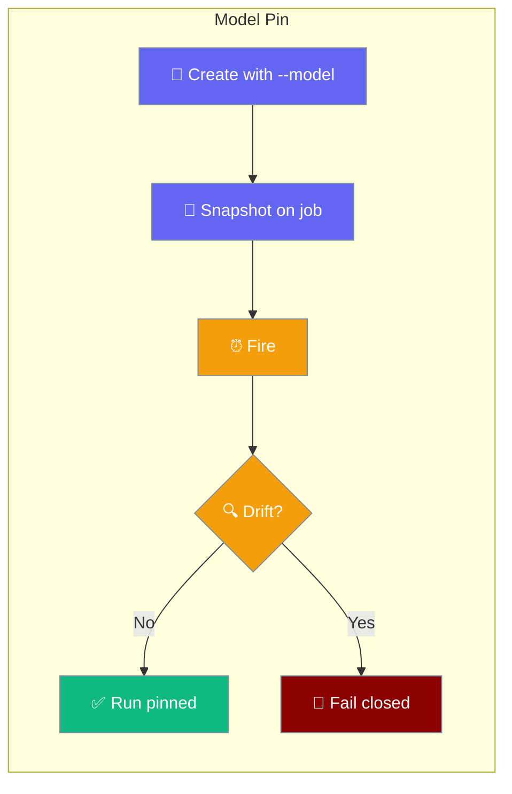
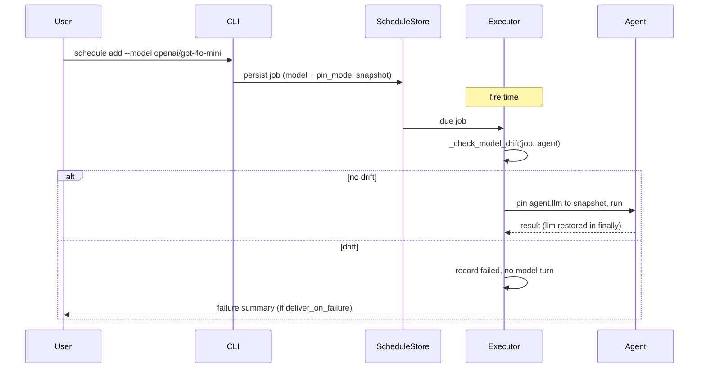
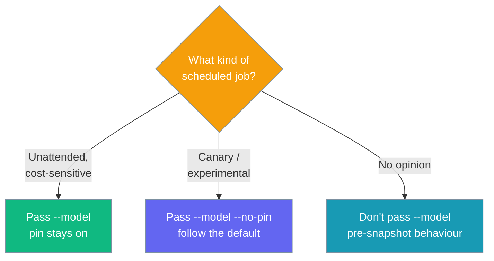

Pin a scheduled job to a specific model so unattended runs stay on the exact model you signed off on — and fail closed the moment the default drifts.



A scheduled job used to resolve its model at fire time, so a job created against a cheap default silently inherited whatever the default later became. Pinning snapshots the model at creation and fails closed on drift.

## Quick Start

<Steps>
<Step title="Agent-first (Python)">
Snapshot the model on the `ScheduleJob` at creation. When `model` is set and `pin_model` is `True`, the run is pinned and drift fails closed.

```python
from praisonaiagents import Agent
from praisonaiagents.scheduler import ScheduleJob, Schedule

agent = Agent(
    name="Brief",
    instructions="Give a one-paragraph daily brief.",
)

job = ScheduleJob(
    name="daily-brief",
    schedule=Schedule(kind="cron", cron_expr="0 9 * * *"),
    message="summarise the day",
    model="openai/gpt-4o-mini",   # snapshot — pinned
    pin_model=True,               # default; shown for clarity
)
```
</Step>

<Step title="Pin from the CLI">
Pass `--model` to capture a snapshot. The pin is on by default.

```bash
praisonai schedule add "daily-brief" \
  -s "cron:0 9 * * *" \
  -m "summarise the day" \
  --model "openai/gpt-4o-mini"
```
</Step>

<Step title="Follow the default (opt out)">
Use `--no-pin` for a canary or experimental job that should follow whatever the default becomes.

```bash
praisonai schedule add "flex-brief" -s daily -m "summarise" --no-pin
```
</Step>
</Steps>

---

## How It Works

The snapshot is taken at add time; the drift check runs at fire time and branches into run-pinned or fail-closed.



| Step | What happens |
|------|-------------|
| Snapshot | `--model` (or `ScheduleJob.model`) is stored on the job at creation |
| Drift check | No-op when `model` is unset or `pin_model` is falsy; otherwise `(provider, model)` are compared after normalising a provider prefix |
| No drift | The run is pinned run-scoped by mutating `agent.llm`; a `finally` block restores the original `llm` so the pin never leaks into another turn |
| Drift | Run is recorded `failed`, no model turn is taken, and a failure summary is delivered when `RunPolicy(deliver_on_failure=True)` is set |

<Note>
A `--command` (no-LLM) job takes no model turn, so pinning is skipped for it.
</Note>

---

## Which Option?

Three levers plus the no-snapshot default cover every case.



---

## Configuration

### `ScheduleJob` fields

| Field | Type | Default | Description |
|-------|------|---------|-------------|
| `provider` | `Optional[str]` | `None` | Model provider snapshotted when the job was created (e.g. `"openai"`). Advisory metadata paired with `model`. `None` = no snapshot, no drift enforcement. |
| `model` | `Optional[str]` | `None` | Model identifier snapshotted at creation (e.g. `"gpt-4o-mini"`). When set and `pin_model` is `True`, the wrapper executor pins the run to this model and fails closed on drift. `None` preserves pre-snapshot behaviour. |
| `pin_model` | `bool` | `True` | When `True` a `model` snapshot is enforced. `False` opts into following whatever the default becomes. Only meaningful when `model` is set. |

`provider` / `model` are persisted only when set, and `pin_model` is persisted only when opting out (`False`) — agent-only jobs stay byte-for-byte identical on disk. `from_dict` restores all three and is unknown-key tolerant.

<Card title="ScheduleJob API Reference" icon="code" href="/sdk/praisonaiagents/scheduler">
  Full `ScheduleJob` dataclass reference
</Card>

---

## Common Patterns

### Pin every scheduled job in a hardened deploy

Capture a snapshot on each job so no unattended run can drift onto a costlier default.

```python
from praisonaiagents.scheduler import ScheduleJob, Schedule

job = ScheduleJob(
    name="nightly-report",
    schedule=Schedule(kind="cron", cron_expr="0 2 * * *"),
    message="compile the nightly report",
    model="openai/gpt-4o-mini",
)
```

### Fail closed and deliver the alert

Combine the pin with `RunPolicy(deliver_on_failure=True)` so a drift is recorded failed *and* surfaced to the target.

```python
from praisonai.scheduler import RunPolicy

# drift → recorded failed AND delivered to the target
policy = RunPolicy(deliver_on_failure=True)
```

### `--no-pin` for canary / experimental jobs

Follow whatever the default becomes for a job you want tracking the latest model.

```bash
praisonai schedule add "canary" -s daily -m "smoke-test the default model" \
  --model "openai/gpt-4o-mini" --no-pin
```

### Provider-prefix normalisation (no false drift)

A provider-qualified pin (`openai/gpt-4o-mini`) and a bare-model resolver (`gpt-4o-mini`) do not false-drift — the embedded provider prefix is lifted out before the comparison. Only the first `/` splits, so fine-tuned paths like `openai/ft:gpt-4o:org::id` keep their tail.

```python
from praisonaiagents.scheduler import ScheduleJob, Schedule

# Pin carries a provider prefix; a bare-model resolution still matches.
job = ScheduleJob(
    name="brief",
    schedule=Schedule(kind="cron", cron_expr="0 9 * * *"),
    message="summarise the day",
    model="openai/gpt-4o-mini",
)
```

---

## Best Practices

<AccordionGroup>
<Accordion title="Pin every unattended, cost-sensitive job">
An unattended run has no human to catch a costlier default. Pass `--model` on every scheduled job you would not want silently upgraded — the pin defaults to on, so a snapshot is all it takes.
</Accordion>

<Accordion title="Pair the pin with deliver_on_failure">
A fail-closed drift is only useful if someone sees it. Set `RunPolicy(deliver_on_failure=True)` so a drift lands in your channel instead of a silent `failed` record.

```python
from praisonai.scheduler import RunPolicy

policy = RunPolicy(deliver_on_failure=True)
```
</Accordion>

<Accordion title="Use --no-pin only for jobs meant to track the default">
`--no-pin` opts a job into following the default forever. Reserve it for canaries and experiments — not for anything whose cost or behaviour you rely on.
</Accordion>

<Accordion title="Qualify the model with a provider when you have one">
A provider-qualified pin like `openai/gpt-4o-mini` is normalised against a bare-model resolution, so it never false-drifts. Provider is only compared when both sides carry one.
</Accordion>
</AccordionGroup>

---

## Related

<CardGroup cols={2}>
  <Card title="Schedule CLI" icon="terminal" href="/cli/schedule">
    All schedule commands and options
  </Card>
  <Card title="Scheduled Run Policy" icon="shield-halved" href="/features/scheduled-run-policy">
    deliver_on_failure & policy scans for unattended runs
  </Card>
  <Card title="Multi-Tenant Scheduler" icon="user-shield" href="/features/scheduler-multi-tenant">
    Isolate each gateway user's jobs with a principal owner key
  </Card>
  <Card title="Command Action" icon="terminal" href="/features/scheduler-command-action">
    No-LLM command jobs — pinning is skipped for these
  </Card>
</CardGroup>
