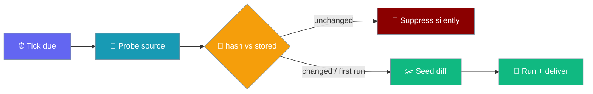
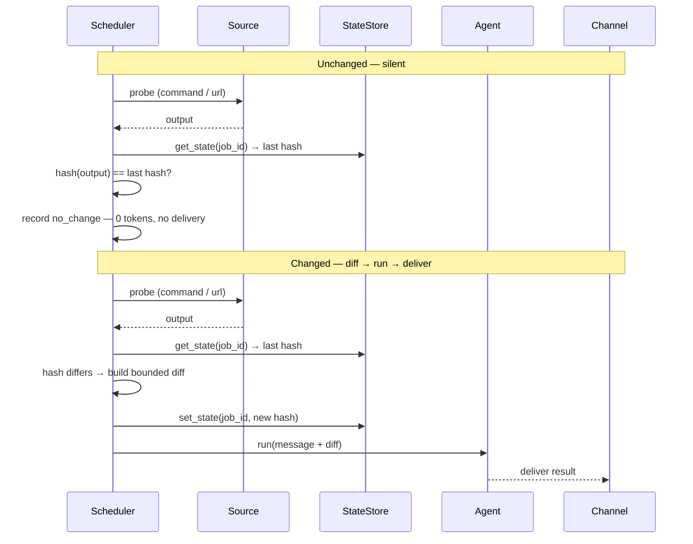
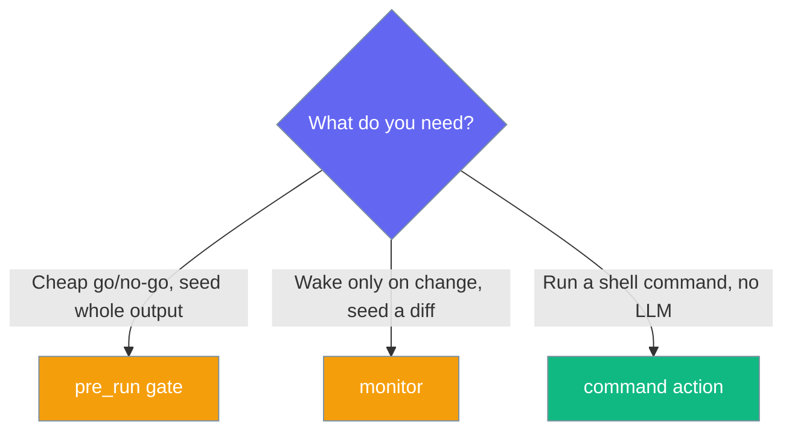

Turn any scheduled job into a change-aware monitor — wake only when a watched source changed, and hand the agent only the diff.

<Warning>
**Preview — contract shipped, runtime not yet wired.** The core protocol contract (the `monitor` field, `GateResult.no_change` / `state_updates`, `JobStateStoreProtocol`, and the `no_change` run status) landed in [PraisonAI PR #3845](https://github.com/MervinPraison/PraisonAI/pull/3845). The change-detection **wrapper** that actually probes the source, hashes it, and suppresses unchanged ticks ships in a follow-up PR. Today a job that sets `monitor={...}` round-trips through storage but **behaves like a regular job that fires every tick** — nothing suppresses a tick yet. Use this page to author against the stable contract; the "wake only when changed" behaviour arrives with the wrapper.
</Warning>



## Quick Start

<Steps>
<Step title="Agent-centric — watch a page, tell me only what's new">
The agent schedules the monitor for you from a plain request.

```python
from praisonaiagents import Agent
from praisonaiagents.tools import schedule_add

agent = Agent(name="watcher", tools=[schedule_add])
agent.start(
    "Every hour, monitor https://status.example. Only tell me when it changes, "
    "and tell me only what's new."
)
```
</Step>

<Step title="Direct Python — build the ScheduleJob yourself">
Set `monitor` to name a cheap source to probe each tick.

```python
from praisonaiagents.scheduler import ScheduleJob, parse_schedule

job = ScheduleJob(
    name="site-watch",
    message="The watched page changed. Here is the diff; summarise what is new.",
    schedule=parse_schedule("every 1h"),
    monitor={"url": "https://status.example"},   # or {"command": "..."}
)
```
</Step>

<Step title="Shell source — probe a cheap counter">
A bounded command is a better source than a full HTML page.

```python
job = ScheduleJob(
    name="unread-watch",
    message="Unread count changed — summarise what is new.",
    schedule=parse_schedule("every 1h"),
    monitor={"command": "curl -s https://api.example/unread | jq '.count'"},
)
```
</Step>

<Step title="YAML — configure via agents.yaml">
```yaml
schedule:
  every: "1h"
  message: "Summarise what is new."
  monitor:
    url: "https://status.example"
  deliver: "telegram:123456"
```
</Step>
</Steps>

---

## How It Works

The wrapper hashes the probed source and compares it to the last-seen hash held in per-job state.



**Caller contract (verbatim from the SDK):** *"Because a legacy stateless gate accepts only `job`, callers MUST NOT unconditionally pass `state=`. Detect capability first — e.g. call `should_run(job, state=prior)` only when the gate opts into state, otherwise fall back to `should_run(job)` — so stateless gates keep working unchanged and never raise `TypeError`."*

An error probe (a transient 500) leaves prior state untouched, so a later recovery to the prior output still suppresses — a transient failure does not count as a change.

---

## Run Status: `no_change` vs the others

`RunRecord.status` gains a fourth value so an operator can tell a *silent monitor* apart from a *deliberate skip*.

| `status` | Meaning | Tokens | Delivery |
|----------|---------|--------|----------|
| `succeeded` | The model turn ran and finished | Yes | Yes |
| `failed` | The run errored | Maybe | On-failure only |
| `skipped` | A go/no-go gate said "don't run" | No | No |
| `no_change` | A **watched source was unchanged** since the last tick | No | No |

<Note>
`no_change` implies `run=False` — the core enforces this invariant in `GateResult.__post_init__`. Use `no_change` records in `session show` to prove a monitor is *running* even when it is silent.
</Note>

---

## What's Stored in Per-Job State

The monitor keeps a small durable scratchpad keyed by job id — typically the last-seen hash, plus an optional cursor / watermark.

```python
from typing import Any, Dict, Protocol, runtime_checkable

@runtime_checkable
class JobStateStoreProtocol(Protocol):
    """Bounded per-job durable scratchpad. All methods OPTIONAL — callers use hasattr()."""

    def get_state(self, job_id: str) -> Dict[str, Any]: ...
    def set_state(self, job_id: str, state: Dict[str, Any]) -> None: ...  # size-capped
    def clear_state(self, job_id: str) -> None: ...  # called when a job is removed
```

The state is **bounded** (size-capped by the implementation) and **cleared when the job is removed**. The core owns only the shape; the wrapper decides where to persist it.

---

## Distinct From Other Gates

Pick the right sibling — `monitor` is the *stateful* one that seeds a *diff*.



| Field | Stateful? | Seeds | Distinct outcome |
|-------|-----------|-------|------------------|
| `pre_run` | No | Whole gate output | `skipped` |
| `monitor` | **Yes** | A bounded **diff** | **`no_change`** |
| `command` | No | Nothing (no LLM) | model-free action |

---

## Configuration Options

The `monitor` field is a small mapping naming one cheap source to probe each tick.

| Key | Type | Description |
|-----|------|-------------|
| `command` | `str` | A shell command whose stdout is hashed and diffed |
| `url` | `str` | A bounded fetch whose body is hashed and diffed |

```python
monitor={"url": "https://status.example"}
# or
monitor={"command": "curl -s https://api.example/unread | jq '.count'"}
```

<Note>
`monitor` serialises only when set — `None` (default) keeps the existing stateless behaviour, and an explicitly-empty mapping round-trips faithfully. For the full field types, see the auto-generated SDK reference rather than duplicating them here.
</Note>

---

## Best Practices

<AccordionGroup>
<Accordion title="Prefer a bounded, cheap probe">
A JSON endpoint returning a single counter beats hashing a full HTML page — it changes only when the thing you care about changes, and it is fast on every tick.

```python
# Good — a small, stable signal
monitor={"command": "curl -s https://api.example/unread | jq '.count'"}

# Avoid — a whole page churns on ads, timestamps, and markup noise
monitor={"url": "https://example.com/full-homepage"}
```
</Accordion>

<Accordion title="A transient error is not a change">
An error probe leaves prior state untouched — a transient 500 does not "count as a change". When the source recovers to its prior output, the tick still suppresses. Design probes that fail loudly (non-zero exit) rather than emitting an error page as "content".
</Accordion>

<Accordion title="Use no_change records to prove a monitor is alive">
A silent monitor looks identical to a broken one. Check run history — a stream of `no_change` records proves the monitor is probing every tick and simply has nothing to report.

```bash
praisonai session show   # look for no_change entries
```
</Accordion>

<Accordion title="Never pass state= to a stateless gate">
Callers MUST detect capability first. Pass `state=` only when the gate opts into state; otherwise fall back to `should_run(job)` so legacy stateless gates never raise `TypeError`.
</Accordion>
</AccordionGroup>

---

## Related

<CardGroup cols={2}>
<Card title="Scheduler Pre-Run Gate" icon="filter" href="/features/scheduler-pre-run-gate">
  The stateless sibling — a cheap go/no-go gate
</Card>
<Card title="Scheduler Command Action" icon="terminal" href="/features/scheduler-command-action">
  The no-LLM sibling — deliver a command's stdout verbatim
</Card>
<Card title="Scheduler Delivery" icon="paper-plane" href="/features/scheduler-delivery">
  Where results go — note `no_change` ticks do not deliver
</Card>
<Card title="Async Agent Scheduler" icon="clock" href="/features/async-agent-scheduler">
  The scheduler this monitor plugs into
</Card>
</CardGroup>
