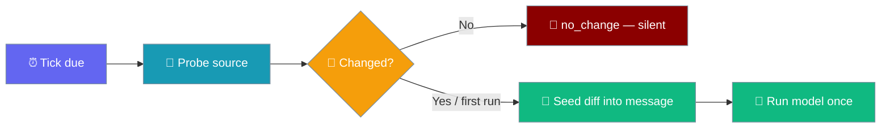
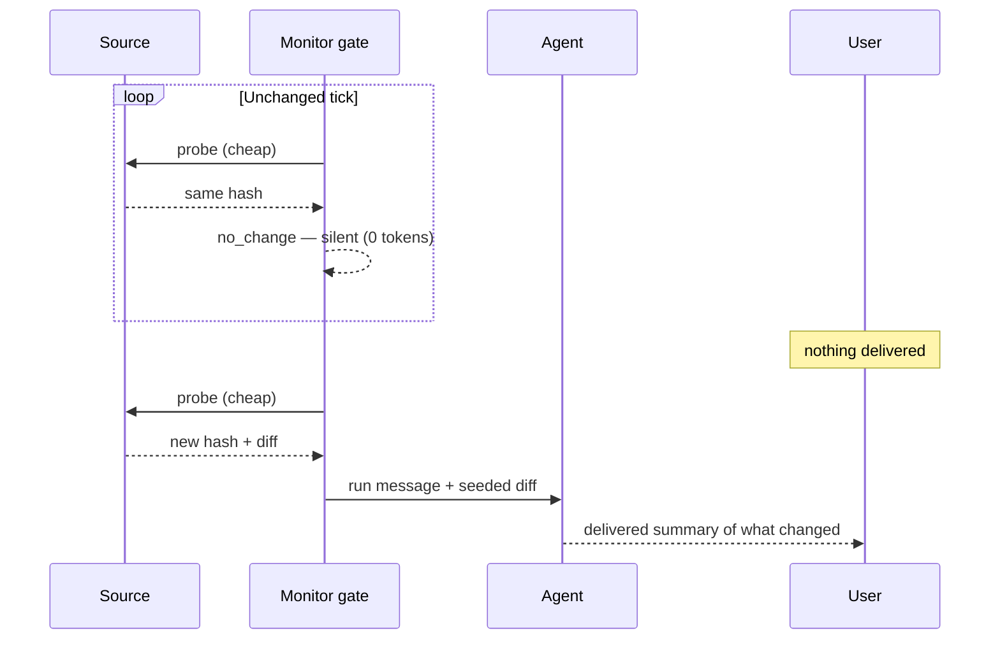
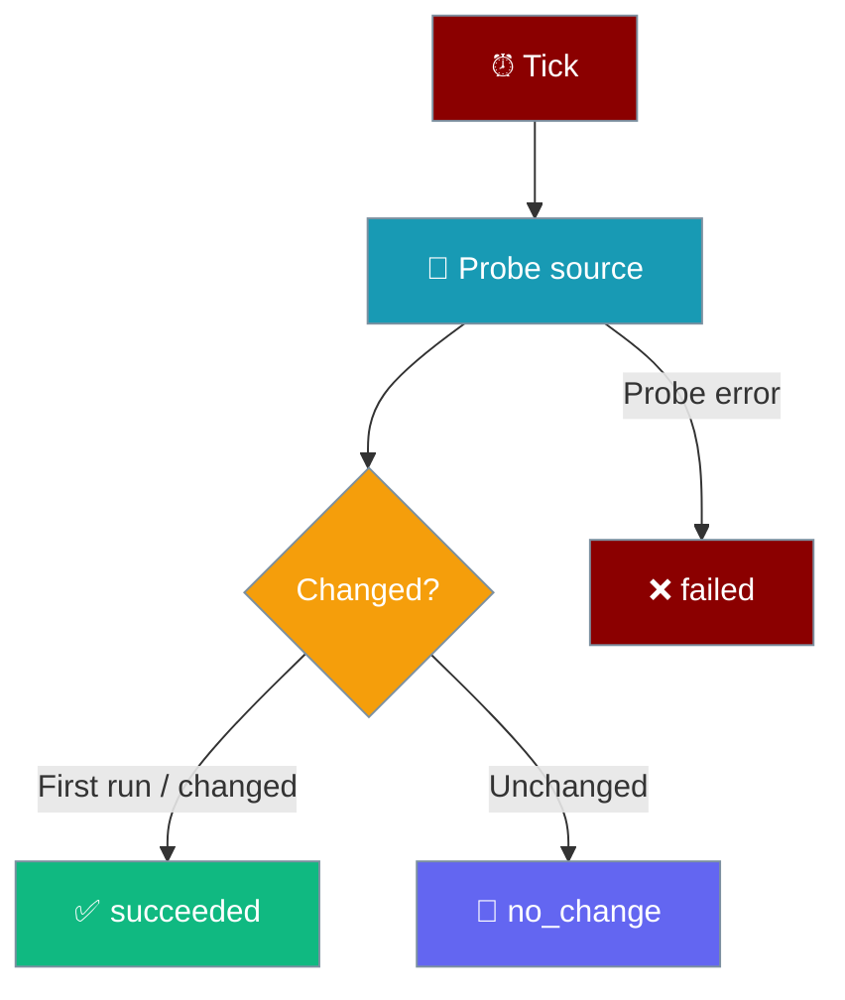
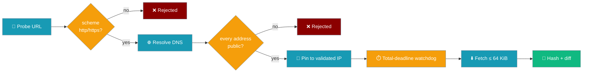
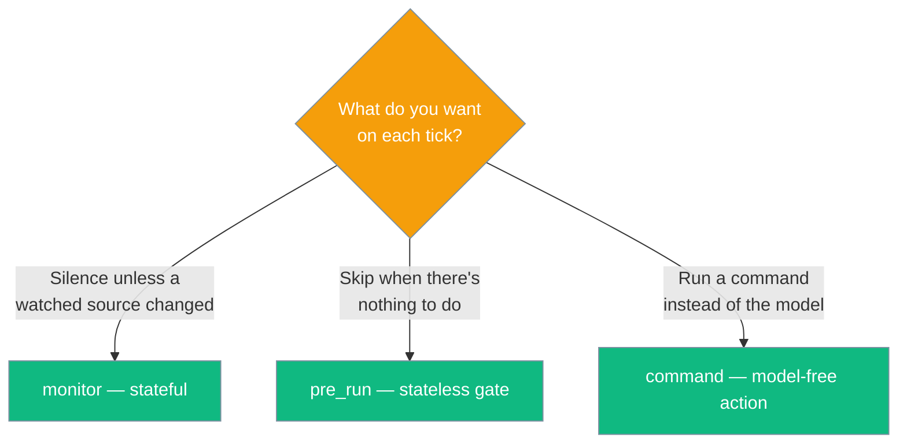

Turn a scheduled agent into a monitor: probe a cheap source each tick, run the model only when it changed, and stay silent when it didn't.



<Note>
The `monitor` field is a **declarable spec** the core round-trips through storage. The probe, hashing, bounded diff, state persistence, and the `no_change` record live in the `praisonai-bot` / wrapper layer — the core owns only the contract.
</Note>

## Quick Start

<Steps>
<Step title="Turn an agent into a monitor">
Add `monitor` to a `ScheduleJob`. The agent runs only when the watched URL changes.

```python
from praisonaiagents import Agent
from praisonaiagents.scheduler import ScheduleJob, Schedule

agent = Agent(name="News watcher", instructions="Summarise new items")

job = ScheduleJob(
    name="hn-frontpage",
    schedule=Schedule(kind="every", every_seconds=900),
    message="Summarise the changes.",
    agent_id=agent.id,
    monitor={"url": "https://news.ycombinator.com/"},
)
```
</Step>

<Step title="Watch a shell source instead">
Use `command` inside `monitor` to watch any cheap shell output — a file, a database count, a health probe.

```python
from praisonaiagents.scheduler import ScheduleJob, Schedule

job = ScheduleJob(
    name="disk-watch",
    schedule=Schedule(kind="every", every_seconds=300),
    message="Explain the change in disk usage and flag anything urgent.",
    monitor={"command": "df -h /"},
)
```
</Step>
</Steps>

---

## What The User Sees

Silence is the feature — an unchanged source produces no ping and spends no tokens.



---

## Three Outcomes

Every tick records exactly one status.



| Status | Meaning |
|--------|---------|
| `succeeded` | The source changed (or first run) — the agent ran and delivered |
| `no_change` | A watched source was unchanged — suppressed silently, no tokens, no delivery |
| `failed` | The probe itself errored |

`no_change` is distinct from `skipped` (a generic gate go/no-go) so you can tell "nothing changed" apart from "the gate said don't run".
---

## How It Works

Each tick probes the source, hashes the output, and compares it to the last-seen hash held in per-job state.

| Tick outcome | What happens | Recorded status |
|--------------|--------------|-----------------|
| Source unchanged | Model turn suppressed — no tokens, no delivery | `no_change` |
| Source changed | Bounded diff seeded into `message`, model runs once | `succeeded` |
| First run (no prior state) | Treated as changed — model runs, hash stored | `succeeded` |
| Probe errored | Prior state left untouched so a later recovery still suppresses | `failed` |

<Note>
`no_change` is a **distinct** status from `skipped`. `skipped` means "a gate said don't run"; `no_change` means "a watched source was unchanged" — so operators can tell the two apart in run history.
</Note>

---

## Configuration Options

### `monitor` spec

`monitor` is a small mapping naming one cheap source to probe each tick.

| Key | Type | Description |
|-----|------|-------------|
| `command` | `str` | Shell command whose stdout is hashed and diffed each tick |
| `url` | `str` | A bounded fetch whose response body is hashed and diffed each tick |

### `ScheduleJob` field

| Field | Type | Default | Description |
|-------|------|---------|-------------|
| `monitor` | `Optional[Dict[str, Any]]` | `None` | Change-detection source spec. `None` keeps the existing stateless behaviour. Omitted from serialization when unset (fully backward-compatible) |

### `GateResult` — monitor outcome

The wrapper's monitor gate returns a `GateResult` carrying the monitor-mode outcome.

| Field | Type | Default | Description |
|-------|------|---------|-------------|
| `run` | `bool` | `True` | Whether to spend the model turn this tick |
| `context` | `str \| None` | `None` | Text seeded into the job message when `run` is `True` |
| `reason` | `str \| None` | `None` | Human-readable note recorded with the run |
| `no_change` | `bool` | `False` | `True` when the watched source was unchanged — implies `run=False` (enforced in `__post_init__`) |
| `state_updates` | `dict \| None` | `None` | Bounded key/value to persist for the next tick (last-seen hash, watermark). `None` means "write nothing" |

Setting `no_change=True` always forces `run=False`, so a monitor can never fire a tick the contract defines as suppressed.

```python
from praisonaiagents.scheduler import GateResult

# unchanged source → suppress silently
GateResult(no_change=True, state_updates={"last_hash": "abc123"})

# changed source → run with a diff seeded into the message
GateResult(run=True, context="2 new releases", state_updates={"last_hash": "def456"})
```

### `RunRecord.status`

| Value | Meaning |
|-------|---------|
| `succeeded` | The model turn ran and completed |
| `failed` | The run raised or the probe errored |
| `skipped` | A stateless gate said don't run |
| `no_change` | A watched source was unchanged (monitor mode) |

---

## URL Monitor Reliability & Safety

Every URL probe runs behind a bounded, hardened path. These are the guarantees an operator can rely on before pointing a monitor at anything they don't own end-to-end.



| Guarantee | Value |
|---|---|
| Total wall-clock deadline (connect + body read) | `30 s` (`MonitorGate(timeout=…)`) |
| Response body cap | `64 KiB` — anything larger is rejected |
| Retained preview used for diffing | `2048 B` |
| Diff seeded into the agent message | up to `8000` chars |
| Schemes allowed | `http`, `https` only |
| Embedded credentials (`https://user:pass@…`) | rejected before any connect |
| Private / loopback / link-local addresses | rejected before any connect |
| Connection pinning | fixed to the validated IP — a DNS re-resolve can't smuggle in a private IP |
| TLS | full hostname + CA verification |
| Redirects | not followed |

<Note>
**Slow-body drip protection ([PR #4237](https://github.com/MervinPraison/PraisonAI/pull/4237)):** the total-deadline watchdog now aborts even on `Connection: close` responses where `http.client` has already nulled the socket. Previously a hostile page dripping one byte per socket window could stall the entire sequential scheduler tick — the fix retains a raw socket handle so the watchdog can still shut the connection down.
</Note>

<Warning>
The retained preview is currently smaller (2048 B) than the digest window (64 KiB), so a change that lands past byte 2048 reports `"Monitor output changed outside retained preview."` as the seeded diff — the run still fires, but the diff is a marker rather than the bytes that changed. Track [PraisonAI #4233](https://github.com/MervinPraison/PraisonAI/issues/4233) for the follow-up that bounds the preview to the digest window.
</Warning>

---

## Monitor vs Pre-Run vs Command

Three scheduler features feel similar but solve different problems.



| Feature | Kind | Fires the model? | Silence when… |
|---------|------|------------------|---------------|
| `monitor` | Stateful (remembers last hash) | Only when the source changed | The source is unchanged (`no_change`) |
| [`pre_run`](/features/scheduler-pre-run-gate) | Stateless go/no-go gate | Only when the gate says "go" | Nothing to do (`skipped`) |
| [`command`](/features/scheduler-command-action) | Model-free delivery action | Never — delivers stdout verbatim | — |

> From the SDK docstring: "monitor is distinct from `pre_run` (a stateless go/no-go gate) and `command` (a model-free delivery action)."

<Note>
On the scheduled delivery path, a `no_change` outcome is silently suppressed — no ping, no tokens. See [Scheduler Delivery](/features/scheduler-delivery) and [Bot Intentional Silence](/features/bot-intentional-silence) for how unattended-monitor silence is enforced unconditionally.

The heavy `MonitorGate` (URL/shell probe + hashing + diffing + state persistence) is a wrapper-layer feature. This page documents the **core contract** — the declarable `monitor` spec, the `GateResult` outcomes, and the state-store protocol.
</Note>

---

## Per-Job State

A monitor needs memory across wake-ups — the last-seen hash or a watermark. The core defines the `JobStateStoreProtocol` contract, and the concrete `ConfigYamlScheduleStore` implementation now ships ([PR #4057](https://github.com/MervinPraison/PraisonAI/pull/4057)) with a 16 KiB per-job cap. The executor auto-injects a "Notepad" block into the prompt and persists `GateResult.state_updates` on go and `no_change` ticks alike.

| Method | Description |
|--------|-------------|
| `get_state(job_id)` | Return the persisted state dict (`{}` if none) |
| `set_state(job_id, state)` | Persist bounded state for the job |
| `clear_state(job_id)` | Drop state when the job is removed |

<Warning>
All `JobStateStoreProtocol` methods are **optional**. Callers detect support with `hasattr()` and treat absence as "no per-job state" — today's stateless behaviour. Legacy stateless gates (`should_run(self, job)`) still satisfy the protocol under `runtime_checkable`, so callers must detect capability before passing `state=`.
</Warning>

See [Cross-Run Memory](/features/scheduler-job-state) for the full notepad walkthrough — the format, how the agent writes back, and the one-shot-job caveat.

<Note>
**PR #4205:** Scheduled ticks now execute via the shared `run_sync_or_offload` bridge instead of a fresh `asyncio.run()` per fire. This preserves per-loop LiteLLM / HTTPX / asyncpg connection pools across ticks, lets Langfuse (and other flushers) actually flush from scheduled runs, and honours `scoped_bridge` bindings. Long-running scheduled agents run unbounded (`timeout=None`) — matching pre-fix behaviour — because `ScheduleLoop` already claims the occurrence atomically before `on_trigger` fires.
</Note>

---

## CLI, YAML, and Python Parity

The same `monitor` spec round-trips through every front-end.

<Tabs>
<Tab title="Python">

```python
from praisonaiagents.scheduler import ScheduleJob, Schedule

job = ScheduleJob(
    name="release-watch",
    message="Summarise what changed.",
    schedule=Schedule(kind="every", every_seconds=3600),
    monitor={"url": "https://example.com/releases"},
)
```

</Tab>
<Tab title="YAML">

```yaml
jobs:
  - name: release-watch
    message: "Summarise what changed."
    schedule:
      kind: every
      every_seconds: 3600
    monitor:
      url: "https://example.com/releases"
```

</Tab>
</Tabs>

`ScheduleJob.to_dict()` / `from_dict()` only persist `monitor` when it's configured, so stateless jobs stay byte-for-byte unchanged.

---

## Best Practices

<AccordionGroup>
<Accordion title="Bound your source so a large fetch can't stall the tick">
The probe runs on every tick. Watch a small, cheap source — a status endpoint, a row count, a file's modification marker — not a multi-megabyte page. A bounded source keeps the ticker responsive.

```python
monitor={"command": "curl -sf --max-time 5 https://status.example.com/health"}
```
</Accordion>

<Accordion title="Use monitor when you want silence-when-unchanged">
Reach for `monitor` when the whole point is "only tell me when something changed" — a page, a feed, a metric. Unchanged ticks cost zero tokens and deliver nothing.
</Accordion>

<Accordion title="Use pre_run when you want silence-when-nothing-to-do">
If the decision is a stateless go/no-go (an inbox check, a queue depth), use [`pre_run`](/features/scheduler-pre-run-gate) instead — it doesn't need to remember a prior hash.
</Accordion>

<Accordion title="Let first-run seed the baseline">
The first tick has no prior state, so it always runs and stores the baseline hash. Expect one delivery when a monitor job is created, then silence until the source moves.
</Accordion>

<Accordion title="Watch no_change separately from skipped">
Filter run history on `no_change` to see "how often was the source unchanged" without conflating it with a generic gate skip.
</Accordion>

<Accordion title="Leave prior state on a probe error">
Return `state_updates=None` on an error probe so prior state is untouched — a later recovery to the prior output still suppresses correctly.
</Accordion>

<Accordion title="Keep stored state bounded">
State is a small scratchpad, not a database. Store cursors and hashes, not full payloads, so a runaway write can't grow unbounded.
</Accordion>

<Accordion title="Prefer a small endpoint over a full page for URL monitors">
Each URL probe is capped at a total wall-clock deadline (default 30 s) covering connect and body read, so a slow-drip attacker can no longer stall the scheduler tick. A legitimate page you don't need still costs a fetch on every tick, though — prefer a small JSON endpoint over a full page and the whole loop stays cheap.
</Accordion>
</AccordionGroup>

---

## Related

<CardGroup cols={2}>
<Card title="Cross-Run Memory" icon="database" href="/features/scheduler-job-state">
  The notepad a monitor reads and writes across runs
</Card>
<Card title="Pre-Run Gate" icon="filter" href="/features/scheduler-pre-run-gate">
  Stateless go/no-go gate — skip when there's nothing to do
</Card>
<Card title="Command Action" icon="terminal" href="/features/scheduler-command-action">
  Model-free action — deliver a command's stdout verbatim
</Card>
<Card title="Scheduler Delivery" icon="paper-plane" href="/features/scheduler-delivery">
  Push scheduled results to Telegram/Discord/Slack/WhatsApp
</Card>
<Card title="Bot Intentional Silence" icon="volume-xmark" href="/features/bot-intentional-silence">
  How unattended silence is enforced
</Card>
<Card title="Async Scheduler" icon="clock" href="/features/async-scheduler">
  Schedule agents on intervals, cron, or one-shot timestamps
</Card>
<Card title="Context Chaining" icon="link" href="/features/scheduler-context-chaining">
  Fan a monitor's output into a downstream job as bounded context
</Card>
<Card title="Scheduled Run Policy" icon="shield-check" href="/features/scheduled-run-policy">
  Safety gates on what a scheduled run may do
</Card>
</CardGroup>
