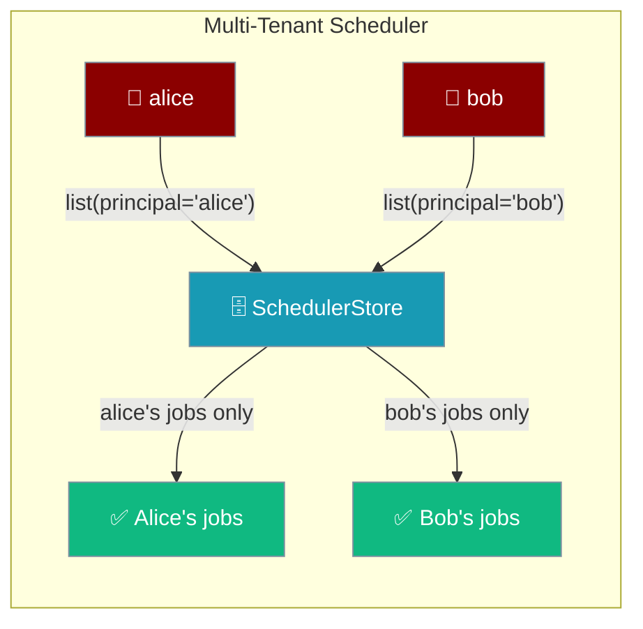
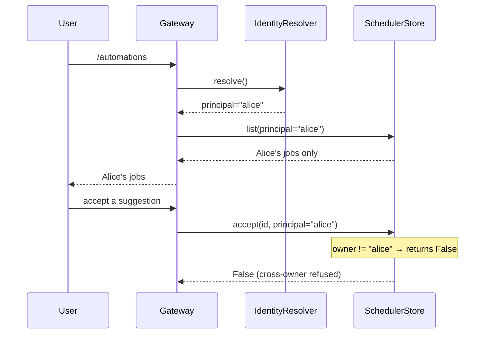
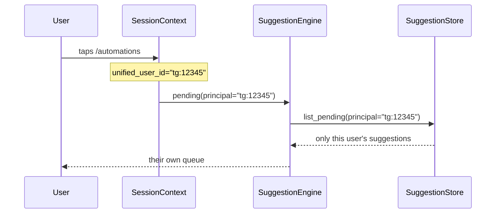
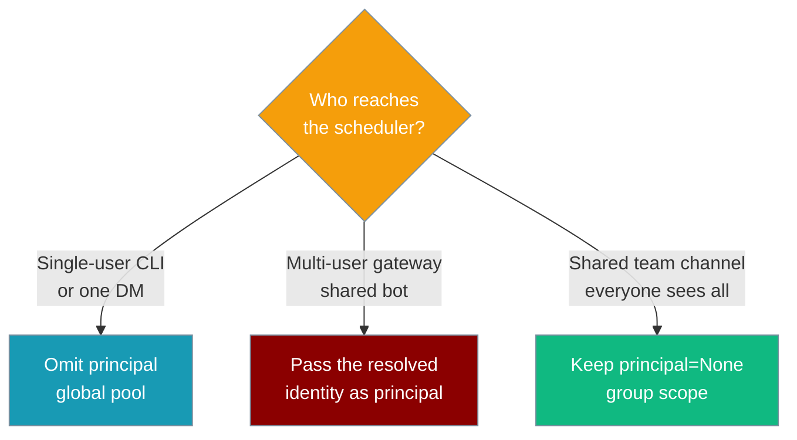

Pass a `principal` when creating a scheduled automation or a suggestion, and every list / accept / dismiss / remove call is automatically scoped to that owner — one gateway user's jobs are invisible to another's.



## Quick Start

<Steps>
<Step title="Create a job for a specific user">
Set `principal` on a `ScheduleJob`. `store.list(principal="alice")` returns only Alice's job, while `store.list()` returns everything.

```python
from praisonaiagents.scheduler import ScheduleJob, Schedule
from praisonaiagents.scheduler.config_store import ConfigYamlScheduleStore

store = ConfigYamlScheduleStore()

store.add(ScheduleJob(
    name="morning-brief",
    schedule=Schedule(kind="cron", cron_expr="0 8 * * *"),
    message="Send Alice her morning brief",
    principal="alice",
))

alice_jobs = store.list(principal="alice")   # → just Alice's job
everything = store.list()                     # → every job, all owners
```
</Step>

<Step title="Scope a suggestion to a user">
Set `principal` on a `Suggestion`. Each owner sees only their own pending queue.

```python
from praisonaiagents.scheduler.suggestion_store import SuggestionStore, Suggestion

store = SuggestionStore()

store.add(Suggestion(
    id="sug_abc",
    blueprint_name="morning-brief",
    slots={"hour": 8},
    principal="alice",
))

alice_pending = store.list_pending(principal="alice")   # → Alice's suggestion
bob_pending = store.list_pending(principal="bob")        # → empty
```
</Step>

<Step title="Backward compatible (single-user)">
Omit `principal` everywhere. Behaviour is unchanged — the store is one shared pool.

```python
from praisonaiagents.scheduler import ScheduleJob, Schedule
from praisonaiagents.scheduler.config_store import ConfigYamlScheduleStore

store = ConfigYamlScheduleStore()

store.add(ScheduleJob(
    name="daily-report",
    schedule=Schedule(kind="cron", cron_expr="0 9 * * *"),
    message="Send the daily report",
))

store.list()   # → every job in one shared pool
```
</Step>
</Steps>

---

## How It Works

The gateway resolves the caller to a stable identity, then threads that string into every store call as `principal`. The store filters reads and refuses cross-owner mutations.



| Call | Scoped by `principal` | Cross-owner result |
|------|----------------------|--------------------|
| `list` / `list_pending` | Yes | Other owners' items are hidden |
| `get_by_name` | Yes | Returns `None` (not found) |
| `remove_by_name` | Yes | Returns `False` (not removed) |
| `accept` / `dismiss` | Yes | Returns `False` (refused) |
| `get(job_id)` / `remove(job_id)` | No | Direct-id access is capability-shaped |

### Auto-scoping from the session context

On a bot gateway (Telegram, Discord, Slack, or WhatsApp adapter) every turn installs a `SessionContext` carrying a `unified_user_id`. The agent tools and the gateway bridge read that value automatically, so isolation is on by default — you never thread identity by hand.

These surfaces now default `principal` from `SessionContext.unified_user_id`:

- `schedule_add`, `schedule_list`, `schedule_remove` — the agent-callable tools
- `SuggestionEngine.propose` / `pending` / `accept` / `dismiss` — the wrapper engine
- `_automations.py` inline-keyboard callbacks and `create_from_blueprint`



<Warning>
**Session identity cannot be impersonated.** On a multi-user gateway the authenticated per-turn `SessionContext.unified_user_id` is authoritative and always wins. A prompt-injected agent cannot pass `principal=<victim>` through an agent-callable tool to read or mutate another tenant's jobs — the explicit argument is a trusted default, never an override of a resolved session identity.

Resolution order:
1. Session identity, when present (authenticated caller — cannot be overridden by tool arguments).
2. Otherwise the explicit `principal` value (trusted CLI / gateway-bridge path where no session context is installed).
3. Otherwise `None` ⇒ global, single-tenant behaviour (CLI / single-user deployments are unchanged).

```python
# Alice's authenticated turn on the gateway
# (SessionContext.unified_user_id="alice" is installed by the bot session manager)
schedule_add("j", "daily", principal="carol")   # arg is IGNORED

# The job is owned by Alice, not Carol.
# store.get_by_name("j").principal == "alice"
# schedule_list(principal="carol") returns "No schedules found" — the arg cannot re-scope reads.
```

On the CLI path no session is installed, so `principal="carol"` **is** honoured — that's the trusted path, where there is no ambient identity to protect.
</Warning>

---

## Configuration Options

Every method below gained an optional `principal` filter. `principal=None` is the default and preserves global / single-tenant behaviour.

### `Suggestion` field

| Field | Type | Default | Description |
|-------|------|---------|-------------|
| `principal` | `Optional[str]` | `None` | Canonical identity of the owner. `None` = global / single-tenant. |

### `SuggestionStore` methods

| Method | Signature | Behaviour |
|--------|-----------|-----------|
| `add` | `add(self, suggestion: Suggestion) -> bool` | Pending cap and dedup window are evaluated within the suggestion's own `principal`. |
| `list_pending` | `list_pending(self, principal: Optional[str] = None) -> List[Suggestion]` | Returns only that owner's active suggestions; `None` = global. |
| `accept` | `accept(self, suggestion_id: str, principal: Optional[str] = None) -> bool` | Returns `False` if the suggestion is owned by a different principal. |
| `dismiss` | `dismiss(self, suggestion_id: str, principal: Optional[str] = None) -> bool` | Returns `False` if the suggestion is owned by a different principal. |

### `ScheduleJob` field

| Field | Type | Default | Description |
|-------|------|---------|-------------|
| `principal` | `Optional[str]` | `None` | Canonical identity of the end-user who owns this job. Distinct from `agent_id` (the owning agent) and `origin` (where it was created). Omitted from `to_dict()` when `None`. |

<Note>
`ScheduleJob` also carries `provider` / `model` / `pin_model` for pinning a job to a specific model — snapshot the model at creation so an unattended run fails closed on drift. See [Scheduler Model Pin](/features/scheduler-model-pin).

```python
store.add(ScheduleJob(
    name="morning-brief",
    schedule=Schedule(kind="cron", cron_expr="0 8 * * *"),
    message="Send Alice her morning brief",
    principal="alice",
    model="openai/gpt-4o-mini",   # snapshot — pinned, fails closed on drift
))
```
</Note>

### `FileScheduleStore` / `ConfigYamlScheduleStore` methods

| Method | Signature | Behaviour |
|--------|-----------|-----------|
| `list` | `list(self, agent_id: Optional[str] = None, principal: Optional[str] = None) -> List[ScheduleJob]` | Filters to jobs whose `principal` matches; `None` = global. |
| `get_by_name` | `get_by_name(self, name: str, principal: Optional[str] = None) -> Optional[ScheduleJob]` | A job owned by a different identity is treated as not found (`None`). |
| `remove_by_name` | `remove_by_name(self, name: str, principal: Optional[str] = None) -> bool` | A job owned by a different identity is skipped (returns `False`). |

### Agent-tool signatures

The agent-callable tools and the wrapper engine gained an optional `principal`. On a gateway it defaults from the session; passing it by hand only matters on the CLI / bridge path.

| Tool | Signature (only the new field) | Behaviour |
|------|-------------------------------|-----------|
| `schedule_add` | `schedule_add(..., principal: str = "")` | Trusted default (session identity wins). Stamps `job.principal` and scopes the duplicate-name check. |
| `schedule_list` | `schedule_list(principal: str = "")` | Filters to jobs owned by the caller. |
| `schedule_remove` | `schedule_remove(name: str, principal: str = "")` | Only removes a job owned by the caller. |
| `SuggestionEngine.propose` | `propose(..., principal: Optional[str] = None)` | Stamps `suggestion.principal`. |
| `SuggestionEngine.pending` | `pending(principal: Optional[str] = None)` | Filters. |
| `SuggestionEngine.accept` | `accept(suggestion_id, principal: Optional[str] = None)` | Refuses cross-owner. |
| `SuggestionEngine.dismiss` | `dismiss(suggestion_id, principal: Optional[str] = None)` | Refuses cross-owner. |

---

## Semantics Reference

| Situation | Result |
|-----------|--------|
| `principal=None` on any reader / mutator | Global / single-tenant behaviour (unchanged). |
| `list_pending(principal="alice")` / `list(principal="alice")` | Only items whose `principal == "alice"` are returned. |
| `accept(id, principal="bob")` where suggestion is owned by `"alice"` | Returns `False`; suggestion is NOT accepted. |
| `dismiss(id, principal="bob")` where suggestion is owned by `"alice"` | Returns `False`; suggestion is NOT dismissed. |
| `get_by_name("shared-name", principal="bob")` where job is owned by `"alice"` | Returns `None` (treated as not found). |
| `remove_by_name("shared-name", principal="bob")` where job is owned by `"alice"` | Returns `False`; job is NOT removed. |
| `add(Suggestion(principal="alice", ...))` while Alice is at `MAX_PENDING_CAP` | Returns `False`. |
| `add(Suggestion(principal="bob", ...))` while Alice is at `MAX_PENDING_CAP` | Returns `True` — Bob's cap is measured independently. |
| Two identical `blueprint_name`+`slots` from the same principal within 24h | Deduped (2nd rejected). |
| Two identical `blueprint_name`+`slots` from different principals within 24h | Both accepted — dedup window is per-principal. |
| Serialising a job with `principal=None` | `principal` key is absent from `to_dict()` output. |
| Agent-tool call with `SessionContext.unified_user_id` set, no explicit `principal=` | Argument defaults to the session identity — job is stamped and reads/mutations are scoped to it. |
| Agent-tool call with `SessionContext.unified_user_id` set AND explicit `principal="other"` | Session identity **wins**; the argument is ignored (prevents impersonation via prompt-injected tool calls). |
| Agent-tool call with no `SessionContext` and explicit `principal="carol"` | Explicit value is honoured — trusted CLI / gateway-bridge path. |
| Agent-tool call with no `SessionContext` and no explicit `principal` | `None` → global pool. Single-tenant / CLI behaviour, unchanged. |

---

## Choosing When to Scope



---

## Common Patterns

On a bot gateway the tools read the session for you — no `principal=` needed. Once the gateway installs a `SessionContext`, an agent turn gets per-user isolation for free.

```python
# Called from inside an agent turn on a bot gateway.
# No `principal=` needed — the tool reads SessionContext.unified_user_id.
from praisonaiagents.tools.schedule_tools import schedule_add, schedule_list

schedule_add("morning-brief", "daily", message="Send my morning brief")
schedule_list()   # → only this user's jobs
```

For advanced callers (custom stores, non-gateway wiring) thread the resolved identity down yourself; the core carries the string and enforces the filter but never resolves identity itself.

```python
from praisonaiagents.scheduler import ScheduleJob, Schedule
from praisonaiagents.scheduler.config_store import ConfigYamlScheduleStore

store = ConfigYamlScheduleStore()

def create_for_caller(principal: str, name: str, cron: str, message: str) -> None:
    store.add(ScheduleJob(
        name=name,
        schedule=Schedule(kind="cron", cron_expr=cron),
        message=message,
        principal=principal,
    ))

def list_for_caller(principal: str):
    return store.list(principal=principal)
```

<Note>
**Cross-owner reads are refused too.** On the gateway bridge, `accept_suggestion` in `_automations.py` hides a suggestion whose `principal` doesn't match the caller — the accept path returns *"That suggestion was not found or has already been handled."* Details never leak by guessing an id.
</Note>

<Info>
`get(job_id)` and `remove(job_id)` are intentionally NOT scoped. Direct-id access is capability-shaped — the id is an opaque 12-character hex (`uuid4().hex[:12]`). The guessable surface is the human-readable `name`, so scoping the name-based path (`get_by_name` / `remove_by_name`) is what closes the leak.
</Info>

<Warning>
Any store implementing `ScheduleStoreProtocol` MUST accept `principal: Optional[str] = None` on `list`, `get_by_name`, and `remove_by_name` for `isinstance(store, ScheduleStoreProtocol)` (runtime-checkable) to keep passing. It MUST also honour the "cross-owner is invisible" contract: hide other owners' items on filtered reads, and refuse cross-owner mutations by returning `None` / `False`.
</Warning>

---

## Backward Compatibility

Existing on-disk `jobs.json`, `config.yaml`, and `suggestions.json` files load unchanged. `principal` is omitted from `to_dict()` output when `None`, and every store method defaults `principal` to `None` — the pre-scoping global behaviour.

```python
from praisonaiagents.scheduler import ScheduleJob, Schedule

job = ScheduleJob(
    name="daily-report",
    schedule=Schedule(kind="cron", cron_expr="0 9 * * *"),
    message="Send the daily report",
)

assert "principal" not in job.to_dict()   # key absent when None
```

---

## Best Practices

<AccordionGroup>
  <Accordion title="Reuse the gateway-resolved identity">
    Thread the identity the gateway already resolved (`IdentityResolverProtocol` output) down as `principal`. Do not invent a new identity in the store layer — the core carries the string and enforces the filter, it does not resolve identity.
  </Accordion>
  <Accordion title="Keep the store shared, not sharded">
    The store is designed for one file with per-record ownership, not one file per user. Pass `principal` on each record instead of creating a separate store per user.
  </Accordion>
  <Accordion title="Match the mutation to the read">
    If you list per-principal in the UI, always mutate per-principal in the callback. Never accept a naked `sug_id` from an untrusted UI without re-scoping to the caller's `principal`.
  </Accordion>
  <Accordion title="Treat the direct id as a capability">
    `get(id)` and `remove(id)` are intentionally unscoped. Surface a job's opaque id only to its owner — the id itself is the access token for direct-id operations.
  </Accordion>
</AccordionGroup>

---

## Related

<CardGroup cols={2}>
  <Card title="Automation Suggestions" icon="lightbulb" href="/features/automation-suggestions">
    Per-user consent-first automation proposals.
  </Card>
  <Card title="Async Agent Scheduler" icon="clock" href="/features/async-agent-scheduler">
    The scheduler that owns these jobs.
  </Card>
  <Card title="Scheduled Run Policy" icon="shield-halved" href="/features/scheduled-run-policy">
    Safety gate for unattended runs — a different layer.
  </Card>
  <Card title="Bot Command Access Control" icon="lock" href="/features/bot-command-access-control">
    Who may call `/automations` at all.
  </Card>
</CardGroup>
