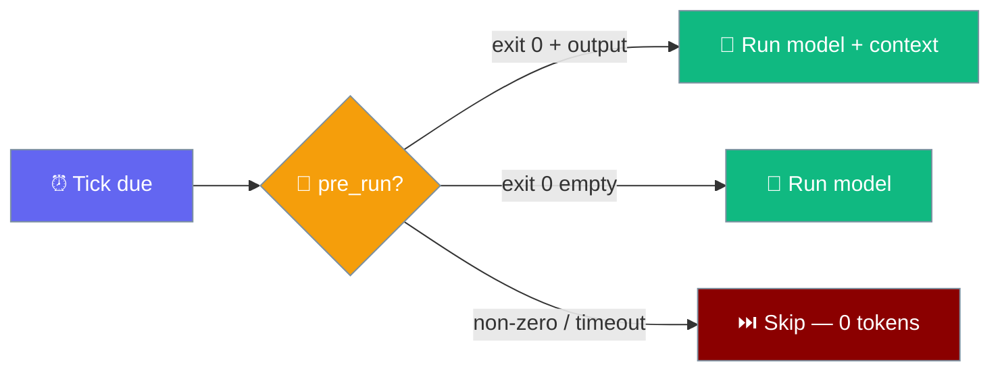
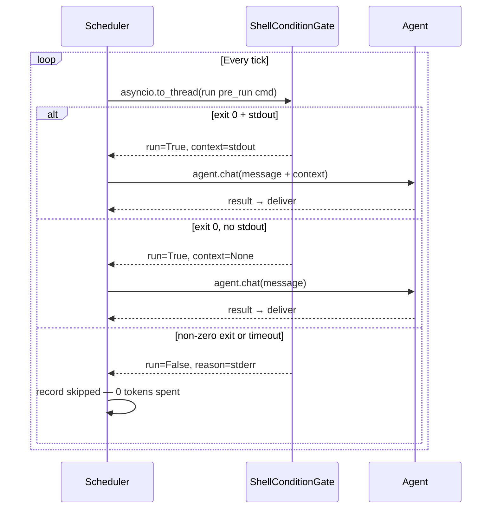
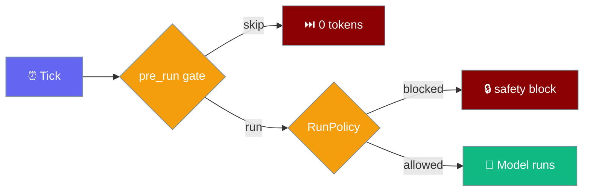

Run a cheap shell check before each scheduled tick — skip the model turn (and any delivery ping) when there's nothing to do.

```python
from praisonaiagents import Agent
from praisonaiagents.scheduler import ScheduleJob, Schedule

agent = Agent(
    name="InboxWatcher",
    instructions="Summarise new emails and flag anything important.",
)
job = ScheduleJob(
    name="inbox-watch",
    schedule=Schedule(kind="every", every_seconds=300),
    pre_run="scripts/new_mail.sh",
    message="Summarise these new emails and flag anything important.",
)
```


The user schedules a tick with a `pre_run` shell hook; the agent only runs when the gate script reports work to do.




## Quick Start

<Steps>
<Step title="YAML (simplest)">
Add `pre_run` to your `agents.yaml` schedule block. The agent only runs when the script exits 0 with output.

```yaml
schedule:
  every: 300
  pre_run: scripts/new_mail.sh
  message: "Summarise these new emails and flag anything important."
```
</Step>

<Step title="Python">
Set `pre_run` directly on a `ScheduleJob`.

```python
from praisonaiagents import Agent
from praisonaiagents.scheduler import ScheduleJob, Schedule

agent = Agent(
    name="InboxWatcher",
    instructions="Summarise new emails and flag anything important.",
)

job = ScheduleJob(
    name="inbox-watch",
    schedule=Schedule(kind="every", every_seconds=300),
    pre_run="scripts/new_mail.sh",
    message="Summarise these new emails and flag anything important.",
)
```
</Step>

<Step title="CLI">
Pass `--pre-run` when adding a scheduled job.

```bash
praisonai schedule add "inbox-watch" \
  -s "*/5m" \
  -m "Summarise new emails" \
  --pre-run "scripts/new_mail.sh" \
  --deliver telegram
```
</Step>
</Steps>

---

## How It Works



The gate runs in `asyncio.to_thread` so a slow check does not block other scheduled ticks. If the gate itself raises an exception, the executor falls back to running the agent (defensive default).

---

## Configuration Options

### `ScheduleJob` fields

| Field | Type | Default | Description |
|-------|------|---------|-------------|
| `pre_run` | `Optional[str]` | `None` | Shell command run before each tick. Set via YAML `schedule.pre_run` or `--pre-run` |
| `condition` | `Optional[str]` | `None` | Advisory natural-language label (round-tripped, **not** enforced by the default gate) |

### `ScheduledAgentExecutor` parameter

| Parameter | Type | Default | Description |
|-----------|------|---------|-------------|
| `condition_resolver` | `None \| False \| callable` | `None` | `None` = auto shell gate when `pre_run` set; `False` = gating disabled; callable `(job) → gate \| None` = custom resolver |

### `ShellConditionGate` options

| Option | Type | Default | Description |
|--------|------|---------|-------------|
| `timeout` | `float` | `30.0` | Seconds before the gate is treated as a skip |
| `_MAX_CONTEXT_CHARS` | `int` | `8000` | Cap on captured stdout appended as context |
| `_MAX_REASON_CHARS` | `int` | `500` | Cap on stderr surfaced in the skip reason |

### Gate decision table

| Gate command exit | stdout | Decision | What happens |
|-------------------|--------|----------|--------------|
| `0` | non-empty | `run=True`, `context=stdout` | Model runs, stdout appended to message |
| `0` | empty | `run=True`, `context=None` | Model runs with original message only |
| non-zero | — | `run=False` | Tick recorded as `skipped` — no tokens, no delivery |
| timeout (>`timeout`s) | — | `run=False` | Same as skipped |
| gate raises | — | falls back to `run=True` | Model runs (defensive) |

<Warning>
`pre_run` executes an arbitrary host shell command on every tick. It is **not** exposed through the agent-callable `schedule_add` tool — accepting it from an LLM would allow a prompt-injected agent to persist server-side command execution. Configure `pre_run` only via CLI, YAML, or Python.
</Warning>

---

## Pre-Run Gate vs RunPolicy

Two complementary gates apply on every tick when both are configured:



| Gate | Purpose | When to configure |
|------|---------|-------------------|
| **Pre-run gate** (`pre_run`) | **Efficiency** — should a run happen at all? | When most ticks have nothing to do |
| **RunPolicy** | **Safety** — what is an unattended run allowed to do? | Always in production unattended runs |

---

## Common Patterns

### Inbox watcher

Only fire when new mail arrives — cuts 288 daily runs to just the count of mail bursts.

```yaml
schedule:
  every: 300
  pre_run: scripts/new_mail.sh
  message: "Summarise these new emails and flag anything important."
```

`scripts/new_mail.sh` exits 0 and prints new messages when mail is present; exits non-zero when the inbox is quiet.

### CI babysitter

Alert a channel only when a build breaks.

```bash
praisonai schedule add "ci-watch" \
  -s "*/5m" \
  -m "Summarise the CI failure and suggest a fix" \
  --pre-run "scripts/ci_failed.sh" \
  --deliver telegram
```

### Custom Python gate

Use a callable resolver for richer logic than a shell exit code.

```python
from praisonaiagents import Agent
from praisonaiagents.scheduler import ScheduleJob, Schedule
from praisonai_bot.scheduler import ScheduledAgentExecutor

class MyPythonGate:
    def check(self, job):
        import requests
        r = requests.get("https://api.example.com/has-work")
        return r.json().get("pending", 0) > 0

agent = Agent(name="WorkProcessor", instructions="Process pending work items.")

job = ScheduleJob(
    name="work-processor",
    schedule=Schedule(kind="every", every_seconds=60),
    message="Process all pending work items.",
)

executor = ScheduledAgentExecutor(
    runner=runner,
    agent_resolver=lambda _: agent,
    condition_resolver=lambda job: MyPythonGate(),
)
```

---

## Best Practices

<AccordionGroup>
<Accordion title="Keep the gate cheap and deterministic">
The gate runs on every tick. Aim for under 1 second — a fast file check, an API ping, or a database row count. Avoid heavy computation.

```bash
# Good — fast local check
scripts/new_mail.sh

# Avoid — slow network calls without caching
scripts/fetch_all_data_and_analyse.sh
```
</Accordion>

<Accordion title="Always set a sensible timeout">
The default `timeout=30.0` is conservative. A runaway gate stalls that tick's slot. Set it to match your gate's expected worst case.

```python
from praisonai_bot.scheduler.condition_gate import ShellConditionGate

gate = ShellConditionGate(timeout=5.0)
```
</Accordion>

<Accordion title="Use stdout to seed the prompt">
The same check that gates the run can feed it the data — the gate's stdout is automatically appended to the message.

```bash
#!/bin/bash
# scripts/new_mail.sh
# Prints new mail subjects if any, exits non-zero if inbox empty
NEW=$(mail -H 2>/dev/null | head -20)
if [ -z "$NEW" ]; then exit 1; fi
echo "$NEW"
```

The agent then receives: `"Summarise these new emails... <new mail subjects>"`.
</Accordion>

<Accordion title="Don't put secrets in pre_run">
The `pre_run` string is stored verbatim in the job record. Use environment variables or a secrets manager instead of inline credentials.

```bash
# Good — use environment variable
scripts/check_api.sh

# Avoid — secret visible in job record
curl -H "Authorization: Bearer mysecrettoken" https://api.example.com/check
```
</Accordion>

<Accordion title="pre_run is CLI/YAML/Python-only — never LLM-callable">
The agent-callable `schedule_add` tool deliberately does not accept `pre_run`. This prevents a prompt-injected agent from persisting arbitrary shell commands on the host. Always configure `pre_run` through the CLI, YAML, or Python code.
</Accordion>

<Accordion title="Understand skipped vs failed">
A gate returning non-zero records the tick as `skipped` (not `failed`) — this is expected normal operation when there's nothing to do. Check your run history with `praisonai schedule logs` to see skip rates.
</Accordion>
</AccordionGroup>

---

## Skip and Failure Reasons

When a tick is skipped or fails, the `JobResult.error` field contains one of these reasons:

| Reason | Source | `status` |
|--------|--------|----------|
| `"No message configured"` | Job has no `message` field | `skipped` |
| `"Agent resolution failed: <exception>"` | `agent_resolver` raised | `failed` |
| `"No agent found for agent_id=<id>"` | `agent_resolver` returned `None` | `failed` |
| `"pre-run gate: nothing to do"` | Gate exit non-zero, no stderr | `skipped` |
| `"pre-run gate: nothing to do (exit <N>: <stderr>)"` | Gate exit non-zero with stderr | `skipped` |
| `"pre-run gate timed out (>{timeout:.0f}s)"` | Gate exceeded timeout | `skipped` |
| `"pre-run gate error: <exception>"` | Gate raised exception (defensive: falls back to run) | — |
| `"Blocked by run policy: <scan.reason>"` | RunPolicy scanner blocked | `failed` |

When `deliver_on_failure` is enabled on the `RunPolicy`, a failure summary is delivered to the channel:

> `⚠️ Scheduled job '<name>' failed: <error>`

---

## `JobResult` Reference

Every tick yields a `JobResult` from `praisonai_bot.scheduler`:

```python
from praisonai_bot.scheduler import JobResult
```

<Tip>
`from praisonai.scheduler.executor import JobResult` also works when the `praisonai` wrapper is installed (backward-compatible shim).
</Tip>

| Field | Type | Default | Description |
|-------|------|---------|-------------|
| `job` | `ScheduleJob` | required | The `ScheduleJob` that was executed |
| `result` | `Optional[str]` | `None` | Agent response, or `None` on failure |
| `status` | `str` | `"succeeded"` | One of `"succeeded"`, `"failed"`, `"skipped"` |
| `error` | `Optional[str]` | `None` | Error message when `status == "failed"` or skip reason when `status == "skipped"` |
| `duration` | `float` | `0.0` | Wall-clock seconds for agent execution |
| `delivered` | `bool` | `False` | Whether the result was delivered to a channel bot |
| `delivery_error` | `Optional[str]` | `None` | Delivery failure message, separate from execution `error` |
| `audit_path` | `Optional[str]` | `None` | Local path where full output was persisted (if any) |

---

## Session Routing

`session_target` on `ScheduleJob` controls whether a scheduled tick reuses an existing channel session or gets its own isolated context.

| `job.session_target` | Behaviour |
|----------------------|-----------|
| `"isolated"` (default) | Each tick uses `session_id=f"cron_{job.id}"` — no shared memory across runs |
| `"main"` | If `job.delivery.session_id` is set, that session is reused so the scheduled turn joins the channel's ongoing conversation |

`session_id` is passed only when the resolved `agent.chat` accepts a `session_id` keyword argument. The executor inspects the signature before passing it.

```yaml
schedule:
  every: 300
  session_target: main   # join the channel's ongoing session
```

---

## Imports: Bot-First and Wrapper Shims

<Tip>
`praisonai_bot.scheduler` is the canonical import for `ScheduledAgentExecutor` and `JobResult`. When the `praisonai` wrapper is installed, `from praisonai.scheduler.executor import ScheduledAgentExecutor` works as a backward-compatible shim.
</Tip>

```python
# Canonical (bot-tier)
from praisonai_bot.scheduler import ScheduledAgentExecutor, JobResult
from praisonai_bot.scheduler.condition_gate import ShellConditionGate

# Wrapper shims (require pip install praisonai)
from praisonai.scheduler.executor import ScheduledAgentExecutor
from praisonai.scheduler.condition_gate import ShellConditionGate
```

---

## Related

<CardGroup cols={2}>
<Card title="Async Agent Scheduler" icon="clock" href="/docs/features/async-agent-scheduler">
  The scheduler this gate plugs into
</Card>
<Card title="Scheduled Run Policy" icon="shield-halved" href="/docs/features/scheduled-run-policy">
  Safety gate — tool scoping, prompt scan, and audit
</Card>
<Card title="Schedule CLI" icon="terminal" href="/docs/cli/schedule">
  CLI surface — where `--pre-run` and `--condition` are configured
</Card>
<Card title="praisonai-bot SDK" icon="comments" href="/docs/sdk/praisonai-bot/index">
  Full bot-tier SDK reference
</Card>
</CardGroup>
