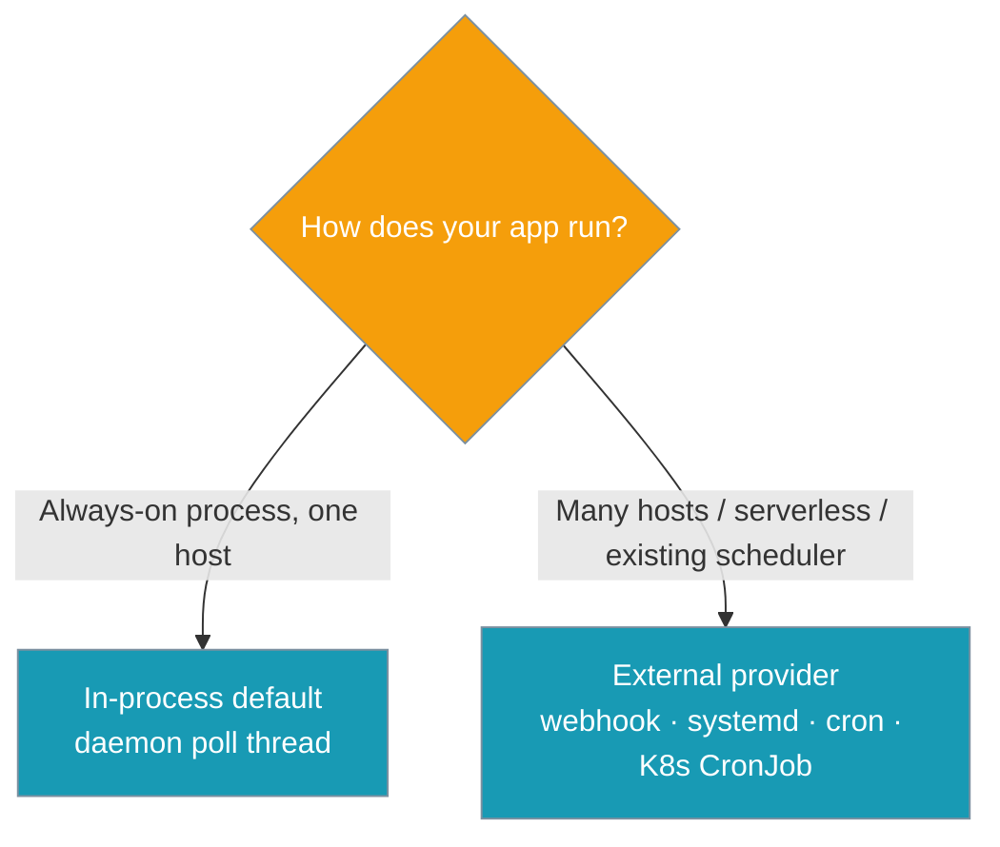
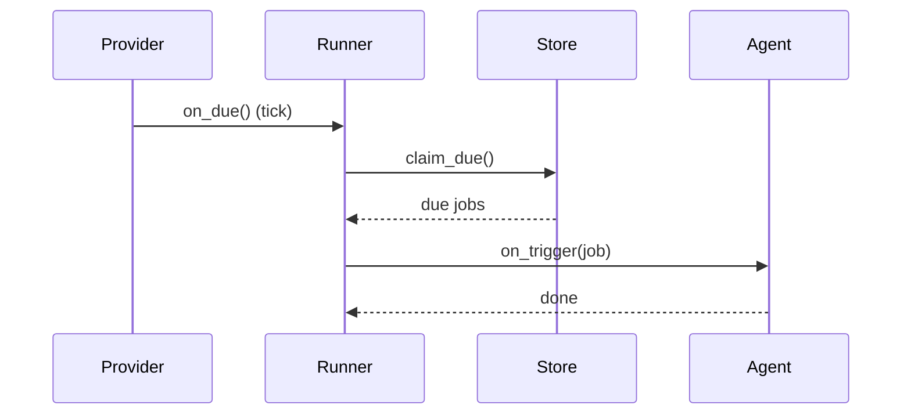
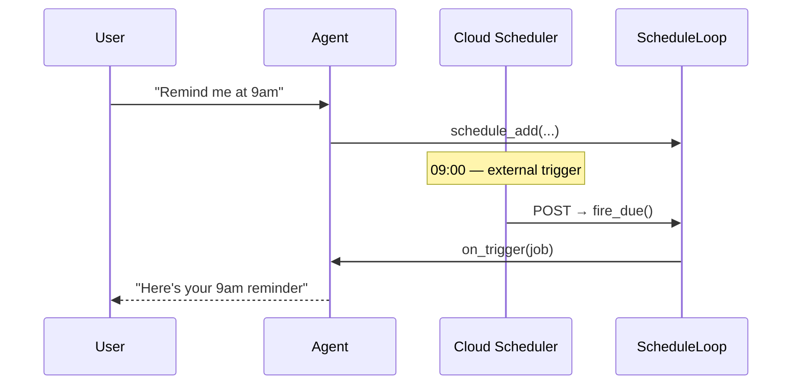

A scheduler provider decides **when** to fire. The default polls in-process; swap it for systemd, a cloud scheduler webhook, or a cron trigger without changing what fires.


A provider never decides *what* fires — it just calls `on_due` whenever a tick should occur, and the shared runner and store claim and fire due jobs.

## Which Provider?

Pick in-process when one host runs all the time; pick an external provider when firing should come from elsewhere.



## Quick Start

<Steps>
<Step title="Default — in-process poll (nothing to configure)">

```python
from praisonaiagents import Agent
from praisonaiagents.scheduler import ScheduleLoop

agent = Agent(name="assistant", instructions="You set reminders.")

loop = ScheduleLoop(on_trigger=lambda job: agent.start(job.message))
loop.start()  # zero-arg — same as before
```

</Step>
<Step title="External / serverless — event-driven, no always-on thread">

```python
from praisonaiagents import Agent
from praisonaiagents.scheduler import ScheduleLoop

agent = Agent(name="assistant", instructions="You set reminders.")

# Reuse the built-in loop as a pure "claim + fire" engine — do NOT call start().
engine = ScheduleLoop(on_trigger=lambda job: agent.start(job.message))

# In your webhook / cron / systemd-timer handler:
def on_cloud_scheduler_ping():
    engine.fire_due()  # one tick — no daemon thread
```

</Step>
</Steps>

---

## How It Works

The provider owns the trigger; the runner and store own the firing.



`on_due` is the seam: the provider calls it whenever its trigger fires, and everything downstream — claiming due jobs and firing them — happens in the runner and store.

| Piece | Owns |
|-------|------|
| Provider (`SchedulerProviderProtocol`) | *When* a tick happens |
| `ScheduleRunner` + store | *What* is due and *how* it fires |

---

## Provider Options

Two ways to drive firing — one always-on, one event-driven.

| Provider | When to use | Always-on thread? |
|----------|-------------|-------------------|
| `InProcessScheduleProvider` (default, alias for `ScheduleLoop`) | Single always-on process | Yes (daemon) |
| External (webhook / systemd / cron / K8s CronJob / APScheduler) | Multi-host, serverless, or delegate to existing scheduler | No |

Any object with `start(on_due, store=...)` and `stop()` satisfies `SchedulerProviderProtocol`.

```python
from praisonaiagents.scheduler import (
    SchedulerProviderProtocol,
    InProcessScheduleProvider,
    ScheduleLoop,
)

assert InProcessScheduleProvider is ScheduleLoop
assert isinstance(ScheduleLoop(on_trigger=lambda job: None), SchedulerProviderProtocol)
```

---

## User Interaction Flow

A reminder set through the agent still fires even when a cloud scheduler drives the tick.



---

## Configuration Options

Providers are protocol-only — see the auto-generated SDK reference for full signatures.

<CardGroup cols={2}>
  <Card title="Scheduler Protocols" icon="code" href="/docs/sdk/praisonai/scheduler">
    `SchedulerProviderProtocol`, `ScheduleStoreProtocol`, `JobConditionProtocol`, `GateResult`
  </Card>
  <Card title="Schedule Tools" icon="clock" href="/docs/tools/schedule-tools">
    Agent-callable `schedule_add` / `schedule_list` / `schedule_remove`
  </Card>
</CardGroup>

---

## Common Patterns

### Cloud webhook

Cloud Scheduler, EventBridge, or a GitHub Actions cron posts to an HTTP handler that calls `fire_due()`.

```python
from praisonaiagents import Agent
from praisonaiagents.scheduler import ScheduleLoop

agent = Agent(name="assistant", instructions="You set reminders.")
engine = ScheduleLoop(on_trigger=lambda job: agent.start(job.message))

# e.g. FastAPI / Flask route the cloud scheduler pings on a schedule
def handle_scheduler_webhook():
    engine.fire_due()
    return {"ok": True}
```

### systemd / launchd timer

A timer unit runs a short command on schedule; the command fires one tick and exits.

```python
# fire_once.py — invoked by a systemd timer (OnCalendar=*:0/5)
from praisonaiagents import Agent
from praisonaiagents.scheduler import ScheduleLoop

agent = Agent(name="assistant", instructions="You set reminders.")
ScheduleLoop(on_trigger=lambda job: agent.start(job.message)).fire_due()
```

### Kubernetes CronJob

A short-lived pod runs `fire_due()` and exits — no long-running scheduler pod.

```python
# entrypoint.py — the CronJob pod's command
from praisonaiagents import Agent
from praisonaiagents.scheduler import ScheduleLoop

agent = Agent(name="assistant", instructions="You set reminders.")
ScheduleLoop(on_trigger=lambda job: agent.start(job.message)).fire_due()
```

---

## Best Practices

<AccordionGroup>
  <Accordion title="Never call start() twice on the same loop">
    `start()` on a running loop is a no-op by design. Treat one loop as one provider — don't try to reconfigure it mid-run.
  </Accordion>
  <Accordion title="Use fire_due() directly for serverless">
    In webhook, cron, or systemd handlers call `engine.fire_due()` and never call `start()` — you get one tick's work with no daemon thread.
  </Accordion>
  <Accordion title="Concurrency is safe by default">
    Both bundled stores (`ConfigYamlScheduleStore` — the default — and `FileScheduleStore`) implement atomic `claim_due`, so a due job fires at most once across processes and hosts out of the box. `fire_due()` also runs its claim + fire step under a per-instance lock, guarding against double-fires within a single process.

    OS advisory locks only hold on filesystems that honour them — NFS does not reliably, so shared-NFS deployments can still double-fire.
  </Accordion>
  <Accordion title="Pair external providers with claim_due stores">
    Both bundled stores already implement `claim_due`, so cross-host at-most-once delivery works by default. If you bring a custom store, implement `claim_due` on it to keep the same guarantee when firing from multiple hosts.
  </Accordion>
</AccordionGroup>

---

## Related

<CardGroup cols={2}>
  <Card title="Background Tasks — ScheduleLoop" icon="clock" href="/docs/features/background-tasks#scheduleloop">
    The in-process poll loop and combined recipes
  </Card>
  <Card title="Schedule Tools" icon="wrench" href="/docs/tools/schedule-tools">
    Let agents create schedules via tool calls
  </Card>
  <Card title="Scheduled Run Policy" icon="shield" href="/docs/features/scheduled-run-policy">
    Safety gate for unattended scheduled runs
  </Card>
  <Card title="Scheduler Pre-Run Gate" icon="filter" href="/docs/features/scheduler-pre-run-gate">
    Skip ticks cheaply before spending tokens
  </Card>
</CardGroup>
