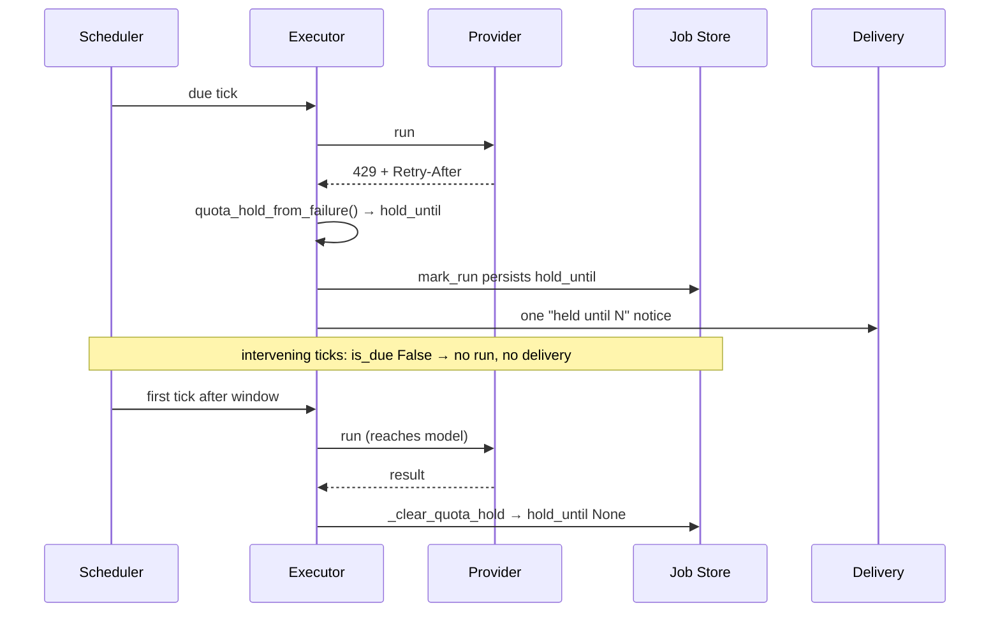
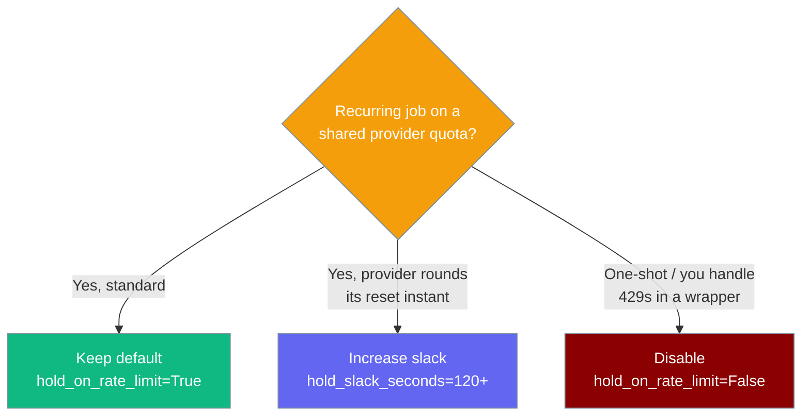

A scheduled job whose provider is rate-limited stops re-firing until the provider's own reset window elapses — one notice, no wasted requests, one clean resume.

```mermaid
graph LR
    Tick[⏰ Scheduled Tick] --> Fail[❌ 429 + Retry-After]
    Fail --> Park[⏸️ Park until reset + slack]
    Park --> Coalesce[🤫 Intervening ticks coalesce]
    Coalesce --> Legal[🤖 First legal tick reaches model]
    Legal --> Clear[✅ Hold cleared]

    classDef input fill:#6366F1,stroke:#7C90A0,color:#fff
    classDef park fill:#F59E0B,stroke:#7C90A0,color:#fff
    classDef fail fill:#8B0000,stroke:#7C90A0,color:#fff
    classDef output fill:#10B981,stroke:#7C90A0,color:#fff

    class Tick input
    class Fail fail
    class Park,Coalesce park
    class Legal,Clear output
```



## Quick Start

<Steps>
<Step title="On by default">
Scheduling an agent already gets the hold — no config needed.

```python
from praisonaiagents import Agent

agent = Agent(
    name="daily-digest",
    instructions="Summarise overnight repo activity.",
)

# A 429 from the provider parks this job until the reset window elapses.
# No extra config — the wrapper's default RunPolicy has hold_on_rate_limit=True.
agent.start("Every day at 02:00, brief last-night activity to slack:#eng.")
```
</Step>

<Step title="Tune the slack, or turn it off">
Construct `RunPolicy` explicitly and pass it to the executor.

```python
from praisonaiagents import Agent
from praisonaiagents.scheduler import ScheduleRunner, FileScheduleStore
from praisonai_bot.scheduler import ScheduledAgentExecutor
from praisonai.scheduler import RunPolicy

agent = Agent(
    name="daily-digest",
    instructions="Summarise overnight repo activity.",
)

runner = ScheduleRunner(FileScheduleStore())

executor = ScheduledAgentExecutor(
    runner=runner,
    agent_resolver=lambda _id: agent,
    run_policy=RunPolicy(
        hold_on_rate_limit=True,   # default — park past the reset window
        hold_slack_seconds=120.0,  # wait 2 min past the window before resuming
    ),
)
```

Set `hold_on_rate_limit=False` to keep the prior fire-every-tick behaviour.
</Step>
</Steps>

---

## How It Works

The first 429 parks the job past the provider's reset window; intervening ticks skip silently; the first tick after the window reaches the model and clears the hold.



| Step | What happens |
|------|-------------|
| First 429 | Executor reads `Retry-After`, sets `job.hold_until = now + window + slack` |
| `mark_run` | Persists `hold_until` so the park survives a restart |
| Notice | One "held until N" message via the de-duplicating incident path |
| Intervening ticks | `is_due` returns `False` while `now < hold_until` — no run, no delivery |
| First legal tick | Run reaches the model; `_clear_quota_hold` lifts the park on success |
| Fresh 429 | Re-parks past the new window (never shortens an existing later hold) |

---

## Keep, Tune, or Disable?

Recurring jobs keep the default; flaky-reset providers raise the slack; one-shot jobs or custom-wrapper handlers disable it.



---

## What Triggers a Hold

Only a rate-limit / quota failure that carries a usable reset window parks the job.

| Signal | Held? | Reason |
|---|---|---|
| 429 with `Retry-After` header (delta-seconds) | ✅ Yes | Parked past that window + slack |
| 429 with `Retry-After` header (HTTP-date, RFC 7231) | ✅ Yes | Parsed via stdlib; parked past that instant + slack |
| 429 with `retry_after` attribute on the exception | ✅ Yes | Same as above |
| 429 message text like `retry after 30 seconds` | ✅ Yes | Extracted from the message |
| 429 with **no** reset hint at all | ❌ No | No usable window — falls through to today's behaviour |
| Non-quota failure (validation, network, 5xx) | ❌ No | Not a rate-limit signal |
| A prior hold in the future, new (shorter) window | Prior wins | A hold is never *shortened* by a later failure |

<Note>
A single hold is bounded to **24 hours** (`_MAX_HOLD_SECONDS`), so a bogus or huge provider `Retry-After` can never park a job indefinitely.
</Note>

---

## Interplay with Incidents

The hold notice **is not gated** on `alert_after_failures` — a job configured to alert only after N failures would otherwise park silently and the operator would never learn it was held. Failure and recovery accounting still folds through the incident tracker for consistency. See [Scheduler Incidents](/features/scheduler-incidents).

## Interplay with Delivery

The "held until N" notice reuses the same de-duplicating incident/alert plumbing as `deliver_on_failure`, so a benched provider produces a **single** notice — not one alert per skipped tick. See [Scheduler Delivery](/features/scheduler-delivery).

## Persistence

`hold_until` is persisted **only when set**, so a benched job stays parked across process restarts and jobs that never hit a quota wall are byte-for-byte unchanged in their serialised form.

---

## Configuration Options

Two fields on `RunPolicy` control the hold. See the full [RunPolicy reference](/features/scheduled-run-policy#configuration-options).

| Option | Type | Default | Description |
|--------|------|---------|-------------|
| `hold_on_rate_limit` | `bool` | `True` | Park the job past the provider's reset window on a rate-limit / quota failure instead of re-firing every tick. Set `False` to keep the prior fire-every-tick behaviour. |
| `hold_slack_seconds` | `float` | `60.0` | Extra seconds added past the provider's reset window when parking, so the job does not re-fire the instant the window reopens. |

---

## Best Practices

<AccordionGroup>
<Accordion title="Keep the default on for recurring jobs">
A nightly or hourly job that hits a shared quota is exactly what this protects against. Leave `hold_on_rate_limit=True`.
</Accordion>

<Accordion title="Bump hold_slack_seconds for providers with rounded reset instants">
If you see a job re-fire and immediately re-park, the provider's reset instant is rounded past `Retry-After`. Raise the slack:

```python
from praisonai.scheduler import RunPolicy

policy = RunPolicy(hold_slack_seconds=180.0)
```
</Accordion>

<Accordion title="Disable only for one-shot jobs or a custom 429 wrapper">
The prior fire-every-tick semantics are almost never what you want in production. Disable only when the job runs once, or when you already handle 429s yourself:

```python
from praisonai.scheduler import RunPolicy

policy = RunPolicy(hold_on_rate_limit=False)
```
</Accordion>

<Accordion title="Trust the 24-hour cap">
A bogus provider `Retry-After` can never park a job indefinitely — the hold is bounded to 24 hours, then the job becomes due again.
</Accordion>
</AccordionGroup>

---

## Related

<CardGroup cols={2}>
<Card title="Scheduled Run Policy" icon="shield-halved" href="/features/scheduled-run-policy">
  The RunPolicy fields, including hold_on_rate_limit
</Card>
<Card title="Scheduler Incidents" icon="bell" href="/features/scheduler-incidents">
  The once-per-incident model this notice reuses
</Card>
<Card title="Scheduler Delivery" icon="paper-plane" href="/features/scheduler-delivery">
  How the "held until" notice reaches operators
</Card>
<Card title="Bot Rate Limiting" icon="gauge" href="/features/bot-rate-limiting">
  The sibling in-tick backoff (5-minute cap) — a different problem
</Card>
</CardGroup>
