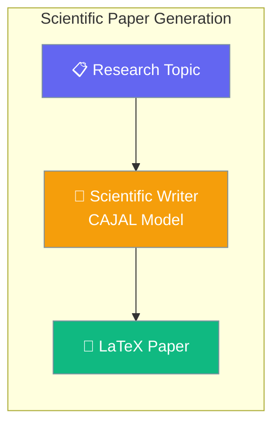
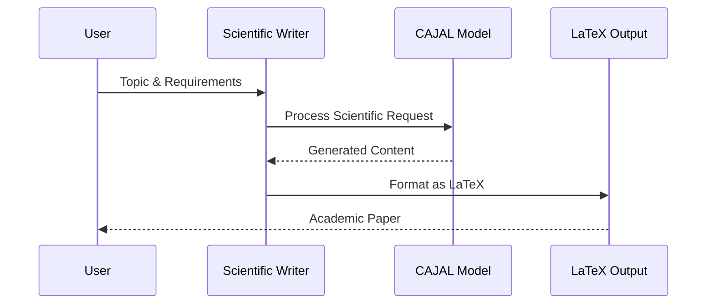
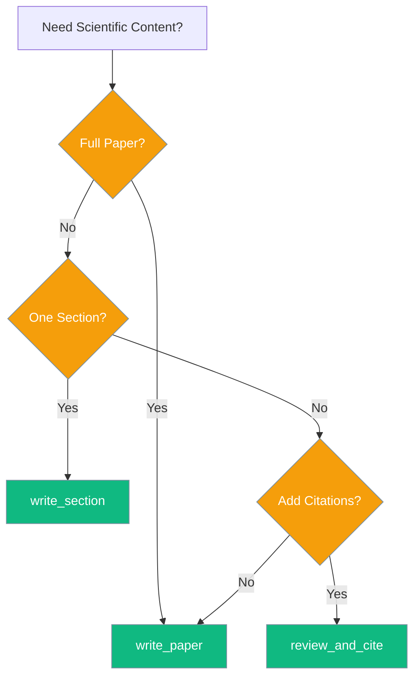
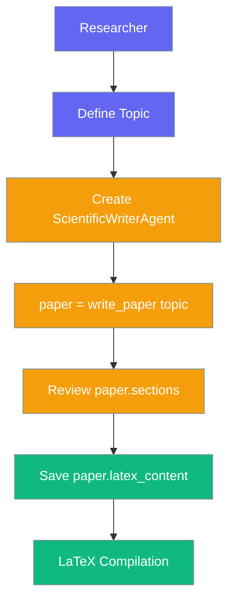

<Warning>
**Removed in PraisonAI PR #1641** — `ScientificWriterAgent` / CAJAL integration was reverted. This page is kept for historical reference only; do not use in new projects.
</Warning>

Scientific Writer Agent created LaTeX-formatted academic papers using the CAJAL local model (no longer available in current releases).



## Quick Start

<Steps>
<Step title="Simple Paper Generation">
```python
from praisonaiagents import ScientificWriterAgent

agent = ScientificWriterAgent()
paper = agent.write_paper("Machine Learning in Healthcare")

print(f"Title: {paper.title}")
print(f"Sections: {len(paper.sections)}")
print(paper.latex_content)
```
</Step>

<Step title="With CAJAL Model">
```python
from praisonaiagents import ScientificWriterAgent

agent = ScientificWriterAgent(
    model="Agnuxo/CAJAL-4B-P2PCLAW"
)

paper = agent.write_paper(
    "Quantum Computing Applications",
    style="research",
    citation_style="IEEE"
)
```
<Note>
CAJAL is a 2GB local model. Requires: `pip install transformers torch`
</Note>
</Step>
</Steps>

---

## How It Works



| Method | Purpose | Output |
|--------|---------|---------|
| `write_paper()` | Full paper generation | Complete `ScientificPaper` |
| `write_section()` | Single section creation | Individual `PaperSection` |
| `review_and_cite()` | Literature review with citations | Formatted citation text |

---

## Choosing the Right Method



---

## Common Patterns

### Single Section Generation

```python
from praisonaiagents import ScientificWriterAgent

agent = ScientificWriterAgent()
section = agent.write_section(
    section_title="Methodology",
    content_request="Machine learning approach for medical diagnosis",
    context="Previous work on CNN architectures"
)

print(section.title)
print(section.content)
print(section.latex_content)
```

### Adding Citations to Existing Content

```python
from praisonaiagents import ScientificWriterAgent

agent = ScientificWriterAgent()
draft = "Machine learning shows promise in healthcare applications."

cited_content = agent.review_and_cite(
    research_query="machine learning healthcare applications",
    existing_content=draft
)
print(cited_content)
```

### Multi-Agent Workflow

```python
from praisonaiagents import Agent, AgentTeam, Task, ScientificWriterAgent

# Create specialized research agents
literature_reviewer = Agent(
    name="Literature Reviewer",
    instructions="Find and analyze academic papers on the topic"
)

methodology_designer = Agent(
    name="Methodology Designer", 
    instructions="Design experimental methodology and approaches"
)

scientific_writer = ScientificWriterAgent(
    model="Agnuxo/CAJAL-4B-P2PCLAW"
)

# Create research workflow
team = AgentTeam(agents=[literature_reviewer, methodology_designer, scientific_writer])

tasks = [
    Task(
        description="Review literature on quantum computing in cryptography",
        agent=literature_reviewer
    ),
    Task(
        description="Design methodology for quantum key distribution analysis", 
        agent=methodology_designer
    ),
    Task(
        description="Write complete academic paper based on research",
        agent=scientific_writer
    )
]

result = team.run(tasks=tasks)
```

---

## Configuration Options

### ScientificWriterAgent Constructor

| Parameter | Type | Default | Description |
|-----------|------|---------|-------------|
| `name` | `Optional[str]` | `"Scientific Writer"` | Agent display name |
| `model` | `Optional[str]` | `"Agnuxo/CAJAL-4B-P2PCLAW"` | Model identifier (CAJAL default) |
| `instructions` | `Optional[str]` | Built-in scientific instructions | Custom behavior instructions |
| `role` | `Optional[str]` | `"Scientific Paper Writer"` | Agent role description |
| `goal` | `Optional[str]` | `"Generate high-quality scientific papers..."` | Agent goal definition |
| `backstory` | `Optional[str]` | Built-in academic backstory | Agent background story |

### Method Parameters

#### `write_paper(topic, sections=None, style="academic", citation_style="APA")`

| Parameter | Type | Default | Description |
|-----------|------|---------|-------------|
| `topic` | `str` | Required | Research topic for the paper |
| `sections` | `Optional[List[str]]` | `["Introduction", "Literature Review", "Methodology", "Results", "Discussion", "Conclusion"]` | Paper section structure |
| `style` | `str` | `"academic"` | Writing style: `"academic"`, `"review"`, `"research"` |
| `citation_style` | `str` | `"APA"` | Citation format: `"APA"`, `"IEEE"`, `"Nature"` |

#### `write_section(section_title, content_request, context=None)`

| Parameter | Type | Default | Description |
|-----------|------|---------|-------------|
| `section_title` | `str` | Required | Title of the section |
| `content_request` | `str` | Required | Content requirements |
| `context` | `Optional[str]` | `None` | Additional context information |

#### `review_and_cite(research_query, existing_content=None)`

| Parameter | Type | Default | Description |
|-----------|------|---------|-------------|
| `research_query` | `str` | Required | Research query for citations |
| `existing_content` | `Optional[str]` | `None` | Existing text to add citations to |

### Return Types

#### `PaperSection` (dataclass)

| Field | Type | Default | Description |
|-------|------|---------|-------------|
| `title` | `str` | Required | Section title |
| `content` | `str` | Required | Section content |
| `latex_content` | `str` | `""` | LaTeX-formatted content |

#### `ScientificPaper` (dataclass)

| Field | Type | Default | Description |
|-------|------|---------|-------------|
| `title` | `str` | Required | Paper title |
| `abstract` | `str` | Required | Paper abstract |
| `sections` | `List[PaperSection]` | `[]` | Paper sections |
| `references` | `List[str]` | `[]` | Bibliography entries |
| `latex_content` | `str` | `""` | Full LaTeX document |
| `metadata` | `Dict[str, Any]` | `{}` | Metadata (`model`, `generated_by`, `is_cajal`) |

---

## User Interaction Flow



A typical researcher workflow:

1. **Define Research Topic**: Specify the subject area and requirements
2. **Configure Agent**: Choose model (CAJAL for local) and citation style
3. **Generate Paper**: Call `write_paper()` with topic and preferences
4. **Review Sections**: Inspect individual sections in `paper.sections`
5. **Export LaTeX**: Save `paper.latex_content` to a `.tex` file
6. **Compile Document**: Process with LaTeX compiler for final PDF

---

## Best Practices

<AccordionGroup>
<Accordion title="When to Use CAJAL vs General LLMs">
**CAJAL Model Benefits:**
- Local processing (no API calls)
- Offline capability
- Scientific specialization
- Consistent academic formatting

**General LLM Benefits:**
- Broader knowledge base
- Faster processing
- No local storage requirements
- Latest research awareness

**Recommendation:** Use CAJAL for sensitive research or offline environments; use general LLMs for broader knowledge requirements.
</Accordion>

<Accordion title="Choosing Section Lists for Different Paper Types">
**Research Papers:**
```python
sections = ["Introduction", "Related Work", "Methodology", "Experiments", "Results", "Discussion", "Conclusion"]
```

**Review Papers:**
```python
sections = ["Introduction", "Background", "Literature Survey", "Analysis", "Future Directions", "Conclusion"]
```

**Technical Reports:**
```python
sections = ["Executive Summary", "Problem Statement", "Solution Approach", "Implementation", "Evaluation", "Recommendations"]
```
</Accordion>

<Accordion title="Citation Style Selection">
- **APA**: Psychology, education, social sciences
- **IEEE**: Engineering, computer science, technology
- **Nature**: Natural sciences, physics, chemistry, biology
- **MLA**: Literature, humanities (when available)

Match the style to your target publication venue.
</Accordion>

<Accordion title="Multi-Agent Scientific Workflows">
Combine Scientific Writer with complementary agents:

1. **Literature Review Agent** → Research existing work
2. **Data Analysis Agent** → Process experimental data  
3. **Scientific Writer Agent** → Generate formatted paper
4. **Review Agent** → Quality check and feedback

This creates a comprehensive research pipeline for complex projects.
</Accordion>
</AccordionGroup>

---

## Related

<CardGroup cols={2}>
<Card title="Code Agent" icon="code" href="/docs/features/codeagent">
  Generate and analyze code for research implementations
</Card>
<Card title="Math Agent" icon="calculator" href="/docs/features/mathagent">
  Solve mathematical problems and create equations
</Card>
</CardGroup>