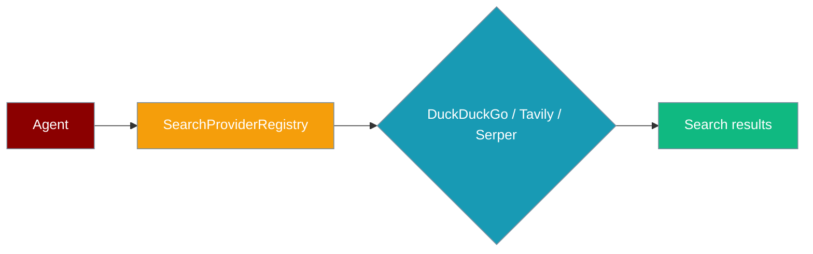
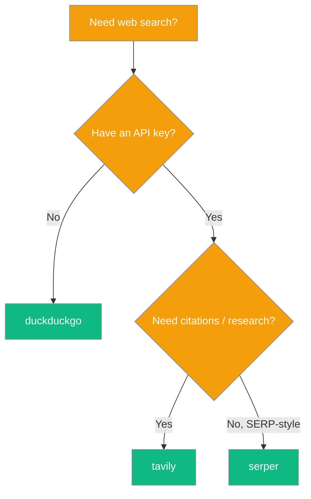

Pick a web-search backend (DuckDuckGo, Tavily, Serper) for your agent — or plug in your own.

```python
from praisonaiagents import Agent

agent = Agent(
    name="Researcher",
    instructions="Search the web and summarise findings.",
    web=True,
)
agent.start("Latest news on renewable energy")
```



## Quick Start

<Steps>
<Step title="Simple Usage">
Give your agent web search with the default DuckDuckGo provider:

```python
from praisonaiagents import Agent

agent = Agent(
    name="Researcher",
    instructions="Search the web and summarise findings.",
    web=True,
)
agent.start("Latest news on renewable energy")
```
</Step>

<Step title="Switch providers via config">
Select Tavily or Serper from the CLI or bot config:

```bash
praisonai bot run telegram --web-search --web-provider tavily
```

```python
from praisonaiagents import Agent

agent = Agent(
    name="Researcher",
    instructions="Use Tavily for deep web search.",
    web=True,
)
# Set WEB_SEARCH_PROVIDER=tavily in the environment, or pass via bot YAML
```
</Step>

<Step title="Register a custom search provider">
Distribute a custom provider as a pip plugin:

```toml
# pyproject.toml
[project.entry-points."praisonai.tools.search"]
my-search = "my_pkg.tools:MySearchTool"
```

```python
from praisonai.cli.features._search_registry import SearchProviderRegistry

registry = SearchProviderRegistry.default()
tool_cls = registry.resolve("my-search")
tool = tool_cls()
```
</Step>
</Steps>

---

## Built-in Providers

| Provider | API key needed? | Free tier | Best for |
|----------|-----------------|-----------|----------|
| `duckduckgo` | No | Yes | Default, no setup, general queries |
| `tavily` | Yes (`TAVILY_API_KEY`) | Limited | Research-grade results, citations |
| `serper` | Yes (`SERPER_API_KEY`) | Limited | Google SERP-style results |

Entry-point group: `praisonai.tools.search`

---

## Which Provider Should I Pick?



---

## Best Practices

<AccordionGroup>
<Accordion title="Store API keys in the environment">
Set `TAVILY_API_KEY` or `SERPER_API_KEY` in your shell or deployment secrets — never hard-code keys in agent instructions.

```bash
export TAVILY_API_KEY=tvly-...
praisonai bot run telegram --web-search --web-provider tavily
```
</Accordion>

<Accordion title="Fall back to DuckDuckGo">
The registry falls back to `duckduckgo` when an unknown provider name is requested — useful for resilient bot configs.
</Accordion>

<Accordion title="Cache repeated queries">
For high-volume agents, cache search results in Redis or session memory to avoid rate limits on paid providers.
</Accordion>
</AccordionGroup>

---

## Related

<CardGroup cols={2}>
<Card title="Tool Search" icon="magnifying-glass" href="/docs/features/tool-search">
  Progressive disclosure when agents have many MCP tools
</Card>
<Card title="Endpoint Provider Registry" icon="plug" href="/docs/features/endpoint-provider-registry">
  Plug custom endpoint types into serve / discovery
</Card>
</CardGroup>
