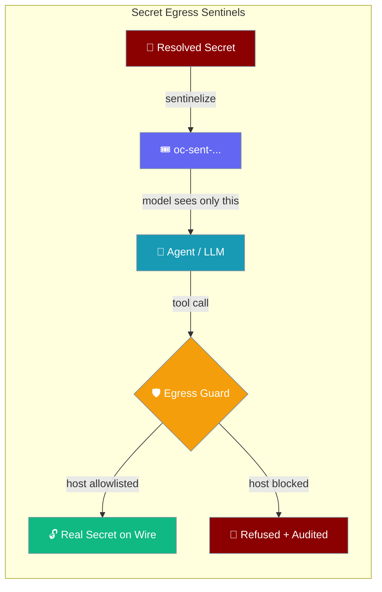
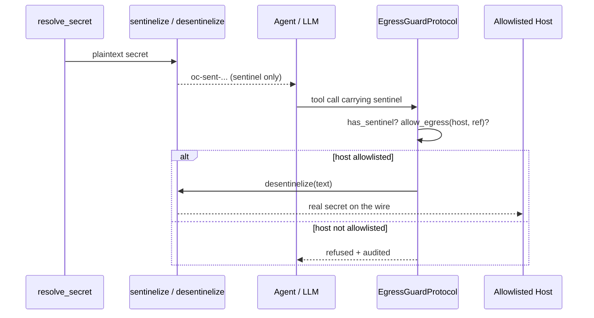

A resolved secret is swapped for an opaque, per-process token the model can carry safely; the real value is put back only at the moment a request egresses to an allowlisted host.



## Quick Start

<Steps>

<Step title="Mint a sentinel so the model never sees plaintext">
```python
from praisonaiagents import Agent
from praisonaiagents.secrets import sentinelize

# The plaintext API key is replaced by an opaque, per-process token.
# The agent, prompt, tool arguments and transcript only ever carry the token.
api_token = sentinelize("sk-live-1234567890abcdef")

agent = Agent(
    name="API Caller",
    instructions=f"Call the vendor API with Authorization: Bearer {api_token}",
)
agent.start("Fetch the latest invoices")
```
The agent holds `oc-sent-...`, not the real key.
</Step>

<Step title="Detect a sentinel at the egress seam">
```python
from praisonaiagents.secrets import has_sentinel

outbound_request = f"GET /v1/invoices\nAuthorization: Bearer {api_token}"
assert has_sentinel(outbound_request) is True   # a credential is on this request
```
`has_sentinel` tells the egress guard a request carries a credential and must pass the host allowlist first.
</Step>

<Step title="Substitute back on allowlisted egress only">
```python
from praisonaiagents.secrets import desentinelize

allowed_hosts = {"api.vendor.com"}
host = "api.vendor.com"

if host in allowed_hosts:
    on_wire = desentinelize(outbound_request)   # real secret put back on the wire
else:
    raise PermissionError("secret egress refused: host not in allowlist")
```
The plaintext reappears only for the one allowlisted request.
</Step>

</Steps>

---

## How It Works

The core owns only the sentinelisation seam; the wrapper's guard decides what may egress.



A sentinel is `oc-sent-` followed by 32 hex characters. The plaintext lives in a per-process map guarded by a lock and is also registered for log redaction, so an accidental leak of the real value is still masked.

---

## Which Function Do I Pick?

Each function has one call site in the credential lifecycle.

| Function | Call it from | Purpose |
|---|---|---|
| `sentinelize(secret)` | Credential-loading boundary (right after `resolve_secret`) | Replace plaintext with an opaque token the model can safely reference |
| `has_sentinel(text)` | Egress guard, before any host decision | Detect that an outbound request is carrying a credential |
| `desentinelize(text)` | Egress guard, **only after** host allowlisting | Put the real secret on the wire for the one allowlisted request |
| `EgressGuardProtocol` | Wrapper / integration code | The seam a deployment plugs in to decide what may egress |

Full signatures live in the auto-generated SDK reference.

<Card title="secrets module reference" icon="code" href="/sdk/reference/praisonaiagents/modules/secrets">
  Auto-generated `sentinelize`, `desentinelize`, `has_sentinel`, and `EgressGuardProtocol` API surface.
</Card>

---

## Guarantees

- **Opaque** — the token reveals nothing about the secret's length, shape, or content.
- **Per-process** — a token minted in one process cannot be forged or re-used in another; `desentinelize` on an unknown token is a no-op.
- **Short-value safe** — a 1- or 2-character PIN is hidden exactly like a long key; there is no minimum length.
- **Idempotent** — repeated `sentinelize(same_value)` returns the same token; `desentinelize` of text with no known token is a no-op.
- **No performance tax** — `desentinelize` only visits token shapes present in the input, so a bulk registry does not slow a single-token request.
- **Belt and braces** — `sentinelize` also calls `register_secret_for_redaction`, so a leaked plaintext is still masked by `redact_secrets` / `redact_outbound`.

---

## Common Patterns

Sentinelise the moment a secret is resolved, then reference the token everywhere else.

```python
from praisonaiagents import Agent
from praisonaiagents.secrets import resolve_secret, sentinelize

resolution = resolve_secret({"source": "env", "id": "VENDOR_API_KEY"})
if not resolution.available:
    raise RuntimeError("credential unavailable")

token = sentinelize(resolution.value)   # model never sees resolution.value again

agent = Agent(
    name="Billing",
    instructions=f"Authenticate with Bearer {token} and list open invoices.",
)
agent.start("Summarise this month's invoices")
```

Implement `EgressGuardProtocol` in your wrapper to enforce a default-deny host allowlist.

```python
from praisonaiagents.secrets import (
    EgressGuardProtocol,
    SecretRef,
    desentinelize,
    has_sentinel,
    sentinelize,
)

class HostAllowlistGuard:
    def __init__(self, allowed_hosts: set[str]) -> None:
        self._allowed = allowed_hosts

    def sentinel_for(self, ref: SecretRef) -> str:
        resolved = resolve_secret(ref)
        return sentinelize(resolved.value)

    def allow_egress(self, host: str, ref: SecretRef) -> bool:
        return host in self._allowed

guard = HostAllowlistGuard(allowed_hosts={"api.vendor.com"})
assert isinstance(guard, EgressGuardProtocol)   # runtime_checkable contract

def send(host: str, ref: SecretRef, request: str) -> str:
    if has_sentinel(request) and not guard.allow_egress(host, ref):
        raise PermissionError("secret egress refused: host not allowlisted")
    return desentinelize(request)
```

---

## Common Pitfalls

- Logging the sentinelized string is harmless (the token is opaque) — but logging the **desentinelized** version leaks the secret. Only the socket write should ever see post-`desentinelize` text.
- `has_sentinel` returning `False` means **no known** sentinel. A token-shaped string never minted in this process is not a sentinel.
- Sentinelisation is per-process, so a sentinel does not survive serialization across processes. If you fork workers, re-sentinelize in the child or route egress through a shared process.

---

## Best Practices

<AccordionGroup>

<Accordion title="Sentinelize at the resolver boundary">
Call `sentinelize` the moment `resolve_secret(...).value` becomes available, before passing anything into an `Agent`, prompt template, or tool argument builder.
</Accordion>

<Accordion title="Treat the token as plaintext in your UX">
The model may freely place `oc-sent-...` into prompts and arguments. The egress guard is the single enforcement point, so the token itself needs no special handling upstream.
</Accordion>

<Accordion title="Default-deny host allowlists">
An `allow_egress` that returns `True` by default defeats the point. Start with an empty allowlist and add hosts explicitly.
</Accordion>

<Accordion title="Never log desentinelize output">
Once you substitute back, the plaintext is live. Keep that string on the wire only — never in a log, metric, or transcript.
</Accordion>

<Accordion title="Keep the core seam, host enforcement in the wrapper">
Don't push proxy or allowlist logic into core. `EgressGuardProtocol` exists so core stays protocol-only and nothing heavy is imported.
</Accordion>

</AccordionGroup>

---

## Related

<CardGroup cols={2}>
  <Card title="Outbound Secret Scrub" icon="shield-halved" href="/features/outbound-secret-scrub">
    After-the-fact masking on bot replies — complementary to before-the-fact sentinelisation.
  </Card>
  <Card title="Gateway Secret References" icon="key" href="/features/gateway-secret-references">
    Where resolved secrets come from, before you sentinelize them.
  </Card>
  <Card title="secrets SDK Reference" icon="code" href="/sdk/reference/praisonaiagents/modules/secrets">
    Auto-generated reference for the sentinel functions and protocol.
  </Card>
  <Card title="Hook Events" icon="webhook" href="/features/hook-events">
    The seams where an egress guard plugs into the request path.
  </Card>
</CardGroup>
